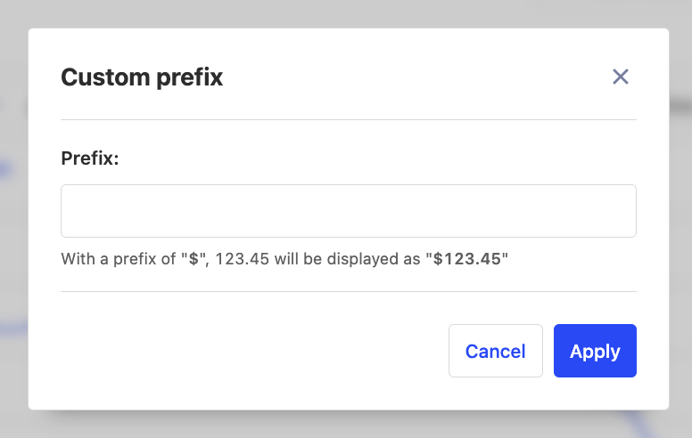
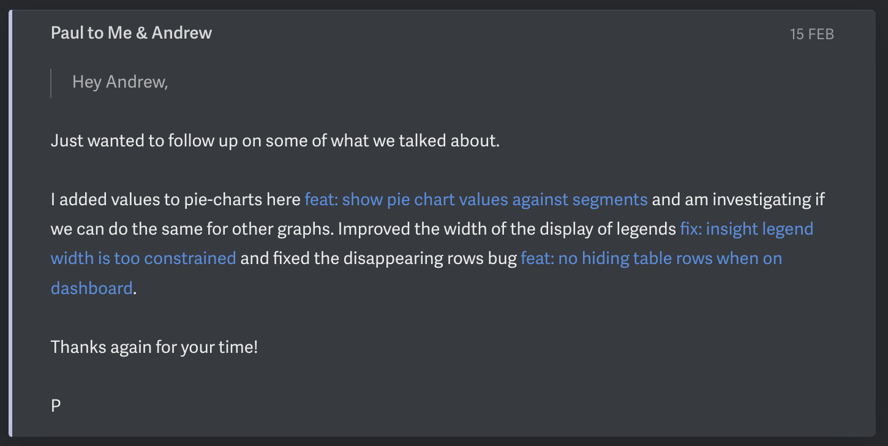

To become a 10x engineer, most people think about improving their typing speed, buying more monitors, or using the latest framework where everything is a macro. These hacks focus on speeding up the time from an idea to a rolled-out implementation. You'll get a 1.5x boost at most.

Where you can truly get 10x results is by zooming out and solving for user impact. Here, leverage comes from choosing the right problem, building the right solution, and using the right tools. This can only happen by deeply understanding your users. Enabling you to focus on their "hair-on-fire" problems and build solutions that are intuitive and effective. The best way to do this? Speak directly to your users.

## Tickets are highly lossy

Your users are real people. They have problems to overcome. They work in a team. They have hopes and dreams. But if all that gets to you is the ticket "Add a button to this page" you miss that context. And you miss the opportunity to build a significantly better product.

Let's discuss an example from PostHog: we were getting requests for handling revenue in PostHog. If taken at face value, we might work on "Adding revenue support to PostHog" - and have added a custom database field and display support for the common currencies.

Instead, we went deeper - asking them why did they want revenue data in PostHog? We learned that if a teammate created the chart it was often unclear what the axes of charts was referring to. This affected charts containing revenue data but also other types of data such as app response times measured in milliseconds. We refined the problem to support custom prefixes and postfixes and built it within a day. And compared to the original problem definition we improved support for much more than just revenue data.



### Solving the information bottleneck: direct user-engineering interaction


Traditionally, information flows from the user to the product manager (PM) by an interview and then from the PM to the engineer through a bunch of tickets. At each stage, important context is lost. It’s one way, so you can’t go deeper on the important areas.

Direct two-way interaction gives you this context. By significantly increasing the signal you can quickly cut scope, realize you’re tackling the wrong problem, or come up with a more elegant solution.

And it's the engineers who can most effectively cut scope and reframe solutions, as they have the background on the existing architecture and components. PM interviews are still useful to highlight important problem areas and bring in additional context. But they are not a replacement.

## Booking user interviews: Defining segments and automating the process

To build with users, it’s crucial to develop a system to quickly speak with customers. If the friction is too high, you’ll ride an initial burst of motivation followed by regression to the old way of heads-down coding.

The first step to speaking to your users is to find them. You can define your segment using company traits, user traits, and behavioral information. A data warehouse or a product analytics tool like PostHog can be helpful here.

Then you need to can contact them and book a time. The simplest way is to email out a Calendly link in batches via bcc’ed. But quickly you should move to an in-app prompt. We’ve seen an increase in conversion from outreach to booking by ~5x (from 3% to 16%), a reduction in email spam, and more fine-grained control of the number of bookings a week. A reward like a $30 merchandise voucher helps. 

Checkout PostHog’s [user interview app](https://posthog.com/tutorials/feedback-interviews-site-apps#setting-up-the-user-interview-app) for a quick way of showing prompts to segments of users or our [open-source set of components](https://github.com/PostHog/posthog-prompts/tree/luke/react-demo) for building your own.


## Types of user interviews: problem exploration and solution exploration

To get the most out of the interview, you should know the goal. The goal normally fits into two buckets:

### 1. Problem exploration

Find the biggest hair-on-fire problem and then deeply understand the parameters. Focus on the concrete times they’ve experienced the problem.

Example questions:
- How have they tried to solve it before?
- What do they think of the other solutions on the market?
- Would they pay for it?
- Can you talk me through the last time you experienced this problem?
- Is this actually a problem for you?

**Recommendation:** Read "The Mom Test" by Rob Fitzpatrick. It's a fantastic primer on problem exploration.

### 2. Solution validation

You’ve identified the hair-on-fire problem and understand it well. Now you’re validating whether your solution actually solves it. Focus on presenting the user with quick prototypes.

Example activities:
 - Have the user click through a Figma prototype and think out-loud. Ask them to complete the high-level goal and see where they get stuck. Ask what they think the text means.

- Send a few mockups of the solutions over Slack to the user from the problem exploration interview and ask if it solves the problem.

- Create a mock-up and have a call with the user to see if they will commit to paying some amount if you build it.

**Recommendation:** The book "Don’t make me think" is great for usability testing.

## Build a quick feedback loop by combining sync and async communication

User interviews are high-bandwidth: you can quickly narrow down the most important problem and gather all the parameters. But it normally takes a few days to get on the call.

After the initial discussion, get your user on Slack for B2B or Whatsapp for B2B. This will enable you to quickly follow up with mockups or further questions during the solution validation phase.

Check out this example from Li when building out our feature flag permissions. She received the response 3 minutes (!!) later.


The more important the problem for the user, the quicker they'll respond.

## Beware solution ideas from users, reframe them as problems

During interviews, users will often suggest an idea for the solution of what they want. It’s crucial to not accept this at face value and instead ask “Why?” until you can reframe it as a problem with the appropriate context. 

Often the solution they propose doesn’t actually solve the problem they experienced, or there’s a much better solution that you can build instead. But most times it's not even a problem they are facing at all! Treat the solution idea as an ember and get curious about it.

*There's an entire [wikipedia page](https://en.wikipedia.org/wiki/XY_problem) dedicated to this.*

## Sometimes it's better to just ship what the user is asking for

But be careful not to go too far the other way and generalize every problem. The art of product is using your judgment.


Particularly for small usability improvements or where you already have a strong thesis it's better to move faster. It's a great way to build a better product, drive word-of-mouth growth and encourage more relevant feedback.



## The challenge: Book a user interview this week

Across PostHog’s engineering teams we see the benefits of engineers speaking directly to users: more important problems being solved and better products being shipped. But chances are you won’t actually believe me until you’ve done a few interviews yourself and realized what someone wrote on a ticket is completely different from reality.

So here’s the challenge: **book your first user interview this week next time you’re on your computer**. *Add a reminder on your phone now*

It will take less than 15 minutes to set up. How? Create a Calendly link and connect it to your Google Meet and Google Calendar. Grab a list of 30-50 customer emails and send out the following message via bcc:

```jsx
Hi! I’m X, a software engineer at Y. I’m currently working on Z and would love your input on it. Free for a quick call at any of these times? {INSERT CALENDLY LINK} 
```

Or if there’s already a sales call or customer interview organized then ask to join and add your own questions at the end.

Have any questions, feel free to email me at {firstName}@posthog.com or DM me on [Twitter](https://twitter.com/lukeharries_).