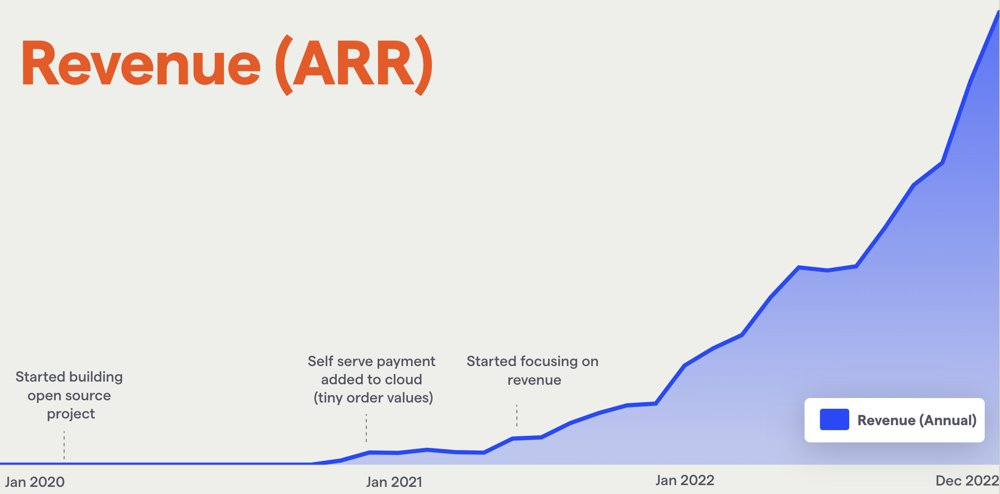

It's always helpful to look back on the year just gone, and 2022 was an exceptionally good year for PostHog. Here's my personal perspective on how it went.

## How it went

### We grew very fast _and_ are much more durable

- Revenue grew nearly 6x without any outbound sales team.

- We hit a 2 month [CAC payback period](https://www.thesaascfo.com/cac-payback-period/), salaries included. Around [12 months](https://www.geckoboard.com/best-practice/kpi-examples/cac-payback-period/#:~:text=The%20general%20benchmark%20for%20startups,have%20greater%20access%20to%20capital.) is seen as exceptional.

- We are comfortably default alive and will likely be profitable in 2023.

We still have work to do. We're working on gross margin – we've done close to zero cost optimization on our hosting so far - and we want to hit a higher absolute level of revenue (around $10M ARR) without spending significantly more before we fundraise again.

### We let people go when we needed to 

We remained disciplined and let people go when we needed to. This helps us retain an ambitious and performance-oriented culture. While these moments are painful, we received positive feedback from our team when we explained why we made these decisions, transparently. 

We are compassionate, but reasonable – we pay 4 months severance because our attitude is letting people go earlier is better for everyone and a big payout for them is kinder in return, so having the the latter means the former condition is met.

### Tim and I wound up in the wrong roles, but we spotted this and fixed them

Tim (my co-founder) and I realized we were managing the wrong teams because the game had changed. I was good at early sales, but we've moved on from that and now he's the right person to help us scale things there.

Likewise in product, we want to go from good to great and that'll take more design attention, which I can help with.

Tim and I therefore swapped a bunch of priorities around with each other, and (so far) it feels much better.

There are two reasons we spotted this: the combination of (1) feedback from our teams and (2) a love / tradition of going for "salt of the earth curries".

We regularly do [360 feedback dinners](../handbook/people/feedback) at offsites, but this feedback came from asking these questions about each other on the exec team in our 1:1s, randomly:

* What do I do that you experience as world-class?

* What do I do where I appear to be experiencing fun, peace or joy (if different from above)

* What do I do that I am good at but that I don't appear to enjoy?

* What do I do that I am not better at than others?

* What do I do that I am actually worse than others?

Secondly, Tim and I love going for a curry every couple of weeks when we work together in person (we're all remote, but we do make an effort to hang out). This means specifically an unpretentious but tasty curry somewhere. 

My wife isn't a huge fan of them so, nearly every time we meet, I jump at the chance and I _think_ I've converted Tim. During one of these, we talked through the feedback we'd received. It's a good reminder to hang out and not make every interaction 'zoomformulaic'.

### I was prioritizing badly, but Tim held me accountable and we fixed that too

At one point, I was getting the individual contributor (IC) work done, but not prioritizing things like company vision/OKRs. Knowing when to do this is a real skill. Too much of it and you're setting a silly culture of planning over trying stuff out; too little, and you don't have a clear direction. 

Tim suggested I hire [Kendal](/community/profiles/721) (Exec Assistant) to help solve this. I felt really silly hiring someone to manage my time and to keep me organized, but the reality is that I can now give more value to the company, which helps everyone. Having a nudge from someone else was what I needed to commit.

### A crappy family situation got much better

My (then) one-year-old daughter got diagnosed with bilateral retinoblastoma (a type of cancer) in 2021. She lost an eye as a result, has her vision permanently damaged in the other, and had to go through chemo. We were delighted to wrap up treatment in the Spring 2022. We were lucky that it went perfectly... she was "cured" (as far as you can be of cancer), and now we're in regular monitoring mode. When she got diagnosed, I chose to focus on revenue over fundraising (instead of trying to do both while taking care of her), and now a year and a half on, I'm very glad that's what we picked.

### We are shipping stuff

We made too many improvements to list on user-facing functionality, and infra / ingestion-based functionality. It feels like we can make new things appear, although Q1 will be a big test – it'll be one of our most ambitious quarters.

Other teams also get their work out the door quickly, unimpeded by bureaucracy / excessive planning. We've had a ton of marketing content appearing, a smooth time with our [People and Ops team](../teams/people), and a [Growth Team](../teams/growth) that can't stop producing winning variants!

### I'm really glad we're not doing outbound / went for a growth team instead

It is always tempting to hire an outbound sales team. After all, we can sell the product and retain users, to a tightly defined audience.

However, it just feels like [it'd be very hard to do outbound sales](../handbook/growth/sales/overview#strategy) to developers. I can't think of a worse group to target this way (this is coming from a place of experience as [I've run outbound sales teams](https://www.linkedin.com/in/j-hawkins/) before).

Instead, we set up a growth team. We've had dramatic results from doing this – such as 25% improvements in our activation flow from single experiments. Yep, one experiment has led to a 25% increase in our monthly growth, forever. That's why we have such a low CAC payback period...

If we _had_ hired a sales team, I guarantee we'd be focusing on how to send more cold emails more effectively versus the more leveraged work of improving our onboarding, activation and billing flows.

### We can take pride in not focusing on number of staff / investors

Lots of companies raised very hyped funding rounds in 2021 – we had demand, but ultimately chose not to move forward. We are confident we made the right call not to do this, but we felt at the time that we were going against the grain. It was really cool to talk about this stuff openly with our team, and to see how quickly we started taking pride in building a real company.

### Doing more of what works in many parts of the company has been great

In go-to-market, it's always tempting to explore new channels. However, in 2022, we really benefited from understanding where our growth was _actually_ coming from, and doing more of those things. This meant content marketing and word of mouth growth.

### Our free support quality has been a bit variable

We get around twice as many community support questions now as we did last year. We've not tracked it, but it feels like we're a lot more rushed as a result when trying to get to everything.

We've implemented multiple things to try to improve this – [Squeak!](https://github.com/PostHog/squeak), a backup infra hero, generally prioritizing cloud (since it's a better experience if possible), launching [Cloud EU](posthog-cloud-eu) to help with GDPR compliance, and hiring Paul Hultgren to work on our docs full time. 

These improvements caused a 75% drop in the likelihood of each user to need support, but that was outweighed by how much growth we had. There are therefore more things to come here as this is an ongoing challenge as we keep scaling. 

### Staying on top of IC work as a cofounder with 40 people is hard

Tim and I have both felt this at different times. We think it's very important we both do individual work – simply, it's more fun to work _alongside_ someone, and that's only the case if we do some actual work. Longer term, we want a culture that values individual contribution, so we should do this ourselves.

However, it is tough pulling this off while making sure the entire company runs in a manner that we're proud of – we've both felt frustrated when we see our individual work slip as a result. That's no reason not to do it, though.

## Things to watch in 2023

* **Looking after hobbyist users as our revenue is accelerating.** Most users of PostHog pay us nothing, and they're often the ones talking about us as part of our word of mouth growth. This can conflict with short-run revenue goals at times, but is fundamentally in line with long term targets (if we have a big fanbase, then that'll bring more fans both free _and_ paid) - and that's ultimately more important, since we're default alive.

* **Our margins!** It'll be the first year we put real effort into hosting costs specifically. Alongside increasing our overall revenue figure, which will happen naturally with time, this is the other metric that'll make a series C easier to raise if we improve it (all the others we need are already in a great place).

* **Scaling execution.** We want to build a real machine around certain things that are working (like content and customer success), so we can get more done and/or to a higher standard without more people.

* **New UI.** We've a [PostHog 3000 project](https://github.com/PostHog/posthog/issues/12923) to pull off. It'll affect multiple teams, so managing to do that without a coordination mess happening will prevent us from being slow at shipping features.

* **Keeping on top of our infra/ingestion.** We have a ridiculous number of events coming in - we must stay up and reliable. We've hired a lot here so far, but we've a huge surface area to manage.

* **New feature buzz.** We should get more marketing benefit from all the cool stuff we ship. Lots of ideas about doing more with our [public roadmap](/roadmap) here.

_Enjoyed this? Subscribe to our [newsletter](https://newsletter.posthog.com/subscribe) to hear more from us twice a month!_
