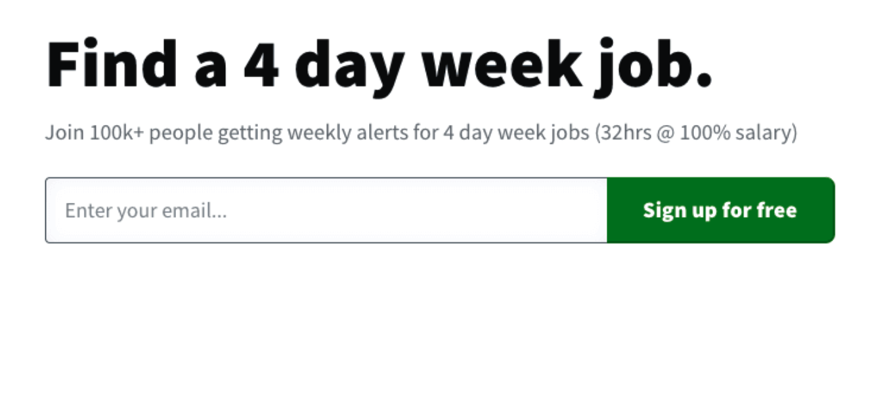
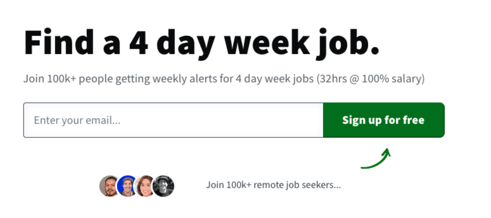

> In this post [Phil McParlane](https://twitter.com/philostar), founder of [4dayweek.io](https://4dayweek.io/), discusses [a test he ran using PostHog’s experimentation tools](https://twitter.com/philostar/status/1693645747168698456) to increase the conversion rate on this signup form.

### 1. Create a hypothesis and goal
All A/B testing begins with a hypothesis — an idea. Every website is different, but typically there are some common changes you can make to try and increase your website’s conversion rate. Here are a few examples of tests you might consider for your site:

- **Color and copy:** You can change the color of a CTA, or the wording to make it more urgent. For example, instead of "Sign up", use "Get Started Now".
- **User interactions:** You can reduce the number of fields in a form to minimize friction, or add progress bars to set expectations. Tooltips can help you test how much support users need.
- **Offers and value:** You can even test different product offers with users, such as offering a free trial or a discount to drive conversions. 
- **Visuals:** Test how different images, animations or videos perform. Add trust signals such as award badges or images of your users alongside testimonials to create social proof. 

In my case, I wanted to test if social proofs such as user images would help increase the number of signups. My hypothesis was that users would be more likely to convert if they had an indication that the service was popular and trusted by lots of people.

### 2. Make a test version
Once you’ve got an idea of what you’d like to test, you need to create two versions of the UI in your app:

- **Control:** This is the original. It serves as the baseline against which you can compare.
- **Test:** This is the version that contains the change you want to evaluate.

You can have multiple test versions in PostHog to run more complicated tests, but for my experiment I only had a single variant — which meant I could split traffic between the two versions 50/50. PostHog then assigns users to one or the other randomly, and monitors how they perform against the goal. 

I wanted to test whether adding social signals to the signup form would improve the conversion rate. Here's the control version, showing what the CTA looked like before the experiment. 

And here's the test version, which shows the CTA with new social signals beneath it.

### 3. Setup the experiment in PostHog
Next, you need to create an experiment inside PostHog. This is where you’ll see the results of your A/B test over time. For the experiment you’ll need to specify a goal. 

There are a few small changes you may also need to make to your app so that the user randomly sees either the control or the test version. 

- **Installation:** First, you need to [install and initialize PostHog](/docs/getting-started/install) in your app if you haven’t already.
- **Feature flag:** You need to create a feature flag that controls which version the users sees, then [query PostHog to get the feature flag](/docs/libraries/js?utm_medium=in-product&utm_campaign=feature-flag) which has been assigned to the user (e.g. control or test).
- **Show UI:** Once you know if the user is in the control or test group, you’ll need to display the relevant UI in your code.
- **Fire event:** Finally, when the user does the thing you want them to do (e.g. signs up), you’ll need to [send the event](/docs/getting-started/send-events) using the Posthog API.

In my case, the goal is to get a user to sign up. So when the user signs up on the app, I fire an event called `user signed up`. Easy!

### 4. Monitor the results
You’re almost finished — now you just need to wait for the results. Depending on how much traffic your site gets, you may have to wait many days or weeks to see if the changes produce [statistically significant](/docs/experiments/significance#:~:text=PostHog%20computes%20this%20significance%20for,conclusion%20and%20terminate%20the%20experiment.) improvements. Luckily, PostHog does all the math for you and will tell you when it’s made a decision.

For our experiment above, adding the social proof underneath the signup form increased the conversion rate by 4.3% — a very sizable improvement and one which is definitely statistically significant!

Armed with this result, I made the call to end the experiment and deploy the test version permanently. Now, all users who visit the site will see a sign-up form which includes these trust signals, and I can look forward to getting even more users. 
