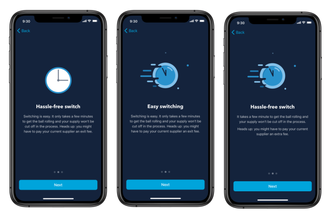
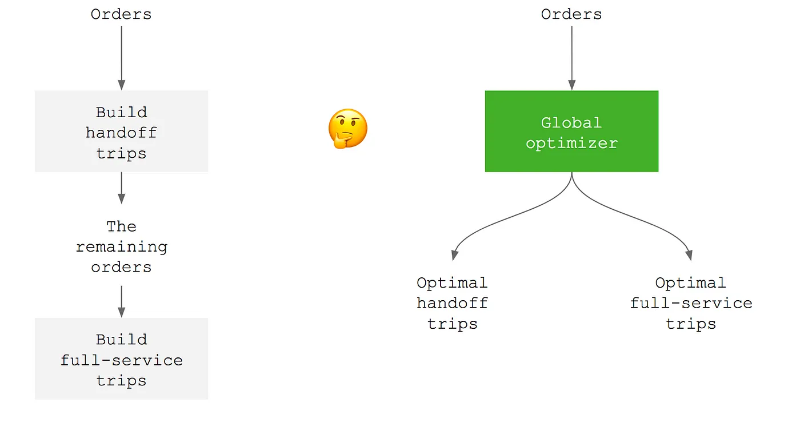
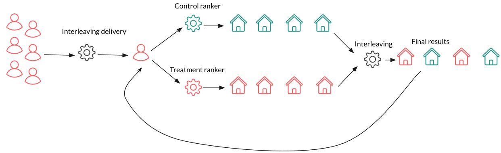
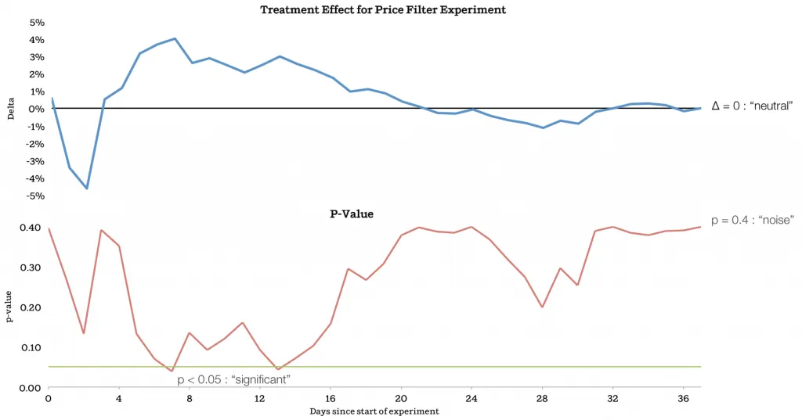
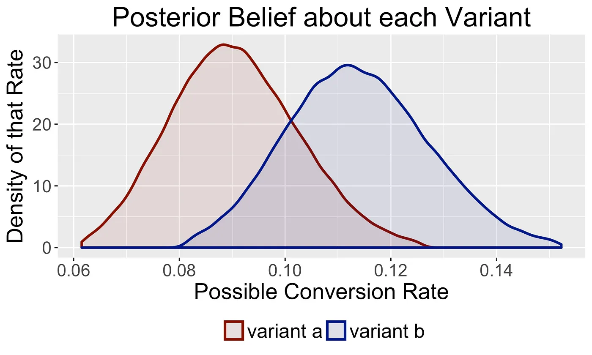

[A/B testing](/docs/experiments/manual) is a powerful tool when used correctly. The key word here is "**correctly**." Only comparing a new feature, copy change, or query with the old version does not create success.

In the wise words of Picasso, "Good artists copy, Great artists steal." To help you become a great A/B test "artist," we’ve researched how some of Y Combinator’s top all-time companies do A/B tests, and we’re giving you the summary here.

## 1. Monzo: Pellets

Monzo provide a standard example of how to run A/B tests. They focused on top-of-funnel (because those impact the most users) and ran about 4 per month. Most were simple page comparisons, but some were [holdout tests](/tutorials/holdout-testing) where 10% of participants continued to see the control variant weeks after the test to ensure no long-term negative effects. 

An A/B test at Monzo starts with a proposal anyone can submit. It asks four questions:

1. What problem are you trying to solve?
2. Why should we solve it?
3. How should we solve it? (optional)
4. What if this problem didn’t exist? (optional)

These proposals also include data on impact and scale. Data also informs success metrics and guardrail metrics to ensure impact and avoid unintended consequences. The goal of the proposal is to create a clear hypothesis containing a solution to a problem or an outcome for an experiment. This needs to be specific, measurable, and testable.

After completing the proposal, experiments launch as small, quick-to-build, low-risk "pellets," rather than large, slow "cannonballs." "Pellet" experiments wrap faster, enabling them to trigger new experiments and keep their momentum.

_Read more at "[Pellets not cannonballs: How we experiment at Monzo](https://monzo.com/blog/2022/05/24/pellets-not-cannonballs-how-we-experiment-at-monzo)" and "[How we experiment at Monzo](https://monzo.com/blog/2019/07/31/how-we-experiment-at-monzo)"_

### Takeaways

- Focus on the top-of-funnel for the highest impact.
- Crafting a hypothesis is critical, a longer proposal process helps with this.
- Ship "pellets," not "cannonballs."

## 2. Instacart: Geography, multivariate regressions

Instacart provides a more complicated example of A/B testing. Their goal was to increase the efficiency of their delivery routing which followed one of two strategies:

1. **Handoff:** one person preps and another picks up and delivers.
2. **Full service:** one person does everything: prep, pickup, and delivery.

For each order, their routing algorithm tries to create a handoff trip, and if it wasn’t possible, create a full service trip. They wanted to test a new algorithm splitting orders into handoff or full service depending on which was more efficient from the start, rather than successively. 

When planning the test, they realized they couldn’t just split by customer or shopper because those were interdependent. For example, deliveries from both algorithms might dispatch to the same shopper. Instead, they tested the new algorithm with:

- **Simulations** to replay the history of customer and shopper behavior using the new algorithm. This showed a 2.1% increase in efficiency.
- After the simulations were positive, they temporarily launched the new algorithm in San Francisco. Doing **before and after analysis** showed an estimated efficiency increase of 2.9%.
- Along with this, they checked **differences in differences** to compare SF (where the change launched) and Oakland (where it didn’t) which were geographically similar and showed correlated efficiency before and after the change.

None of these options proved to Instacart that the change **caused** an improvement, only that changes **correlated** to improvement. Each analysis also missed potentially impactful variables like geography and time.

To solve this, Instacart returned to the A/B test and had to figure out a new way to split samples. They realized since orders happen locally, they don’t have to optimize everywhere at once. They can split by geographical regions (called "zones") and day (because their delivery system "clears" overnight).

Running an A/B test of the new and old algorithms split by zone and day showed an increased average efficiency. A simple regression of the response variable `efficiency` on the group variable `variant` showed it. It also showed a p-value was 0.079 which was higher than the 0.05 threshold, meaning it wasn’t significant.

> **What is a p-value?** A p-value is the probability of obtaining a result equal to or more extreme than what was observed assuming the null hypothesis is true. A p-value of 0.05 means that if the null hypothesis is true, there is a 5% chance of observing the data or more extreme results purely due to random chance.

The simple regression left out potentially important variables like zone, day of the week, and week number (growth). To include these, they used multivariate regressions. This showed a similar improvement in efficiency but with a much lower p-value of **0.0003**.

With this, Instacart was confident their new algorithm led to improvements in delivery efficiency and rolled it out further.

_Read more at "[It All Depends](https://tech.instacart.com/it-all-depends-4bb7b22e854b)."_

### Takeaways

- You might not be able to create an A/B test sample directly using users, but there is always some way to do it (like geography).
- A simple regression doesn’t account for multiple variables, which leads to higher, insignificant p-values. A multivariate regression could provide a more accurate answer.

## 3. Coinbase: Universes

Coinbase had a different challenge from the first two. To A/B test their machine learning algorithms, they needed to run a high volume of tests. Because tests impact each other, they needed separation. This created a bottleneck: there weren’t enough separate user samples to run all the tests they wanted.

Running many tests simultaneously also required complex reasoning, documentation, and alignment, which is a lot of work. It introduces invisible and scattered complexity, which is arguably, the worst kind.

To support a higher volume of tests and simplify the process, Coinbase developed "universes." This is a system to split users into groups, assign A/B tests to those groups, then build versions of the app containing the tested components. It consisted of three main pieces:

1. **Components:** parts of a service you may want to experiment on.
2. **Composer:** builds a service using component constructors, testing one of them. Experiments consist of comparing composers, so they tracked analytics at this level.
3. **Composer manager:** routes requests to the correct composer based on the user. They split users into groups, named "slots" which get a single experiment. Those a part of this experiment get the service the composer put together.

A single configuration file defines all three of these, abstracting the code relevant to the experiment from the actual app. A service they built uses the configuration file to create a universe for the A/B test.

The outcome of building the "universes" system included:

- **Increased A/B test throughput** from 3 experiments in ~6 months before launch to 44 experiments in ~8 months after.
- **Centralized and cleaner code** by splitting experiment and app code as well as using a single configuration file for the experiment. This makes it easier to manage tests.
- **Greater flexibility and faster feedback** through the ability to modify experiments at any time, requiring smaller user samples, and shorter implementation and feedback cycles.

_Read more at "[Scaling Experimentation for Machine Learning at Coinbase](https://www.coinbase.com/blog/scaling-experimentation-for-machine-learning-at-coinbase)."_

### Takeaways

- To scale A/B tests, you must automate, simplify, and standardize the process of creation.
- Separating experiment code from functional code enables you to run more experiments faster.

## 4. Airbnb: Interleaving, dynamic p-values

Although Airbnb has many examples of standard A/B testing, we’re going to cover two unorthodox examples.

### Testing search results with interleaving

The first is how they A/B test their search ranking algorithms. Instead of a user getting either a test or control variant of an algorithm test, they get both through with a framework called interleaving. 

Interleaving is a framework for blending results from both variants to get a direct comparison. It works by:

1. Taking search results from both variants.
2. Combining similar listings.
3. Creating a "competitive pair" from dissimilar listings.
4. Judging success based on what listing drives more bookings (conversion).

Airbnb’s interleaving framework requires 6% of the traffic of a regular A/B test and 1/3 the running length. This led to a 50x speed up while providing results that are 82% consistent with regular A/B tests.

_Read more at "[Beyond A/B Test: Speeding up Airbnb Search Ranking Experimentation through Interleaving](https://medium.com/airbnb-engineering/beyond-a-b-test-speeding-up-airbnb-search-ranking-experimentation-through-interleaving-7087afa09c8e)."_

### Improving accuracy with dynamic p-values

Like many companies, Airbnb had confusion about how long to run A/B tests. Using only a p-value to decide requires you to design an experiment with a desired sample and effect size. Another issue with it is potentially hitting your p-value early and ending the test prematurely. 

In Airbnb’s case, they found a pattern of hitting "significance," and then converging back to neutral in their experiments. For example, they ran an experiment changing the max price filter value to $1000. In it, the test variant had a positive effect and p-value below 0.05 on days 7 and 13; however, as the experiment went on, the p-value increased to 0.4 and the effect became neutral. If they concluded the experiment on day 13, they would ship a change with no long-term positive impact.

To solve this, Airbnb calculated a dynamic p-value curve starting at 0 and then curving up towards 0.05 on day 30 to determine whether an early result is worth investigating. This creates enforced skepticism about early experiment results and helps reduce false positives.

_Read more at  "[Experiments at Airbnb](https://medium.com/airbnb-engineering/experiments-at-airbnb-e2db3abf39e7)."_

### Takeaways

- A/B tests can be set up to compare variants together rather than split using interleaving.
- A static p-value goal may cause you to prematurely end experiments. A custom, dynamic p-value can provide a more accurate threshold.

## 5. Convoy: Bayesian

A/B testing usually uses a **frequentist** method, meaning it focuses on probabilities and p-values to decide a winning variant. The problem with this is it can unnecessarily favor the null hypothesis (aka don’t change). If an experiment doesn’t hit the p-value, new changes don’t get shipped.

If your company prefers to ship more changes, even if they are more likely to be insignificant (aka false positives), a **Bayesian** A/B testing approach might be better. This is what Convoy uses. The Bayesian approach accepts more small improvements, even if they aren’t significant.

The Bayesian approach:

1. Compares prior beliefs of potential values for goal metric (like conversion) with beliefs for a new variant. 
2. Using experimental metrics, calculates the probability that one variant’s goal metric is larger than the other. 
3. When the test variant’s goal metric probability difference hits a threshold, select it as a winner. 

This requires some statistical math too complicated to do here, but Convoy followed [Chris Stucchio’s guide](https://www.chrisstucchio.com/pubs/slides/gilt_bayesian_ab_2015/slides.html) to set it up.

The Bayesian approach focuses more on the average magnitude of wrong decisions over many experiments. This limits making the product worse while maintaining a bias for action. When they stop an experiment, they can be confident they are making a decision that won’t decrease a metric more than a known value, while seeing improvements to the product. By doing this, A/B tests at Convoy can have the highest impact over the long run.

_Read more at "[The Power of Bayesian A/B Testing](https://medium.com/convoy-tech/the-power-of-bayesian-a-b-testing-f859d2219d5)."_

### Takeaways

- Standard, "frequentist" A/B test can unhelpfully favor the null hypothesis.
- A Bayesian approach encourages shipping more changes, even if a larger portion of them don’t have a significant impact.

## Further reading

- [8 annoying A/B testing mistakes every engineer should know](/blog/ab-testing-mistakes)
- [When and how to run group-targeted A/B tests](/blog/running-group-targeted-ab-tests)
- [How to run experiments without feature flags](/docs/experiments/running-experiments-without-feature-flags)
