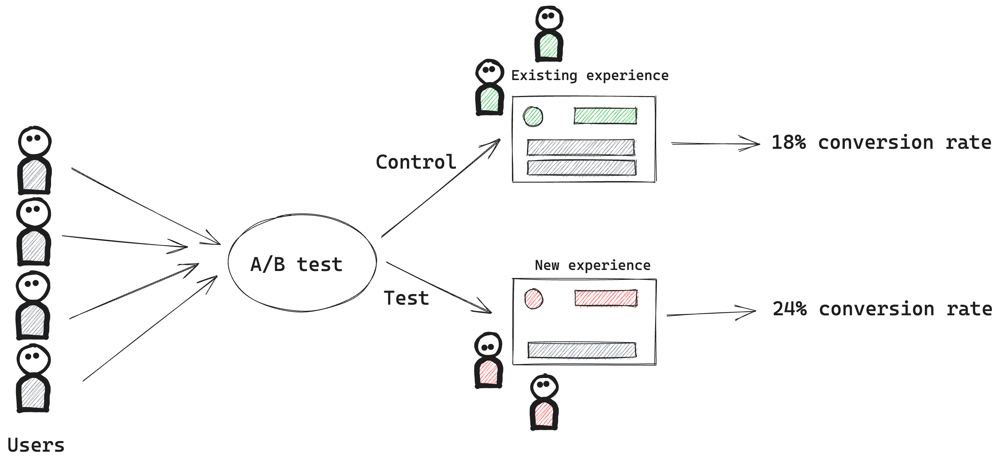

A/B testing enables you to be confident that your product changes are having their intended effects. Rather than making decisions based on gut feeling or intuition, A/B testing provides empirical data to help you remove bias from decision making.

Companies like [Netflix](https://uxdesign.cc/how-netflix-does-a-b-testing-87df9f9bf57c), [Uber](https://www.uber.com/en-GB/blog/supercharging-a-b-testing-at-uber/) and [Booking.com](https://booking.ai/tagged/ab-testing) use A/B testing to ship hundreds of changes a day. In this blog, we'll teach you basic concepts to get you started in A/B testing and supercharge your product growth!

> **Note:** A/B tests are commonly referred to as "experiments".

## How A/B testing works

In A/B testing, you first decide on a goal metric and what change you'd like to see. For example, you may to increase conversion rate, or you may want to decrease customer churn rate. Then, once you've made your code changes and are ready to test, you **randomly** split your users into two (or more) groups:

- The control group: these users will experience your product as is – without any of your new changes.
- The test group: these users will experience your product with your new changes.

You then run your A/B test for some time, usually a few days or weeks, to gather data and compare the differences in the goal metric between the different groups.



> **Note:** These groups are also referred to as "variants".

## What makes a good A/B test?

There are five parts to a good A/B test:

### 1. Has a clear, measurable goal

Like "increase conversion rate by 10%", or "decrease churn rate by 5%". Without a clear goal, it can be unclear what is a successful outcome of test.

### 2. Has a clear hypothesis why your your changes will achieve your goal

This focuses your testing on what changes you're making and why.

Here's an example of a good hypothesis for a SaaS Product: "Adding a short tutorial video on the login page will increase user engagement by 30% because it will help new users understand how to use our product more effectively."

> See our blog on [A/B testing mistakes](https://posthog.com/blog/ab-testing-mistakes#7-testing-an-unclear-hypothesis) to read more on how to avoid testing an unclear hypothesis.

### 3. Tests as small of a change as *reasonably* possible 

Ideally, an A/B test should change one thing at a time. This ensures that any change in user behavior can be attributed to the variable that was changed. If multiple variables are changed, it's difficult to determine which one caused the change in behavior.

However, the caveat here is that too small of change can slow your team down. Since running A/B tests take time, if you're constantly testing small changes it may take long to ship large, meaningful changes.

A good rule of thumb to know if your change is too small is if it's unlikely to impact user behavior significantly. To help inform this decision, you can use qualitative data from user research or quantitative data from previous A/B tests.

### 4. Has a sufficiently large sample size of users

A large sample size for your test ensures the *statistical significance* of your experiment results i.e., if you can be confident that your results are not due to chance, but rather a true effect of the changes you made.

To know whether your change is large enough, you'll need to know:

1. Your current conversion rate.
2. Your "minimum detectable effect" i.e., the smallest change in the conversion rate that you want to detect. The smaller the change, the larger the sample size you'll need.
3. Your desired level of confidence (the industry standard is 95%).

You then use a [formula](https://en.wikipedia.org/wiki/Sample_size_determination) to determine if your sample size is large enough. There are many calculators online that will do this for you, so you can avoid calculating this yourself (We also include this calculator when creating a new [A/B test in PostHog](/ab-testing/features)).

### 5. Has a long enough test duration

Building on the notion of ensuring statistical significant results, once you've calculated your required sample size, you'll be able to calculate how long your experiment should run for. You do this by dividing your sample size by your daily number of eligible users.

For example, if you're making changes to your signup flow and your required sample size is 1,000 new sign-ups. If your daily number of sign-ups is 100, then you'll need to run your experiment for `1,000 / 100 = 10 days`.

Once again, there are many calculators online to help you determine your duration, and PostHog also includes this calculator when creating a new experiment.

**A good rule of thumb is that your experiment duration should be between one week and one month:
**
- One week is a good minimum since users may behave differently on weekends or weekdays.
- One month is a good maximum since otherwise you may delay shipping important product changes.

## When not to A/B test

There's are costs and trade-offs to running A/B tests, and so it may not be a good idea to always run them. Here a few scenarios in which you may not want to run an A/B test:

- **When you lack of sufficient traffic or users, or have time constraints:** It won't be possible to gather enough data to obtain the statistically significant results required to make good decisions.

- **When you have high implementation costs:** Sometimes it may create a lot of technical debt to support and maintain both control and test variants of your experiment.

- **When you have opportunity costs:** The time and resources it takes to implement and analyze A/B tests may be better spent working on other projects.

- **When there are ethical considerations:** It can be tempting to run A/B tests on things such as bug fixes or reliability improvements. While A/B tests can indeed verify your changes are working as expected, you should remember that your users are *real* people that are relying on your product and so you should not run a test for the sake of it. Proceed with caution when testing such changes!

In the above scenarios, it may be better to rely on qualitative feedback or user research for decision making.

## How to implement a good A/B test

Once you're satisfied that your experiment meets the [criteria of a good A/B test](#what-makes-a-good-ab-test), it's time to implement it in your code. This is typically done by using [feature flags](/feature-flags/features) to randomly assign users to an experiment variant, and then logging when users are exposed to the variant i.e., trigger the code path that checks for the feature flag. This enables you to compare metrics in aggregate between the users in your variants.

It's absolutely **essential** to only log the users in your experiment who are actually impacted by the changes you're testing. Users who aren't affected by your test should be excluded. If you include unaffected users, their unchanged behavior will mix in with your results, thereby watering down the impact and the clarity of your findings.

To do so, ensure that checking your feature flag and logging their exposure is the *absolute* last condition you check in your code: 

```
// ❌ Incorrect. Will include unaffected users
function showNewChanges(user) {
  if (posthog.getFeatureFlag('experiment-key') === 'control') {
    return false;
  }

  if (user.hasCompletedAction) {
    return false
  }

  // other checks

  return true
}
```

```
// ✅ Correct. Will exclude unaffected users
function showNewChanges(user) {

  if (user.hasCompletedAction) {
    return false
  }

  // other checks

  if (posthog.getFeatureFlag('experiment-key') === 'control') {
    return false;
  }

  return true
}
```

## Monitoring your A/B test

Once you've started your A/B test, it's a good idea to check in on it 24-48 hours after launch to ensure that everything is running correctly. Here's a list of things to check:

* Check your exposure logging. For example, that the volume of users assigned to the control and test variant is what you'd expect it to be.
* Check your event logging e.g., ensure that you're receiving all the events you expect to receive, and in the right ratios.
* Monitor crashes or error rates to ensure that your experiment is not causing any issues. 

Once you're sure that everything is running smoothly, try to avoid frequently checking the results until the experiment is finished. Checking too often can lead to reactive decisions based on incomplete data. It's usually best to wait until the experiment ends to make any decisions, as you'll have the best data at that point.

## Analyzing results

Once your experiment has run its duration and you've collected enough data, you're ready to look at the results. What you're looking for is statistical significant change in any of the following metrics:

1. **Your goal metric.**

2. **Any secondary metrics.** These are usually metrics that are closely related to your goal metric. For example, if your goal metric is to increase paid conversions, a secondary metric may be to increase sign-ups.

3. **Any counter metrics.** These are metrics that ensure your user experience isn't degrading. For example, if your goal is to increase sign-ups, you should also verify your churn rate is not increasing.

To calculate if your results are statistically significant (without going into too much detail of the exact formula), you'll need the number of users in each variant as well as the conversion rate for each metric. You can then put these values into an [online calculator](https://abtestguide.com/calc/) to determine if they are significant.

> When you run [A/B tests](/ab-testing/features) in PostHog, we'll automatically calculate if your results are statistically significant or not.

### What if my results are not statistically significant?

This does not mean your experiment was a failure! It suggests that the results observed between the variants could be due to random chance rather than the change you implemented. Here are few next steps you can consider:

- **Check you gathered enough data:**  If your sample size was too small or your testing period was too short, you might need to extend the duration of your experiment to gather more data.

- **Consider smaller changes:** If you made a large change, it could be that smaller aspects of the change had different impacts – some positive, some negative, leading to an overall insignificant result. Consider breaking down the change into smaller parts and testing these individually.

- **Consider larger changes:** Conversely, if your change was too subtle or minor, it may not have been enough to affect user behavior. In this case, consider making a more impactful change and then testing that.

- **Review your hypothesis:** It could be that your hypothesis was not correct, and the change you made did not impact user behavior in the way you expected. Take this as a learning opportunity to gain deeper insights into your users.

- **Accept the results:** Sometimes, an insignificant result is the correct result. It tells you that the change you made didn't have the impact you thought it would. This is still a valuable insight, and helps you shipping unnecessary changes.


Calculate Effect Size
Review Secondary Metrics

how to interpret the results - a few examples 
 - what happens if not statistical signfiance?
 - what happens if statsical signifcant 
determining your next steps

## FAQ

### Running multiple experiments?


### Q: My A/B test showed no significant difference. Is it a failure?

### Are A/B tests only for product changes?

### How often should I check the results during an A/B test?

### Should I always choose the variant with the highest conversion rate?


## Best practices ?


## Different types of A/B test

## Advanced: Group level tests

Group vs User level experiments
link to blog 

Add link to this blog in the docs
