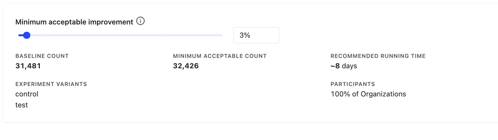

## 1. Including unaffected users in your experiment

The first common mistake in A/B testing is including users in your experiment who aren't actually affected by the change you're testing. It dilutes your experiment results, making it harder to determine the impact of your changes. 

Say you're testing a new feature in your app that rewards users for completing a certain action. You mistakenly include users who have already completed the action in the experiment. Since they are not affected by the change, any metrics related to this action do not change, and thus the results for this experiment may not show a statistically significant change.

To avoid this mistake, make sure to first filter out ineligible users in your code before including them in your experiment. Below is an example of how to do this:

```js
// Incorrect. Will include unaffected users
function showNewChanges(user) {
  if (posthog.getFeatureFlag('experiment-key') === 'control') {
    return false;
  }

  if (user.hasCompletedAction) {
    return false
  }

  // other checks

  return true
}
```

```js
// Correct. Will exclude unaffected users
function showNewChanges(user) {

  if (user.hasCompletedAction) {
    return false
  }

  // other checks

  if (posthog.getFeatureFlag('experiment-key') === 'control') {
    return false;
  }

  return true
}
```

## 2. Only viewing results in aggregate (aka Simpson's paradox)

It's possible an experiment can show one outcome when analyzed at an aggregated level, but another when the same data is analyzed by subgroups.

For example, suppose you are testing a change to your sign-up and onboarding flow. The change affects both desktop and mobile users. Your experiment results show the following:

| Variant         | Visitors | Conversions | Conversion Rate |
|-----------------|----------|-------------|-----------------|
| Control  | 5,000    | 500         | <span className="text-red text-lg">✖</span> 10%             |
| Test     | 5,000    | 1,000       | <span className="text-green text-lg">✔</span> 20%             |

At first glance, the test variant seems to be the clear winner. However, breaking down the results into the desktop and mobile subgroups shows:

| Device           | Variant          | Visitors | Conversions | Conversion Rate |
|-----------|------------------|----------|-------------|-----------------|
| 💻 Desktop   | Control   | 2,000    | 400         | <span className="text-green text-lg">✔</span> 20%             |
|           | Test      | 2,000    | 100         | <span className="text-red text-lg">✖</span> 5%              |
| 📱 Mobile    | Control   | 3,000    | 100         | <span className="text-red text-lg">✖</span> 10%             |
|           | Test      | 3,000    | 900         | <span className="text-green text-lg">✔</span> 30%             |

It's now clear the test variant performed better for mobile users, but it decreased desktop conversions –  an insight we missed when we combined these metrics! This phenomenon is known as [Simpson's paradox](https://medium.com/homeaway-tech-blog/simpsons-paradox-in-a-b-testing-93af7a2f3307).

Depending on your app and experiment, here's a list of aggregate metrics you want to breakdown:
* User tenure
* Geographic location
* Subscription or pricing tier
* Business size, e.g., small, medium, or large
* Device type, e.g., desktop or mobile, iOS or Android
* Acquisition channel, e.g., organic search, paid ads, or referrals, 
* User role or job function, e.g., manager, executive, or individual contributor.

## 3. Conducting an experiment without a predetermined duration

Starting an experiment without deciding how long it should last can cause issues. You may fall victim to the "[peeking problem](https://gopractice.io/data/peeking-problem/)": when you check the intermediate results for statistical significance, make decisions based on them, and end your experiment too early. Without determining how long your experiment should run, you cannot differentiate between intermediate and final results.

Alternatively, if you don't have enough statistical power (i.e., not enough users to obtain a significant result), you'll potentially waste weeks waiting for results. This is especially common in [group-targeted experiments](/blog/running-group-targeted-ab-tests).

The solution is to use an A/B test running time calculator to determine if you have the required statistical power to run your experiment and for how long you should run your experiment. This is built into PostHog.


<Caption>Setting up a new experiment in PostHog includes a recommended running time calculator</Caption>

## 4. Running an experiment without testing it first

Sometimes we're so eager to get results from our experiments, we jump straight to running them with all our users. This may be okay if everything is set up correctly, but if you've made a mistake, you may be unable to rerun your experiment. Why? Let me explain.

Imagine you're running an experiment with a 50/50 split between control and test. You roll out the experiment to all your users, but a day after launch, you notice that your change is causing the app to crash for all test users. You immediately stop the experiment and fix the root cause of the crash. However, restarting the experiment now will produce unreliable results since many users have already seen your change.

To avoid this problem, you should first test your experiment with a [small rollout](/tutorials/phased-rollout) (e.g., 5% of users) for a few days. Once you're confident everything works correctly, you can start the experiment with the remaining users.

Here is a list of what to check during your test rollout:
* Logging is working correctly
* No increase in crashes or other errors
* Use [session replays](/session-replay) to ensure your app is behaving as expected
* Users are assigned to the control and test groups in the ratio you are expecting (e.g., 50/50).

## 5. Neglecting counter metrics

Counter metrics measure unintended negative side-effects in your experiments. If you do not monitor them, you may accidentally roll out changes that result in a worse user experience. 

For example, say you're testing a change to your sign-up page. While the number of sign-ups may increase, you notice that time spent in your app decreases. In this case, it may indicate that your new sign-up page is misleading users about what your app does, resulting in more sign-ups but also more churn.

Another option here is to [run a holdout test](tutorials/holdout-testing), where a small group of users is not shown your changes for a long period of time – e.g. weeks or months after your experiment ends. This helps you to verify that the experiment doesn’t have negative long term effects.

## 6. Not accounting for seasonality

Seasonal periods can cause significant changes in user behavior. People might be taking time off, or focusing on different tasks. In a B2B context, seasonality can also affect the decision-making processes of businesses. For example, companies often have specific times of the year when they allocate budgets, review contracts, or make purchasing decisions. Conducting A/B tests during these periods can result in biased outcomes that may not represent typical user behavior.

Here is a list of seasonality periods to be mindful of:

* **Holiday seasons** – e.g., Christmas and New Year's, July and August summer vacations.
* **Fiscal year-end** – Companies typically review budgeting decisions and contract renewals during this period.
* **Seasonal sales cycles** – Some industries, like retail or agriculture, have seasonal sales cycles. Be aware of these cycles if your target customers operate in such industries.

## 7. Testing an unclear hypothesis

Having a clear definition of what you are testing and why you are testing it will help you determine which metrics to measure and analyze. To understand this better, let's look at an example of a bad hypothesis:

> **Bad Hypothesis:** Changing the color of the "Proceed to checkout" button will increase purchases.

This is bad since it's unclear why we're testing this change and why we expect it to increase purchases. As a result, it's not clear what we need to measure in this experiment. Do we only need to count button clicks? Or is there something else we need to measure?

Here's an improved version:

> **Good hypothesis:** User research showed that users are unsure of how to proceed to the checkout page. Changing the button's color will lead to more users noticing it and thus more people will proceed to the checkout page. This will then lead to more purchases.

It's now clear that we need to measure the following: 
* Button clicks, to show if the change in color leads to more people noticing the button
* Number of purchases, since more people arriving at the checkout page should mean more purchases

This also makes it easier to investigate the experiment results, especially when they are not what we expected. For example:
* If the color change didn't increase button clicks, the page may have a different issue.
* If the number of button clicks increased but the number of purchases did not, there may be an issue with the checkout page.

## 8. Relying too much on A/B tests for decision-making

Not everything that can be measured matters. Not everything that matters can be measured. It's important to remember that there can be other reasons for shipping things besides for metric changes, such as solving user pain points, or creating enjoyable user experiences.

[Raquel](/handbook/company/team), one of our growth engineers here at PostHog, shares an example:

> "We ran an experiment on our sign-up page to make our social login buttons more prominent (e.g., "Sign up with Google" and "Sign up with GitHub") instead of signing up with email and password. While more people signed up using Google and Github, overall sign-ups didn't increase, and nor did activation. Ultimately, we decided to ship the change since we felt that social login lowers friction, and provides a better user experience."

## Conclusion

You should now have a better understanding on common experimentation pitfalls to avoid. To quote [Emily Robinson](https://paulvanderlaken.com/2017/12/01/emily-robinson-abtesting/): Generating numbers is easy; generating numbers you should trust is hard!

To read up more on experimentation, check out our guides on:

- [When and how to run group-targeted A/B tests](/blog/running-group-targeted-ab-tests)
- [How to measure product engagement](/blog/how-to-measure-product-engagement)
- [The most useful product health metrics](/blog/product-health-metrics)