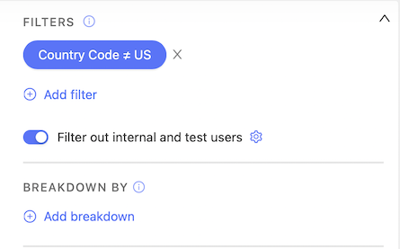
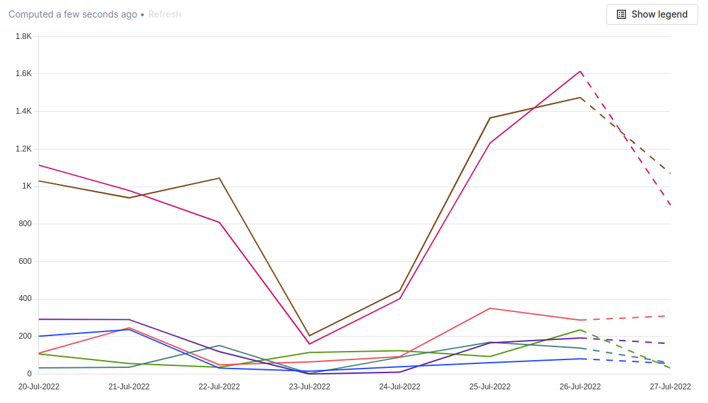

While PostHog is obviously useful for product managers, engineers and analysts, there’s a lot it can do for other teams too — including customer success. Internally, for example, our CS team uses PostHog to track a variety of relevant metrics and to preemptively identify users that would benefit from their support.

You can find out more about how our customer success team works in the PostHog docs, but in the meantime here are five tips to help your team get started with PostHog…

## 1. Find out where customers get stuck

Using a combination of [autocapture](/manual/events#autocapture-event-tracking) and [custom events](/tutorials/event-tracking-guide#using-custom-events-to-track-advanced-behaviors), PostHog makes it possible to track every part of your product experience. This makes it trivial to track where users are getting stuck by using [funnel insights](/manual/funnels).

At PostHog, for example, new users have to go through several common steps to be successful — they must create an account, login, ingest events and then make a discovery through an insight. Using funnels, we’re able to identify which stage users get stuck on and then monitor how successful we are at fixing the problem.

> 💡**PostHog Tip:** Want to delve deeper into the root causes behind a drop off? Use [breakdowns](/funnels#identify-possible-causes-of-failure-and-success) to explore what groups of users have in common. 

## 2. Monitor product usage 

If you, like PostHog, only charge based on usage then you’ll want to keep a close eye on your usage metrics. This will both help you spot any trends in declining usage so that you can react early, and also proactively reach out to customers with increasing usage too. 

The simplest way to monitor usage is via a [trends insight](/manual/trends). Just create an insight which tracks your usage events on a reasonable timeline and you’ll be able to see how it changes over time. At PostHog, we actually monitor usage for each tool on the platform, as well as the overall events ingested — this helps us not only understand usage trends but also see which features are most popular. 

> 💡**PostHog Tip:** If you’ve only got a small number of users, your results may get swayed by internal users or test accounts. [Here’s how to filter them out](/tutorials/filter-internal-users)

## 3. Identify users who may be about to churn

Regardless of whether or not your overall usage is growing, it’s a good idea to monitor your overall retention and identify which customers are falling dormant and at risk of churning. The [lifecycle insight](/manual/lifecycle) exists exactly for this purpose.

Lifecycle insights categorize if users have completed any event within a specified period of time, then compare that to the previous interval to tell you whether they’re falling dormant, returning, resurrecting, or active. Dormant users are the ones to watch out for, as they’re showing poor engagement and are at risk of churning — just click the relevant bar on the insight to get a list. 

> 💡**PostHog Tip:** Curious about the difference between returning and resurrecting users? Check [the lifecycle docs](/manual/lifecycle#interpreting-your-lifecycle) for a full explanation. 

## 4. Integrate PostHog with other tools

We like to think PostHog works brilliantly on its own, but to get the most out of the platform you may want to connect it with other software in your stack. We have a library of over 50 apps to help you do this, so you can connect PostHog with tools such as [Hubspot](/apps/hubspot-connector) or [Salesforce](/apps/salesforce-connector). 

Best of all, because PostHog is entirely open source, you can build your own apps to enhance your data even further — all you need is a little Javascript or Typescript knowledge and you’re good to go!

> 💡**PostHog Tip:** Don’t fancy learning to code? [Connect PostHog to Zapier](/apps/zapier-connector) instead and use that to connect to additional services instead!

## 5. Build a customer success dashboard

Once you’ve built the insights you need, an essential step is adding them all to a PostHog dashboard so that you don’t need to check them one-by-one. Once you’ve pinned all your insights to a dashboard, you can easily check everything in one place and export it as an image if you need to include it in reports. 

At PostHog, we’re not big fans of lengthy meetings and reports — instead, we’ve set up a subscription which sends the insights to a thread in a shared Slack channel every week. Don’t use Slack? You can subscribe by email too.

<NewsletterForm compact />

