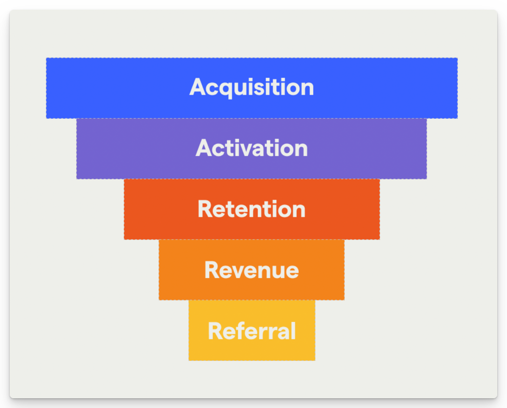
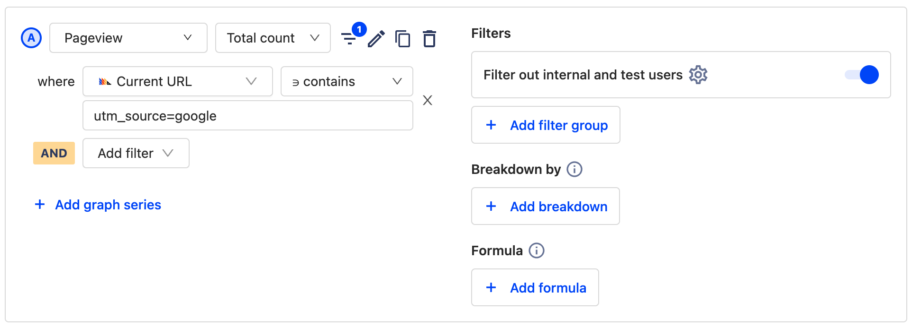
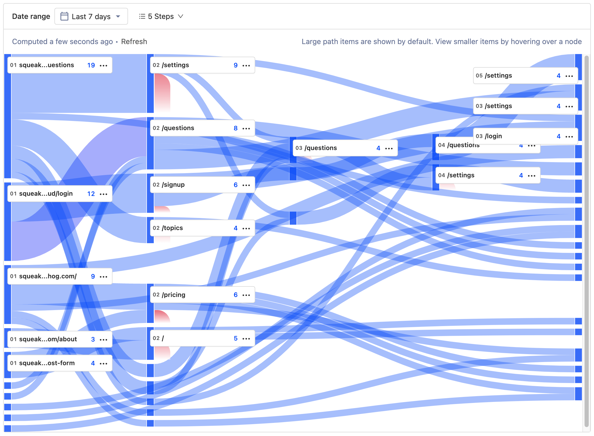
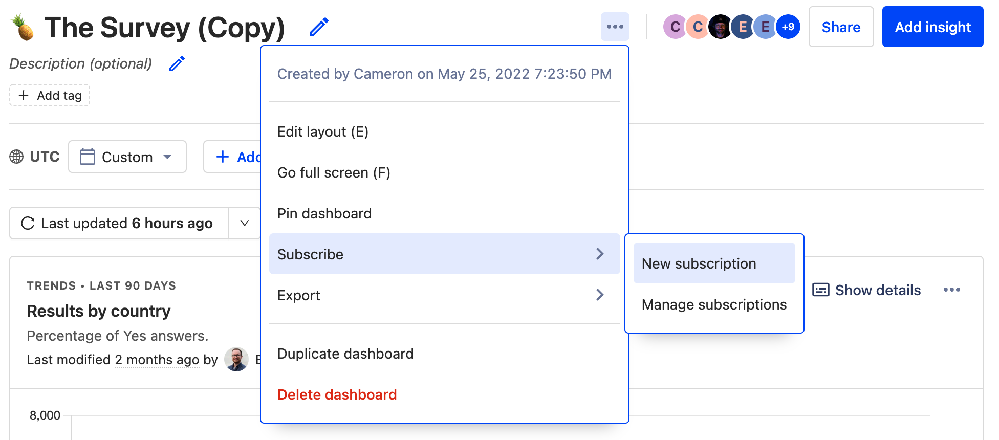

One of the great things about PostHog is that it democratizes your product strategy by making analytics accessible to more than just analysts. There’s no need for old-fashioned SQL queries or complex business intelligence tools — marketing teams are empowered to get all the information they need by themselves. 

Internally, [our marketing team](/handbook/people/team-structure/marketing) uses PostHog for [all their reporting](/blog/posthog-marketing), as well as for running ad-hoc analysis and testing new ideas. Here are some of the tips and tricks we recommend based on their experience...

## 1. Set up an AARRR pirate funnel

AARRR funnels are a framework for understanding how users engage with your product at different stages of their journey — Acquisition, Activation, Retention, Revenue, and Referral. It’s especially useful for marketers, growth teams and product marketers because it enables you to see where your biggest drop-offs are at a glance. 

The AARRR framework needs to be adapted slightly for each product — acquisition in your product, for example, may be a sign-up, a pageview, or something else entirely — but all stages can be tracked in PostHog using the [funnels](/manual/funnels) insight. We recommend creating a dashboard to help you track every stage in one place. 

> 💡**PostHog Tip:** Want to know more? Check our [complete guide to AARRR pirate funnels](/blog/aarrr-pirate-funnel)!

## 2. Track campaigns with trend insights

UTMs are an indispensable tool in the modern marketing arsenal, enabling you to track clicks by adding a customizable parameter after a URL. The URL `posthog.com/?utm_campaign=opensource` could be used in social media posts to track visits to the PostHog website via an open source campaign, for example. But how do you track these campaigns in PostHog?

The simplest way is to use a [trends insight](/manual/trends) in PostHog that filters pageviews by a matching event property. Alternatively, you can filter pageviews by the `Current URL` event property and specify the UTM as contained in the URL. Either result gives you an effortless way to track the performance of campaigns and correlate the results with other analytics data. 

> 💡**PostHog Tip:** Trends aren’t the only way to visualize UTM performance. You can also use [the funnels insight](/manual/funnels) to explore how users move between two events - such as viewing a landing page, and signing up. 

## 3. Watch how users sign-up with session recordings

You may think your sign-up flow is easy to navigate, but what really matters is what your users think. If only there was some way to watch how they use your site, so you can identify where they’re experiencing friction? Enter: [session recordings](/manual/recordings).

Session recordings are like a DVR of people using your product and enable you to see every mouse movement, rageclick and pause that users make on your site — all without surfacing sensitive information. Design and marketing teams at organizations such as [Hasura](/customers/hasura) use session recordings to find ways to optimize their sites. 

> 💡**PostHog Tip:** Watching lots of recordings can be time consuming. We recommend filtering recordings to focus on key events, such as new sign-ups, to make it easier to find valuable insights. 

## 4. Understand how users explore your site with paths

So, you know how to track performance of marketing campaigns and how to see how individual users engage with your content, but how can you get a view of the entire user journey? That’s where [path analysis](/manual/paths) comes in. 

Paths enable you to see the route every user takes between two points, as well as where they drop off or get lost. If you’ve ever wondered the route visitors take between a landing page and a successful sign-up, PostHog’s path analysis tool can give you the answer in seconds. Then, you can find ways to optimize or improve the route!

> 💡**PostHog Tip:** Path insights in PostHog don’t have to specify both the start and endpoint. If you’re curious how users get to a specific page, for example, you can just set an endpoint to see every path users took to reach that page. 

## 5. Use dashboards subscriptions to keep up to date

Maybe you want to share PostHog reports with the whole company, or maybe you’re just trying to cut down on time spent looking for credentials in 1Password. Either way, subscriptions are the solution. 

Subscriptions are currently available via email, or Slack. In both cases, you’ll get regular updates from PostHog about each query on a dashboard so that you can see how results have changed since the last interval. Subscriptions work best for metrics you want to monitor closely over time, such as new customers or overall website traffic. 
