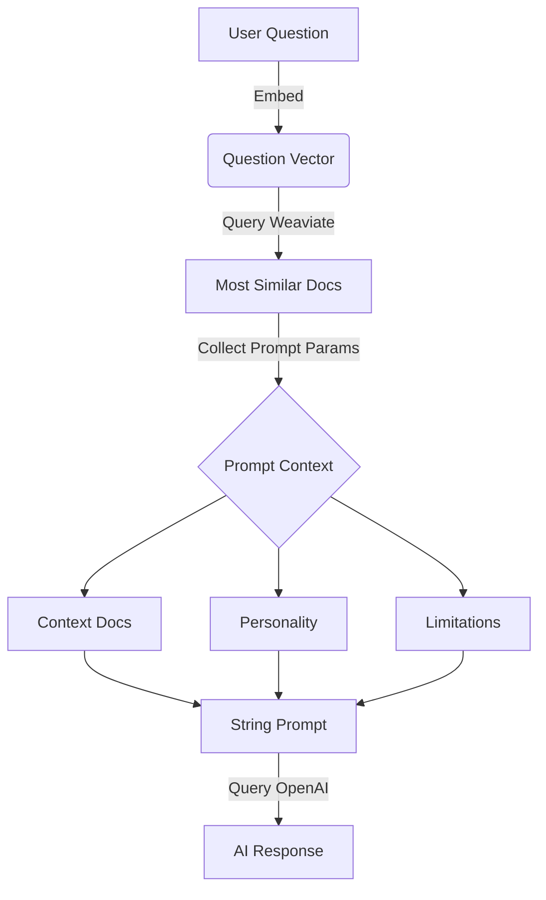

Every year, Team PostHog congregate for our annual all-company offsite. In previous years we've been to Italy, Portugal and Iceland. This year, we went to the Aruba – a tiny, Caribbean island just off the north coast of Venezuela.

As a remote company, our offsites are a hugely important part of our culture. We encourage everyone to meet up when they can, be that through co-working, ad-hoc visits (which we pay for), or small team offsites, but we only get the whole company together once a year.

When we do, we like to plan a mixture of fun social activities, strategic sessions and workshops, culture exercises, and (the most important bit) a 24-hour hackathon.

Here's what we built.

## MaxAI: Our friendly, PostHog support AI

- **Team Bandwaggoners:** James Greenhill, Paul Hultgren, Eric Duong, Raquel Smith and Neil Kakkar

Deployed on our Slack, app, website, and GitHub repos, MaxAI was the inevitable result of everyone wanting to play with GPT. 

The goal of the team was to create an AI bot that could answer support questions, easing the load on our support heroes and making it easier for the community to find answers to their questions.

Built using Weaviate, Haystack, and `gpt-3.5-turbo`, MaxAI works by taking a user's question, collecting all relevant docs and data for that question, generating a prompt with all that context, and querying OpenAI for an answer.

Here's a flowchart of the process:

On the whole, Max gives useful answers – even when using the general data and dealing with complex questions.

Max is also dead handy for summarizing long support threads in Slack or GitHub issues.

That said, Max isn't immune to hallucinating solutions – or even URLs for docs that don't exist – if it doesn't know the answer. It's a work in progress we'll be releasing Max on our support Slack soon as a beta. 

Check out the [MaxAI repo](https://github.com/PostHog/max-ai) for more info.

## Dashboard template libraries and learning tracks

- **Team Vibes:** Ian Vanagas, Joe Martin and Andy Vandervell

The marketing team worked together to build (and ship) a [public library of pre-built dashboards](/templates), including an [AARRR pirate metrics dashboard](/templates/aarrr-dashboard), [templates for B2C](/templates/b2c-dashboard) and [B2B products](/templates/b2c-dashboard), and a [landing page report](/templates/landing-dashboard) for marketers transitioning from Google Analytics.

These dashboards are accessible from the 'New Dashboard' modal in PostHog. Some templates require custom events, which you'll be asked to configure before creating the dashboard – you can also change the events you track later.

Got a request for a dashboard? DM someone from the marketing on our community Slack.

Joe Martin also worked with Eli from the Website & Docs team to ship [PostHog Tracks](/tracks), a new way to discover tutorials organized by role.

## A built-in data warehouse for PostHog

- **Team DataBeach:** Marius Andra, Frank Hamand and Harry Waye

Dubbed DataBeach because Frank and Harry started building the feature while sipping Piña Coladas by the beach, DataBeach is all about our long-term vision of  [simplifying the modern data stack](/blog/modern-data-stack-sucks) for startups. Less time spent wrangling data = more time shipping products. 

The MVP they built consists of custom tables that are created and queried through the PostHog UI and API. These tables provide a way to store and query data from sources like Stripe, Hubspot (see above), Intercom, and more, along with data from PostHog.

There's much to build before PostHog as a data warehouse is ready for you, but it's coming. Keep an eye on our [public roadmap](/roadmap) for updates.

## Building a Zendesk killer in PostHog

- **Team Arubug:** Tiina Turban, Simon Fisher, Paul D'Ambra, Cameron DeLeone, and Cory Watilo

Last year, we adopted Zendesk to manage support for PostHog, but we don't love it. It's hard to prioritize tickets, and most lack the context a support hero or engineer needs to fix it. Enter team Arubug, who decided there had to be a better way.

// TODO: Video of site app

The team started by [building a site app](/tutorials/build-site-app) for bug reports based on our existing [Feedback Widget](/apps/feedback-widget), which sends a `$bug_report` event to PostHog.

// TODO: Screenshot of dashboard

These reports feed into a dashboard that tracks bug reports, helping us to identity trends. Bugs can broken down as tables with relevant properties, and session replays, attached.

// TODO: Screenshot of bug report table 

The team also built a communication tab into bug reports, so support can send emails and leave notes on tickets with additional context without leaving the app. Every email is a ClickHouse event tied to the initial UUID of the report event, with emails (for now) sent and received via Zapier.

// TODO: Screenshot of communication tab

Long term, we're looking at whether this could replace Zendesk for support, and be launched as a beta product for PostHog users one day.

## Hedgehog mode + toolbar = awesomeness

- **Team:** Ben White, Grace McKenzie and Lottie Coxon

Hedgehog mode is one of PostHog's most powerful features – who wouldn't want to play with our adorable mascot? 

// TODO: Gif/image of hats and costumes

Currently, Max – accessible via the help menu in PostHog – can jump around, spin, wave, dance, and wave. For their hackathon, the team worked on accessories for Max, such as hats, glasses, and costumes, that PostHog users could unlock by completing certain tasks – e.g. watching a certain number of replays.

// TODO: Gif of toolbar

They also set about revamping the PostHog Toolbar, replacing the dull but functional PostHog icon with an animated Max whose status changes when you select different toolbar features.

## PostHog beta feature previews

- **Team WE WILL DE-FEAT-URE MANAGEMENT YOU:** James Hawkins, Michael Matloka and Annika Schmid

We're constantly building new features, but we have to invite users personally to try them out. It's inefficient and not cool. James, Michael and Annika thought it would be better if PostHog users could join PostHog betas themselves. So, they built it. That is cool.

// TODO: Screenshot of feature preview

Feature previews is pretty simple. It's a list of features we're testing, including screenshots and basic information, that users can simply enable or disable whenever they like. When they do, they're either automatically added to removed from the relevant feature flag.

In future, we want to build this out so users can register their interest in features that aren't ready yet, so they get automatically added to the preview when it goes live.

We hope to roll this out as a usable feature soon.

## Summer social events

- **Team Plops (People & Ops):** Coua Phang and Kendal Hall

Our hackathon isn't just for engineering. The People & Ops team used the time to plan summer events (IRL and virtual) for the PostHog team.

In June they've planned a virtual engraving workshop, in July a virtual escape room experience, and in August we're getting together in Cambridge, UK for a scavenger hunt around the city, and a barbecue.

## Event-based automations

- **Team Automations:** Luke Harries, Ben White, Thomas Obermüller, Cory Watilo 

Luke and Thomas built an MVP for automations in PostHog. In the MVP, automations have a source (event, action or cron job), logic (pause for / pause until), and sources (e.g. send a Slack message, create a GitHub Issue, add to cohort, add to feature flag, send an in-app message etc.).

// TODO: Screenshot of Automation creation

Even this basic functionality creates numerous helpful use cases, but long-term we expect to add more sources and destinations, and the ability to create automations based on event thresholds.

## HouseWatch: Centralized monitoring and management for ClickHouse

- **Team HouseWatch:** Li Yi Yu, Yakko Majuri, and Tim Glaser

PostHog uses ClickHouse as our main event database, but we end up using a huge range of tools (Grafana, Metabase, pganalyze etc.) to monitor and manage it. Team HouseWatch built a centralized dashboard, so we can eliminate all this bloat and have everything in one place.

// TODO: Screenshot of House Watch

The homepage allows us to monitor things like execution count (queries per hour), and memory usage. There's also a slow queries view, which will allow the team to proactively identify problematic queries and reach out to customers to help.

Other features include:

- Custer performance overview
- Table size visualizations (including size by columns)
- Ability to kill queries
- Productized async migrations

Needless to say, this is all backend work you will never see, but House Watch will make it easier for us to keep PostHog fast and reliable for you.