Every year, Team PostHog congregates for our [annual all-company offsite](/handbook/company/offsites). In previous years we've been to Italy, Portugal and Iceland. This year, we went to Aruba – a tiny, Caribbean island just off the north coast of Venezuela.

As a remote company, our offsites are a hugely important part of our culture. We encourage everyone to meet up when they can, be that through co-working, ad-hoc visits ([which we pay for](/handbook/people/spending-money#budget-for-socializing)), or [small team offsites](/handbook/company/offsites#small-team-offsites), but we only get the whole company together once a year.

When we do, we like to plan a mixture of fun social activities, strategic sessions and workshops, culture exercises, and (the most important bit) a 24-hour hackathon.

Here's what we built during our Aruba hackathon.

## MaxAI: Our friendly, PostHog support AI

- **Team Bandwaggoners:** James Greenhill, Paul Hultgren, Eric Duong, Raquel Smith and Neil Kakkar

Deployed on our Slack, app, website, and GitHub repos, MaxAI was the inevitable result of everyone wanting to play with GPT. 

The goal was to create an AI bot that could answer support questions, easing the load on our [support heroes](/handbook/engineering/support-hero) and making it easier for the community to find answers to their questions.

Built using Weaviate, Haystack, and `gpt-3.5-turbo`, MaxAI works by taking a user's question, collecting all relevant docs and data to that question, generating a prompt with that context, and querying OpenAI for an answer.

Here's a flowchart of the process:

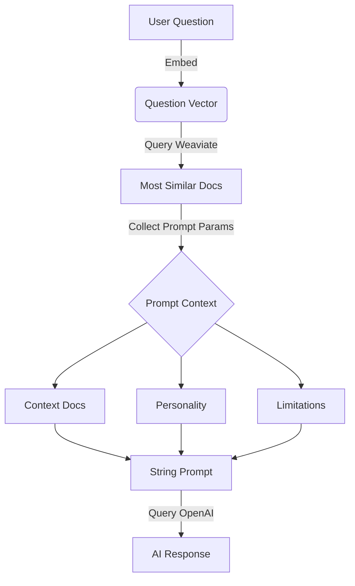

On the whole, Max gives useful answers – even when dealing with complex questions. Max is also dead handy for summarizing long support threads in Slack or GitHub issues. 

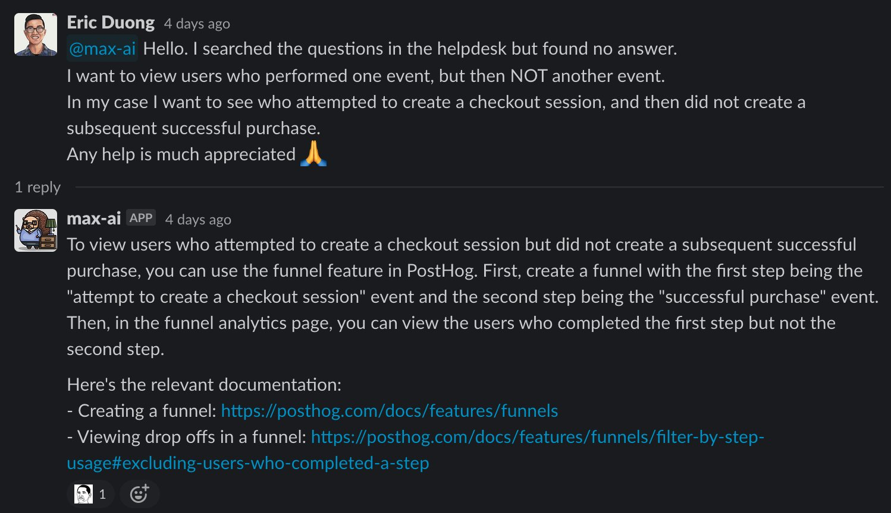

That said, Max isn't immune to hallucinating solutions – or even URLs for docs that don't exist – if it doesn't know the answer. It's a work in progress, but we've released Max in our community as a beta. Drop him a DM! 

Check out the [MaxAI repo](https://github.com/PostHog/max-ai) for more info.

## Dashboard template libraries and learning tracks

- **Team Vibes:** Ian Vanagas, Joe Martin and Andy Vandervell

The marketing team worked together to build (and ship) a [public library of pre-built dashboards](/templates), including an [AARRR pirate metrics dashboard](/templates/aarrr-dashboard), [templates for B2C](/templates/b2c-dashboard) and [B2B products](/templates/b2c-dashboard), and a [landing page report](/templates/landing-dashboard) for marketers transitioning from Google Analytics.

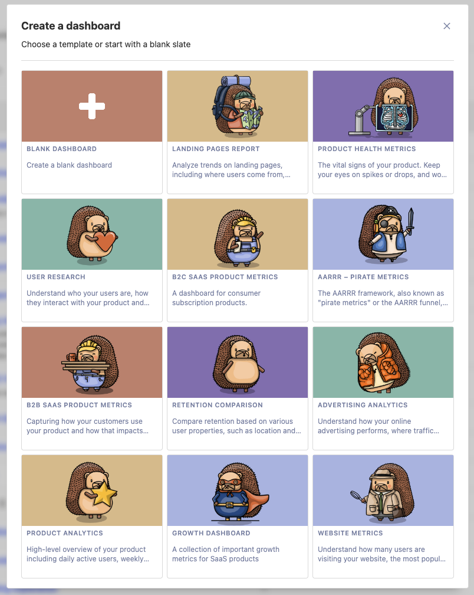

These dashboards are accessible from the 'New Dashboard' modal in PostHog. Some templates require custom events, which you'll be asked to configure before creating the dashboard – you can also change the events you track later.

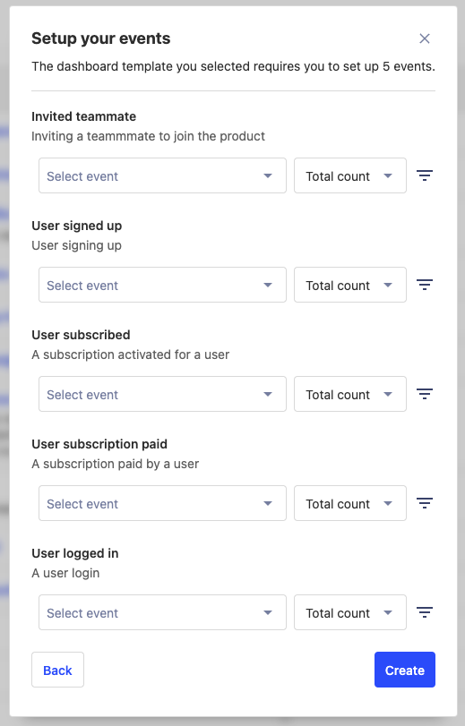

Got a request for a dashboard? DM the team on our community Slack!

## A curated set of PostHog tutorials

- **Team Not-ShuffleHog:** Joe Martin and Eli Kinsey

For Joe, one hackathon project wasn't enough. He also worked with Eli Kinsey from the Website & Docs team to ship [PostHog Tracks](/tracks), a new way to discover tutorials organized by role.

Tracks groups tutorials into curated lesson groups based on the common use-cases we see in PostHog. There are lesson tracks for Product Engineers, Front-end Developers, and Product Managers. 

The team name is a reference to a hackathon project Joe is especially passionate about, but wasn't able to work on this year. One day. 

## A built-in data warehouse for PostHog

- **Team DataBeach:** Marius Andra, Frank Hamand and Harry Waye

Dubbed DataBeach because Frank and Harry started building the feature while sipping Piña Coladas by the beach, DataBeach is all about our long-term vision of [simplifying the modern data stack](/blog/modern-data-stack-sucks) for startups. Less time spent wrangling data = more time shipping products. 

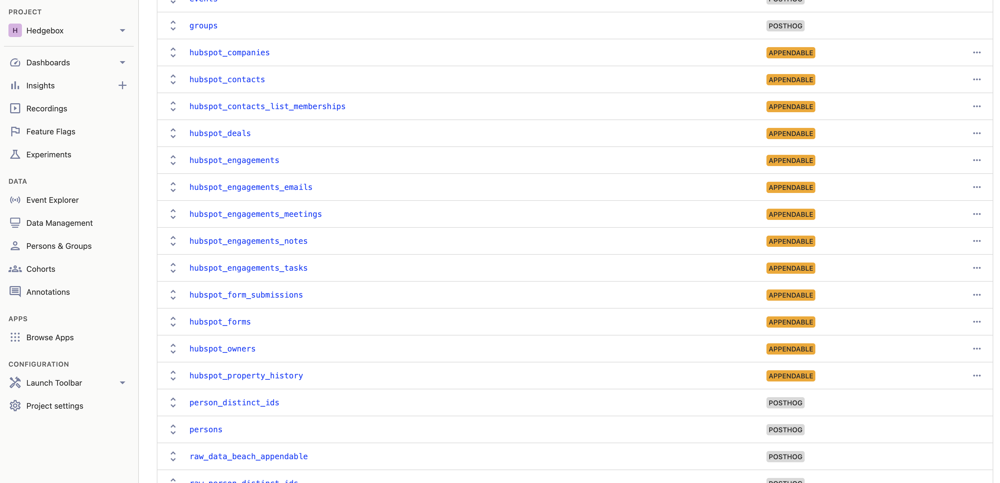

They teamed up with Marius to an build MVP consisting of custom tables that are created and queried through the PostHog UI and API. These tables provide a way to store and query data from sources such as Stripe, Hubspot (see above), Intercom, and more, along with data from PostHog.

There's more to build before PostHog is ready to be your data warehouse, but we're working on it. Keep an eye on our [public roadmap](/roadmap) for updates.

## Leveling up PostHog support

- **Team Arubug:** Tiina Turban, Simon Fisher, Paul D'Ambra, Cameron DeLeone, and Cory Watilo

Anecdotally, our direct-to-an-engineer support is a big reason why people love us. But we've run into a few of inefficiencies as we've grown, such as:

- Support requests that lack the context an engineer needs to fix it
- Lack of trends and aggregated info about support requests
- Difficulty managing multiple sources for support requests

Enter team Arubug, who decided there had to be a better way.

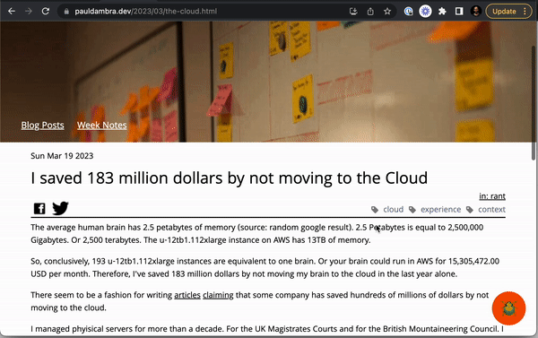

The team started by [building a site app](/tutorials/build-site-app) for bug reports which sends a `$bug_report` event to PostHog.

These reports feed into a dashboard that tracks bug reports, helping us to identity trends. Bugs can be broken down as tables with relevant properties, and session replays, attached.

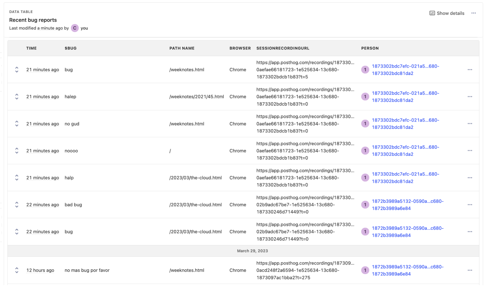

The team also built a communication tab into bug reports, so support can send emails and leave notes on tickets with additional context without leaving the app. Every email is a ClickHouse event tied to the initial UUID of the report event, with emails (for now) sent and received via Zapier.

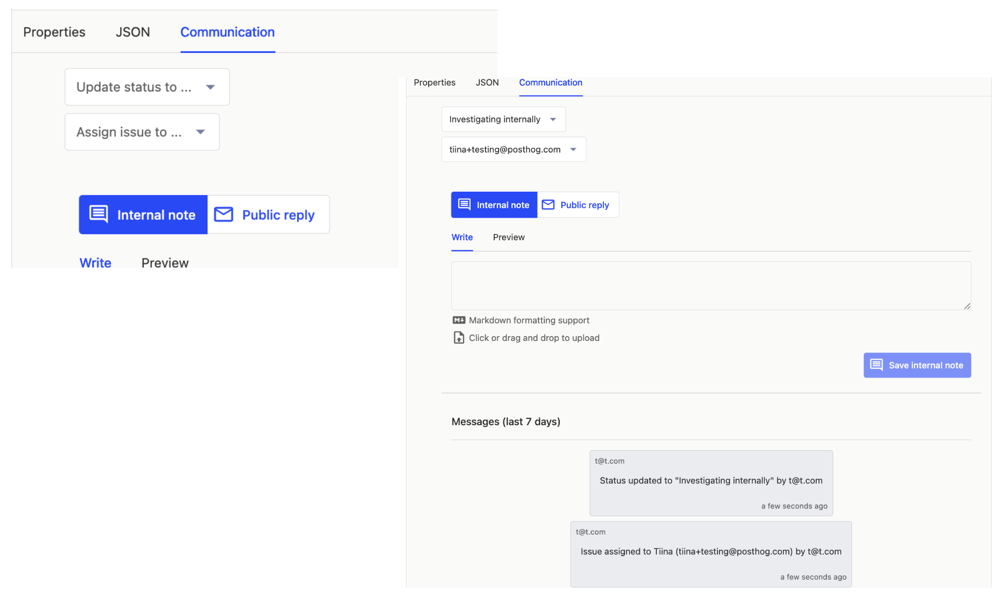

After the hackathon, we reviewed the plan and realized: 

1. Due to the increased complexity of our product, it's hard for a single engineer to provide good support for all of our products. 

2. Support heroes shield product teams from feedback about their product, impeding an important feedback loop.

Consequently, we decided to use the hackathon in-app integration to triage support requests by product/team, and improve our integration with Zendesk instead of developing the communication tab further. 

Now, instead of our single support hero, each team will handle support requests for their product, and tickets will be enhanced with useful context, such as session replays and product usage data. This process also enables us to collect aggregated info on bugs and requests, so we can identify common issues faster.

## Hedgehog mode + toolbar = awesomeness

- **Team:** Ben White, Grace McKenzie and Lottie Coxon

Hedgehog mode is one of PostHog's most powerful features – who wouldn't want to play with our adorable mascot? 

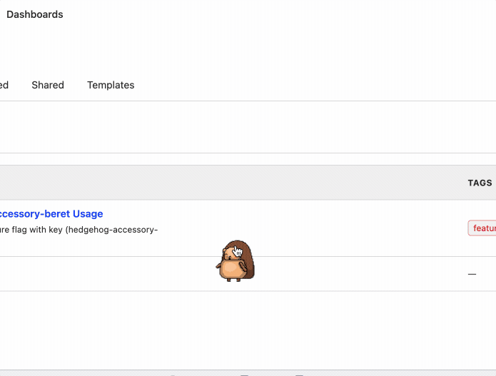

Currently, Max – accessible via the help menu in PostHog – can jump around, spin, wave, dance, and wave. For their hackathon, the team worked on accessories for Max, such as hats, glasses, and costumes, that PostHog users could unlock by completing certain tasks – e.g. watching a certain number of replays.

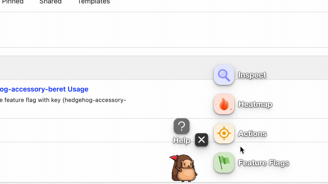

They also set about revamping the PostHog Toolbar, replacing the dull but functional PostHog icon with an animated Max whose status changes when you select different toolbar features.

## PostHog beta feature previews

- **Team WE WILL DE-FEAT-URE MANAGEMENT YOU:** James Hawkins, Michael Matloka and Annika Schmid

We're constantly building new features, but we have to invite users personally to try them out. It's inefficient and not cool. James, Michael and Annika thought it would be better if PostHog users could join PostHog betas themselves. So, they built it. That is cool.

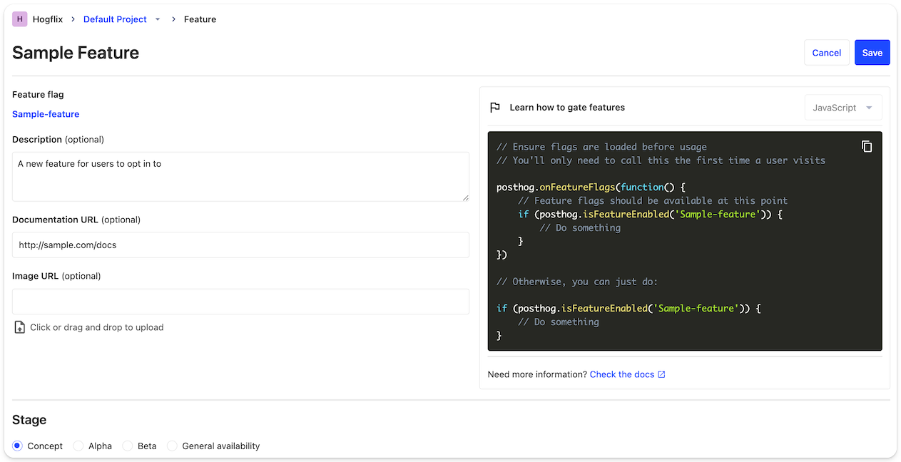
<Caption>Interface for creating feature preview entries, including screenshots and docs options</Caption>

Feature previews is pretty simple. It's a list of features we're testing, including screenshots and basic information, that users can simply enable or disable whenever they like. When they do, they're either automatically added to, or removed from, the relevant feature flag.

In the future, we hope to extend this feature to PostHog users who want to do the same for their own users.

## Summer social events

- **Team Plops (People & Ops):** Coua Phang and Kendal Hall

Our hackathon isn't just for engineering. The People & Ops team used the time to plan summer events (IRL and virtual) for the PostHog team.

In June they've planned a virtual engraving workshop, in July a virtual escape room experience, and in August we're getting together in Cambridge, UK for a scavenger hunt around the city, and a barbecue.

## Event-based automations

- **Team Automations:** Luke Harries, Ben White, Thomas Obermüller, Cory Watilo 

Luke, Thomas, Ben and Cory built an MVP for automations in PostHog. In the MVP, automations have a source (event, action or cron job), logic (pause for / pause until), and sources (e.g. send a Slack message, create a GitHub Issue, add to cohort, add to feature flag, send an in-app message etc.).

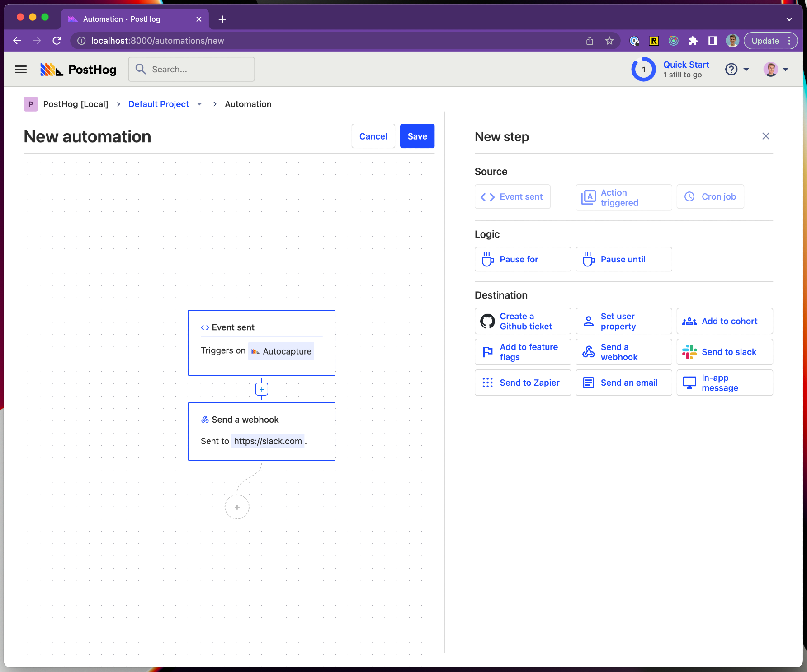

Even this basic functionality has numerous helpful use cases, but long-term we expect to add more sources and destinations, and the ability to create automations based on event thresholds.

## HouseWatch: Centralized monitoring and management for ClickHouse

- **Team HouseWatch:** Li Yi Yu, Yakko Majuri, and Tim Glaser

PostHog uses ClickHouse as our main event database, but we end up using a huge range of tools (Grafana, Metabase, pganalyze etc.) to monitor and manage it. Team HouseWatch built a centralized dashboard, so we can eliminate all this bloat and have everything in one place.

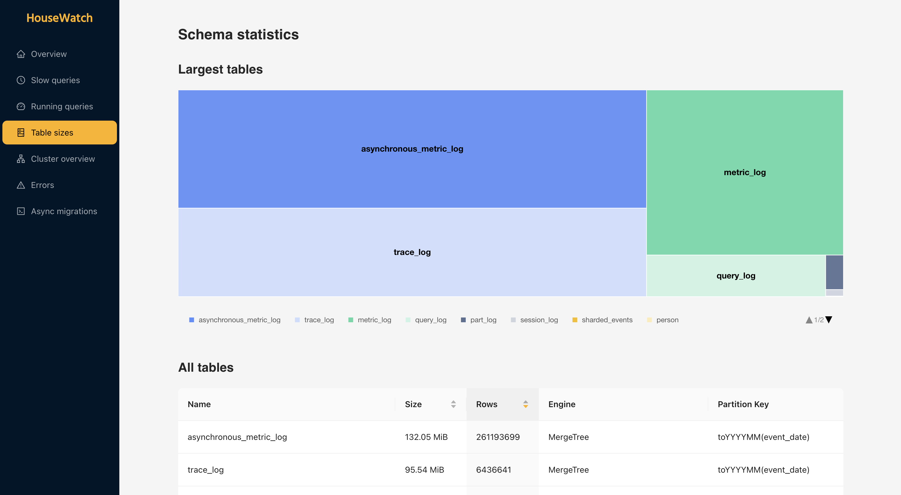

The homepage enables us to monitor things like execution count (queries per hour), and memory usage. There's also a slow queries view, which will allow the team to proactively identify problematic queries and reach out to customers to help.

Other features include:

- Custer performance overview
- Table size visualizations (including size by columns)
- Ability to kill queries
- Productized async migrations

Needless to say, this is all backend work you will never see, but HouseWatch will make it easier for us to keep PostHog fast and reliable for you.

## What's next?

Some hackathon projects, such as our new dashboard templates, have already shipped, while we've also revamped how we do support based on the work of Team Arubug. Others are still work-in-progress projects that we expect to ship in future – see our [public roadmap](/roadmap) and [GitHub repo](https://github.com/PostHog/posthog) for updates on what we're working on.

Fancy joining us at our next all-company offsite? We're [always hiring](/careers).
