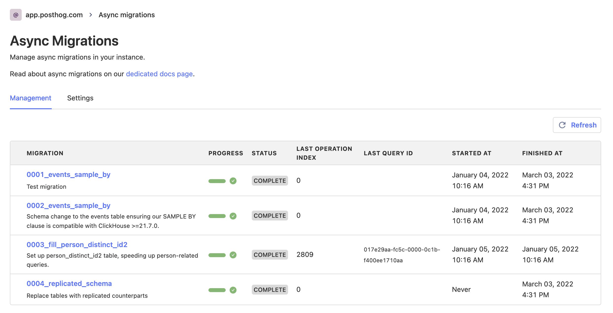
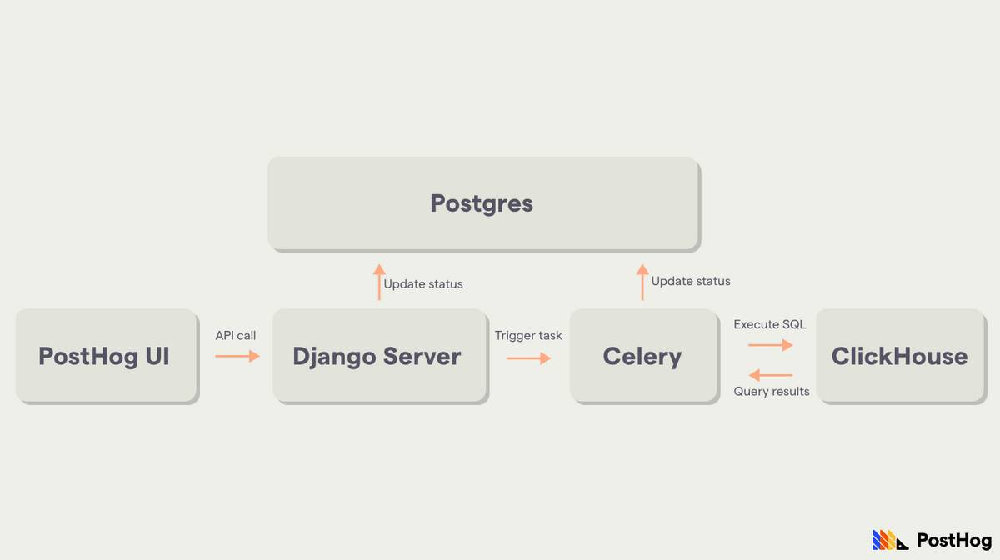

In this world nothing is certain except death, taxes, and database migrations.

As your product evolves, your schemas evolve too, and you need migrations to update them.

However, not all migrations are made equal.

Some are simple, others are complex. Some run quickly, others take a long time.

For example, consider the following three scenarios that we've encountered at PostHog when updating table schemas in ClickHouse (our analytics database):

> Note: These scenarios are based on non-replicated tables.

**1. Adding a column to a table**

This is reasonably simple. We can modify the table in place with an `ALTER TABLE` statement and add the column we want.

**2. Changing the engine of a table**

Here things start to get a bit more complicated. ClickHouse does not support changing table engines via `ALTER TABLE`, so we cannot modify the table in place.

Instead, we need to create a new table with the same schema, except for the engine change, and insert data from the old table into it.

Luckily, ClickHouse provides a nice way to do this. With `ATTACH PARTITION`, we can "copy the data" from the old table to the new table reasonably quickly, by simply "attaching" the existing partition(s) to the new table. In reality, no data gets "copied", but rather new hard links are created to point to the existing data.

So while we do need to get data from a table to another, this isn't very problematic.

**3. Changing the sorting key of a table**

This is where things get hairy.

ClickHouse tables using engines in the `MergeTree` family [store data on disk in sorted parts following a "sorting key"](https://clickhouse.com/docs/en/development/architecture/#merge-tree).

This is defined by the `ORDER BY` clause at table creation.

Now, say you've done some analysis on the most common queries you run and determined you'd have a massive performance benefit from adding a column to your sorting key.

Well, tough luck - can't do that.

While a `MODIFY ORDER BY` statement [does exist on ClickHouse](https://clickhouse.com/docs/en/sql-reference/statements/alter/order-by/), the docs specifically note that "you cannot add expressions containing existing columns to the sorting key".

The reason for this is that adding a column to the sorting key would require rewriting all parts on disk, as they should now be sorted differently.

This means that, like in example #2, we need to create a new table and add the old data to it. However, it also means that we cannot use `ATTACH PARTITION`, as the parts on the new table will be different from those on the old table.

That leaves us with one option: inserting all the data from the old table into the new table...

Row. By. Row.

## The problem

Needing to execute migrations like the one above leaves us with a difficult problem at hand: inserting data row by row can take _a long time_.

The time it will take depends on the size of the table to be migrated, and thus, if we're migrating a large table (say, [our events table](https://github.com/PostHog/posthog/issues/5684)), this can take weeks.

As a result, we can't pop this in with our other ("normal") migrations which run on every upgrade, as they would prevent the upgrade from happening, and potentially even cause downtime.

But that's not all. We at PostHog have an additional problem: self-hosted users.

If PostHog was a SaaS-only platform (with no self-hosting available), we could have a team dedicated to running this "manually" on our instance, monitoring it, and making sure everything runs smoothly.

However, that's not a viable option for users that run their own PostHog instance. Providing them with a runbook is _an_ option, but it doesn't align with our goal of making PostHog easy to deploy and manage.

We needed something better.

## Enter async migrations



The solution we came up with for the problem mentioned above is a system for running so-called async migrations.

This system allows us to **safely** run long data migrations in the background without causing any downtime, as well as provides a full suite of tools for managing and debugging these migrations easily.

When we started building it, we wanted the system to have three key characteristics:

1. It should be asynchronous, but with guarantees.
2. It should be safe.
3. It should be easy to work with, both for developers and users.

Here's how we achieved all three.

### 1. It should be asynchronous, but with guarantees

As we established earlier, long-running (and potentially unbounded) migrations can't be part of the upgrade path.

Thus, they can't run _synchronously_ during a version upgrade, they must run _asynchronously_ during normal operations.

For this, we settled on a version range approach.

```py
class Migration(AsyncMigrationDefinition):

    posthog_min_version = "1.45.0"
    posthog_max_version = "1.47.9"

    # ...
```

Unlike migrations that immediately become a pre-requisite for upgrading to the version they're included in, async migrations specify a range of versions within which they can be run, and users can run them at any time they like, provided their instance is within the range.

The beauty of this system is that users have flexibility to pick a convenient period to run the migrations (maybe they want to keep a close eye on it, or scale some services temporarily), but we (PostHog developers) can rely on them being completed from a given version onwards.

The guarantees around completion are done via a combination of hard requirements for upgrading to certain versions and good communication through release notes and docs, and they prevent us from having to support multiple code paths depending on the state of the database.

Given our monthly release schedule for minor versions, a migration added in 1.45.0 with an upper bound of 1.48.0 gives users three months to run them before the version it is required in comes out. In addition, it allows us to start working on code that relies on the migration being done after two months, essentially as soon as the last supported version (in this case 1.47.0) is released.

As for how they run, we leveraged a service we already used for asynchronous operations: Celery. We only ever run one async migration task at a time, keep task states temporarily in Redis, and tasks are dispatched with `track_started=True` and `ignore_result=False`, so we can keep an eye on them and handle edge cases like the Celery worker dying unexpectedly.

### 2. It should be safe

Anytime you're messing with user databases there's a risk that things will go bad. Period.

As such, just like with any migration, async migrations still rely on reviewers, tests, and checks to ensure nothing dangerous is shipped, like a migration with `DROP TABLE events`.

However, it was a top priority for us to make the async migrations system include all the necessary tools for running database operations safely on environments we don't control (self-hosted instances).

To achieve this, we:

-   Made available to developers a wide range of checks that can short circuit the running process, such as a precheck, a periodic healthcheck, service version requirements, and dependencies. To give one specific example, we often use prechecks to ensure the database has enough free disk space to run the migration, given we might temporarily duplicate a table's data, for instance.
-   Built the system with resumability and rollbacks in mind, ensuring migrations can behave in a sane and non-destructive way if services crash, errors are thrown, timeouts occur, etc. Depending on the circumstances, we will either continue running the migration if we've determined it to be safe, or roll the database back to the initial state.

### 3. It should be easy to work with, both for developers and users

Lastly, async migrations should be easy to launch and manage for users, as well as easy to write and build upon for developers.

To cover the latter part, we implemented the aforementioned guarantees and checks, as well as made the migration definitions closely resemble other migration systems we already have in place.

As for users, we built a fully-fledged UI for instance admins, where they can read about the migration, update settings (like default timeouts and automatic rollbacks), trigger a run, pause or resume a migration, force a rollback, monitor status and progress, as well as get a list of errors.

We also store the ID of the query that is currently running on the database and the ID of the Celery task handling the migration, so more advanced users can go into the services themselves for additional monitoring.

Ultimately, running a migration takes only the click of a button, but all the tools are in place for debugging issues if they come about.

It's also worth noting that we implemented an API for migrations to check if they should even run at all on a given instance. This is particularly useful for preventing useless runs on fresh deploys. A user that deployed PostHog after the migration was introduced shouldn't need to run a migration to get from an old schema to the new schema, given they already have the new schema in place (async migrations should come with corresponding changes to the original schema definitions). In these cases, we auto complete the migration and unblock upgrades without any user input at all.

## A closer look

### Architecture

Async migrations are triggered from the UI and create a Celery task that handles its execution in a background worker.

Metadata about the migration is stored in Postgres, including things such as status (completed, errored, rolled back, etc), progress, start and finish times, and other useful information.



### Structure

An async migration can contain the following components:

-   `description`: A description of the migration.
-   `operations`: A list of operations to run in sequence, each with a designated rollback. An operation can use plain SQL or arbitrary functions, and the operations list can be dynamic based on instance setup. For example, we may generate operations for each partition on a table.
-   `posthog_min_version`: The minimum version of PostHog required for running the migration.
-   `posthog_max_version`: The last PostHog version this migration can be run on.
-   `is_required`: A check that determines if this migration needs to be run on the instance. Usually verifies the current schema of a table to determine if it needs to be migrated.
-   `precheck`: A check that runs before the migration starts to determine if it is safe to do so. It returns a boolean and a message, so it can surface helpful errors to the user.
-   `healthcheck`: A check that runs both before the migration starts and at an interval while it is running. If it fails, it will kill the migration. Also returns a message that will be shown to the user.
-   `service_version_requirements`: A list of requirements for the versions of external services PostHog depends on, such as Kafka and PostgreSQL.
-   `progress`: A function that specifies an arbitrary progress calculation, returning a percentage between 0 and 100. If not present, we calculate progress based on the number of operations executed so far, although this is often not a good proxy.

## What's next?

We currently have three async migrations in the codebase, each destined to make queries in PostHog significantly faster. If you're a user, make sure to run them! For more info, see our [dedicated docs](/docs/runbook/async-migrations).

Going forward, we're excited to make this system even better, polishing our upgrade flow, including more granular controls, and introducing automatic runs under certain circumstances.

Oh, and while we don't spin this out into its own tool for others to use, feel free to check out [our codebase](https://github.com/PostHog/posthog/issues/7054) if you have a similar problem - don't worry, it's open source 😉.

> PostHog is an open source analytics platform you can host yourself. We help you build better products faster, without user data ever leaving your infrastructure.

<ArrayCTA />
