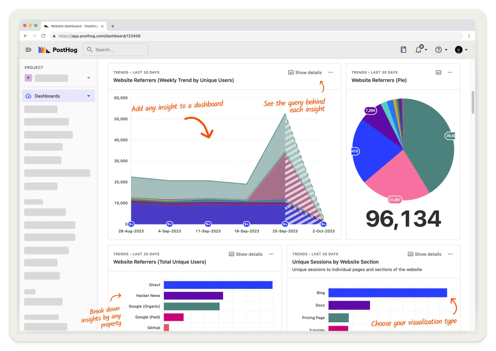
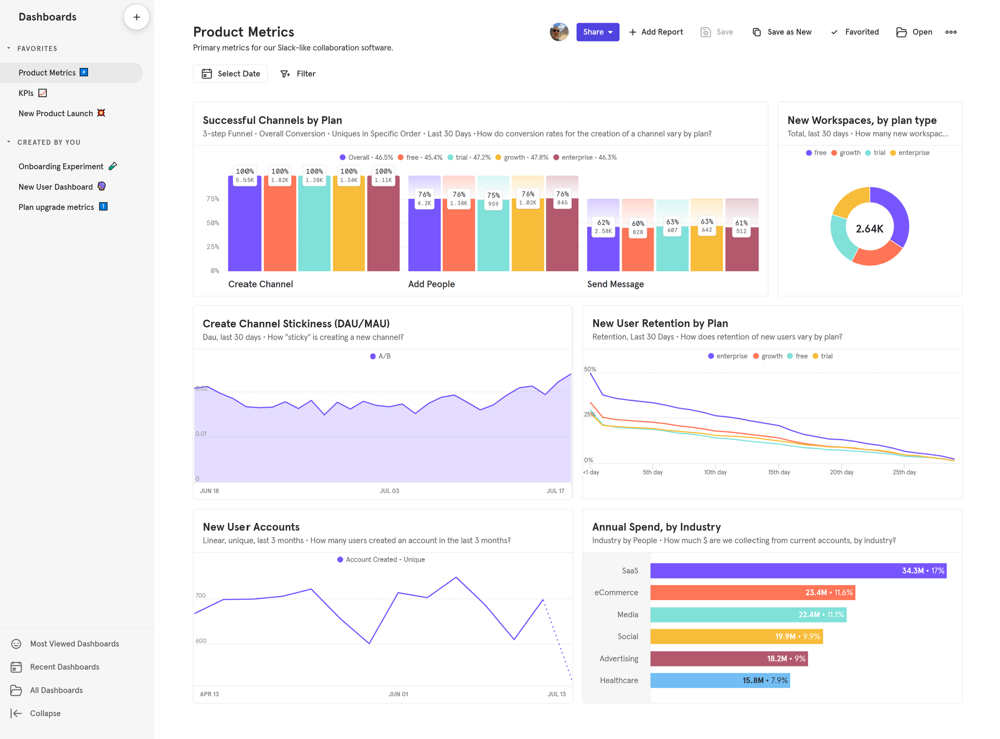
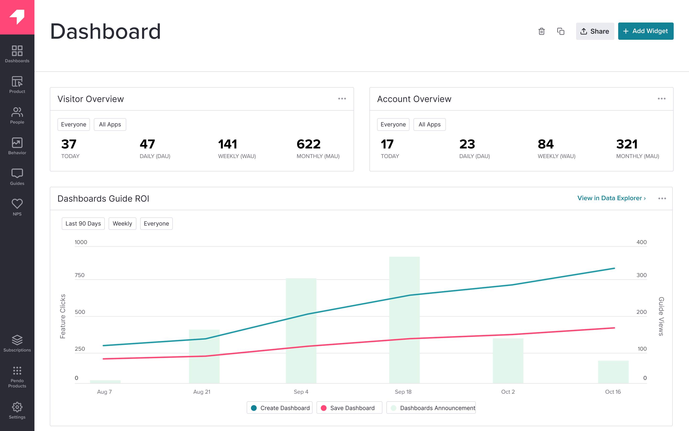
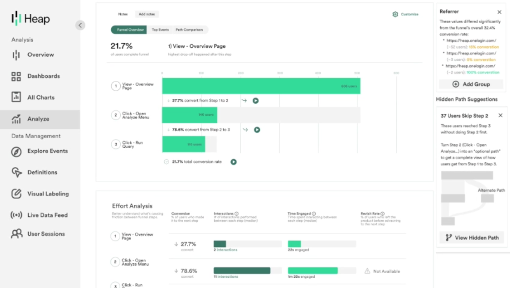
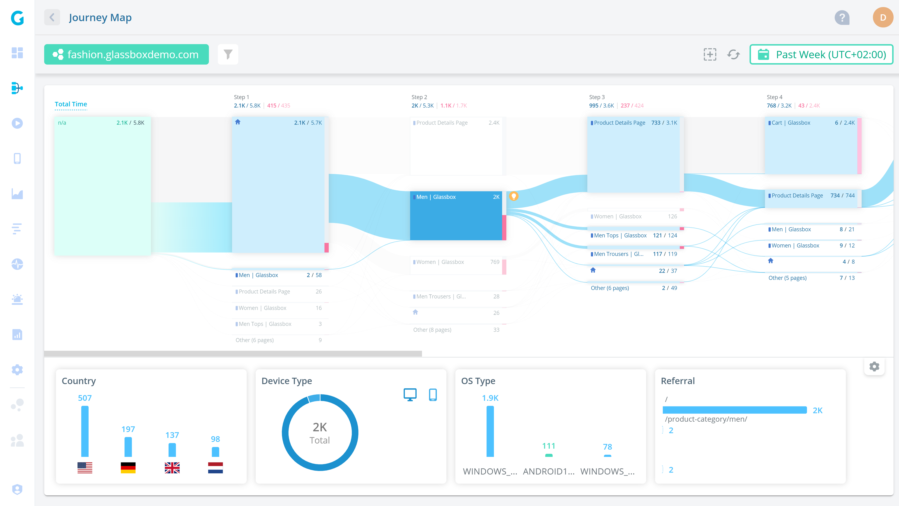
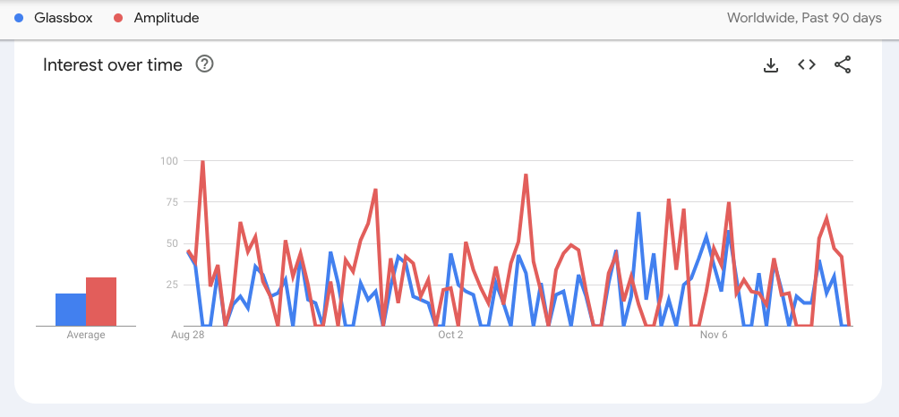
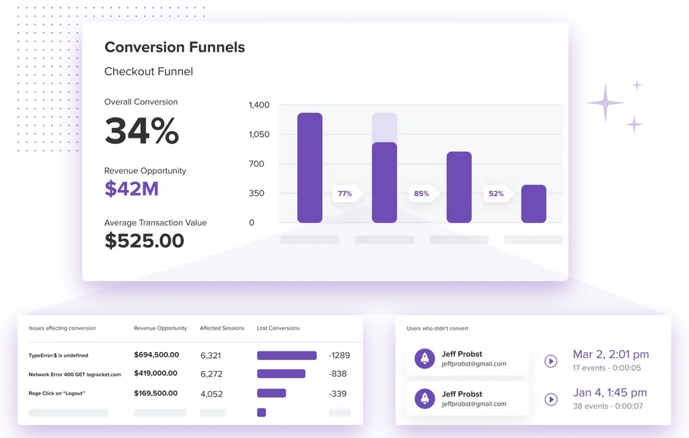
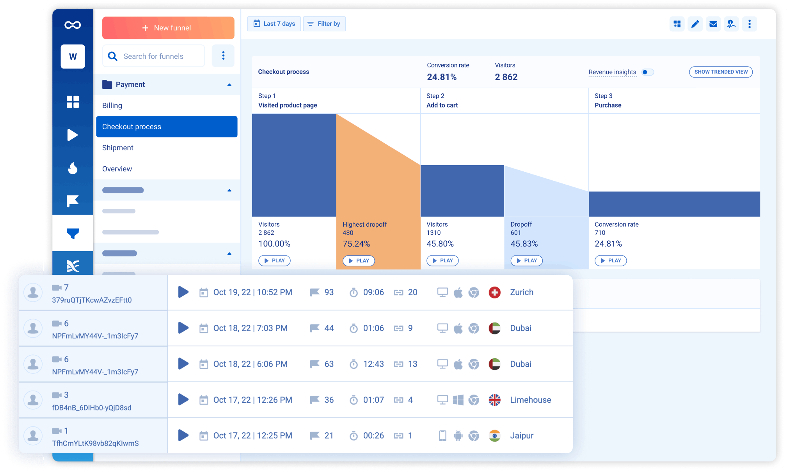
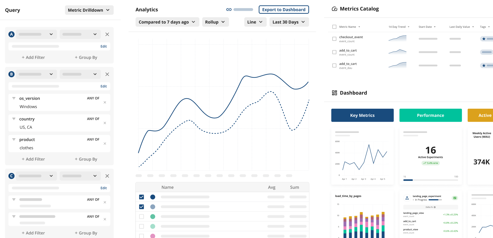

import { ComparisonTable } from 'components/ComparisonTable'
import { ComparisonRow } from 'components/ComparisonTable/row'

The most popular Amplitude alternatives in 2023 are:

1. **PostHog:** An all-in-one platform combining comprehensive analytics with A/B testing, session replay, user surveys, and feature flags. Ideal for B2B SaaS apps.

2. **Mixpanel:** A focused product analytics tool designed for product managers at mid-size companies and above.

3. **Pendo:** Product experience platform with a suite of tools like analytics, session replay, in-app guides, user feedback, and product validation tools.

4. **Heap:** A digital insights platform for understanding the end-to-end journey that includes analytics, autocapture, and session replay.

5. **Glassbox:** Provides analytics and session replay to analysts at retail, ecommerce, and mobile-focused companies.

6. **LogRocket:** A product-focused session replay, analytics, and error tracking tool helping teams identify issues with their site and app.

7. **Smartlook:** Comprehensive user insight platform that includes analytics, session replay, heatmaps, and crash reports.

8. **Statsig:** A platform for building better products with experimentation, feature flags, and a recently added analytics feature.

This guide covers:

- How these tools compare to Amplitude.
- Which key Amplitude features they support.
- What kind of users and companies use them, and why.

## 1. PostHog

- **Founded:** 2020
- **Most similar to:** Amplitude, Heap, Pendo
- **Typical users:** Engineers, product, and growth teams
- **Typical customers:** Mid-size product-focused B2Bs and startups

### What is PostHog?

[PostHog](/) (that's us 👋) is an open-source platform combining product analytics, session replay, feature flags, A/B testing, and user surveys into one product. This means it's not just an alternative to Amplitude, but also tools like [LaunchDarkly](/blog/best-launchdarkly-alternatives) and [FullStory](/blog/best-fullstory-alternatives).

Typical PostHog users are engineers, founders, and product managers at startups and mid-size companies, particularly B2B companies. Customers include [AssemblyAI](/customers/assemblyai), [Hasura](/customers/hasura), [Vendasta](/customers/vendasta), and Airbus.

### Key features

- 📈 **Product analytics:** Funnels, user paths, retention analysis, custom trends, and dynamic user cohorts. Also supports [SQL insights](/docs/product-analytics/sql) for power users.

- 🧪 **A/B tests:** Up to 9 test variations, primary and secondary metrics. Automatically calculate test duration, sample size, and statistical significance.

- 📺 **Session replays:** Including event timelines, console logs, network activity, and 90-day data retention.

- 💬 **Surveys:** Target surveys by event or user properties. Templates for [net promoter score (NPS)](/templates/nps-survey), [product-market fit (PMF)](/templates/pmf-survey) surveys, and more.

- 🚩 **Feature flags:** Rollout features safely with local evaluation (for faster performance) and JSON payloads.

### How does PostHog compare to Amplitude?

Although PostHog is a younger company, it includes all the key features of Amplitude and more. Most importantly, it includes autocapture, session replay, and surveys which help you better understand the usage of your app and website.

<ComparisonTable column1="PostHog" column2="Amplitude">
  <ComparisonRow column1={true} column2={true} feature="Self-serve" description="Free to try, no mandatory sales calls" />
  <ComparisonRow column1={true} column2={true} feature="Product analytics" description="Filter and visualize data with trends, funnels, paths, and retention analysis" />
  <ComparisonRow column1={true} column2={false} feature="Autocapture" description="Capture events without manual instrumentation" />
  <ComparisonRow column1={true} column2={true} feature="Group analytics" description="Track metrics at the account or company level" />
  <ComparisonRow column1={true} column2={true} feature="A/B testing" description="Run multivariate tests and see the impact of changes with custom goals and reports" />
  <ComparisonRow column1={true} column2={true} feature="Feature flags" description="Deploy features safely with targeting, percentage rollouts, and instant rollbacks" />
  <ComparisonRow column1={true} column2={false} feature="Session replay" description="Watch real users on your site; discover friction points" />
  <ComparisonRow column1={true} column2={true} feature="Integrations" description="Import from and export to external services" />
  <ComparisonRow column1={true} column2={true} feature="EU Cloud" description="Store your data in the EU to comply with privacy regulations" />
  <ComparisonRow column1={true} column2={false} feature="Open source" description="Audit code, contribute to roadmap, and build integrations" />
</ComparisonTable>

### How popular is PostHog?

According to [BuiltWith](https://trends.builtwith.com/analytics/PostHog), as of November 2023, 4,358 (0.4%) of the top 1 million websites deploy PostHog. This is roughly half as popular as Amplitude's 10,252.

### Why do companies use PostHog?

According to [reviews on G2](https://www.g2.com/products/posthog/reviews), companies use PostHog because:

1. **It replaces multiple tools:** PostHog replaces Amplitude (analytics), LaunchDarkly (feature flags and A/B testing), and [Hotjar](/blog/posthog-vs-hotjar) (feedback and surveys). This simplifies workflows and ensures all their data is in one place.

2. **Pricing is transparent and scalable:** Reviewers appreciate how PostHog's pricing scales as they grow. There's a [generous free tier](/pricing). Companies eligible for [PostHog for Startups](/startups) also get $50k in additional free credits.

3. **They need a complete picture of users:** PostHog includes the necessary tools to understand users and improve products. This means creating funnels to track conversion, watching replays to see where users get stuck, testing solutions with A/B/n tests, and [gathering feedback](/templates/in-app-feedback-survey) with user surveys.

> #### Bottom line
> Having all the features of Amplitude (and more) while being free, self-serve, and open source makes PostHog a great alternative. This is especially true for engineering-focused startups and scale-ups as it provides the tools to build a great product.

<ArrayCTA />

 

## 2. Mixpanel

- **Founded:** 2009
- **Most similar to:** Heap, Amplitude, Smartlook
- **Typical users:** Product managers, designers, and marketing teams
- **Typical customers:** Mid to large B2C and B2B companies

### What is Mixpanel?

Mixpanel is one of the most popular product analytics tools on the market. Founded in 2009, in recent years it's deprecated additional features, such as A/B testing, to focus on product analytics alone. Their tools enable teams to easily connect to and analyze data from their data warehouse, CDP, and application(s).

### Key features

- 📊 **Product analytics:** Track user behavior, KPIs, and core metrics with trends, retention, and flows.

- 📝 **Collaborative boards:** Build analysis in collaborative boards that can include reports, text, videos, and GIFs. Embed these boards in other tools.

- 🚨 **Alerts:** Get automated notifications when there are anomalies in metrics or if they fall outside a positive or negative range.

- 🔎 **Filtered data views:** Hide and filter data on a per-team basis to reduce noise and separate data for privacy reasons.

### How does Mixpanel compare to Amplitude?

Mixpanel and Amplitude are the original product analytics platforms and have battled for many years. Over time, Amplitude has added more features while Mixpanel remains focused on its key product analytics use cases.

<ComparisonTable column1="Mixpanel" column2="Amplitude">
  <ComparisonRow column1={true} column2={true} feature="Self-serve" description="Free to try, no mandatory sales calls" />
  <ComparisonRow column1={true} column2={true} feature="Product analytics" description="Filter and visualize data with trends, funnels, paths, and retention analysis" />
  <ComparisonRow column1={false} column2={false} feature="Autocapture" description="Capture events without manual instrumentation" />
  <ComparisonRow column1={true} column2={true} feature="Group analytics" description="Track metrics at the account or company level" />
  <ComparisonRow column1={"Manual"} column2={true} feature="A/B testing" description="Run multivariate tests and see the impact of changes with custom goals and reports" />
  <ComparisonRow column1={false} column2={true} feature="Feature flags" description="Deploy features safely with targeting, percentage rollouts, and instant rollbacks" />
  <ComparisonRow column1={false} column2={false} feature="Session replay" description="Watch real users on your site; discover friction points" />
  <ComparisonRow column1={true} column2={true} feature="Integrations" description="Import from and export to external services" />
  <ComparisonRow column1={true} column2={true} feature="EU Cloud" description="Store your data in the EU to comply with privacy regulations" />
  <ComparisonRow column1={false} column2={false} feature="Open source" description="Audit code, contribute to roadmap, and build integrations" />
</ComparisonTable>

### How popular is Mixpanel?

According to [BuiltWith](https://trends.builtwith.com/analytics/Mixpanel), 6,572 of the top one million sites use Mixpanel as of November 2023. This is less than Amplitude's 10,252.

### Why do companies use Mixpanel?

Looking at G2 reviews, companies choose Mixpanel to:

1. **Eliminate the need for data analysts:** Mixpanel helps reviewers structure large volumes of data, and make data-driven decisions, reducing their reliance on dedicated data analysts to produce insights.

2. **Track and target campaigns:** Marketers appreciate the ability to create user segments and target specific users, enabling more personalized campaigns and improved user engagement.

3. **Understand user behavior:** In common with most analytics tools, Mixpanel's users mostly want to understand user behavior, identify bottlenecks, and monitor core metrics like conversion rates, activation, and retention.

> #### Bottom line
> Mixpanel has been a top alternative for Amplitude as long as the two have existed. It's great if you only want product analytics, but if you are looking beyond that, there are likely better choices.

 

## 3. Pendo

- **Founded:** 2013
- **Most similar to:** PostHog, LogRocket
- **Typical users:** Product managers and customer success teams
- **Typical customers:** Product-focused small and mid-market B2C apps

### What is Pendo?

Pendo describes itself as a product experience platform. It helps teams improve their user and custom experience. It does this through the combination of product analytics, session replay, in-app guides, user feedback, and product validation tools.

### Key features

- 📊 **Product analytics:** Funnels, trends, and retention analysis with event autocapture.

- 🦮 **In-app guides:** Deliver personalized guidance to customers, directly inside your app.

- 📝 **User feedback:** Capture and analyze customer feedback at scale.

- 🗺️ **Product validation and roadmaps:** Plan your product improvements and roadmap using data from Pendo.

### How does Pendo compare to Amplitude?

Pendo doesn't have as deep of product analytics functionality and doesn't include A/B testing or experimentation. It focuses more on in-app guides, feedback, and other product tools (which Amplitude doesn't include). Pendo's inclusion of session replay is also a big difference.

<ComparisonTable column1="Pendo" column2="Amplitude">
  <ComparisonRow column1={true} column2={true} feature="Self-serve" description="Free to try, no mandatory sales calls" />
  <ComparisonRow column1={true} column2={true} feature="Product analytics" description="Filter and visualize data with trends, funnels, paths, and retention analysis" />
  <ComparisonRow column1={true} column2={false} feature="Autocapture" description="Capture events without manual instrumentation" />
  <ComparisonRow column1={false} column2={true} feature="Group analytics" description="Track metrics at the account or company level" />
  <ComparisonRow column1={false} column2={true} feature="A/B testing" description="Run multivariate tests and see the impact of changes with custom goals and reports" />
  <ComparisonRow column1={false} column2={true} feature="Feature flags" description="Deploy features safely with targeting, percentage rollouts, and instant rollbacks" />
  <ComparisonRow column1={true} column2={false} feature="Session replay" description="Watch real users on your site; discover friction points" />
  <ComparisonRow column1={true} column2={true} feature="Integrations" description="Import from and export to external services" />
  <ComparisonRow column1={"Enterprise only"} column2={true} feature="EU Cloud" description="Store your data in the EU to comply with privacy regulations" />
  <ComparisonRow column1={false} column2={false} feature="Open source" description="Audit code, contribute to roadmap, and build integrations" />
</ComparisonTable>

### How popular is Pendo?

According to [data from BuiltWith](https://trends.builtwith.com/analytics/Pendo), as of November 2023, 3,734 of the top 1 million websites used Pendo. This is nearly a third of Amplitude's 10,252.

### Why do companies use Pendo?

According to G2 reviews, customers use Pendo for:

1. **Customer support and feedback:** Reviews involved with customer support and feedback collection are big fans of Pendo. They use the feedback features to gather qualitative data and feed that into the validation and roadmap features.

2. **Improved onboarding:** The combination of Pendo's in-app guides and analytics features makes it easy for non-technical users to experiment with new onboarding flows. This helps improve user adoption.

3. **Product planning:** Reviewers use the data tools, product validation, and roadmap features to align internal teams and stakeholders on product development.

> #### Bottom line
> Although Pendo doesn't have the depth in product analytics and A/B testing, the fact that it is free to try, self-serve, and includes session replay makes it a solid alternative to Amplitude.

 

## 4. Heap

- **Founded:** 2013
- **Most similar to:** PostHog, Glassbox
- **Typical users:** Product and marketing teams
- **Typical customers:** B2C SaaS and ecommerce companies with a user experience focus.

### What is Heap?

[Heap](/blog/posthog-vs-heap) describes itself as a digital insights platform. This means it offers both product analytics and session replay and supports marketing use cases with multi-touch attribution.

Contentsquare, a marketing and ecommerce analytics firm, [acquired Heap in September 2023](https://contentsquare.com/heap/) and announced plans to integrate the two products.

### Key features

- ✅ **Event autocapture:** Frees product teams from relying on engineers to instrument all events. Heap offers a visual editor for enables teams to tag on-page events for analysis.

- 📺 **Session replay:** Get qualitative insights about user behavior by replaying their session (although this lacks the debugging tools typical of most replay tools).

- 🔥 **Heatmaps:** See where users click, what point they scroll to, and the areas that get the most attention.

- 🤖 **Analysis suggestions**: Advanced data science capabilities discover hidden interactions, friction points, and knowledge about key paths.

- 🔁 **Managed ETL:** Connect to data warehouses, so you can combine your analytics with other sources and get a fuller picture of the entire user journey.

### How does Heap compare to Amplitude?

Heap's big advantage over Amplitude is autocapture and session replay. If you're interested in A/B testing or EU hosting, Amplitude still has the advantage here though.

<ComparisonTable column1="Heap" column2="Amplitude">
  <ComparisonRow column1={true} column2={true} feature="Self-serve" description="Free to try, no mandatory sales calls" />
  <ComparisonRow column1={true} column2={true} feature="Product analytics" description="Filter and visualize data with trends, funnels, paths, and retention analysis" />
  <ComparisonRow column1={true} column2={false} feature="Autocapture" description="Capture events without manual instrumentation" />
  <ComparisonRow column1={true} column2={true} feature="Group analytics" description="Track metrics at the account or company level" />
  <ComparisonRow column1={false} column2={true} feature="A/B testing" description="Run multivariate tests and see the impact of changes with custom goals and reports" />
  <ComparisonRow column1={false} column2={true} feature="Feature flags" description="Deploy features safely with targeting, percentage rollouts, and instant rollbacks" />
  <ComparisonRow column1={true} column2={false} feature="Session replay" description="Watch real users on your site; discover friction points" />
  <ComparisonRow column1={true} column2={true} feature="Integrations" description="Import from and export to external services" />
  <ComparisonRow column1={false} column2={true} feature="EU Cloud" description="Store your data in the EU to comply with privacy regulations" />
  <ComparisonRow column1={false} column2={false} feature="Open source" description="Audit code, contribute to roadmap, and build integrations" />
</ComparisonTable>

### How popular is Heap?

According to [BuiltWith](https://trends.builtwith.com/analytics/Heap), 4,207 of the top one million sites use Heap as of November 2023. This is less than half of Amplitude's 10,252.

### Why do companies use Heap?

According to G2 reviews, companies enjoy these three areas of Heap:

1. **Autocapture:** Non-technical users love how easy autocapture makes tracking on their site. Along with the element data included, this provides a huge amount of useful analytics data with little setup.

2. **Simple setup:** It does not take a big technical effort to set Heap up. Users can add a single script and begin collecting data. They then make it easy to visualize that data through user paths, funnels, and session replays.

3. **Streamlining analysis:** By having analytics and session replay data in one place, Heap makes it easy to understand the usage of their app or site. This replaces interviews or user testing and makes the development cycle faster.

> #### Bottom line
> For product analytics, Heap is a great alternative to Amplitude thanks to autocapture. It is an especially good choice to try if you prefer session replay to A/B testing, EU hosting, or feature flags.

 

## 5. Glassbox

- **Founded:** 2010
- **Most similar to:** Heap
- **Typical users:** Business analysts, product support, marketers
- **Typical customers:** Enterprise B2C companies, retail, and financial services

### What is Glassbox?

Glassbox is a session replay and analytics platform with a particular focus on mobile apps, retail, and ecommerce use cases. Customers include UK retailer Sainsbury's, Marriott, and Experian.

Glassbox is predominantly used by business analysts and support teams in these companies. 

### Key features

- 📊 **Product analytics:** Understand user paths and struggle points. Build custom dashboards and do cohort filtering.

- 🏎️ **Performance analytics:** Track app performance like crash rate and its impact on conversion rates.

- 📹 **Session replay:** Watch and analyze real user sessions on web and mobile apps.

- 🔥 **Click, scroll, and heatmaps:** Understand where users interact with your app. Do zone analysis and exposure tracking for specific segments.

- ✅ **User feedback:** Gather satisfaction and user feedback on the app experience.

### How does Glassbox compare to Amplitude?

A big downside of Glassbox is a lack of self-serve. Other than that, it is similar to Amplitude on the analytics side, with the bonus of a mobile focus and session replay.

<ComparisonTable column1="Glassbox" column2="Amplitude">
  <ComparisonRow column1={false} column2={true} feature="Self-serve" description="Free to try, no mandatory sales calls" />
  <ComparisonRow column1={true} column2={true} feature="Product analytics" description="Filter and visualize data with trends, funnels, paths, and retention analysis" />
  <ComparisonRow column1={true} column2={false} feature="Autocapture" description="Capture events without manual instrumentation" />
  <ComparisonRow column1={true} column2={true} feature="Group analytics" description="Track metrics at the account or company level" />
  <ComparisonRow column1={false} column2={true} feature="A/B testing" description="Run multivariate tests and see the impact of changes with custom goals and reports" />
  <ComparisonRow column1={false} column2={true} feature="Feature flags" description="Deploy features safely with targeting, percentage rollouts, and instant rollbacks" />
  <ComparisonRow column1={true} column2={false} feature="Session replay" description="Watch real users on your site; discover friction points" />
  <ComparisonRow column1={true} column2={true} feature="Integrations" description="Import from and export to external services" />
  <ComparisonRow column1={false} column2={true} feature="EU Cloud" description="Store your data in the EU to comply with privacy regulations" />
  <ComparisonRow column1={false} column2={false} feature="Open source" description="Audit code, contribute to roadmap, and build integrations" />
</ComparisonTable>

### How popular is Glassbox?

As of October 2023, just 389 of the top 1 million websites deploy Glassbox. This is over 25 times fewer sites than Amplitude's 10,252, but Glassbox's focus on mobile apps isn't reflected in these figures.

[Google Trends](https://trends.google.com/trends/explore?date=today%203-m&q=%2Fg%2F11h028w90p,%2Fg%2F11fy1sr2q5) shows Amplitude being slightly more popular than Glassbox over the last 90 days. 

### Why do companies use Glassbox?

According to G2 reviews, customers use Glassbox for:

1. **Session replay and error analysis:** Glassbox is best known for its session replay features. This helps reviewers analyze user journeys and identify app-breaking bugs.

2. **Heatmap and funnel analysis:** Reviewers like the heatmaps feature, which enables them to see user preferences on key pages. They combine this with paths and funnels to see the entire journey.

3. **Fixing low conversion and abandonment:** Glassbox is popular among online retailers, who use it to solve issues with conversion and basket abandonment. Their struggle scores are a popular feature for figuring this out.

> #### Bottom line
> Not being able to try Glassbox without talking to sales hurts it as an alternative. There are likely better choices, especially if you want A/B testing, feature flags, or EU hosting.

 

## 6. LogRocket

- **Founded:** 2016
- **Most similar to:** PostHog, Smartlook
- **Typical users:** Product managers, engineers, support teams
- **Typical customers:** B2B SaaS, B2C retail companies.

### What is LogRocket?

[LogRocket](/blog/posthog-vs-logrocket) is a product experience platform with product analytics, error tracking, session replay, and performance monitoring. It focuses on helping product managers, engineers, and support teams identify and fix issues.

### Key features

- 📈 **Product analytics:** Capture usage data and visualize it with conversion funnels, path analysis, and retention charts.

- 🚨 **Error tracking:** Identify and triage the most impactful issues with JavaScript and network errors as well as stack traces.

- 🏎️ **Performance monitoring:** Monitor frontend performance such as web vitals, CPU and memory usage, and network speed.

- 📹 **Session replay:** Understand exactly what users are doing on your site. See the screens they visit, places they click, as well as console and network logs, errors, and performance data.

- 🔥 **Heatmaps:** See what users are clicking on, where they are spending their time, and how far they scroll.

### How does LogRocket compare to Amplitude?

Like many of the other alternatives, LogRocket lacks group analytics, A/B testing, and feature flags. It makes up for this by including performance monitoring and error tracking, which Amplitude doesn't include.

<ComparisonTable column1="LogRocket" column2="Amplitude">
  <ComparisonRow column1={true} column2={true} feature="Self-serve" description="Free to try, no mandatory sales calls" />
  <ComparisonRow column1={true} column2={true} feature="Product analytics" description="Filter and visualize data with trends, funnels, paths, and retention analysis" />
  <ComparisonRow column1={true} column2={false} feature="Autocapture" description="Capture events without manual instrumentation" />
  <ComparisonRow column1={false} column2={true} feature="Group analytics" description="Track metrics at the account or company level" />
  <ComparisonRow column1={false} column2={true} feature="A/B testing" description="Run multivariate tests and see the impact of changes with custom goals and reports" />
  <ComparisonRow column1={false} column2={true} feature="Feature flags" description="Deploy features safely with targeting, percentage rollouts, and instant rollbacks" />
  <ComparisonRow column1={true} column2={false} feature="Session replay" description="Watch real users on your site; discover friction points" />
  <ComparisonRow column1={true} column2={true} feature="Integrations" description="Import from and export to external services" />
  <ComparisonRow column1={false} column2={true} feature="EU Cloud" description="Store your data in the EU to comply with privacy regulations" />
  <ComparisonRow column1={false} column2={false} feature="Open source" description="Audit code, contribute to roadmap, and build integrations" />
</ComparisonTable>

### How popular is LogRocket?

According to [BuiltWith](https://trends.builtwith.com/widgets/LogRocket), 1,179 of the top million sites use LogRocket (as of November 2023). This is roughly one-tenth of Amplitude's 10,252. 

### Why do companies use LogRocket?

The reviewers of G2 use LogRocket for these reasons:

1. **Identifying problems:** LogRocket's combination of error tracking, performance monitoring, and session replay makes it uniquely powerful at finding bugs and issues.

2. **Improves user experience:** LogRocket helps reviews fix issues with their apps. Reviewers find it provides all the tools to improve their user experience, mostly by solving what's wrong rather than feedback and planning.

3. **High usability:** LogRocket provides a lot of functionality out of the box. It captures the details users need, provides useful visualizations, and automatically triages some issues.

> #### Bottom line
> LogRocket is a solid alternative to Amplitude, especially if you want session replay, error tracking, and performance monitoring.

 

## 7. Smartlook

- **Founded:** 2016
- **Most similar to:** LogRocket, Glassbox, Heap
- **Typical users:** Engineers, business analysts, product managers
- **Typical customers:** Enterprise retail and ecommerce websites and apps

### What is Smartlook?

Smartlook combines session replays with product analytics, visualizations, and crash reports to generate an overall understanding of user experience. It focuses more on mobile apps with specific tools like mobile heatmaps, native rendering, and wireframe mode.

### Key features

- 📊 **Event-based analytics:** See how often users behave in ways important to you such as URL visits, form submits, and clicks.

- 🛣️ **Funnels and paths:** See how users move through your app with custom visuals for key flows.

- 📹 **Session recordings:** Understand how users are actually using your app and where issues occur.

- 🔥 **Heatmaps:** Figure out what parts of the page users click on, move their mouse over, and scroll to. Overlay all this on your actual site.

- 📉 **Crash reports:** Learn what happens before a crash without reproduction. Watch related session replay and manage crash triaging in Smartlook.

### How does Smartlook compare to Amplitude?

Smartlook swaps Amplitude's A/B testing and feature flags for autocapture and session replay. Their core product analytics and platform features are very similar. 

<ComparisonTable column1="Smartlook" column2="Amplitude">
  <ComparisonRow column1={true} column2={true} feature="Self-serve" description="Free to try, no mandatory sales calls" />
  <ComparisonRow column1={true} column2={true} feature="Product analytics" description="Filter and visualize data with trends, funnels, paths, and retention analysis" />
  <ComparisonRow column1={true} column2={false} feature="Autocapture" description="Capture events without manual instrumentation" />
  <ComparisonRow column1={false} column2={true} feature="Group analytics" description="Track metrics at the account or company level" />
  <ComparisonRow column1={false} column2={true} feature="A/B testing" description="Run multivariate tests and see the impact of changes with custom goals and reports" />
  <ComparisonRow column1={false} column2={true} feature="Feature flags" description="Deploy features safely with targeting, percentage rollouts, and instant rollbacks" />
  <ComparisonRow column1={true} column2={false} feature="Session replay" description="Watch real users on your site; discover friction points" />
  <ComparisonRow column1={true} column2={true} feature="Integrations" description="Import from and export to external services" />
  <ComparisonRow column1={true} column2={true} feature="EU Cloud" description="Store your data in the EU to comply with privacy regulations" />
  <ComparisonRow column1={false} column2={false} feature="Open source" description="Audit code, contribute to roadmap, and build integrations" />
</ComparisonTable>

### How popular is Smartlook?

According to [BuiltWith](https://trends.builtwith.com/analytics/Smartlook), as of November 2023, 3,181 of the top 1 million websites use Smartlook. This is roughly one-third of Amplitude's 10,252.

### Why do companies use Smartlook?

According to G2 reviewers, Smartlook users benefit from:

1. **The integration between replays and events:** Smartlook connects event-based analytics and real user sessions. This enables users to dive deeper into user behavior than a single tool would provide.

2. **Understanding visitor pain points:** The analytics and visualizations make it easy to understand where users are running into trouble or where crashes happen. Fixing these areas improves user experience and conversion. 

3. **Real user monitoring:** See how real users are using your app and monitor the quality of their experiences. Figure out what areas are confusing or not being used properly.

> #### Bottom line
> Smartlook makes a good choice for an Amplitude alternative thanks to its matching product analytics features and being self-serve. For product teams, it misses out on group analytics  but includes session replay which can help you understand specific experiences better.

 

## 8. Statsig

- **Founded:** 2021
- **Most similar to:** PostHog, Amplitude
- **Typical users:** Engineering and DevOps teams
- **Typical customers:** Engineering-focused B2B companies

### What is Statsig?

[Statsig](/blog/posthog-vs-statsig) provides tools like experimentation, feature flags, and analytics to help companies build better products. Teams use it to take the risk out of releases, experiment with new features, and monitor changes.

It also includes a warehouse-native mode to connect directly and utilize your current data warehouse such as Snowflake or BigQuery.

### Key features

- 🧪 **Experimentation:** Measure the impact of new changes with frequentist and Bayesian analysis engines.
- ⛳ **Feature flags:** Take the risk out of releases with targeted feature flag rollouts.
- 📊 **Analytics:** Provides a single location for your metrics. Enables users to dive deeper into them with trends, bar charts, and retention analysis.
- 🏠 **Data warehouse:** Use Statsig with your existing data in your own warehouse. Generate insights and calculate impact using existing data.

### How does Statsig compare to Amplitude?

Opposite to many of the alternatives on this list, Statsig focuses on A/B testing and feature flags. It does include basic analytics, but not nearly at the same level as Amplitude.

<ComparisonTable column1="Statsig" column2="Amplitude">
  <ComparisonRow column1={true} column2={true} feature="Self-serve" description="Free to try, no mandatory sales calls" />
  <ComparisonRow column1={"Missing path"} column2={true} feature="Product analytics" description="Filter and visualize data with trends, funnels, paths, and retention analysis" />
  <ComparisonRow column1={false} column2={false} feature="Autocapture" description="Capture events without manual instrumentation" />
  <ComparisonRow column1={false} column2={true} feature="Group analytics" description="Track metrics at the account or company level" />
  <ComparisonRow column1={true} column2={true} feature="A/B testing" description="Run multivariate tests and see the impact of changes with custom goals and reports" />
  <ComparisonRow column1={true} column2={true} feature="Feature flags" description="Deploy features safely with targeting, percentage rollouts, and instant rollbacks" />
  <ComparisonRow column1={false} column2={false} feature="Session replay" description="Watch real users on your site; discover friction points" />
  <ComparisonRow column1={true} column2={true} feature="Integrations" description="Import from and export to external services" />
  <ComparisonRow column1={false} column2={true} feature="EU Cloud" description="Store your data in the EU to comply with privacy regulations" />
  <ComparisonRow column1={false} column2={false} feature="Open source" description="Audit code, contribute to roadmap, and build integrations" />
</ComparisonTable>

### How popular is Statsig?

According to [BuiltWith](https://trends.builtwith.com/analytics/Statsig), 564 of the top million sites use Statsig. This is nearly 1/20 of Amplitude's 10,252. 

### Why do companies use Statsig?

According to G2, users are big fans of Statsig because:

1. **Experiments-focused:** It provides all the tools to run successful experiments. This enables reviewers to ship faster and create an experimentation mindset within their company.

2. **Responsiveness:** The Statsig team is responsive to user issues and concerns. Reviewers appreciate how helpful support is. 

3. **Documentation:** Thanks to the solid documentation of SDKs and features, in combination with a simple UX, reviewers find Statsig easy to set up and use.

> #### Bottom line
> If your focus is experimentation and feature releases, Statsig can make for a solid alternative to Amplitude. It does miss out on the advanced analytics features when compared to Amplitude.

 

## Is PostHog right for you?

Here's the (short) sales pitch.

We're biased, obviously, but we think PostHog is the perfect Amplitude replacement if:

- You value transparency (we're open source and open core)
- You want tools to help you understand users in more depth (we added session replay, surveys, and more on top of Amplitude's feature set)
- You want to try before you buy (we're self-serve with a [generous free tier](/pricing))

Check out [our product pages](/product-analytics) and [read our docs](/docs) to learn more.

<ArrayCTA />