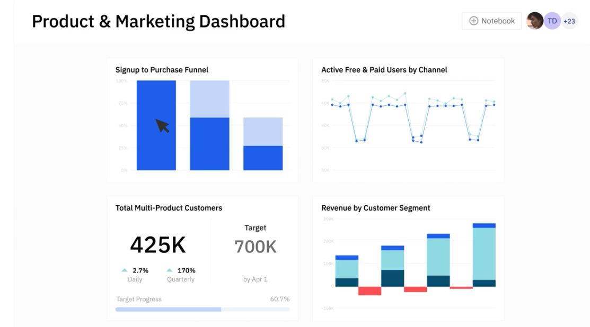
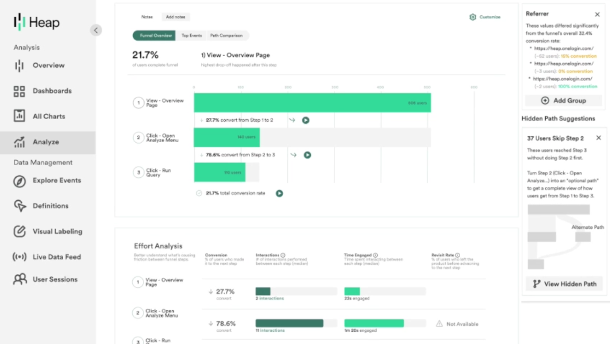
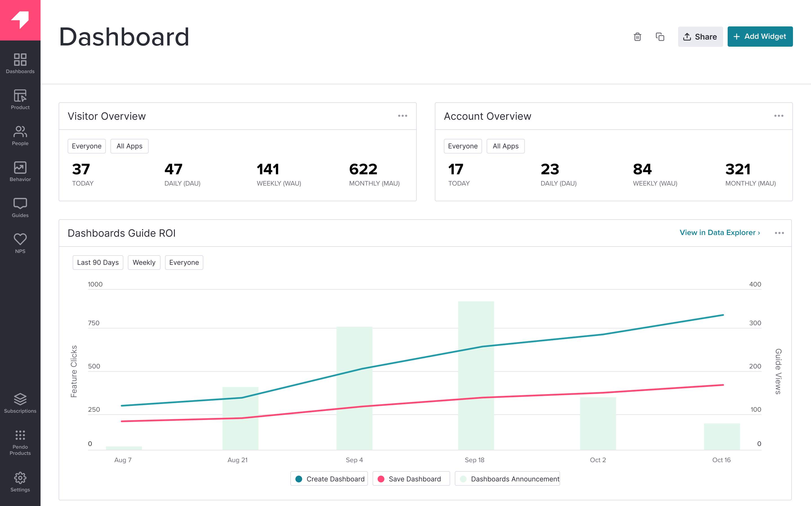

import { ComparisonTable } from 'components/ComparisonTable'
import { ComparisonRow } from 'components/ComparisonTable/row'

## 1. PostHog

- **Founded:** 2020
- **Similar to:** FullStory, Amplitude, LogRocket
- **Typical users:** Engineers and product teams
- **Typical customers:** Mid-size B2Bs and startups

### What is PostHog?

[PostHog](/) (that's us 👋) is an open-source platform combining product analytics, session replay, user surveys, and feature flags into one product. This means it's not only an alternative to FullStory, but also tools like [LaunchDarkly](/blog/posthog-vs-launchdarkly) and Hotjar.

Typical PostHog users are engineers and product managers at startups and mid-size companies, particularly B2B companies. Customers include [AssemblyAI](/customers/assemblyai), [Hasura](/customers/hasura), [Vendasta](/customers/vendasta), and Airbus.

### Key features

- 📈 **Product analytics:** Funnels, user paths, retention analysis, custom trends, and dynamic user cohorts. Also supports SQL insights for power users.

- 📺 **Session replays:** Including event timelines, console logs, network activity, and 90-day data retention.

- 💬 **Surveys:** Target surveys by event or user properties. Templates for [Net Promoter Score (NPS)](/templates/nps-survey), [product-market fit (PMF)](/templates/pmf-survey) surveys, and more.

- 🧪 **A/B tests:** Up to 9 test variations, primary and secondary metrics. Automatically calculate test duration, sample size, and statistical significance.

- 🚩 **Feature flags:** Safely launch features with local evaluation (for faster performance) and JSON payloads.

### How does PostHog compare to FullStory?

PostHog goes beyond the feature set of FullStory. It matches key features like single snippet installation, user segmentation, and privacy options, while also having surveys and A/B testing. As a (big) bonus, it's also free, self-serve, and open source

<ComparisonTable column1="PostHog" column2="FullStory">
  <ComparisonRow column1={true} column2={false} feature="Self-serve" description="Free to try, no mandatory sales calls" />
  <ComparisonRow column1={true} column2={true} feature="Fast implementation" description="Single snippet installed to get started fast" />
  <ComparisonRow column1={true} column2={true} feature="Product analytics" description="Custom trends, funnels, paths, and retention analysis" />
  <ComparisonRow column1={true} column2={true} feature="Autocapture" description="Capture events without manual instrumentation" />
  <ComparisonRow column1={true} column2={true} feature="Funnels and journey maps" description="Measure conversion and track the paths users take" />
  <ComparisonRow column1={true} column2={false} feature="Group analytics" description="Track metrics at the account or company level" />
  <ComparisonRow column1={true} column2={true} feature="User segmenting" description="Analyze and filter based on user properties and behaviors" />
  <ComparisonRow column1={true} column2={true} feature="Session replay" description="Watch real users on your site; discover friction points" />
  <ComparisonRow column1={true} column2={true} feature="Heatmaps" description="See where users click and interact" />
  <ComparisonRow column1={true} column2={false} feature="A/B testing" description="Test changes and analyze their impact" />
  <ComparisonRow column1={true} column2={true} feature="User privacy options" description="Anonymize, mask, and block data you don't want or need" />
  <ComparisonRow column1={true} column2={false} feature="Open source" description="Audit code, contribute to roadmap, and build integrations" />
</ComparisonTable>

### How popular is PostHog?

According to [BuiltWith](https://trends.builtwith.com/analytics/PostHog), PostHog is half as popular as FullStory. As of January 2024, 4,732 (0.5%) of the top 1 million websites deploy PostHog, while 8,430 (0.8%) use FullStory.

### Why do companies use PostHog?

According to [reviews on G2](https://www.g2.com/products/posthog/reviews), companies use PostHog because:

1. **It replaces multiple tools:** PostHog can replace FullStory (session replay and analytics), [LaunchDarkly](/blog/best-launchdarkly-alternatives) (feature flags and A/B testing), and Hotjar (feedback and surveys). This simplifies workflows and ensures all product is in one place.

2. **Pricing is transparent and scalable:** Reviewers appreciate how PostHog's pricing scales as they grow. There's a [generous free tier](/pricing) they can use forever. Companies eligible for [PostHog for Startups](/startups) also get $50k in additional free credits.

3. **They need a complete picture of users:** PostHog includes every tool necessary to understand users and improve products. This means creating funnels to track conversion, watching replays to see where users get stuck, testing solutions with A/B tests, and gathering feedback with user surveys.

> #### Bottom line
> PostHog provides all the tools of FullStory and more. Being self-serve with a generous free tier makes it an ideal alternative to try out. PostHog is an especially good fit for SaaS companies needing multiple tools to build the best product possible.

<ArrayCTA />

 

## 2. Smartlook

- **Founded:** 2016
- **Most similar to:** Heap, FullStory
- **Typical users:** Engineers, business analysts, product managers
- **Typical customers:** Enterprise retail and ecommerce websites and apps

### What is Smartlook?

Smartlook is an analytics platform that combines session replays with product analytics, visualizations, and crash reports to generate user insights. It focuses on mobile apps with specific tools like mobile heatmaps.

### Key features

- 📹 **Session recordings:** Understand how users are actually using your app and where issues occur.

- 📊 **Event-based analytics:** See how often users behave in the ways important to you.

- 🔥 **Heatmaps:** Figure out the most popular parts of a page users click on and scroll to.

- 🛣️ **Funnels and paths:** See how users move through your app with custom visuals for key flows.

- 📉 **Crash reports:** Learn what happens before a crash without complex debugging or reproducation.

### How does Smartlook compare to FullStory?

The feature sets of Smartlook and FullStory are nearly identical. The difference is that Smartlook focuses slightly more on product analytics, is self-serve, and adds crash reports.

<ComparisonTable column1="Smartlook" column2="FullStory">
  <ComparisonRow column1={true} column2={false} feature="Self-serve" description="Free to try, no mandatory sales calls" />
  <ComparisonRow column1={true} column2={true} feature="Fast implementation" description="Single snippet installed to get started fast" />
  <ComparisonRow column1={true} column2={true} feature="Product analytics" description="Custom trends, funnels, paths, and retention analysis" />
  <ComparisonRow column1={true} column2={true} feature="Autocapture" description="Capture events without manual instrumentation" />
  <ComparisonRow column1={true} column2={true} feature="Funnels and journey maps" description="Measure conversion and track the paths users take" />
  <ComparisonRow column1={false} column2={false} feature="Group analytics" description="Track metrics at the account or company level" />
  <ComparisonRow column1={true} column2={true} feature="User segmenting" description="Analyze and filter based on user properties and behaviors" />
  <ComparisonRow column1={true} column2={true} feature="Session replay" description="Watch real users on your site; discover friction points" />
  <ComparisonRow column1={true} column2={true} feature="Heatmaps" description="See where users click and interact" />
  <ComparisonRow column1={false} column2={false} feature="A/B testing" description="Test changes and analyze their impact" />
  <ComparisonRow column1={true} column2={true} feature="User privacy options" description="Anonymize, mask, and block data you don't want or need" />
  <ComparisonRow column1={false} column2={false} feature="Open source" description="Audit code, contribute to roadmap, and build integrations" />
</ComparisonTable>

### How popular is Smartlook?

According to [BuiltWith](https://trends.builtwith.com/analytics/Smartlook), as of January 2024, 3,186 of the top 1 million websites use Smartlook. This is less than half of FullStory's 8,430.

### Why do companies use Smartlook?

According to G2 reviewers, Smartlook users benefit from:

1. **The integration between replays and events:** Smartlook connects event-based analytics and sessions. This enables users to dive deeper into user behavior than a single tool provides.

2. **Understanding visitor pain points:** The analytics and visualizations make it easy to understand where users are running into trouble. Reviews use this to improve the user experience and conversion in these areas.

3. **Real user monitoring:** Smartlook shows how real users are using your app and monitors the quality of their experiences. Reviewers use it to figure out what areas are confusing or used improperly.

> #### Bottom line
> Smartlook and FullStory have nearly the same focuses and features. This makes it a great alternative for ecommerce and retail companies.

 

## 3. Amplitude

- **Founded:** 2012
- **Most similar to:** PostHog, LogRocket
- **Typical users:** Product managers, data analysts, marketing teams
- **Typical customers:** Mid-size and large enterprises

### What is Amplitude?

[Amplitude](/blog/posthog-vs-amplitude) is one of the original product analytics tools. Many large enterprise customers, like Ford, NBCUniversal, and Walmart rely on it. In recent years, they've also added A/B testing and a customer data platform to their offering.

### Key features

- 📈 **Product analytics:** Funnel and retention analysis, user paths, behavioral cohorts, custom dashboards, and more.

- 🧪 **A/B testing:** Test new features on specific targets and analyze with primary, secondary, and counter metrics.

- 💁‍♂️ **Customer data platform:** Combine analytics data with third-party tools for data governance, identity resolution, and data federation.

- 🤖 **AI insight builder:** Generate insights based on natural language requests, like "What is my purchase conversion rate?"

### How does Amplitude compare to FullStory?

One of the biggest downsides of Amplitude is its lack of autocapture. On top of this, they lack the session replay and heatmaps of FullStory.

<ComparisonTable column1="Amplitude" column2="FullStory">
  <ComparisonRow column1={true} column2={false} feature="Self-serve" description="Free to try, no mandatory sales calls" />
  <ComparisonRow column1={true} column2={true} feature="Fast implementation" description="Single snippet installed to get started fast" />
  <ComparisonRow column1={true} column2={true} feature="Product analytics" description="Custom trends, funnels, paths, and retention analysis" />
  <ComparisonRow column1={false} column2={true} feature="Autocapture" description="Capture events without manual instrumentation" />
  <ComparisonRow column1={true} column2={true} feature="Funnels and journey maps" description="Measure conversion and track the paths users take" />
  <ComparisonRow column1={true} column2={false} feature="Group analytics" description="Track metrics at the account or company level" />
  <ComparisonRow column1={true} column2={true} feature="User segmenting" description="Analyze and filter based on user properties and behaviors" />
  <ComparisonRow column1={false} column2={true} feature="Session replay" description="Watch real users on your site; discover friction points" />
  <ComparisonRow column1={false} column2={true} feature="Heatmaps" description="See where users click and interact" />
  <ComparisonRow column1={true} column2={false} feature="A/B testing" description="Test changes and analyze their impact" />
  <ComparisonRow column1={true} column2={true} feature="User privacy options" description="Anonymize, mask, and block data you don't want or need" />
  <ComparisonRow column1={false} column2={false} feature="Open source" description="Audit code, contribute to roadmap, and build integrations" />
</ComparisonTable>

### How popular is Amplitude?

According to [BuiltWith](https://trends.builtwith.com/analytics/Amplitude), Amplitude bests FullStory with 10,678 of the top million sites using them as of January 2024. FullStory is close behind at 8,430.

### Why do companies use Amplitude?

According to G2 reviews, Amplitude users appreciate three key aspects:

1. **Simple to use:** Amplitude makes it easy for non-technical users to get insights about their product and make improvements. Amplitude is built for users like product managers and marketers, making it a popular choice for them.

2. **Built-in A/B testing:** Unlike FullStory, Amplitude offers integrated experimentation features. This enables companies to run experiments on existing cohorts, and then analyze the data in a single place. 

3. **Become data-driven:** Amplitude users appreciate it helps them become data-driven. It becomes easy to add data, visualize it, and make decisions. It makes data accessible to them. 

> #### Bottom line
> Amplitude is a popular choice for product analytics, but lacks many of the tools FullStory provides for tracking overall user experience. If you don't want session replay, heatmaps, or autocapture, it can be a good choice.

 

## 4. Heap

- **Founded:** 2013
- **Most similar to:** FullStory, PostHog
- **Typical users:** Product and marketing teams
- **Typical customers:** B2C SaaS and ecommerce companies wanting to monitor and improve user experience.

### What is Heap?

[Heap](/blog/best-heap-alternatives) describes itself as a digital insights platform. This means Heap offers both product analytics and session replay, and supports marketing use cases with multi-touch attribution.

Contentsquare, a marketing and ecommerce analytics firm, [acquired Heap in September 2023](https://contentsquare.com/heap/) and announced plans to integrate the two products.

### Key features

- ✅ **Event autocapture:** Frees product teams from relying on engineers to instrument all events. Heap offers a visual editor for enables teams to tag on-page events for analysis.

- 📺 **Session replay:** Augment Heap's analytics features with qualitative insights by replaying their session (although this lacks the debugging tools typical of most replay tools).

- 🔥 **Heatmaps:** See where users click, what point they scroll to, and the areas that get the most attention.

- 🤖 **Analysis suggestions**: Their advanced data science capabilities discover hidden interactions, friction points, and paths.

- 🔁 **Managed ETL:** Connect to data warehouses, so you can combine your analytics with other sources and get a fuller picture of the entire user journey.

### How does Heap compare to FullStory?

Heap and FullStory both focus on user experience data and have many of the same features to do it. Autocapture is a main selling point for both. 

<ComparisonTable column1="Heap" column2="FullStory">
  <ComparisonRow column1={true} column2={false} feature="Self-serve" description="Free to try, no mandatory sales calls" />
  <ComparisonRow column1={true} column2={true} feature="Fast implementation" description="Single snippet installed to get started fast" />
  <ComparisonRow column1={true} column2={true} feature="Product analytics" description="Custom trends, funnels, paths, and retention analysis" />
  <ComparisonRow column1={true} column2={true} feature="Autocapture" description="Capture events without manual instrumentation" />
  <ComparisonRow column1={true} column2={true} feature="Funnels and journey maps" description="Measure conversion and track the paths users take" />
  <ComparisonRow column1={true} column2={false} feature="Group analytics" description="Track metrics at the account or company level" />
  <ComparisonRow column1={true} column2={true} feature="User segmenting" description="Analyze and filter based on user properties and behaviors" />
  <ComparisonRow column1={true} column2={true} feature="Session replay" description="Watch real users on your site; discover friction points" />
  <ComparisonRow column1={true} column2={true} feature="Heatmaps" description="See where users click and interact" />
  <ComparisonRow column1={false} column2={false} feature="A/B testing" description="Test changes and analyze their impact" />
  <ComparisonRow column1={true} column2={true} feature="User privacy options" description="Anonymize, mask, and block data you don't want or need" />
  <ComparisonRow column1={false} column2={false} feature="Open source" description="Audit code, contribute to roadmap, and build integrations" />
</ComparisonTable>

### How popular is Heap?

According to [BuiltWith](https://trends.builtwith.com/analytics/Heap), Heap is about half as popular as FullStory with 4,221 sites using them as of January 2024. FullStory has 8,430.

### Why do companies use Heap?

According to G2 reviews, companies enjoy these three areas of Heap:

1. **Autocapture:** Non-technical users love how easy autocapture makes tracking on their site. Along with the element data included, this provides a massive amount of useful analytics data.

2. **Simple setup:** Heap does not take a big technical effort to set up. Users can add a single script, begin collecting data, and easily visualize that data through user paths, funnels, and session replays.

3. **Streamlining analysis:** By having analytics and session replay data in one place, Heap makes it easy to understand the usage of their app or site. This replaces interviews or user testing and makes the development cycle faster.

> #### Bottom line
> Heap and FullStory have nearly the same features. Along with Heap's free trial, this makes them a solid alternative for experience analytics and insights. Although its acquisition by ContentSquare has its future up in the air.

 

## 5. Glassbox

- **Founded:** 2010
- **Most similar to:** FullStory, PostHog
- **Typical users:** Business analysts, product support, marketers
- **Typical customers:** Enterprise B2C companies, retail, and financial services

### What is Glassbox?

Glassbox is a session replay and analytics platform with a particular focus on mobile apps and ecommerce use cases. Customers include Danone, Air Canada, and UK retailer Sainsbury's.

Glassbox predominantly provides "digital experience intelligence" to business analysts and support teams in enterprise B2C companies. 

### Key features

- 📹 **Session replay:** Watch and analyze real user sessions on web and mobile apps.

- 📊 **Product analytics:** Understand user paths and struggle points.

- 🏎️ **Performance analytics:** Track app performance and its impact on conversion rates.

- 🔥 **Click, scroll, and heatmaps:** Understand where users interact with your app.

- ✅ **User feedback:** Gather satisfaction and user feedback on the app experience.

### How does Glassbox compare to FullStory?

Glassbox and FullStory share many of the same features, but Glassbox is not self-serve and it's unclear how easy implementation is.

<ComparisonTable column1="Glassbox" column2="FullStory">
  <ComparisonRow column1={false} column2={false} feature="Self-serve" description="Free to try, no mandatory sales calls" />
  <ComparisonRow column1={false} column2={true} feature="Fast implementation" description="Single snippet installed to get started fast" />
  <ComparisonRow column1={true} column2={true} feature="Product analytics" description="Custom trends, funnels, paths, and retention analysis" />
  <ComparisonRow column1={true} column2={true} feature="Autocapture" description="Capture events without manual instrumentation" />
  <ComparisonRow column1={true} column2={true} feature="Funnels and journey maps" description="Measure conversion and track the paths users take" />
  <ComparisonRow column1={false} column2={false} feature="Group analytics" description="Track metrics at the account or company level" />
  <ComparisonRow column1={true} column2={true} feature="User segmenting" description="Analyze and filter based on user properties and behaviors" />
  <ComparisonRow column1={true} column2={true} feature="Session replay" description="Watch real users on your site; discover friction points" />
  <ComparisonRow column1={true} column2={true} feature="Heatmaps" description="See where users click and interact" />
  <ComparisonRow column1={false} column2={false} feature="A/B testing" description="Test changes and analyze their impact" />
  <ComparisonRow column1={true} column2={true} feature="User privacy options" description="Anonymize, mask, and block data you don't want or need" />
  <ComparisonRow column1={false} column2={false} feature="Open source" description="Audit code, contribute to roadmap, and build integrations" />
</ComparisonTable>

### How popular is Glassbox?

As of January 2024, just 386 of the top 1 million websites deploy Glassbox (according to [BuiltWith](https://trends.builtwith.com/analytics/GlassBox)). Their focus on mobile apps isn't reflected in these numbers, but this is nearly twenty times less than FullStory's 8,430.

### Why do companies use Glassbox?

According to G2 reviews, customers use Glassbox for:

1. **Session replay and error analysis:** Glassbox is best known for its session replay features, so this is the most popular use case. Customers use Glassbox to analyze user journeys and identify app-breaking bugs.

2. **Heatmap and funnel analysis:** Users like the heatmaps feature, which enables them to see user preferences on key pages. They combine this with paths and funnels to see the entire journey.

3. **Fixing low conversion and abandonment:** Glassbox is popular among online retailers, who use it to solve issues with conversion and basket abandonment. Their struggle scores are a popular feature for figuring this out.

> #### Bottom line
> Glassbox has nearly all the features of FullStory and more, along with a deeper focus on mobile. If you are willing to go through the sales process, it is another great alternative to try out, especially for B2C, ecommerce, and retail companies.

 

## 6. LogRocket

- **Founded:** 2016
- **Similar to:** PostHog, Smartlook
- **Typical users:** Product managers, engineers, support teams
- **Typical customers:** B2B SaaS, B2C retail companies.

### What is LogRocket?

[LogRocket](/blog/posthog-vs-logrocket) is a product experience platform with product analytics, error tracking, session replay, and performance monitoring. It focuses on helping product managers, engineers, and support teams identify and fix issues.

### Key features

- 📹 **Session replay:** Understand exactly what users are doing on your site. See the screens they visit, places they click, as well as console and network logs, errors, and performance data.

- 🚨 **Error tracking:** Identify and triage the most impactful issues with JavaScript and network errors as well as stack traces.

- 📈 **Product analytics:** Capture usage data and visualize it with conversion funnels, path analysis, and retention charts.

- 🔥 **Heatmaps:** See what users are clicking on, where they are spending their time, and how far they scroll.

- 🏎️ **Performance monitoring:** Monitor frontend performance such as web vitals, CPU and memory usage, and network speed.

### How does LogRocket compare to FullStory?

LogRocket matches many of FullStory's features while having a greater focus on error and performance tracking. 

<ComparisonTable column1="LogRocket" column2="FullStory">
  <ComparisonRow column1={true} column2={false} feature="Self-serve" description="Free to try, no mandatory sales calls" />
  <ComparisonRow column1={true} column2={true} feature="Fast implementation" description="Single snippet installed to get started fast" />
  <ComparisonRow column1={true} column2={true} feature="Product analytics" description="Custom trends, funnels, paths, and retention analysis" />
  <ComparisonRow column1={true} column2={true} feature="Autocapture" description="Capture events without manual instrumentation" />
  <ComparisonRow column1={true} column2={true} feature="Funnels and journey maps" description="Measure conversion and track the paths users take" />
  <ComparisonRow column1={false} column2={false} feature="Group analytics" description="Track metrics at the account or company level" />
  <ComparisonRow column1={true} column2={true} feature="User segmenting" description="Analyze and filter based on user properties and behaviors" />
  <ComparisonRow column1={true} column2={true} feature="Session replay" description="Watch real users on your site; discover friction points" />
  <ComparisonRow column1={true} column2={true} feature="Heatmaps" description="See where users click and interact" />
  <ComparisonRow column1={false} column2={false} feature="A/B testing" description="Test changes and analyze their impact" />
  <ComparisonRow column1={true} column2={true} feature="User privacy options" description="Anonymize, mask, and block data you don't want or need" />
  <ComparisonRow column1={false} column2={false} feature="Open source" description="Audit code, contribute to roadmap, and build integrations" />
</ComparisonTable>

### How popular is LogRocket?

According to [BuiltWith](https://trends.builtwith.com/widgets/LogRocket), 1,104 of the top million sites use LogRocket (as of January 2024). This is much less FullStory's 8,430. 

### Why do companies use LogRocket?

The reviewers of G2 use LogRocket for these reasons:

1. **Identifying problems:** LogRocket's combination of error tracking, performance monitoring, and session replay makes it uniquely powerful at finding bugs and issues. Unlike other tools, it uncovers both user and software issues.

2. **Improves user experience:** LogRocket seems to succeed at their goal of helping users fix issues. Reviewers find it provides all the tools to improve their user experience.

3. **High usability:** LogRocket provides a lot of functionality out of the box. It captures the details users need, provides useful visualizations, and automatically triages some issues.

> #### Bottom line
> Like many of the alternatives, LogRocket provides all the features of FullStory and more. For team teams looking to identify and fix the issues with their site or product, it makes a great choice.

 

## 7. Pendo

- **Founded:** 2013
- **Most similar to:** PostHog, Hotjar
- **Typical users:** Product managers and customer success teams
- **Typical customers:** Small and mid-market B2C apps

### What is Pendo?

[Pendo](/blog/posthog-vs-pendo) describes itself as a product experience platform. In addition to product analytics, it offers session replay, in-app guides, user feedback, and product validation tools.

### Key features

- 📊 **Product analytics:** Funnels, trends, and retention analysis with event autocapture.

- 🦮 **In-app guides:** Deliver personalized guidance to customers, directly inside your app.

- 📝 **User feedback:** Capture and analyze customer feedback at scale.

- 🗺️ **Product validation and roadmaps:** Plan your product improvements and roadmap using data from Pendo.

### How does Pendo compare to FullStory?

Although Pendo shares similarities with FullStory, it focuses more on qualitative feedback, in-app guides, and product planning. It lacks the autocapture that makes FullStory powerful.

<ComparisonTable column1="Pendo" column2="FullStory">
  <ComparisonRow column1={true} column2={false} feature="Self-serve" description="Free to try, no mandatory sales calls" />
  <ComparisonRow column1={true} column2={true} feature="Fast implementation" description="Single snippet installed to get started fast" />
  <ComparisonRow column1={true} column2={true} feature="Product analytics" description="Custom trends, funnels, paths, and retention analysis" />
  <ComparisonRow column1={false} column2={true} feature="Autocapture" description="Capture events without manual instrumentation" />
  <ComparisonRow column1={true} column2={true} feature="Funnels and journey maps" description="Measure conversion and track the paths users take" />
  <ComparisonRow column1={false} column2={false} feature="Group analytics" description="Track metrics at the account or company level" />
  <ComparisonRow column1={true} column2={true} feature="User segmenting" description="Analyze and filter based on user properties and behaviors" />
  <ComparisonRow column1={true} column2={true} feature="Session replay" description="Watch real users on your site; discover friction points" />
  <ComparisonRow column1={true} column2={true} feature="Heatmaps" description="See where users click and interact" />
  <ComparisonRow column1={false} column2={false} feature="A/B testing" description="Test changes and analyze their impact" />
  <ComparisonRow column1={true} column2={true} feature="User privacy options" description="Anonymize, mask, and block data you don't want or need" />
  <ComparisonRow column1={false} column2={false} feature="Open source" description="Audit code, contribute to roadmap, and build integrations" />
</ComparisonTable>

### How popular is Pendo?

According to [data from BuiltWith](https://trends.builtwith.com/analytics/Pendo), as of January 2024, 3,711 of the top million websites used Pendo. This is under half of FullStory's 8,430.

### Why do companies use Pendo?

According to G2 reviews, customers use Pendo for:

1. **Customer support and feedback:** Users value Pendo as a useful tool for customer support and feedback collection. They use Pendo's feedback features to gather qualitative data and feed that into Pendo's validation and roadmap features.

2. **Improving onboarding:** Combining Pendo's in-app guides and analytics features makes it easy for non-technical users to experiment with new onboarding flows, improving user adoption.

3. **Product planning:** Customers to use Pendo's data tools, product validation, and roadmap features to align internal teams and stakeholders on product development.

> #### Bottom line
> [Pendo](/blog/best-pendo-alternatives) offers many similar features to FullStory, but the lack of autocapture is a big downside. Pendo is likely only a good alternative if you want their feedback, product tour, and product planning features.

 

## Is PostHog right for you?

Here's the (short) sales pitch.

We're biased, obviously, but we think PostHog is the perfect FullStory replacement if:

- You value transparency (we're open source and open core)
- You want tools to ship, track, and analyze new features like A/B testing, feature flags, and surveys.
- You want to try before you buy (we're self-serve with a [generous free tier](/pricing))

Check out [our product pages](/product-analytics) and [read our docs](/docs) to learn more.

<ArrayCTA />
