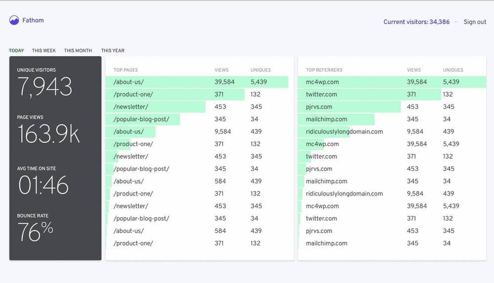

The European Union's GDPR (General Data Protection Regulation) was created in 2016 to provide a framework which protects user privacy and shape how the data of users in the EU (and the UK) can be stored and shared. It applies to all businesses, non-profits and public organizations across the EU and the penalties for breaking it are severe – up to 4% of your yearly revenue. 

While GDPR has created an essential and much-needed framework for handling user data, it has also complicated the ways in which teams can collect user information. A ruling in Austria, for example, punished a business for using Google Analytics (GA) and exporting user data to Google's US-based servers. It's since been followed by similar rulings in [https://isgoogleanalyticsillegal.com/france](France), the [Netherlands](https://isgoogleanalyticsillegal.com/netherlands) and [Italy](https://isgoogleanalyticsillegal.com/italy). 

As a result, many teams are now searching for new GDPR-compliant analytics tools for fear that [Google Analytics may be illegal](https://isgoogleanalyticsillegal.com/). This list compiles some of the best, privacy-friendly alternatives. 

## 1. [PostHog](https://posthog.com/product)

PostHog is an all-in-one, [open source analytics platform](/blog/best-open-source-analytics-tools) that combines  [Product Analytics](/product/#product-analytics), [Session Recording](/product/session-recording), [Feature Flags](/product/feature-flags), [Heatmaps](/product/heatmaps), and [Experimentation](/product/experimentation-suite) under a single platform. 

Unlike [alternative to tools like Amplitude](/blog/posthog-vs-amplitude) and Mixpanel, PostHog can be self-hosted on your own infrastructure, which means you can control exactly where user information is stored and how it is processed. It also supports event auto capture, so you can start collecting useful data immediately without instrumenting events by hand.

### Who is PostHog for?
PostHog is especially helpful for product teams that want to understand how users use their product, but need complete control of their data. As it's open source, it's great for early-stage startups, but the powerful toolset and [range of integrations](/apps) make it ideal for enterprise-scale businesses, too. PostHog is used by many large businesses, including SpaceX, [Hasura](https://posthog.com/customers/hasura), [Phantom](https://posthog.com/customers/phantom), Airbus and YCombinator. 

### Features & benefits
- An all-in-one analytics suite
- Easy to use, no SQL required
- Self-hosting and cloud-hosting available
- Complete control of your data and PostHog instance
- Feature Flags, Heatmaps, Session Recording and more
- Apps to integrate with data warehouses
- Unlimited ability to scale
- Open source, via MIT license

### PostHog and GDPR compliance
PostHog can be deployed onto your own infrastructure, so you retain full control over who your data is shared with and where it is hosted. A cloud-hosted version of PostHog is also available, if you prefer, with servers hosted in the US – PostHog provides guidance on how to [use PostHog Cloud in compliance with GDPR](/docs/privacy/gdpr-compliance).

### Can you use PostHog without cookie banners?
No. As a product analytics platform, PostHog creates user profiles and thus requires cookie permission notifications to be used in a GDPR compliant manner. You can use the [Property Filter app](/apps/property-filter) to prevent PostHog from collecting any personally identifiable information, including IP-based location. 

<ArrayCTA />

## 2. [Fathom](https://usefathom.com/)

Fathom is a popular, privacy-friendly alternative to Google Analytics that's built with user privacy as a priority. It tracks common web statistics like unique visitors, page views, time on site, bounce rate, and referral data. It also includes a basic event tracking system for measuring things like downloads, mailing list signups, and purchases.

While based in Canada, Fathom offers EU-hosting. It also employs what it calls intelligent routing, which ensures that non-EU users are routed via its US servers, while EU users are routed via its EU-based and owned servers. Fathom claims this ensures non-EU visitors get better performance compared to other, similar services that use EU-only hosting.

### Who is Fathom for?
Fathom is ideal for individual users and companies who only require basic web analytics. Unlike GA and other more advanced alternatives, such as PostHog or Matomo, Fathom is a simple, single-page application. It tracks all the basic analytics most people need, but can't offer much insight into user behavior. It's also useful for agencies as it supports up to 50 websites on its core pricing plans.

### Features & benefits
- Fast and lightweight tracking script
- No cookie banner required
- EU isolation and intelligent routing
- Email reports
- Multi-domain tracking

### Fathom and GDPR compliance

As a privacy-first solution, Fathom is GDPR compliant out-of-the-box with no compromises.

### Can you use Fathom without cookie consent banners?

Yes, it's actually designed this way. Fathom is a cookie-less solution, so you don't need cookie banners when using it.

## 3. [Plausible](https://plausible.io/)

Plausible is an open source web analytics platform, created as an alternative to tools such as Google Analytics. This means it offers an effective way to track simple web metrics, such as page views and the number of unique visitors, but lacks the depth of a full product analytics platform such as Mixpanel or PostHog. 

Plausible’s lightweight nature does offer several benefits however, such as a small script size which means it has a minimal impact on page performance. This further distinguishes it from the bloat of Google Analytics.

Plausible’s intense focus on privacy makes it an attractive option for individuals, but also imposes restrictions on how data can be used and stored. There’s no way to identify users or track behavior across multiple sessions or devices, for example. 

### Who is Plausible for?
Plausible is an alternative to Google Analytics and is a good fit for small content and marketing teams which need to track simple website metrics, or for freelancers and bloggers who only need to monitor small sites. 

### Features & benefits
- Lightweight script with minimal page speed impact
- Open source, under a AGPL license
- No need for any cookies, at all
- Minimal data collection for users
- No tracking across sessions, devices or sites

### Plausible and GDPR compliance
Plausible is made and hosted in the EU. It collects no personally identifiable information at all, making it ideal if you want basic, GDPR compliant analytics.

### Can you use Plausible without cookie consent banners?
Yes. Plausible is a cookie-less solution, so you don't need to acquire permission from users to comply with GDPR.

## 4. [Countly](https://count.ly/)

Like PostHog, Countly is an extendable product analytics platform that offers self-hosted open source and enterprise editions, or cloud deployments, for organizations that want to understand product performance and user journeys in greater detail. 

Countly offers a robust suite of features and an extensive range of integrations, including a Net Promoter Score (NPS) survey plugin. The ability to track crashes and errors, and to issue push notifications to mobile users, are also useful additions over most other analytics tools.

### Who is Countly for?
Countly's range of features make it particularly attractive to mobile app developers, especially those working on multi-platform apps across iOS, Mac, Windows, and Android. Its open source Community Edition is available on a AGPL v3 license, though this version removes the majority of its user behavior features, such as retention, revenue tracking, user tracking, cohorts, funnels, and user flow.   

### Features & benefits
- Support for mobile, web, desktop and IoT devices
- Extensible via plugins
- Self-hosting and private cloud deployments available
- Push notifications and crash analytics

### Countly and GDPR compliance
Like PostHog, Countly can be deployed onto your own infrastructure, or in cloud servers based in the EU, so that data isn't stored in servers outside of GDPR jurisdiction.

### Can you use Countly without cookie consent banners?
No. Countly requires you to collect consent to comply with GDPR, though it has consent systems built into the product. 

## 5. Matomo

Matomo is one of the most popular Google Analytics alternatives because it enables teams to collect a comparable level of information, but can be deployed on-premises so that you don’t need to share information with third-parties. Like PostHog, it’s also open source. 

One of Matomo’s most appealing features is the ability to import existing Google Analytics data into Matomo when getting started, so that you don’t lose any previous insights. It’s also entirely self-serve, which better enables less technical team members to run analysis. 

Matomo offers a wealth of other features, from custom alerts to tag managers and media analytics, though many of these are sold under per-feature subscriptions which can make the cost of on-premise deployments hard to predict. 

### Who is Matomo for?
Matomo is suitable for businesses of all sizes which need an alternative to Google Analytics and aren’t interested in the full suite of product analytics tools offered in platforms such as Amplitude, Mixpanel or PostHog. The cloud version of Matomo is also easy to setup and so is especially appealing to less technical teams. 

### Features & benefits
- Cloud hosting on European servers
- Self-hosting version available
- All-in-one Google Analytics replacement
- Google Analytics importer
- Open source, via GPL 3.0

### Matomo and GDPR compliance
Matomo offers first-party cookies by default and offers robust tools to ensure personally identifiable information (PII) is anonymized. Additionally, it can be deployed either on-premises, or into EU-based cloud servers.

### Can you use Countly without cookie consent banners?

Yes. Matomo offers the option of cookie-less tracking, though this does reduce the quality of data it can collect.

**Related:** [PostHog and Matomo compared](/blog/posthog-vs-matomo)

## 6. [GoAccess](https://goaccess.io/)

GoAccess is a completely open source web log analyzer and viewer which runs in a browser-based terminal to give you an overview of the most common website metrics. This means it can act as a replacement for tools such as Google Analytics, though it falls short of a product analytics platform in capabilities. 

Functioning in real-time, GoAccess is useful for spotting who is using up your bandwidth and identifying aggressive crawlers or bots, as well as tracking site metrics such as page views, visitors and time-on-page. The toolset, design and reliance on a terminal make it a popular choice for sysadmins. 

### Who is GoAccess for?
GoAccess is firmly intended for system administrators and software engineers who need to track web performance across smaller sites. It’s unsuitable for those needing a self-service analytics platform or who need easy integration with other tools or data warehouses. 

### Features & benefits
- Open source, via MIT license
- Completely real-time tracking
- Customizable dashboards
- Runs inside a terminal or browser

### GoAccess and GDPR compliance
GoAccess can be configured not to collect PII (personally identifying information) and relies on log file stats which may not require cookies. If configured in this way, GoAccess is GDPR compliant. 

> PostHog is an open-source analytics platform you can host yourself. We help you build better products faster, without user data ever leaving your infrastructure.

<ArrayCTA />
