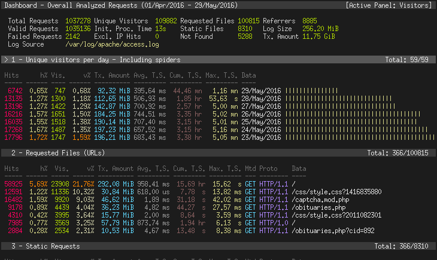

The GDPR (General Data Protection Regulation) places significant restrictions on how you can use tools like Google Analytics to track and collect user data.

And, while there is **no universal legal definition** of what constitutes "GDPR-compliant analytics", there are some fundamental principles you can follow:

1. **You must acquire "unambiguous consent":** Tucking a notice away in your terms and conditions isn't enough. This is why cookie banners are a thing. You need user consent if you're collecting [personally identifiable information](/blog/what-is-personal-data-pii).

2. **Data must be handled securely:** GDPR punishes breaches of privacy and security severely. Data must be held securely and staff trained in how to handle data. You must also delete any personal data you hold if a user requests it.

3. **Only collect data you actually need:** The GDPR encourages organizations to only collect information they actually need. A free online newsletter, for example, needs a user's email address and basic information, such as their name and what country or city they live in, but it doesn't need their home or work address.

Until recently, storing personal data on EU citizens in the US was also considered a potential breach of the GDPR, but a [new adequacy decision](https://commission.europa.eu/law/law-topic/data-protection/international-dimension-data-protection/eu-us-data-transfers_en) agreed in July 2023 makes this less problematic. It's still good practice to avoid transferring this data if you can, but it's not a breach provided US-based companies participate in the new EU-US Data Privacy Framework.

> **Changelog:**
>
> - **Mar 15, 2023:** Added Umami
> - **Aug 29, 2023:** New adequacy decision, added Vercel Web Analytics

## The best GDPR-compliant analytics tools

There are numerous ways to achieve GDPR compliance, which you can broadly categorize as good, better or best:

- **Good:** Data transferred to the US is anonymized
- **Better:** Data is stored in EU cloud servers
- **Best:** You self-host and control all data / no personal data is collected

All the tools in this list offer one or more of these methods. We've also chosen a broad range of tools that includes in-depth product analytics platforms, lightweight "privacy first" platforms and open source [Google Analytics alternatives](/blog/ga4-alternatives).

### 1. PostHog

[PostHog](https://posthog.com) is an all-in-one, [open-source analytics platform](/blog/best-open-source-analytics-tools) that combines product analytics, session recording, feature flags, and experimentation into a single platform. Think Amplitude + Hotjar + LaunchDarkly in one.

PostHog offers EU data hosting, so you can keep all your user data within the EU to comply with the GDPR. Hobbyists can also self-host PostHog Open Source via Docker Compose, though this is only recommended for smaller event volumes in the ~100k per month range. PostHog also supports event autocapture, so you can start collecting useful data immediately without instrumenting events by hand.

#### Who is PostHog for?
PostHog is especially helpful for product teams that want to understand how users use their product. It's great for early-stage startups, but the powerful tool set and [range of integrations](/apps) means it scales to suit any business size.

#### Features & benefits
- An all-in-one analytics suite
- EU data hosting available
- Feature flags, A/B testing, heatmaps, session recording and more
- Apps to integrate with data warehouses
- Unlimited ability to scale
- Open source, via MIT license

#### PostHog and GDPR compliance

- **Open Source:** ✔
- **Self Hosting:** ✔
- **EU Cloud Hosting:** ✔
- **Cookieless Tracking:** ✔

Smaller projects can self-host PostHog Open Source using Docker Compose, but [PostHog Cloud EU](/eu), a fully-managed service with servers hosted in Frankfurt, Germany, is the best option for most users.

While PostHog uses cookies by default, it can be [configured not to use cookies](/tutorials/cookieless-tracking). To use PostHog without cookies, data is stored in a JavaScript object in `memory` that only lasts the duration of the pageview.

#### How much does PostHog cost?

PostHog Cloud is [free to use up to 1 million events per month](/pricing) and 15,000 recordings. Paid plans include support for multiple projects, and advanced features like [A/B and multivariate testing](/manual/experimentation), [correlation analysis](/manual/correlation), [cohorts](/manual/cohorts) and [group analytics](/manual/group-analytics). The open source edition is free to self-host and includes the core product analytics features, session recording, and support for one project only.

<GDPRForm />

### 2. Plausible

[Plausible](https://plausible.io/) is a lightweight alternative to tools such as Google Analytics. It offers an effective way to track simple web metrics, such as page views and the number of unique visitors, but lacks the depth of a full product analytics platform. 

Plausible’s lightweight nature does offer several benefits however, such as a small script size which means it has a minimal impact on page performance. This further distinguishes it from the bloat of Google Analytics.

Plausible’s intense focus on privacy makes it an attractive option for individuals, but also imposes restrictions on how data can be used and stored. There’s no way to identify users or track behavior across multiple sessions or devices, for example. 

#### Who is Plausible for?
Plausible is a good fit for small content and marketing teams who need to track simple website metrics, or for freelancers and bloggers who only need to monitor small sites. 

#### Features & benefits
- Lightweight script with minimal page speed impact
- No need for any cookies, at all
- Minimal data collection for users
- No tracking across sessions, devices or sites

#### Plausible and GDPR compliance

- **Open Source:** ✔
- **Self Hosting:** ✔
- **EU Cloud Hosting:** ✔
- **Cookieless Tracking:** ✔

Plausible is made and hosted in the EU. It collects no personally identifiable information at all, making it ideal if you want basic, GDPR-compliant analytics.

#### How much does Plausible cost?

Plausible charges by pageview with 1 million pageviews costing €69 per month – approx. $71. Paying annually grants you two free months per year – i.e. €69 per month becomes €690 per year. The open source version is free to self-host via Docker Compose.

### 3. Umami

[Umami](https://umami.is/) is an increasingly popular open-source analytics tool designed for privacy. Like Plausible, it's easy to self-host and collects no personal information (such as IP addresses) making GDPR compliance easy. The downside, as usual with privacy-first analytics tools, is it only collects basic analytics data, so it's best used for website analytics where you're less concerned with understanding user behavior.

#### Who is Umami for?

Privacy-conscious website owners who want a no-frills solution that doesn't impact website performance.

#### Features and benefits

- Self-hosting cookieless tracking
- Lightweight script with no performance impact
- Basic event tracking for buttons and other UI elements

#### Umami and GDPR compliance

- **Open Source:** ✔
- **Self Hosting:** ✔
- **EU Cloud Hosting:** ✖
- **Cookieless Tracking:** ✔

#### How much does Umami cost?

Prices start at $9 for 100k monthly events. 1 million events is $49 per month; 10 million is $369 per month. Umami offers a 20% saving for paying annually.

### 4. Fathom

[Fathom](https://usefathom.com/) is a popular, privacy-friendly alternative to Google Analytics that's built with user privacy at its core. It tracks common web statistics like unique visitors, page views, time on site, bounce rate, and referral data. It also has a basic event tracking system for measuring things like downloads, mailing list signups, and purchases.

While based in Canada, Fathom offers EU-hosting. It also employs what it calls intelligent routing. This ensures that non-EU users are routed via its US servers, while EU users are routed via its EU-based and owned servers. Fathom claims this means non-EU visitors get better performance compared to other, similar services that use EU-only hosting.

#### Who is Fathom for?

Fathom is ideal for individual users and companies who only require basic web analytics. Unlike GA and other more advanced alternatives, such as PostHog or Matomo, Fathom is a simple, single-page application. It tracks all the basic analytics most people need, but can't offer much insight into user behavior. It's also useful for agencies as it supports up to 50 websites on its core pricing plans.

#### Features & benefits

- Fast and lightweight tracking script
- No cookie banner required
- EU isolation and intelligent routing
- Email reports
- Multi-domain tracking

#### Fathom and GDPR compliance

- **Open Source:** ✖
- **Self Hosting:** ✖
- **EU Cloud Hosting:** ✔
- **Cookieless Tracking:** ✔

As a privacy-first solution, Fathom is GDPR compliant out-of-the-box with no compromises. It's also a cookie-less solution, so you don't need cookie banners when using it.

#### How much does Fathom cost?

Like Plausible, Fathom charges by pageview, though it's a bit cheaper than Plausible. A website generating 1 million pageviews per month would pay $54 per month, compared to around $71 with Plausible. Fathom also offers two months free use for paying annually, but there is no free-to-use open source version.

### 5. Matomo

[Matomo](https://matomo.org/) is one of the most popular Google Analytics alternatives because it enables teams to collect a comparable level of information, but can be deployed on-premises so that you don’t need to share information with third-parties. Like PostHog, it’s also open source. 

One of Matomo’s most appealing features is the ability to import existing Google Analytics data into Matomo when getting started, so that you don’t lose any previous insights.

Matomo offers a wealth of other features, from custom alerts to tag managers and media analytics, though many of these are sold under per-feature subscriptions which can make the cost of on-premise deployments hard to predict. 

#### Who is Matomo for?
Matomo is suitable for businesses of all sizes which need an alternative to Google Analytics. The cloud version of Matomo is also easy to setup, making it ideal for non-technical users.

#### Features & benefits
- Cloud hosting on European servers
- Self-hosting version available
- All-in-one Google Analytics replacement
- Google Analytics importer
- Open source, via GPL 3.0

#### Matomo and GDPR compliance

- **Open Source:** ✔
- **Self Hosting:** ✔
- **EU Cloud Hosting:** ✔
- **Cookieless Tracking:** ✔

Matomo offers first-party cookies by default and robust tools to ensure personally identifiable information (PII) is anonymized. Additionally, it can be deployed either on-premises, or into EU-based cloud servers. Yes. Matomo offers the option of cookie-less tracking, though this does reduce the quality of data it collects.

#### How much does Matomo cost?

Matomo's core open source analytics is free to self-host. More advanced features, such as A/B testing and Custom reports, are add-ons charged for annually at varying rates. Its managed cloud service charges by hits (any pageview, event, download etc.) with 1 million hits costing £139 (approx. $170) per month.

**Related:** [PostHog and Matomo compared](/blog/posthog-vs-matomo)

### 6. Vercel Web Analytics

Vercel includes a lightweight, privacy-compliant analytics tool in all its front-end-as-a-service plans. Like most privacy-first tools, it tracks basic website metrics like pageviews, unique users, time on page, and referrers. You can also set up custom events you want to track (e.g. clicking a call to action). It records no personally identifiable information, so you can use it without cookie permission banners. It also includes a useful Speed Insights tool for keeping track of your website's Core Web Vitals.

#### Who is Vercel Web Analytics for?

While it's only available to Vercel customers, Vercel Web Analytics is ideal if you just need basic website analytics – e.g. for a company website. It does everything Plausible, Fathom and other privacy-first tools offer, so you don't need to deploy them if you're already using Vercel.

#### Features & benefits

- Included with Vercel
- Tracks all key website metrics
- Supports custom events
- No cookie banners needed

#### Vercel Web Analytics and GDPR compliance

- **Open Source:** ✖
- **Self Hosting:** ✖
- **EU Cloud Hosting:** ✖
- **Cookieless Tracking:** ✔

Vercel doesn't support hosting your analytics data in the EU, but it collects no personally identifiable information, so this isn't necessary for GDPR compliance.

#### How much does Vercel Web Analytics cost?

Free hobby deployments are limited to just 2,500 events and 10,000 speed insights per month. The Pro plan includes 25,000 events, which you can increase to 500k events for $50 per month more.

### 7. Countly

Like PostHog, [Countly](https://count.ly/) is an extendable product analytics platform that offers self-hosted open source and enterprise editions, or cloud deployments, for organizations that want to understand product performance and user journeys in greater detail. 

Countly offers a robust suite of features and an extensive range of integrations, including a Net Promoter Score (NPS) survey plugin. The ability to track crashes and errors, and to issue push notifications to mobile users, are also useful additions over most other analytics tools.

#### Who is Countly for?

Countly's range of features make it particularly attractive to mobile app developers, especially those working on multi-platform apps across iOS, Mac, Windows, and Android. Its open source Community Edition is available on a AGPL v3 license, though this version removes the majority of its user behavior features, such as retention, revenue tracking, user tracking, cohorts, funnels, and user flow.   

#### Features & benefits

- Support for mobile, web, desktop and IoT devices
- Extensible via plugins
- Self-hosting and private cloud deployments available
- Push notifications and crash analytics

#### Countly and GDPR compliance

- **Open Source:** ✔
- **Self Hosting:** ✔
- **EU Cloud Hosting:** ✔
- **Cookieless Tracking:** ✖

Like PostHog, Countly can be deployed onto your own infrastructure, or in cloud servers based in the EU, so that data isn't stored in servers outside of GDPR jurisdiction. It doesn't offer a cookie-less tracking option, but it does have consent systems built in.

#### How much does Countly cost?

Countly doesn't publish pricing on its website. You have to contact sales. Its open source Community Edition is free to self-host, but it excludes most of its user behavior features. 

### 8. TelemetryDeck

[TelemetryDeck](https://telemetrydeck.com/) is to app analytics what Plausible and Fathom are to website analytics – a lightweight tool that collects minimal personal information. Consequently, TelemetryDeck says developers can use it without tracking permission banners.

Unlike Plausible and Fathom, TelemetryDeck is an event-based analytics platform, making it more adept at understanding what users are doing in your app. It includes basic retention, funnel, page flow insights, and tracks useful app data such as app version, phone model and OS version, and average usage time.

#### Who is TelemetryDeck for? 

TelemetryDeck is good for individual app developers who want a simple, effective solution for app analytics. It's most comparable to Countly, though it doesn't collect as much information on users, or offer as many features. There are first-party SDKs for Swift, Kotlin (for Android and Java), and Javascript (for Node and websites). There's also a community SDK for the Unity game engine.

#### Features & benefits

- App analytics for Android and iPhone apps
- Doesn't track any personally identifiable information
- Tracks app version and phone OS version
- Basic retention, funnel, and user path visualizations

#### TelemetryDeck and GDPR compliance

- **Open source:** ✖
- **Self-hosting:** ✖
- **EU Cloud Hosting:** ✔
- **Cookieless Tracking:** ✔

TelemetryDeck makes GDPR compliance very easy. It doesn't collect enough personal information to require opt-out banners, and it's hosted in the EU.

#### How much does TelemetryDeck cost?

TelemetryDeck's free plan gives you up to 100,000 signals per month – signals are TelemetryDeck's name for events. It has three other plans (Indie, Business and Enterprise) which unlock more signals, support, and user accounts.

### 9. GoAccess

[GoAccess](https://goaccess.io/) is a completely open source web log analyzer and viewer which runs in a browser-based terminal to give you an overview of the most common website metrics. This means it can act as a replacement for tools such as Google Analytics, though it falls short of a product analytics platform in capabilities. 

Functioning in real-time, GoAccess is useful for spotting who is using up your bandwidth and identifying aggressive crawlers or bots, as well as tracking site metrics such as page views, visitors and time-on-page. The toolset, design and reliance on a terminal make it a popular choice for sysadmins. 

#### Who is GoAccess for?

GoAccess is for system administrators and software engineers who need to track web performance across smaller sites. It’s unsuitable for those needing a self-service analytics platform or who need easy integration with other tools or data warehouses. 

#### Features & benefits

- Open source, via MIT license
- Completely real-time tracking
- Customizable dashboards
- Runs inside a terminal or browser

#### GoAccess and GDPR compliance

- **Open Source:** ✔
- **Self Hosting:** ✔
- **EU Cloud Hosting:** ✔
- **Cookieless Tracking:** ✔

You can configure GoAccess to either not collect IP addresses or anonymize them, so it can be used without cookie banners.

#### How much does GoAccess cost?

GoAccess is open source and has no paid tiers.

<GDPRForm />