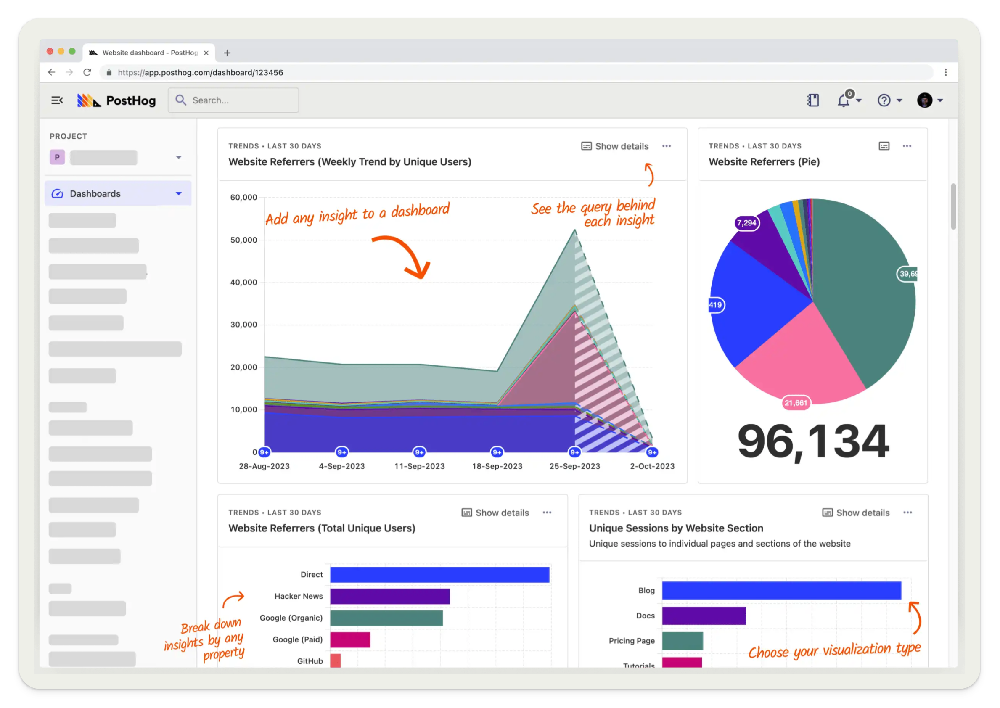
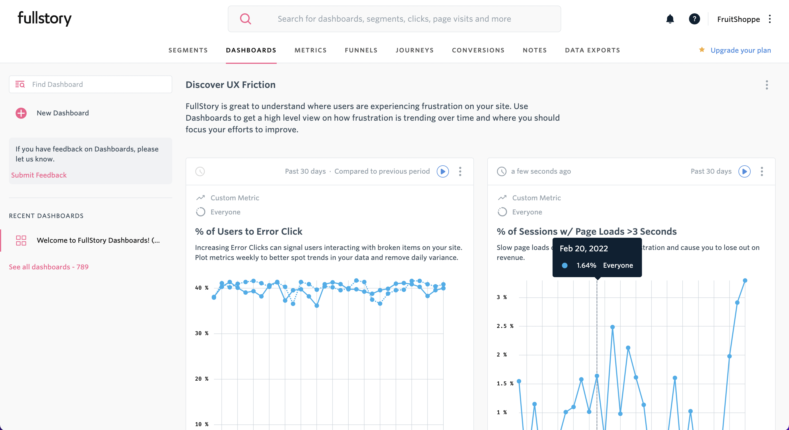
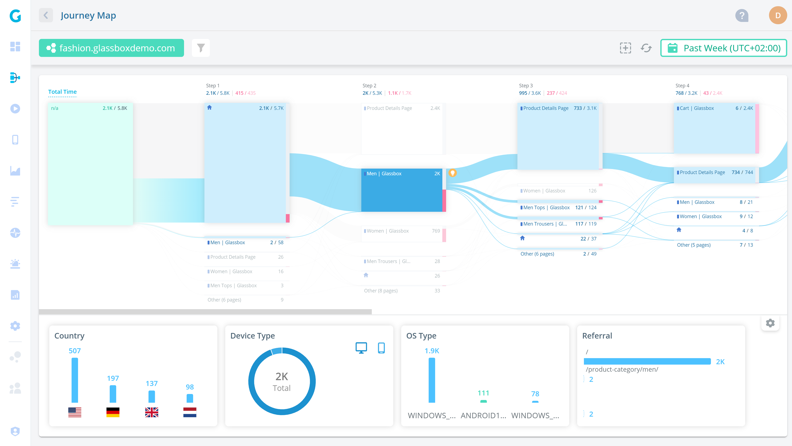
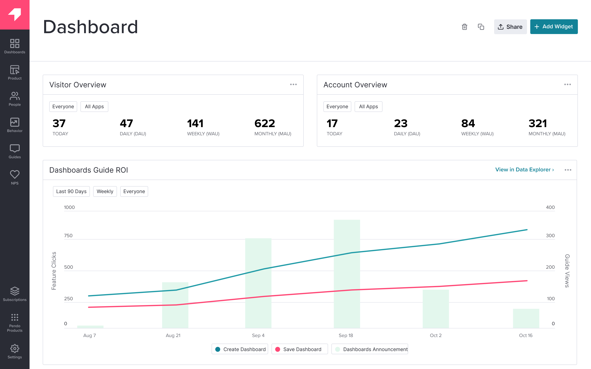
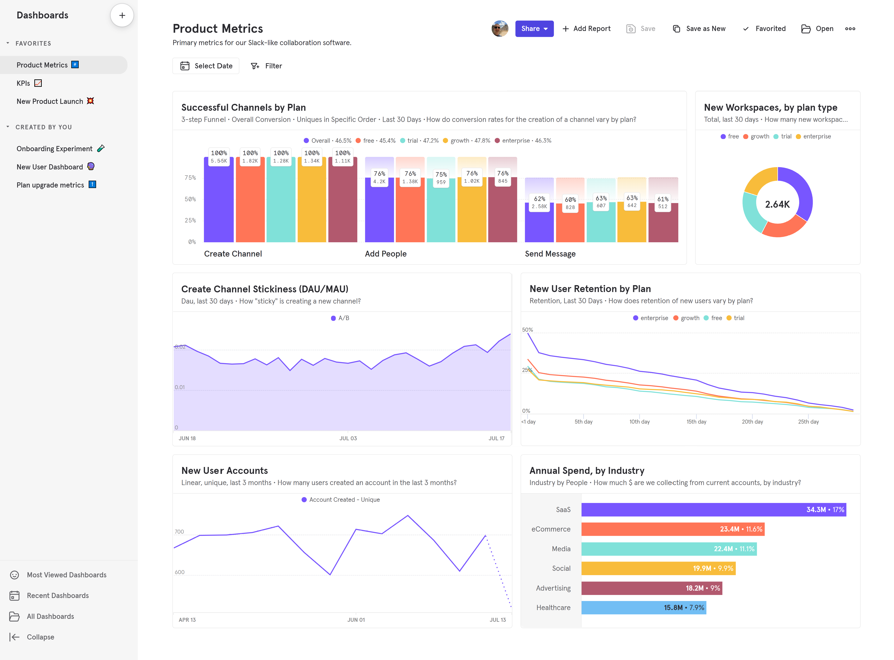
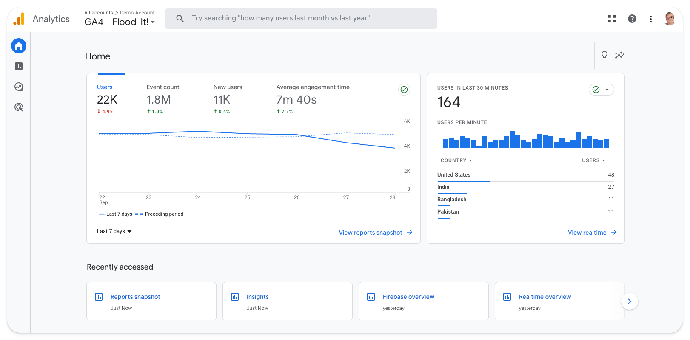

import { ComparisonTable } from 'components/ComparisonTable'
import { ComparisonRow } from 'components/ComparisonTable/row'

The most popular Heap alternatives in 2023 are:

1. **PostHog:** All-in-one platform that combines comprehensive analytics with session replay, A/B testing, feature flags, and user surveys. Ideal for B2B SaaS apps.

2. **FullStory:** Session replay and analytics tool that's popular among online retailers for analyzing behavior in mobile apps.

3. **Glassbox:** Session replay and analytics platform that's mainly used by business and data analysts at e-commerce companies.

4. **Pendo:** Product experience platform that includes analytics, session replay, in-app guides, user feedback, and product validation tools. 

5. **Mixpanel:** A pure product analytics tool designed for product managers at startups and mid-size companies.

6. **Amplitude:** An analytics and testing tool used by product and data teams at large enterprises like Ford, NBCUniversal, and Walmart.

7. **Google Analytics 4:** A marketing and product analytics tool that's tightly integrated with other Google products.

This guide covers:
- How these tools compare to Heap
- Which key Heap features they support
- What kind of users and companies use them, and why

## 1. PostHog

- **Founded:** 2020
- **Similar to:** Heap, Amplitude
- **Typical users:** Engineers and product teams
- **Typical customers:** Mid-size B2Bs and startups 

### What is PostHog?

[PostHog](https://posthog.com/) (that's us 👋) is an [open-source analytics platform](/blog/best-open-source-analytics-tools) that combines product analytics, session replay, feature flags, A/B testing, and user surveys into one product. This means it's not just an alternative to Heap, but also tools like [LaunchDarkly](/blog/posthog-vs-launchdarkly) and [LogRocket](/blog/posthog-vs-logrocket).

Typical PostHog users are engineers and product managers at startups and mid-size companies, particularly B2B companies. Customers include [AssemblyAI](/customers/assemblyai), [Hasura](/customers/hasura), [Vendasta](/customers/vendasta), and Airbus.
 
### Key features

- 📈 **Product analytics:** Funnels, user paths, retention analysis, custom trends, and dynamic user cohorts. Also supports SQL insights for power users.

- 📺 **Session replays:** Including event timelines, console logs, and network activity, and 90-day data retention.

- 🚩 **Feature flags** with local evaluation (for faster performance) and JSON payloads.

- 🧪 **A/B tests:** Up to 9 test variations, primary and secondary metrics. Automatically calculate test duration, sample size, and statistical significance.

- 💬 **Surveys:** Target surveys by event or user properties. Templates for Net Promoter Score (NPS), product-market fit (PMF) surveys, and more.

### How does PostHog compare to Heap?

PostHog is the most direct like-for-like alternative to Heap.

Unlike Mixpanel and Amplitude, PostHog supports event autocapture, which means it starts capturing data from the moment you deploy PostHog's code.

You can also [create and label events using the PostHog toolbar](/tutorials/how-to-capture-events-the-easy-way). This is similar to Heap's visual labeling feature, though it's only supported on web apps.

<ComparisonTable column1="PostHog" column2="Heap">
  <ComparisonRow column1={true} column2={true} feature="Self-serve" description="Free to try, no mandatory sales calls" />
  <ComparisonRow column1={true} column2={true} feature="Product analytics" description="Custom trends, funnels, and retention analysis" />
  <ComparisonRow column1={true} column2={true} feature="Autocapture" description="Capture events without manual instrumentation" />
  <ComparisonRow column1={true} column2={true} feature="Visual labeling" description="Create and tag custom events without using code" />
  <ComparisonRow column1={true} column2={true} feature="Session replay" description="Watch real users use your product; diagnose bugs" />
  <ComparisonRow column1={true} column2={false} feature="Feature flags" description="Roll out features safely; toggle features for cohorts or individuals" />
  <ComparisonRow column1={true} column2={false} feature="A/B testing" description="Test changes and analyze their impact" />
  <ComparisonRow column1={true} column2={false} feature="User surveys" description="Ask users for qualitative feedback and gather responses" />
  <ComparisonRow column1={true} column2={true} feature="Heatmaps" description="See where users click and interact" />
  <ComparisonRow column1={true} column2={true} feature="Group analytics" description="Track metrics at account or company level" />
  <ComparisonRow column1={true} column2={false} feature="Open source" description="Build your own apps and contribute code" />
</ComparisonTable>

### How popular is PostHog?

According to [data compiled by Jason Packer](https://www.linkedin.com/posts/jhpacker_just-updated-the-popularity-numbers-on-my-activity-7112462135120601088-YLdh/), an independent analytics consultant, PostHog is the fastest growing Heap alternative on the market.

As of July 2023, **PostHog** is deployed by 2,365 (0.2%) of the top 1 million websites in 2023, up +327% from 554 the previous year. **Heap** is deployed by 3,200 (0.3%), but only grew by 1% YoY.

### Why do companies use PostHog?

According to [reviews on G2](https://www.g2.com/products/posthog/reviews), companies use PostHog because:

1. **It replaces multiple tools:** PostHog can replace Heap (product analytics), LaunchDarkly (feature flags and A/B testing), and Hotjar (session replay and surveys). This simplifies workflows and ensures all their data is in one place.

2. **Pricing is transparent and scalable:** Reviewers appreciate how PostHog's pricing scales as they grow. There's a [generous free tier](/pricing). Companies eligible for [PostHog for Startups](/startups) also get $50k in additional free credits.

3. **They need a complete picture of users:** PostHog includes every tool necessary to understand users and improve products. This means creating funnels to track conversion, watching replays to see where users get stuck, testing solutions with A/B tests, and gathering feedback with user surveys.

> #### Bottom line 
> PostHog is the only Heap alternative that offers product analytics with autocapture, session replay, and a visual labeling tool for creating events. This, combined with additional features like feature flags and surveys, makes it an excellent like-for-like replacement for Heap.

<ArrayCTA />

 

## 2. FullStory

- **Founded:** 2012
- **Most similar to:** PostHog, Glassbox
- **Typical users:** Product managers, customer success, and support
- **Typical customers:** Online retailers and SaaS companies 

### What is FullStory?

[FullStory](/blog/best-fullstory-alternatives) describes itself as Digital Experience Intelligence, which is code for session replay and mobile app analytics, with a side of product analytics. Like Heap and PostHog, it supports event autocapture, so you don't have to manually code every event you want to capture.

### Key features

- 📹 **Session replay:** Watch and analyze real user sessions on web and mobile apps.

- 📊 **Product analytics:** Understand user paths and struggle points.

- 📈 **Event autocapture:** Tagless event capture that ensures all events are tracked. 

- 🔥 **Heatmaps:** Find out where users click and frustration points.

- 📱 **Mobile app analytics:** Crash analytics and users path analysis.

### How does FullStory compare to Heap?

FullStory offers both product analytics with autocapture and session replay. It also offers session replay for mobile apps, which Heap doesn't support.

<ComparisonTable column1="FullStory" column2="Heap">
  <ComparisonRow column1={false} column2={true} feature="Self-serve" description="Free to try, no mandatory sales calls" />
  <ComparisonRow column1={true} column2={true} feature="Product analytics" description="Custom trends, funnels, and retention analysis" />
  <ComparisonRow column1={true} column2={true} feature="Autocapture" description="Capture events without manual instrumentation" />
  <ComparisonRow column1={false} column2={true} feature="Visual labeling" description="Create and tag custom events without using code" />
  <ComparisonRow column1={true} column2={true} feature="Session replay" description="Watch real users use your product; diagnose bugs" />
  <ComparisonRow column1={false} column2={false} feature="Feature flags" description="Roll out features safely; toggle features for cohorts or individuals" />
  <ComparisonRow column1={false} column2={false} feature="A/B testing" description="Test changes and analyze their impact" />
  <ComparisonRow column1={false} column2={false} feature="User surveys" description="Ask users for qualitative feedback and gather responses" />
  <ComparisonRow column1={true} column2={true} feature="Heatmaps" description="See where users click and interact" />
  <ComparisonRow column1={true} column2={true} feature="Group analytics" description="Track metrics at account or company level" />
</ComparisonTable>

### How popular is FullStory?

FullStory is more popular than Heap. According to data from BuiltWith, as of October 2023, FullStory is deployed on 8,107 of the top 1 million websites in the world. Heap is used by 4,248.

### Why do companies use FullStory?

According to reviews on G2, companies use FullStory for:

1. **Easier collaboration:** As an accessible tool for non-technical users, FullStory facilitates collaboration between product, UX, and engineering teams by allowing all teams to access useful, reliable data.

2. **Viewing user issues:** Support teams use FullStory to replay sessions to understand user hard to replicate problems, and identify bugs that need fixing.

3. **Improving conversion:** FullStory users like to combine funnel insights with replays of user sessions to understand pain points and improve conversion.

> ### Bottom line
> FullStory is a good Heap alternative for non-technical teams, particularly customer success and support teams who need to diagnose user problems. It has superior session replay features, though arguably is less focused on analytics use cases than Heap or PostHog.

 

## 3. Glassbox

- **Founded:** 2010
- **Most similar to:** FullStory
- **Typical users:** Business analysts, product support
- **Typical customers:** Retail and financial services

### What is Glassbox?

Glassbox is a session replay and analytics platform with a particular focus on mobile apps and e-commerce use cases. Customers include UK retailer Sainsbury's, Marriott, and Experian.

Unlike Heap, which is mainly used by product managers, G2 suggests Glassbox is predominantly used by business analysts and support teams.

### Key features

- 📹 **Session replay:** Watch and analyze real user sessions on web and mobile apps.

- 📊 **Product analytics:** Understand user paths and struggle points.

- 🏎️ **Performance analytics:** Track app performance and their impact on conversion rates.

- 🔥 **Click, scroll and heatmaps:** Understand where users interact with your app.

- ✅ **User feedback:** Gather satisfaction and user feedback on app experience.

### How does Glassbox compare to Heap?

Glassbox offers similar core features to Heap, including product analytics with autocapture – Glassbox calls it tagless tracking. It doesn't offer visual labeling tool, however.

<ComparisonTable column1="Glassbox" column2="Heap">
  <ComparisonRow column1={false} column2={true} feature="Self-serve" description="Free to try, no mandatory sales calls" />
  <ComparisonRow column1={true} column2={true} feature="Product analytics" description="Custom trends, funnels, and retention analysis" />
  <ComparisonRow column1={true} column2={true} feature="Autocapture" description="Capture events without manual instrumentation" />
  <ComparisonRow column1={false} column2={true} feature="Visual labeling" description="Create and tag custom events without using code" />
  <ComparisonRow column1={true} column2={true} feature="Session replay" description="Watch real users use your product; diagnose bugs" />
  <ComparisonRow column1={false} column2={false} feature="Feature flags" description="Roll out features safely; toggle features for cohorts or individuals" />
  <ComparisonRow column1={false} column2={false} feature="A/B testing" description="Test changes and analyze their impact" />
  <ComparisonRow column1={true} column2={false} feature="User surveys" description="Ask users for qualitative feedback and gather responses" />
  <ComparisonRow column1={true} column2={true} feature="Heatmaps" description="See where users click and interact" />
  <ComparisonRow column1={true} column2={true} feature="Group analytics" description="Track metrics at account or company level" />
</ComparisonTable>

### How popular is Glassbox?

According to data from BuiltWith, Glassbox isn't as popular as Heap. 

As of October 2023, it's deployed on just 389 of the top 1 million websites, compared to Heap's 4,248. 

That said, Glassbox's greater focus on mobile apps isn't reflected in these figures.

### Why do companies use Glassbox?

According to G2 reviews, customers use Glassbox for:

1. **Session replay and error analysis:** Glassbox is best-known for its session replay features, so this is the most popular use case. Customers use Glassbox to analyze user journeys and identify app-breaking bugs.

2. **Heatmap and funnel analysis:** Users like the heatmaps feature, which enables them to see user preferences on key pages and use this to visualize user funnels.

3. **Fixing low conversion and abandonment:** Glassbox is popular among online retailers, who use it to solve issues around conversion and basket abandonment.

> ### Bottom line
> Glassbox is a good Heap alternative for online retailers mostly interested in mobile app analytics and session replay, but SaaS companies should look elsewhere.

 

## 4. Pendo

- **Founded:** 2013
- **Most similar to:** PostHog, Heap
- **Typical users:** Product managers and customer success teams
- **Typical customers:** Small and mid-market B2C companies

### What is Pendo?

Pendo describes itself as a product experience platform. In addition to product analytics, it offers session replay, in-app guides, user feedback, and product validation tools.

### Key features

- 📊 **Product analytics:** Funnels, trends, and retention analysis with event autocapture.

- 🦮 **In-app guides:** Deliver personalized guidance to customers, directly inside your app.

- 📝 **User feedback:** Capture and analyze customer feedback at scale.

- 🗺️ **Product validation and roadmaps:** Plan your product improvements and roadmap using data from Pendo.

### How does Pendo compare to Heap?

Pendo offers similar features to Heap, including event autocapture and session replay. It lacks a visual labeling tool for events, however.

<ComparisonTable column1="Pendo" column2="Heap">
  <ComparisonRow column1="Starter plans only" column2={true} feature="Self-serve" description="Free to try, no mandatory sales calls" />
  <ComparisonRow column1={true} column2={true} feature="Product analytics" description="Custom trends, funnels, and retention analysis" />
  <ComparisonRow column1={true} column2={true} feature="Autocapture" description="Capture events without manual instrumentation" />
  <ComparisonRow column1={false} column2={true} feature="Visual labeling" description="Create and tag custom events without using code" />
  <ComparisonRow column1={true} column2={true} feature="Session replay" description="Watch real users use your product; diagnose bugs" />
  <ComparisonRow column1={false} column2={false} feature="Feature flags" description="Roll out features safely; toggle features for cohorts or individuals" />
  <ComparisonRow column1={false} column2={false} feature="A/B testing" description="Test changes and analyze their impact" />
  <ComparisonRow column1={true} column2={false} feature="User surveys" description="Ask users for qualitative feedback and gather responses" />
  <ComparisonRow column1={false} column2={true} feature="Heatmaps" description="See where users click and interact" />
  <ComparisonRow column1={true} column2={true} feature="Group analytics" description="Track metrics at account or company level" />
</ComparisonTable>

### How popular is Pendo?

According to [data from BuiltWith](https://trends.builtwith.com/analytics/Pendo), Pendo is about as popular as Heap. As of October 2023, Pendo is used by 3,729 of the top 1 million websites, compared to 4,248 that use Heap.

### Why do companies use Pendo?

According to G2 reviews, customers use Pendo for:

1. **Customer support and feedback:** Users value Pendo as a useful tool for customer support and feedback collection. They use Pendo's feedback features to gather qualitative data, and feed that into Pendo's validation and roadmap features.

2. **Improving onboarding:** Combining Pendo's in-app guides and analytics features makes it easy for non-technical users to experiment with new onboarding flows, improving user adoption.

3. **Product planning:** Customers to use Pendo's data tools, product validation, and roadmap features to align internal teams and stakeholders on product development.

> ### Bottom line
> Pendo is similar to Heap in many ways. It's primarily designed for non-technical users, and supports event autocapture, making it viable alternative for product teams.

 

## 5. Mixpanel

- **Founded:** 2009
- **Most similar to:** PostHog, Heap, and Amplitude
- **Typical users:** Product managers, desginers and marketing teams
- **Typical customers:** Mid-size B2C and B2B companies

### What is Mixpanel?

Mixpanel is one of the most popular product analytics tools on the market. Founded in 2009, in recent years it's deprecated additional features, such as A/B testing, to focus on product analytics alone.
 
### Key features

- 📊 **Product analytics:** Track user behavior, trends, and retention

- 📝 **Collaborative notebooks:** Create analysis in notebooks and collaborate with colleagues

- 🚨 **Anomaly detection:** Get automated alerts when metrics fall outside a positive or negative range

- 🔎 **Filtered data views:** Hide and filter data on a per-team basis to reduce noise

### How does Mixpanel compare to Heap?

Mixpanel and Heap are similar in many ways. They're both used mainly by product managers and offer product analytics. However, Mixpanel lacks several features Heap users rely on, such as event autocapture and session replay.

<ComparisonTable column1="Mixpanel" column2="Heap">
  <ComparisonRow column1={true} column2={true} feature="Self-serve" description="Free to try, no mandatory sales calls" />
  <ComparisonRow column1={true} column2={true} feature="Product analytics" description="Custom trends, funnels, and retention analysis" />
  <ComparisonRow column1={false} column2={true} feature="Autocapture" description="Capture events without manual instrumentation" />
  <ComparisonRow column1={false} column2={true} feature="Visual labeling" description="Create and tag custom events without using code" />
  <ComparisonRow column1={false} column2={true} feature="Session replay" description="Watch real users use your product; diagnose bugs" />
  <ComparisonRow column1={false} column2={false} feature="Feature flags" description="Roll out features safely; toggle features for cohorts or individuals" />
  <ComparisonRow column1={false} column2={false} feature="A/B testing" description="Test changes and analyze their impact" />
  <ComparisonRow column1={false} column2={false} feature="User surveys" description="Ask users for qualitative feedback and gather responses" />
  <ComparisonRow column1={false} column2={true} feature="Heatmaps" description="See where users click and interact" />
  <ComparisonRow column1={true} column2={true} feature="Group analytics" description="Track metrics at account or company level" />
</ComparisonTable>

### How popular is Mixpanel?

According to [BuiltWith data compiled by Jason Packer](https://www.linkedin.com/posts/jhpacker_just-updated-the-popularity-numbers-on-my-activity-7112462135120601088-YLdh/), an independent analytics consultant, Mixpanel is more popular than Heap. As of July 2023, **Mixpanel** is deployed by 5,218 of the top 1 million websites in 2023. **Heap** is deployed by 3,200.

### Why do companies use Mixpanel?

1. **Eliminate need for data analysts:** Reviewers on G2 note Mixpanel helps them structure large volumes of data, and make data-driven decisions, reducing their reliance on dedicated data analysts to produce insights.

2. **Campaign targeting and tracking:** Marketing users appreciate the ability to create user segments and target specific users, enabling more personalized campaigns and improved user engagement.

3. **Understanding user behavior:** In common with most analytics tools, Mixpanel's users mostly want to understand user behavior, identify bottlenecks, and monitor core metrics like conversion rates, activation, and retention.

> #### Bottom line 
> Mixpanel is a good option to replace Heap, but it has shortcomings. The lack of autocapture is a major drawback for Heap users reliant on that feature, and you'll need to find another session replay tool if you want that feature.

 

## 6. Amplitude

- **Founded:** 2012
- **Most similar to:** Mixpanel
- **Typical users:** Product managers, data analysts, marketing teams
- **Typical customers:** Mid-size and large enterprises

### What is Amplitude?

[Amplitude](/blog/best-amplitude-alternatives) is an analytics and testing tool with a particular focus on large enterprise customers, like Ford, NBCUniversal, and Walmart. 

### Key features

- 📈 **Product analytics:** Funnel and retention analysis, user paths, behavioral cohorts, custom dashboards, and more.

- 🧪 **A/B testing:** Support for JSON payloads, primary, secondary, and counter metrics.

- 💁‍♂️ **Customer data platform:** Combine analytics data with third-party tools for data governance, identity resolution, and data federation.

- 🤖 **AI insight builder:** Generate insights based on natural language requests, like "What is my purchase conversion rate?".

### How does Amplitude compare to Heap?

Like Mixpanel, Amplitude lacks features Heap users rely on, such as autocapture, visual labeling, and session replay. But its analytics features are arguably a little more mature, particularly the natural language and anomaly detection features.

<ComparisonTable column1="Amplitude" column2="Heap">
  <ComparisonRow column1="Starter plans only" column2={true} feature="Self-serve" description="Free to try, no mandatory sales calls" />
  <ComparisonRow column1={true} column2={true} feature="Product analytics" description="Custom trends, funnels, and retention analysis" />
  <ComparisonRow column1={false} column2={true} feature="Autocapture" description="Capture events without manual instrumentation" />
  <ComparisonRow column1={false} column2={true} feature="Visual labeling" description="Create and tag custom events without using code" />
  <ComparisonRow column1={false} column2={true} feature="Session replay" description="Watch real users use your product; diagnose bugs" />
  <ComparisonRow column1={true} column2={false} feature="Feature flags" description="Roll out features safely; toggle features for cohorts or individuals" />
  <ComparisonRow column1={true} column2={false} feature="A/B testing" description="Test changes and analyze their impact" />
  <ComparisonRow column1={false} column2={false} feature="User surveys" description="Ask users for qualitative feedback and gather responses" />
  <ComparisonRow column1={false} column2={true} feature="Heatmaps" description="See where users click and interact" />
  <ComparisonRow column1={true} column2={true} feature="Group analytics" description="Track metrics at account or company level" />
</ComparisonTable>

### How popular is Amplitude?

Amplitude is more than twice as popular than Heap, according to [data compiled by Jason Packer](https://www.linkedin.com/posts/jhpacker_just-updated-the-popularity-numbers-on-my-activity-7112462135120601088-YLdh/), an independent analytics consultant. 

As of July 2023, Amplitude is deployed by 6,973 of the top 1 million websites in 2023. Heap is deployed by 3,200.

### Why do companies use Amplitude?

1. **Reducing load on data teams:** Amplitude is designed to enable non-technical users to self-serve analytics. Amplitude cites NBCUniversal as a company that's benefited from its data team spending less time responding to requests for analysis.

2. **Large-scale experimentation:** Unlike Mixpanel, Amplitude offers built-in experimentation features. This enables companies to run experiments on users using existing cohorts created in Amplitude.

3. **Resolving data quality problems:** Companies that use Amplitude, particularly large ones, often migrate from outdated, self-built, tools that generate poor quality data. Amplitude helps them fix that while making analytics more accessible.

> #### Bottom line
> The case for Amplitude is very similar to the case for Mixpanel. It's a well-established Heap alternative, but falls short of a like-for-like replacement due to is lack of autocapture and session replay.

 

## 7. Google Analytics 4

- **Released:** October 2020
- **Most similar to:** Amplitude
- **Typical users:** Marketing and content teams
- **Typical customers:** Commerce websites and large enterprises

### What is Google Analytics 4?

Google Analytics 4 (GA4) is a marketing and product analytics tool that's tightly integrated with other Google products, such as Ads, BigQuery, Looker Studio, and Firebase. 

Unlike its predecessor, Universal Analytics (GA3), it's event-based. It also introduces new report types, such as conversion funnels and retention tables. This makes it more useful to product teams than before.

### Key features

- 🤖 **Predictive insights** alert you to trends you're not aware of, like an increase in traffic to a specific landing page, or an anomalous decline in conversion from one period to another.

- 🔁 **Integration with Google tools** means it's easy to analyze your GA4 data elsewhere, such as Google's dashboarding tool, Looker Studio.

- ⌨️ **Natural language search** means you can ask specific questions, like "MoM growth in users on iOS", rather searching existing reports.

### How does GA4 compare to Heap?

GA4 is another tool that supports event autocapture, though confusingly Google calls this "enhanced analytics". 

On paper, it offers similar feature to Heap, though GA4's product analytics are less mature than those of Heap and other more established event-based tools.

<ComparisonTable column1="Google Analytics 4" column2="Heap">
  <ComparisonRow column1={true} column2={true} feature="Self-serve" description="Free to try, no mandatory sales calls" />
  <ComparisonRow column1={true} column2={true} feature="Product analytics" description="Custom trends, funnels, and retention analysis" />
  <ComparisonRow column1={true} column2={true} feature="Autocapture" description="Capture events without manual instrumentation" />
  <ComparisonRow column1={false} column2={true} feature="Visual labeling" description="Create and tag custom events without using code" />
  <ComparisonRow column1={false} column2={true} feature="Session replay" description="Watch real users use your product; diagnose bugs" />
  <ComparisonRow column1={false} column2={false} feature="Feature flags" description="Roll out features safely; toggle features for cohorts or individuals" />
  <ComparisonRow column1={false} column2={false} feature="A/B testing" description="Test changes and analyze their impact" />
  <ComparisonRow column1={false} column2={false} feature="User surveys" description="Ask users for qualitative feedback and gather responses" />
  <ComparisonRow column1={false} column2={true} feature="Heatmaps" description="See where users click and interact" />
  <ComparisonRow column1={false} column2={true} feature="Group analytics" description="Track metrics at account or company level" />
</ComparisonTable>

### How popular is GA4?

Google Analytics remains the most-used analytics tool in the world by a large margin. 

As of July 2023, [30.5% of the top 1 million websites](https://www.linkedin.com/posts/jhpacker_just-updated-the-popularity-numbers-on-my-activity-7112462135120601088-YLdh/) run GA4 – another 35.7% were still running GA3.

### Why do companies use GA4?

1. **Because it's Google:** It's not an original reason, but it holds true. Using Google Analytics makes a lot of sense for teams who rely on other Google platforms, like Google Ads and BigQuery.

2. **It's powerful and free:** Likewise, Google's scale means GA4 is completely free to most small and medium-sized businesses. This, combined with strong analytical tools and the large ecosystem of GA experts to call upon, makes it a safe choice.

3. **To track marketing ROI:** GA4 is predominantly used by marketing and e-commerce teams to track campaign ROI. It's also popular among large content publishers for its scalability.

> #### Bottom line
> Until recently, Google Analytics wasn't a viable Heap alternative. The launch of GA4 changed this, but switching from Heap to Google only makes sense if you're keen to integrate deeper into Google's ecosystem of data tools, like BigQuery and Looker Studio.

 

## Is PostHog right for you?

Here's the (short) sales pitch. 

We're biased, obviously, but we think PostHog is the perfect Heap replacement if:

- You value transparency (we're open source and open core)
- You want to use fewer tools (we can replace way more than just Heap)
- You want try before you buy (we're self-serve with a [generous free tier](/pricing))

Check out [our product pages](/product-analytics) and [read our docs](/docs) to learn more.

<ArrayCTA />
