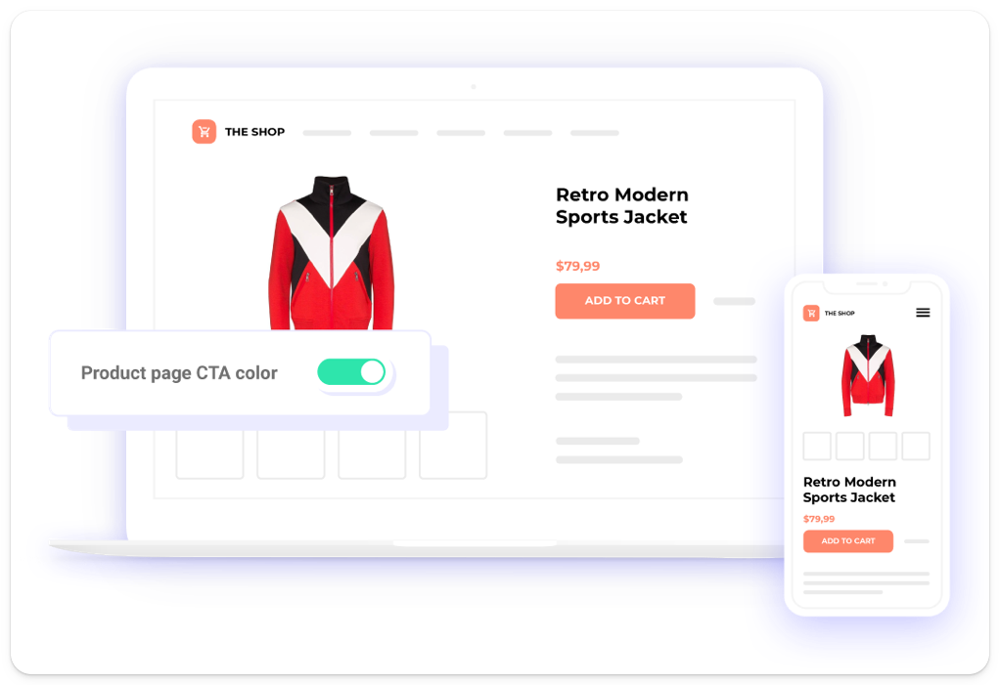
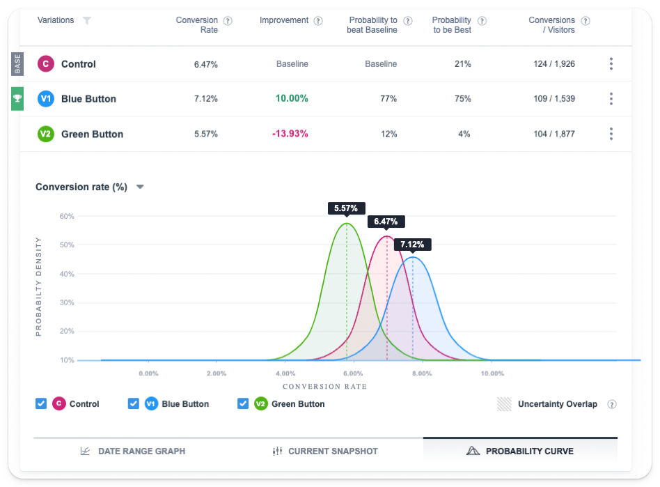

What do Google Optimize, [Optimizely](/blog/posthog-vs-optimizely), Convert, and Webtrends Optimize have in common?

1. They're popular A/B testing tools
2. None of them are HIPAA-compliant

Anyone who develops a healthcare product or app will be painfully familiar with this problem. And, while it's tempting to make do without A/B testing for your product, that's a mistake. It's nearly impossible to eliminate second- and third-order effects without a robust testing system, and a good testing product will allow you to target specific user properties, so you get actionable results.

## What you need for HIPAA compliance

HIPAA requires you to comply with the [Privacy Rule](https://www.hhs.gov/ocr/privacy/hipaa/administrative/privacyrule/index.html) and the [Security Rule](https://www.hhs.gov/ocr/privacy/hipaa/administrative/securityrule/index.html). Breaching either can result in hefty financial penalties, but for the sake of this guide we're mostly interested in how the Privacy Rule impacts analytics and A/B testing.

There are three ways to comply with the Privacy rule when adopting analytics and testing tools:

1. **Anonymize all PHI and identifiers:** There are two so-called "[De-identification Standards](https://www.hhs.gov/hipaa/for-professionals/privacy/special-topics/de-identification/index.html#standard)" – "Expert Determination," where an expert verifies that data isn't personally identifiable, and "Safe Harbor" where all 18 types of identifier are removed. The former is preferable simply because applying the Safe Harbor approach can render data effectively useless for analytical purposes.

2. **Sign a BAA with a third-party tool:** You must sign a BAA with any third-party platform that handles your protected health information (PHI). This can mean signing multiple agreements, though, such as one with your analytical partner, but also _any_ tools you use for importing and exporting data from your data warehouse.

3. **Self-host and keep control of all your data:** The less common is to self-host tools for analytics and experimentation on your own infrastructure. This reduces the number of BAAs and general legal wrangling needed to generate user insights. The only downside is you'll need the expertise to manage self-hosted instances, or third-party support to do so, and you are wholly liable for any security breaches.

These are the broad principles, but **please consult an expert** before making any final decision on how to implement tools in compliance with HIPAA. 

## The best HIPAA-compliant A/B testing tools

### 1. PostHog

- **Product analytics:** ✔
- **Web analytics:** ✔
- **Session replay:** ✔
- **Feature flags:** ✔
- **A/B testing:** ✔
- **Surveys:** ✔
- **Self-hostable:** ✔
- **BAA available:** ✔

[PostHog](https://posthog.com/) is an open source all-in-one platform that combines A/B testing with product analytics, session replay, feature management, and user surveys – everything you need to understand user behavior. All these tools are seamlessly integrated and, because you get everything in one, you only need to sign one BAA for all your analytics needs.

PostHog offers a BAA on its Teams plan, which starts at $450 and includes [generous monthly free allowances](/pricing), such as 1 million analytics events every month. You can also self-host the open-source edition for free, though this isn't recommended as it's provided without support or guarentee. 

### 2. Kameleoon

- **Product analytics:** ✖
- **Web analytics:** ✖
- **Session replay:** ✖
- **Feature flags:** ✔
- **A/B testing:** ✔
- **Surveys:** ✖
- **Self-hostable:** ✖
- **BAA available:** ✔

Kameleoon is an A/B testing and personalization platform. It supports A/B and [multivariate testing](/product-engineers/what-is-multivariate-testing-examples), and feature flags for managing the rollout of new features and running tests. In addition to testing, it features a real-time personalization engine that's particularly useful for e-commerce. It doesn't have any deeper analytics features, so you'll need to run it alongside another [HIPAA-compliant analytics tool](/blog/best-hipaa-compliant-analytics-tools) to gather deeper user behavior data.

Kameleoon doesn't publish pricing publicly, but conversion optimization consultants BrillMark [state](https://www.brillmark.com/kameleoon-ab-testing-platform/#:~:text=The%20yearly%20licensing%20pricing%20for,pay%20for%20the%20annual%20license) pricing starts at $35,000 per year and scales based on traffic volume.  

### 3. VWO

- **Product analytics:** ✖
- **Web analytics:** ✖
- **Session replay:** ✖
- **Feature flags:** ✔
- **A/B testing:** ✔
- **Surveys:** ✖
- **Self-hostable:** ✖
- **BAA available:** ✔

VWO offers a range of different products. Its testing product, VWO Testing, includes visual and code editors. You can run both A/B and multivariate tests, though the latter is limited to its Pro and Enterprise plans.

#### VWO and HIPAA compliance

- **Self-Hosting:** No
- **BAA Available**: Yes

VWO is a cloud-hosted platform only and will enter into a BAA with its users.

What [VWO says](https://vwo.com/compliance/hipaa/):

>"VWO customers who are subject to HIPAA and wish to use the VWO products with PHI must sign a BAA with VWO. Customers are responsible for ensuring that they achieve compliance with HIPAA and HITECH Act requirements. 
>
>"We adhere to the HIPAA obligations by leveraging appropriate security configuration options for all VWO products. Additionally, we make our Business Associate Agreement (BAA) available for execution by subscribers."

#### How much does VWO cost?

VWO doesn't publish its pricing publicly, but it does offer a 14-day free trial.

### Adobe Target

Adobe Target is part of Adobe's Experience Cloud, though it can be bought and used on its own. It supports A/B and multivariate tests, though unlike Kameleoon it doesn't offer feature flagging as it's primarily aimed at marketing teams rather than product developers. To this end, it includes a visual editor, so marketing teams can easily make changes to pages and run tests on conversion independently.

#### Adobe Target and HIPAA compliance

- **Self-Hosting:** No
- **BAA Available**: Yes

What [Adobe says](https://www.adobe.com/trust/compliance/hipaa-ready.html):

> "Adobe provides health care customers with services that are ready to accept PHI, referring to these services as HIPAA-Ready Services. These HIPAA-Ready Services have additional features and functionalities that allow for both customers, who are Covered Entities or Business Associates, and Adobe to comply with their respective HIPAA obligations. These additional features may increase your license or subscription costs."

#### How much does Adobe Target cost?

Adobe doesn't publish pricing for Adobe Target, but suffice it to say it probably won't be cheap given its typical clients are multinational corporations. As noted in its T&Cs, using its "HIPAA-Ready Service" may incur an additional cost above a normal subscription plan.

## FAQ

### Who does HIPAA apply to?

HIPAA applies to "covered entities," such as healthcare providers who transmit any health information in electronic form, health plans, and healthcare clearinghouses. Mobile apps fall under HIPAA if they store protected health information (PHI), and share it with any covered entity. 

HIPAA also applies to "business associates," which, according to the [US Department of Health and Human Services](https://www.hhs.gov/hipaa/for-professionals/covered-entities/sample-business-associate-agreement-provisions/index.html), are "a subcontractor that creates, receives, maintains, or transmits protected health information on behalf of another business associate."

Under HIPAA, the A/B testing tools in this guide would all be considered business associates.

### What is PHI (Protected Health Information)?

Protected Health Information (PHI) is any information about health status, provision of healthcare, or payment for healthcare that can be linked to an individual. 

This includes medical records, laboratory results, billing information, and any other information that identifies an individual and relates to their past, present, or future physical or mental health condition, treatment, or payment for healthcare services.

### Is self-hosting better than signing a BAA?

There's no objective correct answer here. In theory, self-hosting is preferable as it means you don't share any data with third-parties (business associates), and thus you don't need to sign a BAA.

But self-hosting also presents additional risks. You're wholly liable for ensuring your A/B testing infrastructure is secure, which can be challenging if you don't have the internal expertise to manage this. If this is the case, it may be better to rely on a HIPAA-compliant business associate who has experience hosting analytics at scale.

### What's the difference between A/B and multivariate testing?

**A/B testing** involves comparing the conversion rates of two or more different versions of the same page or user experience. Users are sent to one version or the other, and the outcomes are compared until a large enough sample has been achieved to measure the statistical significance of the results. A/B testing is sometimes called 'split testing' and you can test more than two pages, a process sometimes referred to as A/B/n testing.

**Multivariate testing** is similar to A/B testing, but it tests more page elements together to understand how they interact with each other. One would, for example, use a multivariate test to compare all the possible combinations of three different page headlines and three different CTAs (call to actions) to see which performs best. The basic process is similar to an A/B test, but instead of comparing whole page designs, you're comparing specific elements to each other.