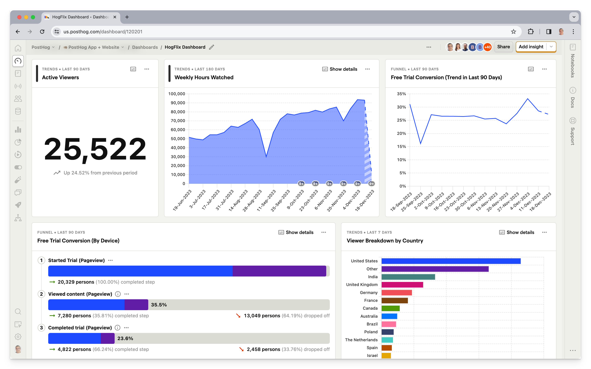
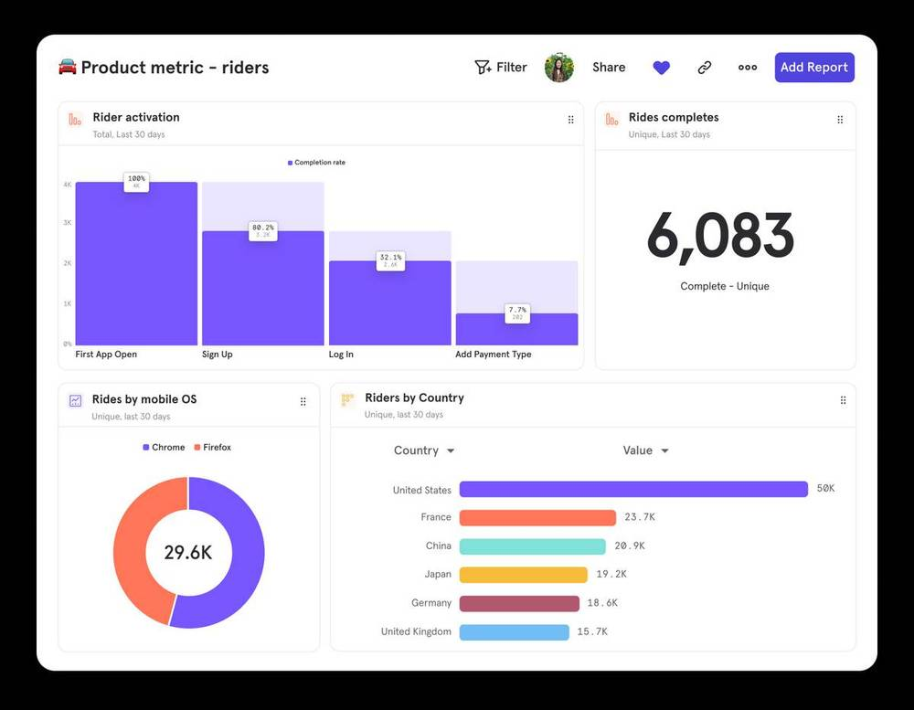
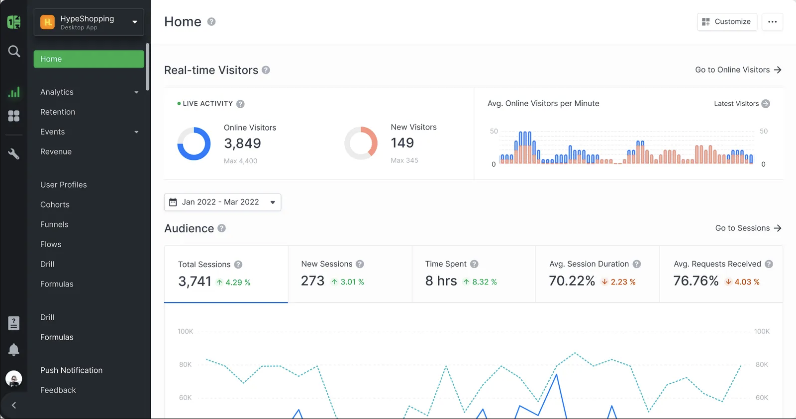
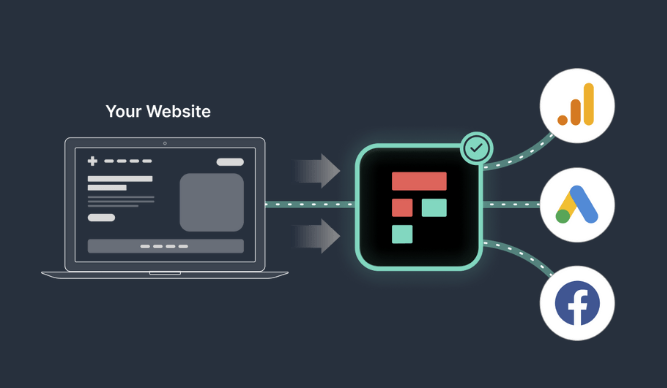
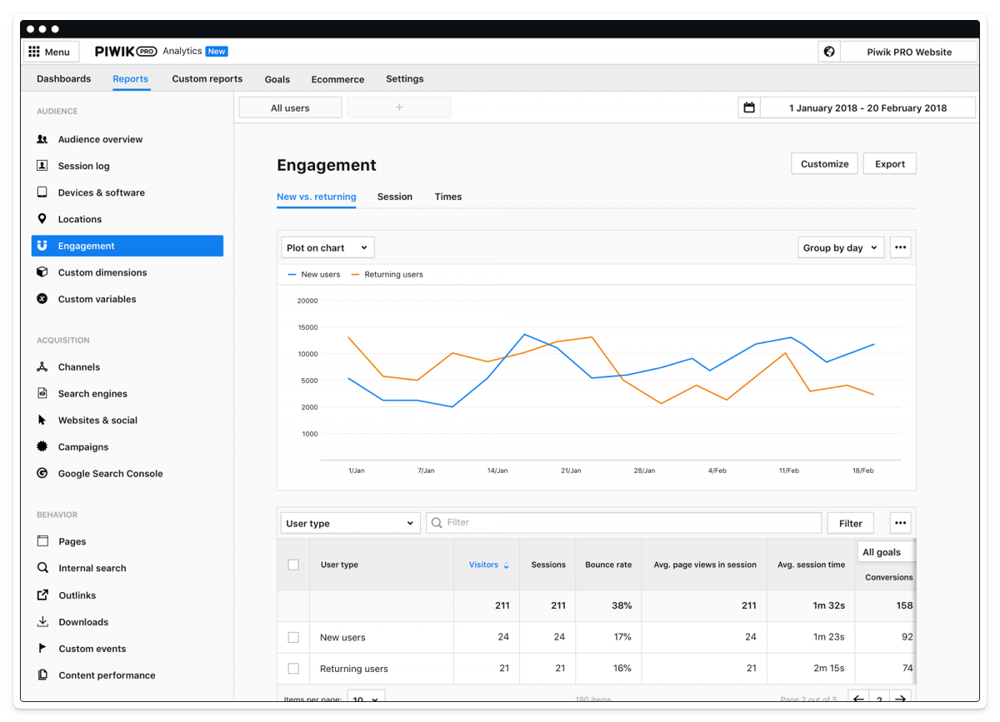
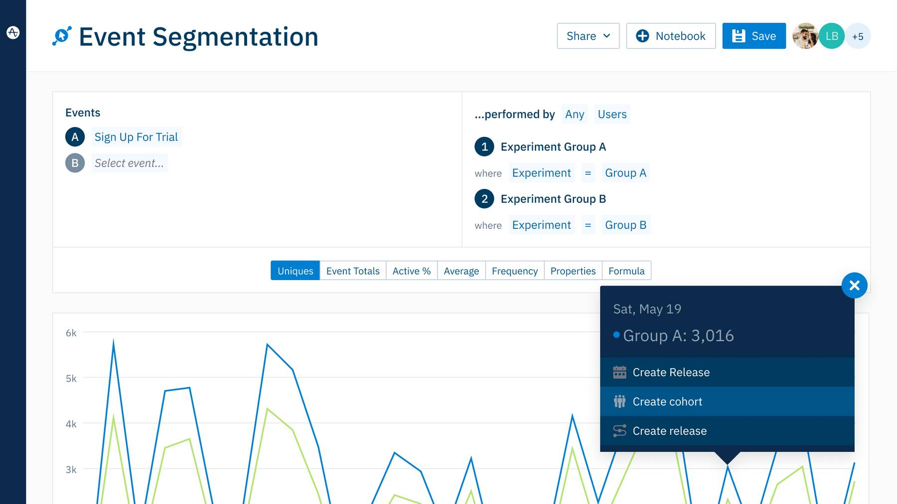

## What is HIPAA?

Passed in 1996, HIPAA (Health Insurance Portability and Accountability Act) defines the legal requirements for securing and handling health information, and the severe penalties for failing to do so.

Data protected under HIPAA is called [Protected Health Information](/blog/what-is-personal-data-pii) (PHI), or ePHI if it is digitized. It includes any data that can be used to identify the past, current or future health status of an individual. 

This includes test results and diagnoses, but also birthdays, ethnicity, gender and other information. Even an IP address can be considered ePHI under HIPAA.

While similar in some respects to the EU's General Data Protection Regulation (GDPR), HIPAA applies specifically to companies handling the PHI of US-based customers. Companies that also need to comply with the GDPR should see our guide to [GDPR-compliant analytics](/blog/best-gdpr-compliant-analytics-tools).

There are two ways to be HIPAA-compliant while using analytics tools:

1. Self-host your analytics, so data remains totally within your control.
2. Sign a Business Associate Agreement (BAA) with a third-party analytics tool. 

## What is a Business Associate Agreement (BAA)?

Some services enable HIPAA compliance through the creation of a [Business Associate Agreement](https://www.hhs.gov/hipaa/for-professionals/covered-entities/sample-business-associate-agreement-provisions/index.html)(US Department of Health). This is a contract with a service provider to ensure that they are jointly compliant and liable for services they provide. 

It's worth noting that, because BAAs expose third-parties to increased risk and scrutiny, they are often an expensive option and/or require users to purchase a higher tier of license. 

Some analytics tools, such as Google Analytics, don't offer BAAs and are therefore not HIPAA-compliant.

## The best HIPAA-compliant analytics tools

### 1. PostHog

- **Product analytics:** ✔
- **Web analytics:** ✔
- **Session replay:** ✔
- **Feature flags:** ✔
- **A/B testing:** ✔
- **Surveys:** ✔
- **Customer data platform:** ✔

[PostHog](https://posthog.com/) is an open-source platform that combines product analytics, web analytics, session replay, feature flags, A/B testing, and user surveys into one platform. It gives you every tool you need to understand user behavior and, unlike typical analytics tools that rely on third-party integrations, all these tools work together seamlessly.

Being an all-in-one platform has two further benefits:

1. PostHog can replace multiple individual products – e.g. [Mixpanel](/blog/best-mixpanel-alternatives) for product analytics, [LaunchDarkly](/blog/best-launchdarkly-alternatives) for feature management, etc.
2. You only need to sign one BAA to get all these tools, reducing legal complexity and risk.

#### PostHog and HIPAA compliance

- **Self-hostable:** ✔
- **BAA available:** ✔

A BAA is available on PostHog's [Teams plan](/pricing), which also includes priority support and generous free usage limits for all tools – e.g. 1 million free analytics events every month. You can also self-host the open-source edition of PostHog, but this isn't recommended as it's provided without guarantee or support.

### 2. Mixpanel

- **Product analytics:** ✔
- **Web analytics:** ✔
- **Session replay:** ✖
- **Feature flags:** ✖
- **A/B testing:** ✖
- **Surveys:** ✖
- **Customer data platform:** ✖

[Mixpanel](https://mixpanel.com/) is a pure product analytics tool for analyzing user funnels and behavior. It doesn't offer built-in tools for things like session replay, feature management, A/B testing, or user surveys, but it does have extensive integrations with third-party tools for these.

#### Mixpanel and HIPAA compliance

- **Self-hostable:** ✖
- **BAA available:** ✔

A BAA is available on Mixpanel's Growth plan, which starts at $20 per month for 10,000 events. You'll need to sign separate BAAs with any other analytics you wish to integrate with Mixpanel.

**See also:** [The most popular Mixpanel alternatives](/blog/best-mixpanel-alternatives)

### 3. Countly

- **Product analytics:** ✔
- **Web analytics:** ✔
- **Session replay:** ✖
- **Feature flags:** ✖
- **A/B testing:** ✔
- **Surveys:** ✔
- **Customer data platform:** ✖

[Countly](https://countly.com) is an analytics platform for mobile, web, and desktop applications that also offers add-ons for remote configuration, A/B testing, and user surveys.

#### Countly and HIPAA compliance

- **Self-hostable:** ✔
- **BAA available:** ✖

Countly doesn't offer a BAA for HIPAA compliance on its hosted cloud, but it does offer the option to either:

1. Self-host the product on your own.
2. Deploy it to a private cloud managed by Countly.

This makes Countly a good option if you'd prefer to self-host your analytics.

### 4. Freshpaint

- **Product analytics:** ✖
- **Web analytics:** ✖
- **Session replay:** ✖
- **Feature flags:** ✖
- **A/B testing:** ✖
- **Surveys:** ✖
- **Customer data platform:** ✔

[Freshpaint](https://www.freshpaint.io/) isn't an analytics tool per se, it's more of an analytics event tracker and customer data platform (CDP) that's specifically designed for healthcare companies. 

Freshpaint sits between data sources (e.g data warehouses) and third-party data destinations and ensures no PHI is passed between them. This means you can continue to use non-HIPAA compliant tools, such as Google Analytics, safe in the knowledge you're not accidentally passing PHI into them.

#### Freshpaint and HIPAA compliance

- **Self-hostable:** ✖
- **BAA available:** ✔

Freshpaint is a cloud-only product specifically designed for healthcare companies, so offers a BAA for HIPAA compliance.

### 5. PiwikPRO

- **Product analytics:** ✖
- **Web analytics:** ✔
- **Session replay:** ✖
- **Feature flags:** ✖
- **A/B testing:** ✖
- **Surveys:** ✖
- **Customer data platform:** ✔

PiwikPRO is a commercial analytics and customer data platform spun out of the open-source analytics tool, Matomo. As such, it's more a web analytics tool than other options in this list, though you can use it on mobile and web apps. Because it's based on Europe, PIWIKPro is popular among companies also seeking GDPR compliance – it has a built-in compliance manager to assist with this. 

#### PiwikPRO and HIPAA compliance

- **Self-hostable:** ✔
- **BAA available:** ✔

It offers HIPAA compliance as part of its PRO Enterprise plan, either by signing a BAA or by self-hosting, giving you maximum flexibility.

### 6. Amplitude

- **Product analytics:** ✔
- **Web analytics:** ✖
- **Session replay:** ✔
- **Feature flags:** ✔
- **A/B testing:** ✔
- **Surveys:** ✖
- **Customer data platform:** ✔

[Amplitude](https://amplitude.com) sits somewhere between PostHog and Mixpanel. It's a product analytics tool at its core, but it also offers extras such as session replay, feature flags, and A/B testing.

#### Amplitude and HIPAA compliance

- **Self-hostable:** ✖
- **BAA available:** ✔

Amplitude offers a BAA, but doesn't stipulate the minimum terms for signing one on its website. You can also use its product analytics tool on top of a Snowflake data warehouse, which may be an option for HIPAA compliance if you're already storing analytics data in Snowflake.

**See also:** [The most popular Amplitude alternatives](/blog/best-amplitude-alternatives)

### 7. Heap

- **Product analytics:** ✔
- **Web analytics:** ✖
- **Session replay:** ✔
- **Feature flags:** ✖
- **A/B testing:** ✖
- **Surveys:** ✖
- **Customer data platform:** ✖

[Heap](https://heap.io) is a product analytics tool that, like PostHog, Mixpanel and Amplitude, helps you understand user behavior using trends and funnel analysis. It also offers a basic session replay tool. Like Amplitude, it caters more to non-technical users, such as marketing and e-commerce teams focused on optimizing conversions.

#### Heap and HIPAA compliance

- **Self-hostable:** ✖
- **BAA available:** ✔

Heap offers a BAA, but only on its Pro and Premier plans, not on its self-serve Growth plan. It's not available as a self-hosted product.

**See also:** [The most popular Heap alternatives](/blog/best-heap-alternatives)

## FAQ

### Who does HIPAA apply to?

HIPAA applies to "covered entities," such as healthcare providers who transmit any health information in electronic form, health plans, and healthcare clearinghouses. Mobile apps fall under HIPAA if they store protected health information (PHI), and share it with any covered entity. 

HIPAA also applies to "business associates," which, according to the [US Department of Health and Human Services](https://www.hhs.gov/hipaa/for-professionals/covered-entities/sample-business-associate-agreement-provisions/index.html), are "a subcontractor that creates, receives, maintains, or transmits protected health information on behalf of another business associate."

Under HIPAA, the analytics tools in this guide would all be considered business associates.

### What is PHI (Protected Health Information)?

Protected Health Information (PHI) is any information about health status, provision of healthcare, or payment for healthcare that can be linked to an individual. 

This includes medical records, laboratory results, billing information, and any other information that identifies an individual and relates to their past, present, or future physical or mental health condition, treatment, or payment for healthcare services.

### Is self-hosting analytics better than signing a BAA?

There's no objective correct answer here. In theory, self-hosting is preferable as it means you don't share any data with third-parties (business associates), and thus you don't need to sign a BAA.

But self-hosting also presents additional risks. You're wholly liable for ensuring your analytics infrastructure is secure, which can be challenging if you don't have the internal expertise to manage this. If this is the case, it may be better to rely on a HIPAA-compliant business associate who has experience hosting analytics at scale.