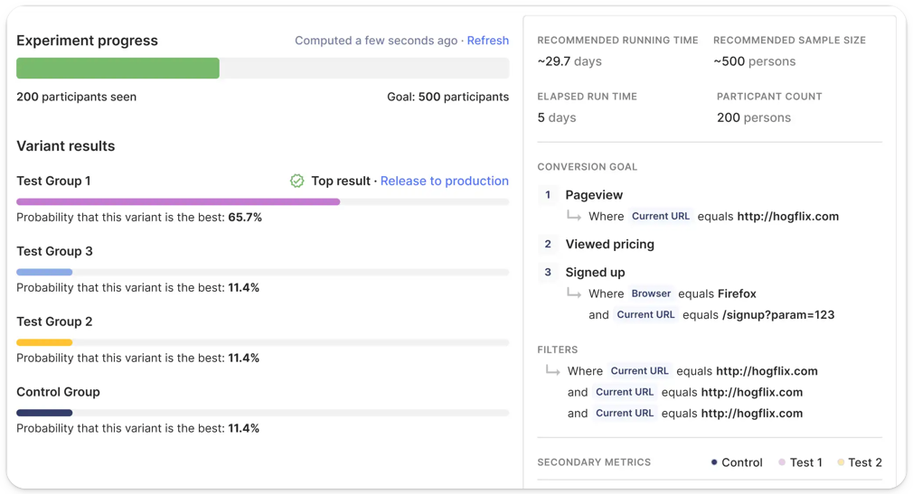

Passed in 1996, HIPAA (aka Health Insurance Portability and Accountability Act) defines the legal requirements for securing and handling health information, and the severe penalties for failing to do so.

Data protected under HIPAA is called Protected Health Information (PHI), or ePHI if it is digitized. It includes any data which can be used to identify the past, current or future health status of an individual. This obviously includes test results and diagnoses, but it can also cover birthdays, ethnicity, gender and other information. Even your IP address can be considered ePHI under HIPAA. 

One of the challenges for organizations affected by HIPAA is that it limits how data about customers can be gathered, stored and shared. 

In this article we’ll explore the best platforms for gathering and analyzing customer information in a way which complies with HIPAA. Many platforms which rely on third-party cookies, cannot be used under HIPAA regulations without either anonymizing data or signing BAA agreements. 

### What is a Business Associate Agreement (BAA)?

Some services enable HIPAA compliance through the creation of a [Business Associate Agreement, or BAA](https://www.hhs.gov/hipaa/for-professionals/covered-entities/sample-business-associate-agreement-provisions/index.html). This is essentially a contract with a service provider to ensure that they are jointly compliant and liable for services they provide. 

It's worth noting that, because BAAs expose third-parties to increased risk and scrutiny, they are often an expensive option and/or require users to purchase a higher tier of license than they may otherwise require. Additionally, not all organizations may offer BAAs at all. 

> If your business operates inside the EU, it’s worth checking out our article about [GDPR compliant analytics](/blog/best-gdpr-compliant-analytics-tools) to ensure you comply with both sets of regulations. 

## 1 [PostHog](/product-analytics)

PostHog is an all-in-one platform for building better products. Unlike other tools on this list, it offers a robust suite of tools, including product analytics, feature flags, A/B testing, user surveys, data pipelines, session replays, and more. 

We're biased, but we think it's pretty great - not least because you only need a single BAA to cover usages across all 8+ features. That means there's less risk, less overhead, and it's quicker to get setup. 

PostHog's product analytics suite offers a wide selection of tools, from funnel and path analysis to an SQL input for more advanced queries. Best of all, product analytics combines brilliantly with other parts of PostHog - you can, for example, jump straight from a funnel view to a list of session replays illustrating that journey. 

### Features & benefits

- All-in-one product stack with 8+ functions
- Only one BAA needed to cover multiple products
- Self-serve, no SQL required
- SOC 2 certified, GDPR-ready
- US & EU hosting available
- Open source

### Is PostHog HIPAA compliant?

PostHog offers Business Associate Agreements (BAA) to teams which need HIPAA complaince, enabling those teams to use all of PostHog's features until a single agreement. 

## 2. [Mixpanel](https://mixpanel.com/)

Mixpanel offers a suite of product analytics tools, including funnel and trend analysis. It lacks some specific features, such as Feature Flags, but offers a library of 50 plugins to extend functionality via integrations with other platforms. 

Mixpanel isn’t open source and can’t be deployed into a users’ own infrastructure. Instead, it must be deployed via the Cloud and data must be shared with Mixpanel directly, meaning [a BAA is required in order to use Mixpanel under HIPAA](https://mixpanel.com/legal/mixpanel-hipaa/). 

### Features & benefits

- Product analytics suite
- Group Analytics, for B2B organizations
- Self-serve, no SQL required
- SOC 2 certified

### Is Mixpanel HIPAA compliant?

Mixpanel isn’t HIPAA compliant out-of-the-box, but offers a Business Associate Agreement so that it can be used by organizations which need to remain compliant with HIPAA regulations. 

## Is Google Analytics HIPAA compliant?

The short answer is that, no, [Google Analytics is not HIPAA compliant](/blog/is-google-analytics-hipaa-compliant). 

According to [Google’s own disclaimers](https://support.google.com/analytics/answer/6366371?hl=en#hipaa&zippy=%2Cin-this-article), Google Analytics cannot be used for handling PHI or ePHI (including IP addresses) by _either_ covered entities or their third-party business associates: 

>Unless otherwise specified in writing by Google, Google does not intend uses of Google Analytics to create obligations under the Health Insurance Portability and Accountability Act, as amended, (“HIPAA”), and makes no representations that Google Analytics satisfies HIPAA requirements. If you are (or become) a Covered Entity or Business Associate under HIPAA, you may not use Google Analytics for any purpose or in any manner involving Protected Health Information unless you have received prior written consent to such use from Google.

Although [Google does offer a BAA for some services](https://support.google.com/a/answer/3407054?hl=en), such as Google Calendar and Google Keep, Google Analytics is not included on this list. In fact, [Google Analytics may even be illegal](https://isgoogleanalyticsillegal.com/) to use in some countries due to the way it collects and stores data.

## 3. [Countly](https://count.ly/)

Tailored to the needs of Internet Of Things (IoT) organizations, Countly’s product analytics platform offers tools such as multi-device user tracking and crash analytics. This makes it especially suited to hardware manufacturers, or teams who need to focus on debugging customer issues.

Countly isn’t open source - though it does offer a range of apps to increase extensibility and add features such as surveys, dashboards and funnel analysis. 

### Features & benefits

- User tracking across desktop, mobile and IOT devices
- Library of apps to extend functionality
- Push notifications and crash analytics

### Is Countly HIPAA compliant?
Yes. Countly can be deployed on to your own infrastructure, so that data doesn’t have to be sent to third-party services. BAA agreements may still be needed with hosting providers, however.

> Looking for HIPAA-compliant session recording tools as well? Read our guide to [best self-hosted session recording tools](/blog/best-open-source-session-replay-tools)

## 4. [Plausible](https://plausible.io/)

Another open-source analytics platform, Plausible is designed to help teams track basic website metrics such as pageviews and bounce rates. This pared-back focus means Plausible lacks the more powerful features included in PostHog, such as Feature Flags and Session Recording, but makes it suited to the needs of website managers. 

One benefit of Plausible’s approach is that it only requires a 1KB script in order to function and has a much smaller impact on page performance than Google Analytics. Again, because it’s open source (under an AGPL license), it can be tailored to the needs of your team and can be deployed on-premises.

Plausible is a good fit for website admins and includes integrations with both Slack and Google Search Console, but it lacks the more powerful features needed by Product or Engineering teams in larger organizations.

### Features & benefits

- Lightweight script with no need for cookies
- Minimal data collection for users
- No tracking across sessions, devices or sites

### Is Plausible HIPAA compliant?

Yes. Plausible can be hosted on your own infrastructure. It also collects minimal amounts of user data and only presents it in an anonymized, aggregated format. This is both a benefit and a drawback however, as it’s not possible to use Plausible to inspect the behavior or information of individual users. 

You may still need to create a BAA with your cloud hosting provider, as with any self-hosted solution.

## Is Google Analytics HIPAA compliant?

The short answer is that, no, [Google Analytics is not HIPAA compliant](/blog/is-google-analytics-hipaa-compliant). 

According to [Google’s own disclaimers](https://support.google.com/analytics/answer/6366371?hl=en#hipaa&zippy=%2Cin-this-article), Google Analytics cannot be used for handling PHI or ePHI (including IP addresses) by _either_ covered entities or their third-party business associates: 

>Unless otherwise specified in writing by Google, Google does not intend uses of Google Analytics to create obligations under the Health Insurance Portability and Accountability Act, as amended, (“HIPAA”), and makes no representations that Google Analytics satisfies HIPAA requirements. If you are (or become) a Covered Entity or Business Associate under HIPAA, you may not use Google Analytics for any purpose or in any manner involving Protected Health Information unless you have received prior written consent to such use from Google.

Although [Google does offer a BAA for some services](https://support.google.com/a/answer/3407054?hl=en), such as Google Calendar and Google Keep, Google Analytics is not included on this list. In fact, [Google Analytics may even be illegal](https://isgoogleanalyticsillegal.com/) to use in some countries due to the way it collects and stores data. 