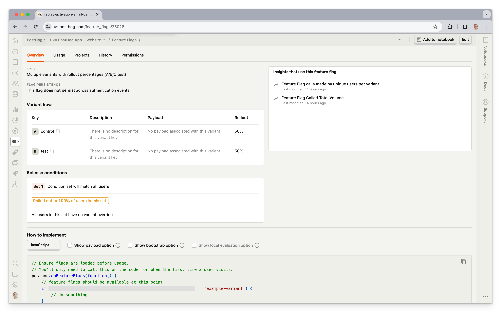
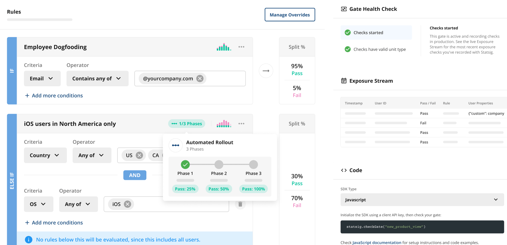
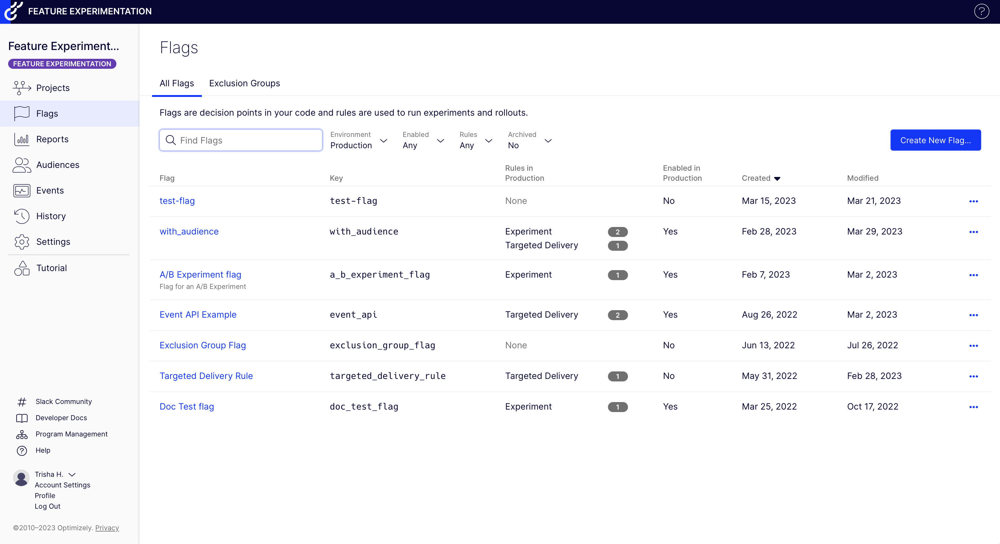
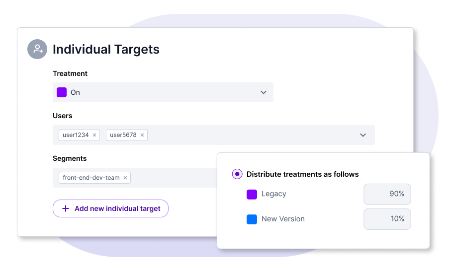
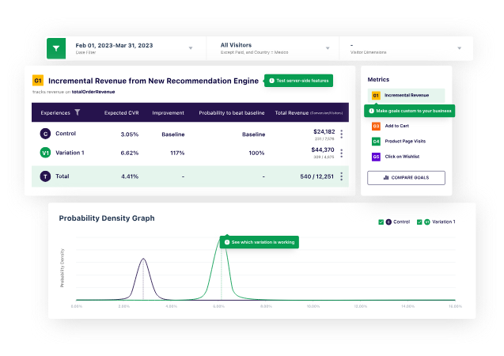
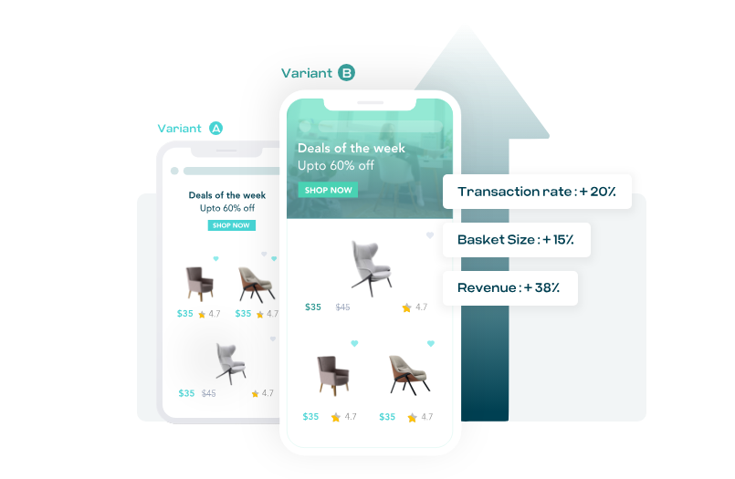
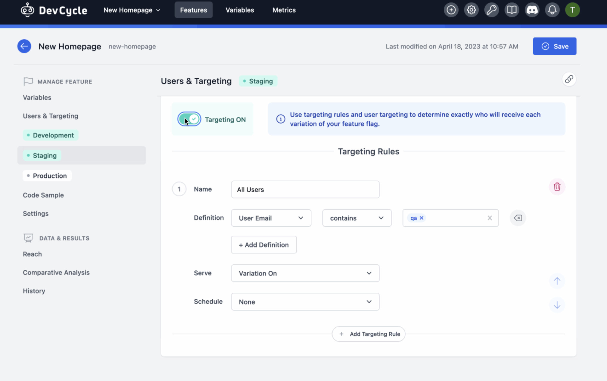
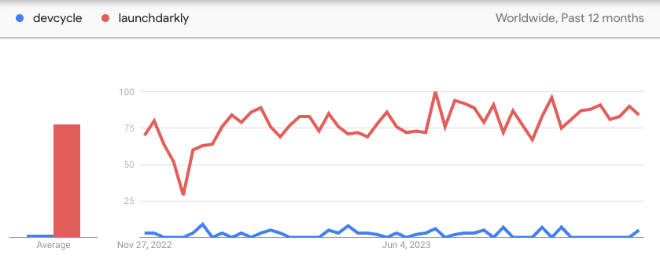

import { ComparisonTable } from 'components/ComparisonTable'
import { ComparisonRow } from 'components/ComparisonTable/row'

The most popular LaunchDarkly alternatives in 2024 are:

1. **PostHog:** An all-in-one platform combining feature flags and A/B testing with comprehensive analytics, session replay, and user surveys. Ideal for B2B SaaS apps.

2. **Statsig:** A platform for building better products with feature flags, experimentation, and analytics.

3. **Optimizely:** An all-in-one marketing system providing web and feature experimentation along with a huge suite of content and ecommerce tools.

4. **Split:** A feature flagging tool focused on observability and testing to help better release and manage features.

5. **VWO:** A digital experience optimization platform with tools for experimentation, observation, and personalization.

6. **AB Tasty:** A tool for optimizing brand and product experiences through experiments and personalization.

7. **DevCycle:** A developer-first feature flag platform with integrations into your existing workflows.

This guide covers:

- How these tools compare to LaunchDarkly.
- Which key LaunchDarkly features they support.
- What kind of users and companies use them, and why.

## 1. PostHog

- **Founded:** 2020
- **Similar to:** LaunchDarkly, Statsig
- **Typical users:** Engineers and product teams
- **Typical customers:** Mid-size B2Bs and startups

### What is PostHog?

[PostHog](/) (that's us 👋) is an open-source platform combining A/B testing, feature flags, product analytics, session replay, and user surveys into one product. This means it's not only an alternative to [LaunchDarkly](/blog/posthog-vs-launchdarkly) but also tools like [Mixpanel](/blog/posthog-vs-mixpanel) and Hotjar.

Typical PostHog users are engineers and product managers at startups and mid-size companies, particularly B2B companies. Customers include [AssemblyAI](/customers/assemblyai), [Hasura](/customers/hasura), [Vendasta](/customers/vendasta), and Airbus.

### Key features

- 🚩 **Feature flags:** Safely rollout features with [local evaluation](/docs/feature-flags/local-evaluation) (for faster performance), JSON payloads, and instant rollbacks.

- 🧪 **A/B tests:** Up to 9 test variations, primary and secondary metrics. Automatically calculate test duration, sample size, and statistical significance.

- 📈 **Product analytics:** Funnels, user paths, retention analysis, custom trends, and dynamic user cohorts. Also supports [SQL insights](/docs/product-analytics/sql) for power users.

- 💬 **Surveys:** Target surveys by event or user properties. Templates for [net promoter score (NPS)](/templates/nps-survey), [product-market fit (PMF)](/templates/pmf-survey) surveys, and more.

- 📺 **Session replays:** Including event timelines, console logs, network activity, and 90-day data retention.

### How does PostHog compare to LaunchDarkly?

The core features for feature flags and experimentation are similar between the two. The big difference is that PostHog is free, open-source, and self-serve, while LaunchDarkly has automations.

Also, for LaunchDarkly, features like integrations, API controls, and reusable segments are only available on its Pro plan. Much of its automation and governance functionality is only available on LaunchDarkly's Enterprise plans.

<ComparisonTable column1="PostHog" column2="LaunchDarkly">
  <ComparisonRow column1={true} column2={false} feature="Self-serve" description="Free to try, no mandatory sales calls" />
  <ComparisonRow column1={true} column2={true} feature="Feature flags" description="Deploy features safely with targeting and percentage rollouts" />
  <ComparisonRow column1={true} column2={true} feature="Advanced targeting" description="Target flags and A/B tests on segments and non-users" />
  <ComparisonRow column1={true} column2={true} feature="Local evaluation" description="Use local, cached flag values to increase speed" />
  <ComparisonRow column1={true} column2={true} feature="A/B testing" description="Run multivariate tests and see the impact of changes with custom goals and reports" />
  <ComparisonRow column1={true} column2={true} feature="Funnel tests" description="Use conversion funnels as goals for your A/B test" />
  <ComparisonRow column1={true} column2={false} feature="Advanced analytics" description="Custom SQL, paths, and retention analysis with flag data and beyond." />
  <ComparisonRow column1={true} column2={true} feature="Major SDKs" description="Pre-built SDKs for JavaScript, Python, iOS, Android, Go, and more" />
  <ComparisonRow column1={true} column2={true} feature="API" description="Evaluate and edit flags and A/B tests with an API" />
  <ComparisonRow column1={false} column2={true} feature="Automations" description="Trigger flag states based on schedules, triggers" />
  <ComparisonRow column1={true} column2={true} feature="Imports and exports" description="Import and export data to and from other popular tools" />
  <ComparisonRow column1={true} column2={true} feature="Governance" description="Audit log, roles-based access, permissions" />
  <ComparisonRow column1={true} column2={"SDKs"} feature="Open source" description="Audit code, contribute to roadmap, and build integrations" />
</ComparisonTable>

### How popular is PostHog?

According to [BuiltWith](https://trends.builtwith.com/analytics/PostHog), as of January 2024, 4,732 (0.5%) of the top 1 million websites deploy PostHog. This is much more popular than LaunchDarkly's 918, but this doesn't count mobile installs.

### Why do companies use PostHog?

According to [reviews on G2](https://www.g2.com/products/posthog/reviews), companies use PostHog because:

1. **It replaces multiple tools:** PostHog can replace [LaunchDarkly](/blog/posthog-vs-launchdarkly) (feature flags and A/B testing), Mixpanel (analytics), and Hotjar (feedback and surveys). This simplifies workflows and ensures all product is in one place.

2. **Pricing is transparent and scalable:** Reviewers appreciate how PostHog's pricing scales as they grow. There's a [generous free tier](/pricing) they can use forever. Companies eligible for [PostHog for Startups](/startups) also get $50k in additional free credits.

3. **They need a complete picture of users:** PostHog includes every tool necessary to understand users and improve products. This means creating funnels to track conversion, watching replays to see where users get stuck, testing solutions with A/B tests, and gathering feedback with user surveys.

> #### Bottom line
> Being free, self-serve, and sharing many of the same features, PostHog is a great alternative to LaunchDarkly. This is especially true for startups and scale-ups looking for all the product and data tools they need in one.

<ArrayCTA />

 

## 2. Statsig

- **Founded:** 2021
- **Similar to:** DevCycle, PostHog
- **Typical users:** Engineering and DevOps teams
- **Typical customers:** Engineering-focused B2B companies

### What is Statsig?

[Statsig](/blog/posthog-vs-statsig) provides tools like feature flags, experimentation, and analytics to help companies build better products. Teams use Statsig to take the risk out of releases, experiment with new features, and monitor changes.

It also includes a warehouse-native mode to connect directly and utilize your data warehouse, such as Snowflake.

### Key features

- ⛳ **Feature flags:** Take the risk out of releases with targeted feature flag rollouts.

- 🧪 **Experimentation:** Measure the impact of new changes with frequentist and Bayesian analysis engines.

- 📊 **Analytics:** Provides a single location for your metrics. Enables users to dive deeper into them with trends, bar charts, and retention analysis.

- 🏠 **Data warehouse:** Use Statsig with your existing data in your own warehouse. Generate insights and calculate impact using existing data.

### How does Statsig compare to LaunchDarkly?

Statsig has a similar feature set to LaunchDarkly, but includes built-in analytics and a warehouse-native mode. 

<ComparisonTable column1="Statsig" column2="LaunchDarkly">
  <ComparisonRow column1={true} column2={false} feature="Self-serve" description="Free to try, no mandatory sales calls" />
  <ComparisonRow column1={true} column2={true} feature="Feature flags" description="Deploy features safely with targeting and percentage rollouts" />
  <ComparisonRow column1={true} column2={true} feature="Advanced targeting" description="Target flags and A/B tests on segments and non-users" />
  <ComparisonRow column1={true} column2={true} feature="Local evaluation" description="Use local, cached flag values to increase speed" />
  <ComparisonRow column1={true} column2={true} feature="A/B testing" description="Run multivariate tests and see the impact of changes with custom goals and reports" />
  <ComparisonRow column1={false} column2={true} feature="Funnel tests" description="Use conversion funnels as goals for your A/B test" />
  <ComparisonRow column1={"Only retention"} column2={false} feature="Advanced analytics" description="Custom SQL, paths, and retention analysis with flag data and beyond." />
  <ComparisonRow column1={true} column2={true} feature="Major SDKs" description="Pre-built SDKs for JavaScript, Python, iOS, Android, Go, and more" />
  <ComparisonRow column1={true} column2={true} feature="API" description="Evaluate and edit flags and A/B tests with an API" />
  <ComparisonRow column1={true} column2={true} feature="Automations" description="Trigger flag states based on schedules, triggers" />
  <ComparisonRow column1={true} column2={true} feature="Imports and exports" description="Import and export data to and from other popular tools" />
  <ComparisonRow column1={true} column2={true} feature="Governance" description="Audit log, roles-based access, permissions" />
  <ComparisonRow column1={"SDKs"} column2={"SDKs"} feature="Open source" description="Audit code, contribute to roadmap, and build integrations" />
</ComparisonTable>

### How popular is Statsig?

According to [BuiltWith](https://trends.builtwith.com/analytics/Statsig), 648 of the top one million websites use Statsig. This slightly less than LaunchDarkly's 918.

### Why do companies use Statsig?

According to G2, users are big fans of Statsig because:

1. **Experiments-focused:** Statsig provides all the tools to run successful experiments. Reviewers write this enables them to ship faster and create an experimentation mindset.

2. **Responsiveness:** The Statsig team is responsive to user issues and concerns. Reviewers appreciate how helpful support is. 

3. **Documentation:** Thanks to the solid documentation of SDKs and features, in combination with a simple UX, reviewers find Statsig easy to set up and use.

> #### Bottom line
> For software teams looking to run more experiments and ship faster, Statsig is a solid alternative to LaunchDarkly. This is only helped by the ease of setup, documentation, and self-serve availability.

 

## 3. Optimizely

- **Founded:** 2010
- **Similar to:** VWO
- **Typical users:** Enterprise marketing, frontend teams
- **Typical customers:** Large retail, travel, and other B2C companies

### What is Optimizely?

[Optimizely](/blog/posthog-vs-optimizely) is an all-in-one set of tools for marketing. It helps businesses create the best possible digital experiences. It enables this through a combination of content management, marketing, web and feature experiments, and ecommerce optimization tools.

### Key features

- 🕸️ **Web experimentation:** Use Optimizely's visual editor and on-page previews to create frontend experiments quickly.

- 🧪 **Feature experimentation:** Run targeted experiments anywhere on your stack. View detailed reports on their impact.

- 🤹 **Project management:** Idea backlogs, workflows, and design tools to coordinate experiments and content.

- 📝 **Content management system:** Manage, deliver, and optimize your content in a centralized location.

- 💸 **Ecommerce optimization:** Customize checkout workflow along with CMS and experimentation to create the best possible commerce experience.

### How does Optimizely compare to LaunchDarkly?

When it comes to experimentation, Optimizely and LaunchDarkly have all the core features teams want. Beyond this, Optimizely has much more available like content and project management, while LaunchDarkly has greater depth in workflows. 

<ComparisonTable column1="Optimizely" column2="LaunchDarkly">
  <ComparisonRow column1={false} column2={false} feature="Self-serve" description="Free to try, no mandatory sales calls" />
  <ComparisonRow column1={true} column2={true} feature="Feature flags" description="Deploy features safely with targeting and percentage rollouts" />
  <ComparisonRow column1={true} column2={true} feature="Advanced targeting" description="Target flags and A/B tests on segments and non-users" />
  <ComparisonRow column1={true} column2={true} feature="Local evaluation" description="Use local, cached flag values to increase speed" />
  <ComparisonRow column1={true} column2={true} feature="A/B testing" description="Run multivariate tests and see the impact of changes with custom goals and reports" />
  <ComparisonRow column1={true} column2={true} feature="Funnel tests" description="Use conversion funnels as goals for your A/B test" />
  <ComparisonRow column1={false} column2={false} feature="Advanced analytics" description="Custom SQL, paths, and retention analysis with flag data and beyond." />
  <ComparisonRow column1={true} column2={true} feature="Major SDKs" description="Pre-built SDKs for JavaScript, Python, iOS, Android, Go, and more" />
  <ComparisonRow column1={true} column2={true} feature="API" description="Evaluate and edit flags and A/B tests with an API" />
  <ComparisonRow column1={true} column2={true} feature="Automations" description="Trigger flag states based on schedules, triggers" />
  <ComparisonRow column1={true} column2={true} feature="Imports and exports" description="Import and export data to and from other popular tools" />
  <ComparisonRow column1={true} column2={true} feature="Governance" description="Audit log, roles-based access, permissions" />
  <ComparisonRow column1={"SDKs"} column2={"SDKs"} feature="Open source" description="Audit code, contribute to roadmap, and build integrations" />
</ComparisonTable>

### How popular is Optimizely?

According to BuiltWith, 5,221 of the top million sites use [Optimizely](https://trends.builtwith.com/analytics/Optimizely) as of January 2024. This is much more than LaunchDarkly's 918. 

### Why do companies use Optimizely?

According to G2 reviews, people are fans of Optimizely because:

1. **User-friendly interface:** It is easy for reviewers to set up and manage experiments. The visual editor is praised as a big part of this.

2. **Integration with analytics platforms:** Optimizely doesn't have built-in analytics, but reviewers appreciate its integrations with Google Analytics, Adobe Analytics, and others.
 
3. **Business-oriented:** Optimizely focuses on optimizing business, marketing, and ecommerce use cases. It helps them improve the core business metrics they care about.

> #### Bottom line
> Optimizely has a larger feature set than LaunchDarkly but focuses less on feature flags specifically. Unless you want the CMS and commerce features it provides, it is unlikely a good alternative.

 

## 4. Split

- **Founded:** 2015
- **Similar to:** DevCycle, LaunchDarkly
- **Typical users:** Engineering teams
- **Typical customers:** Enterprise reliability-focused teams

### What is Split?

Split is a feature management platform combining feature flags with testing and observability to ship features safely and effectively. It cares more about preventing issues with monitoring than other LaunchDarkly alternatives.

### Key features

- ⛳ **Feature flags:** Create, target, and manage feature flags. Enables gradual releases and instant rollbacks.

- 🔍 **Observability:** A built-in attribution engine enables you to monitor the impact of features and catch issues.

- 🚧 **Alerts:** Automatically notify when issues and degradations occur connected to the related flags.

- 🧪 **Experimentation:** Test the impact of variants on key metrics from any source.

### How does Split compare to LaunchDarkly?

By focusing on feature flags and A/B testing, Split and LaunchDarkly have similar feature sets. Split provides more observability and testing tools, like alerts, while LaunchDarkly focuses more on automation and workflows. 

<ComparisonTable column1="Split" column2="LaunchDarkly">
  <ComparisonRow column1={true} column2={false} feature="Self-serve" description="Free to try, no mandatory sales calls" />
  <ComparisonRow column1={true} column2={true} feature="Feature flags" description="Deploy features safely with targeting and percentage rollouts" />
  <ComparisonRow column1={"Segments"} column2={true} feature="Advanced targeting" description="Target flags and A/B tests on segments and non-users" />
  <ComparisonRow column1={true} column2={true} feature="Local evaluation" description="Use local, cached flag values to increase speed" />
  <ComparisonRow column1={true} column2={true} feature="A/B testing" description="Run multivariate tests and see the impact of changes with custom goals and reports" />
  <ComparisonRow column1={true} column2={true} feature="Funnel tests" description="Use conversion funnels as goals for your A/B test" />
  <ComparisonRow column1={false} column2={false} feature="Advanced analytics" description="Custom SQL, paths, and retention analysis with flag data and beyond." />
  <ComparisonRow column1={true} column2={true} feature="Major SDKs" description="Pre-built SDKs for JavaScript, Python, iOS, Android, Go, and more" />
  <ComparisonRow column1={"Edit only"} column2={true} feature="API" description="Evaluate and edit flags and A/B tests with an API" />
  <ComparisonRow column1={false} column2={true} feature="Automations" description="Trigger flag states based on schedules, triggers" />
  <ComparisonRow column1={true} column2={true} feature="Imports and exports" description="Import and export data to and from other popular tools" />
  <ComparisonRow column1={true} column2={true} feature="Governance" description="Audit log, roles-based access, permissions" />
  <ComparisonRow column1={"SDKs"} column2={"SDKs"} feature="Open source" description="Audit code, contribute to roadmap, and build integrations" />
</ComparisonTable>

### How popular is Split?

According to [BuiltWith](https://trends.builtwith.com/analytics/Split), 173 of the top million sites use Split as of January 2024. This is roughly a third of LaunchDarkly's 918.

### Why do companies use Split?

According to G2, reviewers are big fans of Split because:

1. **Ease of setup:** Reviewers appreciate how easy Split is to set up thanks to their SDKs, guides, and user interface.

2. **More confident releases:** The tools Split provides, like easy feature kill switches, alerts, and monitoring enable reviewers to be confident in their feature releases.

3. **Intuitive interface:** Creating a new flag is simple, but Split maintains the depth more advanced users require as well. Reports are easy to understand.

> #### Bottom line
> Because it offers nearly the same features while being self-serve, Split makes for a great alternative to LaunchDarkly. For teams needing absolute confidence in their new features, Split's monitoring and alerting tools are a big help.

 

## 5. VWO

- **Founded:** 2009
- **Similar to:** Optimizely, LaunchDarkly
- **Typical users:** Product managers, engineers, UX designers
- **Typical customers:** Enterprise B2B and B2C companies optimizing customer experiences

### What is VWO?

VWO is a digital optimization platform that aims to maximize conversion with tools like A/B testing, personalization, funnels, heatmaps, session replay, and customer analytics.

The VWO platform is home to multiple different products including testing, insights, data, personalize, plan, and web rollouts.

### Key features

- **🧪 A/B testing:** Improve conversion with web, mobile, and server-side A/B testing.

- **💽 Data platform:** Collect and analyze custom data across your stack.

- **🤔 Insights:** Understand your users with session recordings, heatmaps, analytics, and surveys.

- **👔 Personalization:** Create and tailor user journeys and campaigns to the audience, location, and time.

- **📋 Planning:** Ideate and plan optimization campaigns in one location.

### How does VWO compare to LaunchDarkly?

Like Optimizely, VWO has a larger feature set than LaunchDarkly, but less of a focus on feature flags specifically.

<ComparisonTable column1="VWO" column2="LaunchDarkly">
  <ComparisonRow column1={true} column2={false} feature="Self-serve" description="Free to try, no mandatory sales calls" />
  <ComparisonRow column1={true} column2={true} feature="Feature flags" description="Deploy features safely with targeting and percentage rollouts" />
  <ComparisonRow column1={true} column2={true} feature="Advanced targeting" description="Target flags and A/B tests on segments and non-users" />
  <ComparisonRow column1={true} column2={true} feature="Local evaluation" description="Use local, cached flag values to increase speed" />
  <ComparisonRow column1={true} column2={true} feature="A/B testing" description="Run multivariate tests and see the impact of changes with custom goals and reports" />
  <ComparisonRow column1={true} column2={true} feature="Funnel tests" description="Use conversion funnels as goals for your A/B test" />
  <ComparisonRow column1={false} column2={false} feature="Advanced analytics" description="Custom SQL, paths, and retention analysis with flag data and beyond." />
  <ComparisonRow column1={true} column2={true} feature="Major SDKs" description="Pre-built SDKs for JavaScript, Python, iOS, Android, Go, and more" />
  <ComparisonRow column1={"Edit only"} column2={true} feature="API" description="Evaluate and edit flags and A/B tests with an API" />
  <ComparisonRow column1={false} column2={true} feature="Automations" description="Trigger flag states based on schedules, triggers" />
  <ComparisonRow column1={true} column2={true} feature="Imports and exports" description="Import and export data to and from other popular tools" />
  <ComparisonRow column1={true} column2={true} feature="Governance" description="Audit log, roles-based access, permissions" />
  <ComparisonRow column1={"SDKs"} column2={"SDKs"} feature="Open source" description="Audit code, contribute to roadmap, and build integrations" />
</ComparisonTable>

### How popular is VWO?

According to [BuiltWith](https://trends.builtwith.com/analytics/Visual-Website-Optimizer), 8,457 of the top million sites use VWO as of January 2024. This is nearly ten times more than LaunchDarkly's 918.

### Why do companies use VWO?

Reviewers on G2 are big fans of VWO for these reasons:

1. **Support:** VWO's support staff are knowledgable, helpful, and responsive, making a positive impression on reviewers.

2. **Multi-function:** Reviewers like they can combine A/B tests with surveys, funnels, session replays, and analysis tools.

3. **Becoming data-driven:** VWO enables technical and non-technical to make more and better data-driven decisions. 

> #### Bottom line
> If you're a massive enterprise looking for all the optimization tools VWO offers, it's a solid alternative. If you are smaller or product-focused, there are likely better options.

 

## 6. AB Tasty

- **Founded:** 2013
- **Similar to:** VWO
- **Typical users:** Marketing and product teams
- **Typical customers:** Large retail and entertainment companies

### What is AB Tasty?

A/B Tasty is a suite of tools for optimizing brand and product experiments. This includes experimentation, personalization, and recommendations. It helps teams build better end-to-end digital user experiences, especially focused on retail, entertainment, and ecommerce.

### Key features

- 🌐 **Web experimentation:** Run A/B and multivariate tests easily with low/no-code tools.

- 🧪 **Feature experimentation:** Test new features in production for server-side or mobile apps.

- 🫂 **Personalization:** Create personalized experiences with audience builder and segmentation tools.

- 🛼 **Rollouts:** Use feature flags to progressively deliver, manage, and rollback new features.

- 🙋‍♂️ **Recommendations:** Show the right products at the right time in customers' journey.

### How does AB Tasty compare to LaunchDarkly?

AB Tasty has many similar features to LaunchDarkly but lacks the depth. For example, it's missing conversion funnel A/B tests, API evaluation, automation, and more. It makes up for this in the other optimization tools its platform includes.

<ComparisonTable column1="AB Tasty" column2="LaunchDarkly">
  <ComparisonRow column1={false} column2={false} feature="Self-serve" description="Free to try, no mandatory sales calls" />
  <ComparisonRow column1={true} column2={true} feature="Feature flags" description="Deploy features safely with targeting and percentage rollouts" />
  <ComparisonRow column1={true} column2={true} feature="Advanced targeting" description="Target flags and A/B tests on segments and non-users" />
  <ComparisonRow column1={true} column2={true} feature="Local evaluation" description="Use local, cached flag values to increase speed" />
  <ComparisonRow column1={true} column2={true} feature="A/B testing" description="Run multivariate tests and see the impact of changes with custom goals and reports" />
  <ComparisonRow column1={false} column2={true} feature="Funnel tests" description="Use conversion funnels as goals for your A/B test" />
  <ComparisonRow column1={false} column2={false} feature="Advanced analytics" description="Custom SQL, paths, and retention analysis with flag data and beyond." />
  <ComparisonRow column1={true} column2={true} feature="Major SDKs" description="Pre-built SDKs for JavaScript, Python, iOS, Android, Go, and more" />
  <ComparisonRow column1={"Edit only"} column2={true} feature="API" description="Evaluate and edit flags and A/B tests with an API" />
  <ComparisonRow column1={false} column2={true} feature="Automations" description="Trigger flag states based on schedules, triggers" />
  <ComparisonRow column1={true} column2={true} feature="Imports and exports" description="Import and export data to and from other popular tools" />
  <ComparisonRow column1={"No audit"} column2={true} feature="Governance" description="Audit log, roles-based access, permissions" />
  <ComparisonRow column1={"SDKs"} column2={"SDKs"} feature="Open source" description="Audit code, contribute to roadmap, and build integrations" />
</ComparisonTable>

### How popular is AB Tasty?

As of January 2024, 2,280 of the top million sites use AB Tasty according to [BuiltWith](https://trends.builtwith.com/analytics/AB-Tasty). This is nearly three times more than LaunchDarkly's 918. 

### Why do companies use AB Tasty?

According to G2 reviews, users choose AB Tasty for the following reasons:

1. **Ease-of-use:** Non-technical users can create and manage simple A/B tests using the visual editor. The reports also praise how simple and intuitive the entire platform is. 

2. **Support:** AB Tasty's customer support receives high praise. They even provide an option to help you with recommendations and implementation (for a cost) if you need it.

3. **Widgets:** Reviewers enjoy AB Tasty's collection of pre-built widgets such as alerts, banners, and modals to help personalize experiences.

> #### Bottom line
> A/B Tasty has some useful tools for experience optimization but is missing the depth LaunchDarkly has. If you're a retail and entertainment company, it might be a good alternative, but if not, there are likely better alternatives.

 

## 7. DevCycle

- **Founded:** 2022
- **Similar to:** Split
- **Typical users:** Development teams
- **Typical customers:** All stages of B2B software companies

### What is DevCycle?

DevCycle is a startup launched out of Taplytics, another A/B testing platform. It is a feature flag management platform built for developers and designed for speed. It highlights its suite of dev tool integrations, CLI, and simple interface.  

### Key features

- 🏁 **Feature flags:** Easily and safely rollout and rollback features to deploy faster and reduce risk. Use automation to put an end to manual changes.

- 🤝 **Integrations:** Combine with the tools you are already using for your workflow like GitHub, Terraform, Datadog, and Jira.

- 🧪 **A/B testing:** Run experiments and evaluate the impact of new features. Do multi-armed bandits to compare variations.

- 🧑‍💻 **Developer-focused:** Features like a server-less architecture, edge decisioning support, and a wide API help developers make full use of DevCycle.

### How does DevCycle compare to LaunchDarkly?

DevCycle has many of the core A/B testing and feature flagging features but misses out on some of the more advanced features of LaunchDarkly.

<ComparisonTable column1="DevCycle" column2="LaunchDarkly">
  <ComparisonRow column1={true} column2={false} feature="Self-serve" description="Free to try, no mandatory sales calls" />
  <ComparisonRow column1={true} column2={true} feature="Feature flags" description="Deploy features safely with targeting and percentage rollouts" />
  <ComparisonRow column1={"Segments"} column2={true} feature="Advanced targeting" description="Target flags and A/B tests on segments and non-users" />
  <ComparisonRow column1={true} column2={true} feature="Local evaluation" description="Use local, cached flag values to increase speed" />
  <ComparisonRow column1={true} column2={true} feature="A/B testing" description="Run multivariate tests and see the impact of changes with custom goals and reports" />
  <ComparisonRow column1={false} column2={true} feature="Funnel tests" description="Use conversion funnels as goals for your A/B test" />
  <ComparisonRow column1={false} column2={false} feature="Advanced analytics" description="Custom SQL, paths, and retention analysis with flag data and beyond." />
  <ComparisonRow column1={true} column2={true} feature="Major SDKs" description="Pre-built SDKs for JavaScript, Python, iOS, Android, Go, and more" />
  <ComparisonRow column1={"Edit only"} column2={true} feature="API" description="Evaluate and edit flags and A/B tests with an API" />
  <ComparisonRow column1={true} column2={true} feature="Automations" description="Trigger flag states based on schedules, triggers" />
  <ComparisonRow column1={"Exports only"} column2={true} feature="Imports and exports" description="Import and export data to and from other popular tools" />
  <ComparisonRow column1={"No audit log"} column2={true} feature="Governance" description="Audit log, roles-based access, permissions" />
  <ComparisonRow column1={"SDKs"} column2={"SDKs"} feature="Open source" description="Audit code, contribute to roadmap, and build integrations" />
</ComparisonTable>

### How popular is DevCycle?

BuiltWith doesn't have data on DevCycle's usage, but we can use [Google Trends](https://trends.google.com/trends/explore?q=devcycle,launchdarkly) as a proxy. According to them, LaunchDarkly is 10-20x more popular than DevCycle.

### Why do companies use DevCycle?

According to G2, reviewers appreciate DevCycle's:

1. **Pricing:** Unlike other tools listed, DevCycle reviewers praise its fair pricing and say it provides great value.

2. **Simplicity:** DevCycle makes it easy for reviews to get feature flags set up and start improving their feature management process.

3. **Integrations:** The fact that DevCycle integrates with GitHub and Jira helps developer workflow. 

> #### Bottom line
> For developers looking for basic feature flags and experimentation tools, DevCycle is a solid choice. Unfortunately, DevCycle lacks the feature maturity of many of the other options.

 

## Is PostHog right for you?

Here's the (short) sales pitch.

We're biased, obviously, but we think PostHog is the perfect LaunchDarkly replacement if:

- You value transparency (we're open source and open core)
- You want more than just A/B testing and flags (we have a full suite of product analytics, session replays, and surveys).
- You want to try before you buy (we're self-serve with a [generous free tier](/pricing))

Check out [our product pages](/product-analytics) and [read our docs](/docs) to learn more.

<ArrayCTA />