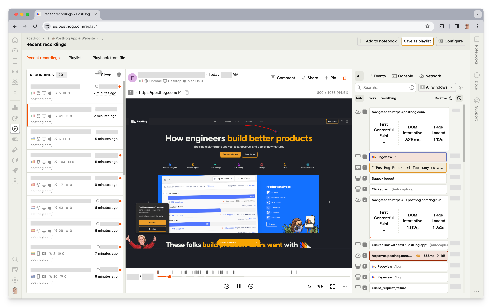
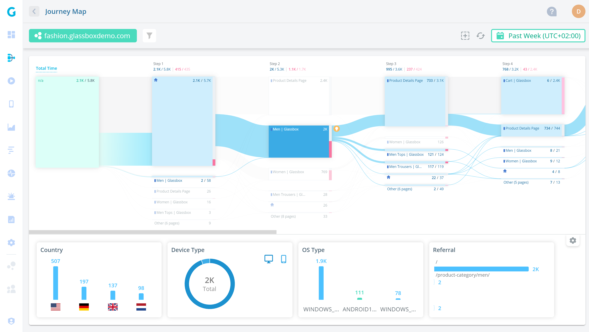
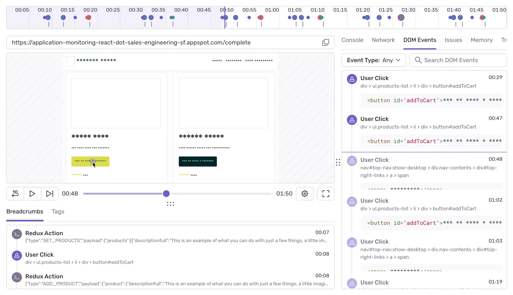
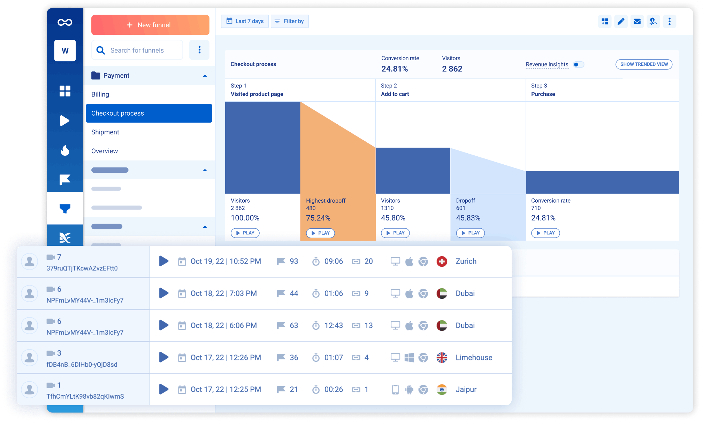
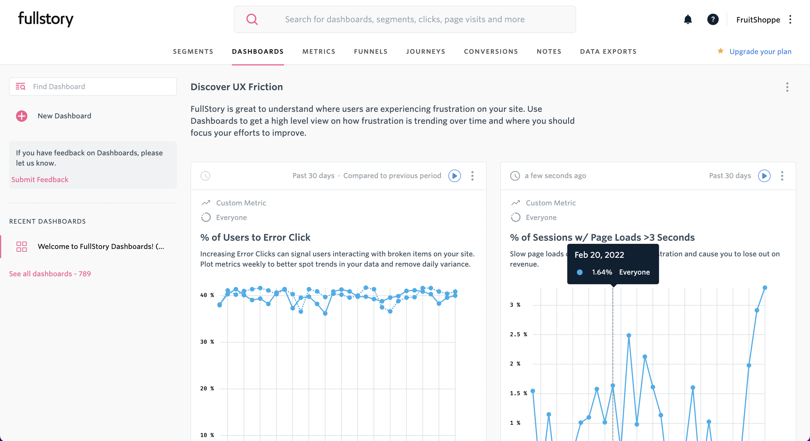
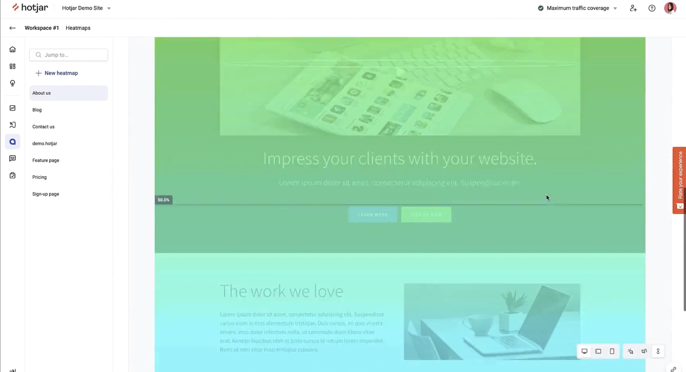

import { ComparisonTable } from 'components/ComparisonTable'
import { ComparisonRow } from 'components/ComparisonTable/row'

## 1. PostHog

- **Founded:** 2020
- **Similar to:** LogRocket, Smartlook
- **Typical users:** Engineers and product teams
- **Typical customers:** Mid-size B2Bs and startups

### What is PostHog?

[PostHog](/) (that's us 👋) is an open-source platform combining product analytics, session replay, feature flags, A/B testing, and user surveys into one product. This means it's not just an alternative to LogRocket, but also tools like [LaunchDarkly](/blog/posthog-vs-launchdarkly) and [Amplitude](/blog/posthog-vs-amplitude).

Typical PostHog users are engineers and product managers at startups and mid-size companies, particularly B2B companies. Customers include [AssemblyAI](/customers/assemblyai), [Hasura](/customers/hasura), [Vendasta](/customers/vendasta), and Airbus.

### Key features

- 📈 **Product analytics:** Funnels, user paths, retention analysis, custom trends, and dynamic user cohorts. Also supports SQL insights for power users.

- 📺 **Session replays:** Including event timelines, console logs, network activity, and 90-day data retention.

- 🚩 **Feature flags** with local evaluation (for faster performance) and JSON payloads.

- 🧪 **A/B tests:** Up to 9 test variations, primary and secondary metrics. Automatically calculate test duration, sample size, and statistical significance.

- 💬 **Surveys:** Target surveys by event or user properties. Templates for Net Promoter Score (NPS), product-market fit (PMF) surveys, and more.

### How does PostHog compare to LogRocket?

PostHog has more tools for shipping new features and understanding their impact, while LogRocket focuses on surfacing issues and errors with your app's experience.

<ComparisonTable column1="PostHog" column2="LogRocket">
  <ComparisonRow column1={true} column2={true} feature="Self-serve" description="Free to try, no mandatory sales calls" />
  <ComparisonRow column1={true} column2={true} feature="Session replay" description="Watch real users use your product; diagnose bugs" />
  <ComparisonRow column1={true} column2={true} feature="Heatmaps" description="See where users click and interact" />
  <ComparisonRow column1={true} column2={true} feature="Product analytics" description="Custom trends, funnels, paths, and retention analysis" />
  <ComparisonRow column1={true} column2={true} feature="Autocapture" description="Capture events without manual instrumentation" />
  <ComparisonRow column1={true} column2={false} feature="Group analytics" description="Track metrics at the account or company level" />
  <ComparisonRow column1={true} column2={false} feature="A/B testing" description="Test changes and analyze their impact" />
  <ComparisonRow column1={true} column2={true} feature="Performance monitoring" description="Track core web vitals, server usage, and network performance." />
  <ComparisonRow column1={false} column2={true} feature="Error monitoring" description="Capture exceptions and failures automatically" />
  <ComparisonRow column1={false} column2={true} feature="Issue management" description="Score issues, triage, monitor app health" />
  <ComparisonRow column1={false} column2={true} feature="Alerting" description="Set alerts on metric thresholds or anomalies" />
  <ComparisonRow column1={true} column2={false} feature="Open source" description="Build your own apps and contribute code" />
</ComparisonTable>

### How popular is PostHog?

According to [BuiltWith](https://trends.builtwith.com/analytics/PostHog), PostHog is much more popular than LogRocket. As of January 2024, 4,732 (0.5%) of the top 1 million websites deploy PostHog, over triple LogRocket's 1,104 (0.1%).

### Why do companies use PostHog?

According to [reviews on G2](https://www.g2.com/products/posthog/reviews), companies use PostHog because:

1. **It replaces multiple tools:** PostHog can replace LogRocket (session replay and analytics), LaunchDarkly (feature flags and A/B testing), and Hotjar (feedback and surveys). This simplifies workflows and ensures all their data is in one place.

2. **Pricing is transparent and scalable:** Reviewers appreciate how PostHog's pricing scales as they grow. There's a [generous free tier](/pricing). Companies eligible for [PostHog for Startups](/startups) also get $50k in additional free credits.

3. **They need a complete picture of users:** PostHog includes every tool necessary to understand users and improve products. This means creating funnels to track conversion, watching replays to see where users get stuck, testing solutions with A/B tests, and gathering feedback with user surveys.

> #### Bottom line
>
> LogRocket focuses on helping teams fix issues with their product, while PostHog focuses on helping teams build a successful product. PostHog is a great alternative because it includes most of the features of LogRocket, with less of a focus on errors and more on A/B testing and surveys.

<ArrayCTA />

 

## 2. Glassbox

- **Founded:** 2010
- **Most similar to:** FullStory, PostHog
- **Typical users:** Business analysts, product support, marketers
- **Typical customers:** Enterprise B2C companies, retail, and financial services

### What is Glassbox?

Glassbox is a session replay and analytics platform with a particular focus on mobile apps and e-commerce use cases. Customers include UK retailer Sainsbury's, Marriott, and Experian.

Glassbox is predominantly used by business analysts and support teams in enterprise B2C companies. 

### Key features

- 📹 **Session replay:** Watch and analyze real user sessions on web and mobile apps.

- 📊 **Product analytics:** Understand user paths and struggle points.

- 🏎️ **Performance analytics:** Track app performance and its impact on conversion rates.

- 🔥 **Click, scroll, and heatmaps:** Understand where users interact with your app.

- ✅ **User feedback:** Gather satisfaction and user feedback on the app experience.

### How does Glassbox compare to LogRocket?

On a feature-by-feature basis, Glassbox and LogRocket are nearly identical. Glassbox even automatically identifies trouble areas in your app, similar to LogRocket's issue monitoring and triaging. The big difference is Glassbox's focus on mobile and lack of error tracking. 

<ComparisonTable column1="Glassbox" column2="LogRocket">
  <ComparisonRow column1={false} column2={true} feature="Self-serve" description="Free to try, no mandatory sales calls" />
  <ComparisonRow column1={true} column2={true} feature="Session replay" description="Watch real users use your product; diagnose bugs" />
  <ComparisonRow column1={true} column2={true} feature="Heatmaps" description="See where users click and interact" />
  <ComparisonRow column1={true} column2={true} feature="Product analytics" description="Custom trends, funnels, paths, and retention analysis" />
  <ComparisonRow column1={true} column2={true} feature="Autocapture" description="Capture events without manual instrumentation" />
  <ComparisonRow column1={false} column2={false} feature="Group analytics" description="Track metrics at the account or company level" />
  <ComparisonRow column1={false} column2={false} feature="A/B testing" description="Test changes and analyze their impact" />
  <ComparisonRow column1={true} column2={true} feature="Performance monitoring" description="Track core web vitals, server usage, and network performance." />
  <ComparisonRow column1={false} column2={true} feature="Error monitoring" description="Capture exceptions and failures automatically" />
  <ComparisonRow column1={true} column2={true} feature="Issue management" description="Score issues, triage, monitor app health" />
  <ComparisonRow column1={true} column2={true} feature="Alerting" description="Set alerts on metric thresholds or anomalies" />
  <ComparisonRow column1={false} column2={false} feature="Open source" description="Build your own apps and contribute code" />
</ComparisonTable>

### How popular is Glassbox?

As of January 2024, just 386 of the top 1 million websites deploy Glassbox. This is a quarter of LogRocket's 1,104.

That said, Glassbox's focus on mobile apps isn't reflected in these figures.

### Why do companies use Glassbox?

According to G2 reviews, customers use Glassbox for:

1. **Session replay and error analysis:** Glassbox is best known for its session replay features, so this is the most popular use case. Customers use Glassbox to analyze user journeys and identify app-breaking bugs.

2. **Heatmap and funnel analysis:** Users like the heatmaps feature, which enables them to see user preferences on key pages. They combine this with paths and funnels to see the entire journey.

3. **Fixing low conversion and abandonment:** Glassbox is popular among online retailers, who use it to solve issues with conversion and basket abandonment. Their struggle scores are a popular feature for figuring this out.

> #### Bottom line
>
> Glassbox is the closest feature-for-feature alternative to LogRocket with more of a focus on mobile. Glassbox makes sense for large B2C and ecommerce companies looking for similar functionality to LogRocket.

 

## 3. Sentry

- **Founded:** 2012
- **Most similar to:** LogRocket, Glassbox
- **Typical users:** Developers, infrastructure teams
- **Typical customers:** B2C and B2B SaaS software with complicated products.

### What is Sentry?

Sentry is an error tracking and application monitoring platform providing tools to help prevent broken code, crashes, and other issues. All the tools engineering teams need to identify bugs, monitor performance, and debug slow queries.

### Key features

- 📹 **Session replay:** See all the details of an issue with context like DOM events, console logs, and network calls.

- ➡️ **Tracing:** Identify performance issues with an end-to-end distributed trace to see how calls and queries do across the stack.

- ⚠️ **Error tracking:** Capture errors and events leading up to them to make reproduction and fixes simpler.

- 🏎️ **Performance monitoring:** See how your app and queries perform. Find and fix slow areas.

- 1️⃣ **Release tracking:** Connect issues to releases. Gives the context to making debugging easier.

### How does Sentry compare to LogRocket?

Both Sentry and LogRocket focus on mitigating and fixing issues with your application. LogRocket has more tools for non-technical users to do this, like heatmaps and product analytics.

<ComparisonTable column1="Sentry" column2="LogRocket">
  <ComparisonRow column1={true} column2={true} feature="Self-serve" description="Free to try, no mandatory sales calls" />
  <ComparisonRow column1={true} column2={true} feature="Session replay" description="Watch real users use your product; diagnose bugs" />
  <ComparisonRow column1={false} column2={true} feature="Heatmaps" description="See where users click and interact" />
  <ComparisonRow column1={false} column2={true} feature="Product analytics" description="Custom trends, funnels, paths, and retention analysis" />
  <ComparisonRow column1={false} column2={true} feature="Autocapture" description="Capture events without manual instrumentation" />
  <ComparisonRow column1={false} column2={false} feature="Group analytics" description="Track metrics at the account or company level" />
  <ComparisonRow column1={false} column2={false} feature="A/B testing" description="Test changes and analyze their impact" />
  <ComparisonRow column1={true} column2={true} feature="Performance monitoring" description="Track core web vitals, server usage, and network performance." />
  <ComparisonRow column1={true} column2={true} feature="Error monitoring" description="Capture exceptions and failures automatically" />
  <ComparisonRow column1={true} column2={true} feature="Issue management" description="Score issues, triage, monitor app health" />
  <ComparisonRow column1={true} column2={true} feature="Alerting" description="Set alerts on metric thresholds or anomalies" />
  <ComparisonRow column1={true} column2={false} feature="Open source" description="Build your own apps and contribute code" />
</ComparisonTable>

### How popular is Sentry?

According to data from [BuiltWith](https://trends.builtwith.com/javascript/Sentry), as of January 2024, 63,463 of the top 1 million sites use Sentry, much more than LogRocket's 1,104.

### Why do companies use Sentry?

G2 reviews are big fans of these three benefits of Sentry:

1. **Fix bugs fast:** Understand where issues are happening and get the context to solve them fast. Sentry enables developers to figure out what is happening and where.

2. **Auto tracking:** Track performance, errors, crashes, and performance automatically. Developers are more confident they understand when errors and performance issues are happening. 

3. **Comprehensive:** All the tools developers need to debug, find issues, and improve their applications. All this information is invaluable for developers when it comes to building a high-quality app.

> #### Bottom line
>
> Sentry focuses entirely on error tracking and application monitoring tools, it doesn't include the product tools LogRocket has and isn't as friendly to non-technical users.

 

## 4. Smartlook

- **Founded:** 2016
- **Most similar to:** LogRocket, Glassbox
- **Typical users:** Engineers, business analysts, product managers
- **Typical customers:** Enterprise retail and ecommerce websites and apps

### What is Smartlook?

Smartlook is an analytics platform combining session replays with product analytics, visualizations, and crash reports to generate user insights. Focuses more on mobile apps with specific tools like mobile heatmaps.

### Key features

- 📹 **Session recordings:** Understand how users are actually using your app and where issues occur.

- 📊 **Event-based analytics:** See how often users behave in the ways important to you.

- 🔥 **Heatmaps:** Figure out what parts of the page users click and scroll to.

- 🛣️ **Funnels and paths:** See how users move through your app with custom visuals for key flows.

- 📉 **Crash reports:** Learn what happens before a crash without reproduction.

### How does Smartlook compare to LogRocket?

Smartlook's combination of session replay and analytics with a focus on issues is very similar to LogRocket. LogRocket has more tools for monitoring and error tracking, however.

<ComparisonTable column1="Smartlook" column2="LogRocket">
  <ComparisonRow column1={true} column2={true} feature="Self-serve" description="Free to try, no mandatory sales calls" />
  <ComparisonRow column1={true} column2={true} feature="Session replay" description="Watch real users use your product; diagnose bugs" />
  <ComparisonRow column1={true} column2={true} feature="Heatmaps" description="See where users click and interact" />
  <ComparisonRow column1={true} column2={true} feature="Product analytics" description="Custom trends, funnels, paths, and retention analysis" />
  <ComparisonRow column1={true} column2={true} feature="Autocapture" description="Capture events without manual instrumentation" />
  <ComparisonRow column1={false} column2={false} feature="Group analytics" description="Track metrics at the account or company level" />
  <ComparisonRow column1={false} column2={false} feature="A/B testing" description="Test changes and analyze their impact" />
  <ComparisonRow column1={false} column2={true} feature="Performance monitoring" description="Track core web vitals, server usage, and network performance." />
  <ComparisonRow column1={false} column2={true} feature="Error monitoring" description="Capture exceptions and failures automatically" />
  <ComparisonRow column1={false} column2={true} feature="Issue management" description="Score issues, triage, monitor app health" />
  <ComparisonRow column1={true} column2={true} feature="Alerting" description="Set alerts on metric thresholds or anomalies" />
  <ComparisonRow column1={false} column2={false} feature="Open source" description="Build your own apps and contribute code" />
</ComparisonTable>

### How popular is Smartlook?

According to [BuiltWith](https://trends.builtwith.com/analytics/Smartlook), as of January 2024, 3,186 of the top 1 million websites use Smartlook. This is more than LogRocket's 1,104.

### Why do companies use Smartlook?

According to G2 reviewers, Smartlook users benefit from:

1. **The integration between replays and events:** Smartlook connects event-based analytics and sessions. This enables users to dive deeper into user behavior than a single tool would provide.

2. **Understanding visitor pain points:** The analytics and visualizations make it easy to understand where users are running into trouble. Fixing these areas improves user experience and conversion. 

3. **Real user monitoring:** See how real users are using your app and monitor the quality of their experiences. Figure out what areas are confusing or not being used properly.

> #### Bottom line
>
> Smartlook focuses on a subset of LogRocket's functionality, but it is a strong alternative for apps and websites looking for session replay and product analytics.

 

## 5. FullStory

- **Founded:** 2012
- **Most similar to:** PostHog, Glassbox
- **Typical users:** Product managers, customer success, and support
- **Typical customers:** Online retailers and SaaS companies

### What is FullStory?

[FullStory](/blog/best-fullstory-alternatives) describes itself as Digital Experience Intelligence, which is code for session replay and mobile app analytics, with a side of product analytics. Like LogRocket and PostHog, it supports event autocapture, so you don't have to manually code every event you want to capture.

### Key features

- 📹 **Session replay:** Watch and analyze real user sessions on web and mobile apps.

- 📊 **Product analytics:** Understand user paths and struggle points.

- 📈 **Event autocapture:** Tagless event capture that ensures the tracking of all events.

- 🔥 **Heatmaps:** Find out where users click and frustration points.

- 📱 **Mobile app analytics:** Crash analytics and user path analysis.

### How does FullStory compare to LogRocket?

Both FullStory and LogRocket have tools to understand user experience, but LogRocket captures more data on errors and issues.

<ComparisonTable column1="FullStory" column2="LogRocket">
  <ComparisonRow column1={false} column2={true} feature="Self-serve" description="Free to try, no mandatory sales calls" />
  <ComparisonRow column1={true} column2={true} feature="Session replay" description="Watch real users use your product; diagnose bugs" />
  <ComparisonRow column1={true} column2={true} feature="Heatmaps" description="See where users click and interact" />
  <ComparisonRow column1={true} column2={true} feature="Product analytics" description="Custom trends, funnels, paths, and retention analysis" />
  <ComparisonRow column1={true} column2={true} feature="Autocapture" description="Capture events without manual instrumentation" />
  <ComparisonRow column1={false} column2={false} feature="Group analytics" description="Track metrics at the account or company level" />
  <ComparisonRow column1={false} column2={false} feature="A/B testing" description="Test changes and analyze their impact" />
  <ComparisonRow column1={true} column2={true} feature="Performance monitoring" description="Track core web vitals, server usage, and network performance." />
  <ComparisonRow column1={false} column2={true} feature="Error monitoring" description="Capture exceptions and failures automatically" />
  <ComparisonRow column1={false} column2={true} feature="Issue management" description="Score issues, triage, monitor app health" />
  <ComparisonRow column1={true} column2={true} feature="Alerting" description="Set alerts on metric thresholds or anomalies" />
  <ComparisonRow column1={false} column2={false} feature="Open source" description="Build your own apps and contribute code" />
</ComparisonTable>

### How popular is FullStory?

According to data from [BuiltWith](https://trends.builtwith.com/analytics/FullStory), as of January 2024, 8,430 of the top 1 million websites in the world deploy FullStory. This is much more than LogRocket's 1,104.

### Why do companies use FullStory?

According to reviews on G2, companies use FullStory for:

1. **Easier collaboration:** As an accessible tool for non-technical users, FullStory facilitates collaboration between product, UX, and engineering teams by allowing all teams to access useful, reliable data.

2. **Viewing user issues:** Support teams use FullStory to replay sessions to understand user hard-to-replicate problems, and identify bugs that need fixing.

3. **Improving conversion:** FullStory users like to combine funnel insights with replays of user sessions to understand pain points and improve conversion.

> #### Bottom line
>
> FullStory is a mature product with many of the same features as LogRocket. It's great for ecommerce companies who care less about the error tracking depth of LogRocket.

 

## 6. Pendo

- **Founded:** 2013
- **Most similar to:** PostHog, Hotjar
- **Typical users:** Product managers and customer success teams
- **Typical customers:** Small and mid-market B2C apps

### What is Pendo?

[Pendo](/blog/best-pendo-alternatives) describes itself as a product experience platform. In addition to product analytics, it offers session replay, in-app guides, user feedback, and product validation tools.

### Key features

- 📊 **Product analytics:** Funnels, trends, and retention analysis with event autocapture.

- 🦮 **In-app guides:** Deliver personalized guidance to customers, directly inside your app.

- 📝 **User feedback:** Capture and analyze customer feedback at scale.

- 🗺️ **Product validation and roadmaps:** Plan your product improvements and roadmap using data from Pendo.

### How does Pendo compare to LogRocket?

Pendo focuses more on in-app guides and feedback. It doesn't have the monitoring and error tracking LogRocket has.

<ComparisonTable column1="Pendo" column2="LogRocket">
  <ComparisonRow column1={true} column2={true} feature="Self-serve" description="Free to try, no mandatory sales calls" />
  <ComparisonRow column1={true} column2={true} feature="Session replay" description="Watch real users use your product; diagnose bugs" />
  <ComparisonRow column1={true} column2={true} feature="Heatmaps" description="See where users click and interact" />
  <ComparisonRow column1={true} column2={true} feature="Product analytics" description="Custom trends, funnels, paths, and retention analysis" />
  <ComparisonRow column1={false} column2={true} feature="Autocapture" description="Capture events without manual instrumentation" />
  <ComparisonRow column1={false} column2={false} feature="Group analytics" description="Track metrics at the account or company level" />
  <ComparisonRow column1={false} column2={false} feature="A/B testing" description="Test changes and analyze their impact" />
  <ComparisonRow column1={false} column2={true} feature="Performance monitoring" description="Track core web vitals, server usage, and network performance." />
  <ComparisonRow column1={false} column2={true} feature="Error monitoring" description="Capture exceptions and failures automatically" />
  <ComparisonRow column1={false} column2={true} feature="Issue management" description="Score issues, triage, monitor app health" />
  <ComparisonRow column1={false} column2={true} feature="Alerting" description="Set alerts on metric thresholds or anomalies" />
  <ComparisonRow column1={false} column2={false} feature="Open source" description="Build your own apps and contribute code" />
</ComparisonTable>

### How popular is Pendo?

According to [data from BuiltWith](https://trends.builtwith.com/analytics/Pendo), as of January 2024, 3,711 of the top 1 million websites used Pendo. This is triple LogRocket's 1,104.

### Why do companies use Pendo?

According to G2 reviews, customers use Pendo for:

1. **Customer support and feedback:** Users value Pendo as a useful tool for customer support and feedback collection. They use Pendo's feedback features to gather qualitative data and feed that into Pendo's validation and roadmap features.

2. **Improving onboarding:** Combining Pendo's in-app guides and analytics features makes it easy for non-technical users to experiment with new onboarding flows, improving user adoption.

3. **Product planning:** Customers to use Pendo's data tools, product validation, and roadmap features to align internal teams and stakeholders on product development.

> #### Bottom line
>
> Although both have analytics and session replay, Pendo focuses on in-app guides and feedback. It falls short on the monitoring and error tracking fronts though.

 

## 7. Hotjar

- **Founded:** 2014
- **Most similar to:** Pendo, Glassbox
- **Typical users:** Product designers, researchers, and marketers
- **Typical customers:** Ecommerce and content-driven sites

### What is Hotjar?

Hotjar focuses on user behavior rather than analytics. This means using heatmaps, replays, feedback, and interviews to understand the qualitative aspects of your site and app.

### Key features

- 🔥 **Heatmaps:** See what parts of your pages get attention and how far down the page users get.

- 🎥 **Recordings:** Replay real user sessions and see what they see.

- 🗣️ **Feedback:** Learn what your users are thinking. Find out their likes and dislikes.

- 📝 **Surveys:** Ask users questions to hear their opinions on features, flows, and what you should build next.

- 👔 **Interviews:** Talk to real users to share ideas, test designs, and get live feedback.

### How does Hotjar compare to LogRocket?

LogRocket focuses on analytics and error tracking, while Hotjar focuses on tools for talking to users like feedback, surveys, and interviews.

<ComparisonTable column1="Hotjar" column2="LogRocket">
  <ComparisonRow column1={true} column2={true} feature="Self-serve" description="Free to try, no mandatory sales calls" />
  <ComparisonRow column1={true} column2={true} feature="Session replay" description="Watch real users use your product; diagnose bugs" />
  <ComparisonRow column1={true} column2={true} feature="Heatmaps" description="See where users click and interact" />
  <ComparisonRow column1={false} column2={true} feature="Product analytics" description="Custom trends, funnels, paths, and retention analysis" />
  <ComparisonRow column1={false} column2={true} feature="Autocapture" description="Capture events without manual instrumentation" />
  <ComparisonRow column1={false} column2={false} feature="Group analytics" description="Track metrics at the account or company level" />
  <ComparisonRow column1={false} column2={false} feature="A/B testing" description="Test changes and analyze their impact" />
  <ComparisonRow column1={false} column2={true} feature="Performance monitoring" description="Track core web vitals, server usage, and network performance." />
  <ComparisonRow column1={false} column2={true} feature="Error monitoring" description="Capture exceptions and failures automatically" />
  <ComparisonRow column1={false} column2={true} feature="Issue management" description="Score issues, triage, monitor app health" />
  <ComparisonRow column1={false} column2={true} feature="Alerting" description="Set alerts on metric thresholds or anomalies" />
  <ComparisonRow column1={false} column2={false} feature="Open source" description="Build your own apps and contribute code" />
</ComparisonTable>

### How popular is Hotjar?

According to [BuiltWith](https://trends.builtwith.com/analytics/Hotjar), as of January 2024, Hotjar is much more popular than LogRocket. A massive 73,874 of the top 1 million sites use Hotjar. LogRocket is only used on 1,104.

### Why do companies use Hotjar?

According to G2 reviews, users are fans of Hotjar because:

1. **Insights on user behavior:** Shows what they are doing, where their attention is going, and how they are spending their time. Users love the realizations they get with Hotjar's tools.

2. **Simple for non-technical users:** Hotjar is easy to set up and use by non-technical roles like designers, marketers, and product managers. The visuals are easy to use and make data clear.

3. **Heatmaps and scrollmaps:** Seeing clicks and how far users scroll down a page works well and creates actionable insights. Helps improve UX and page designs.

> #### Bottom line
>
> Hotjar and LogRocket are on opposite sides of the qualitative vs quantitative analytics spectrum. Hotjar has tools to get qualitative user behavioral insights, while LogRocket focuses on the metrics and issue-driven quantitative ones.

 

## Is PostHog right for you?

Here's the (short) sales pitch.

We're biased, obviously, but we think PostHog is the perfect LogRocket replacement if:

- You value transparency (we're open source and open core)
- You want tools to help you build a better product, rather than just fix issues (we added A/B testing, feature flags, surveys, and more on top of LogRocket's feature set)
- You want to try before you buy (we're self-serve with a [generous free tier](/pricing))

Check out [our product pages](/product-analytics) and [read our docs](/docs) to learn more.

<ArrayCTA />