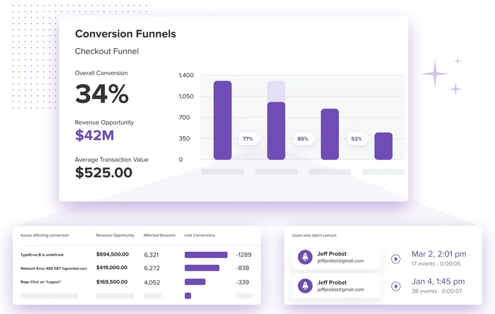
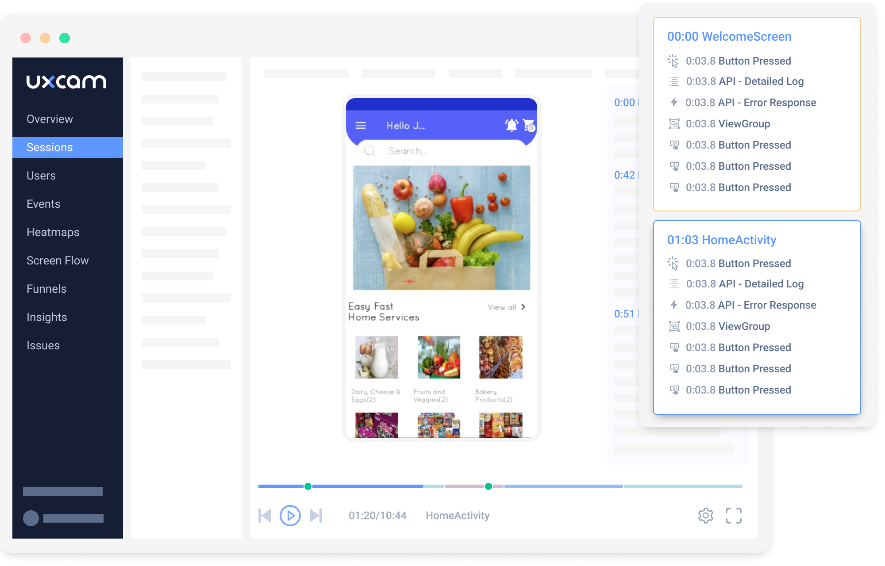
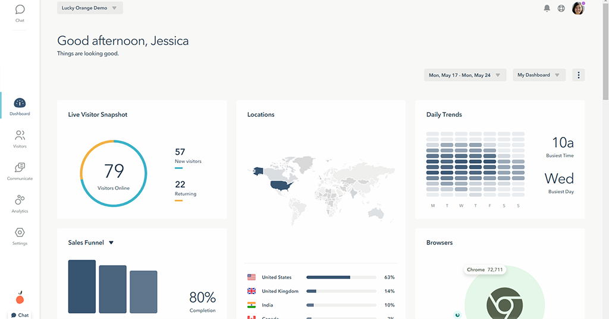
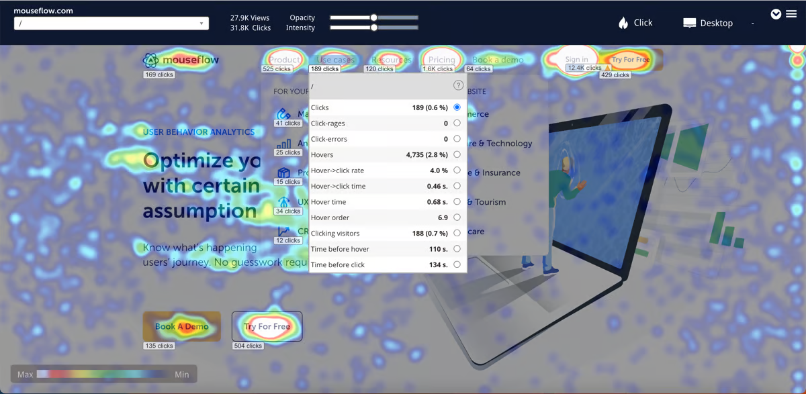

import { ComparisonTable } from 'components/ComparisonTable'
import { ComparisonRow } from 'components/ComparisonTable/row'

## 1. PostHog

- **Founded:** 2020
- **Similar to:** LogRocket, Mixpanel
- **Typical users:** Engineers and product teams
- **Typical customers:** Mid-size B2B/B2C companies and startups

### What is PostHog?

[PostHog](/) (that's us 👋) is an open-source platform that combines session replay, product analytics, feature flags, A/B testing, and user surveys into one product. This means it's not just an alternative to Microsoft Clarity, but also tools like [Statsig](/blog/posthog-vs-statsig) and [Mixpanel](/blog/posthog-vs-mixpanel).

According to [BuiltWith](https://trends.builtwith.com/analytics/PostHog), as of Feb 2024, PostHog is used on 5,169 (0.52%) of the top 1 million websites. Microsoft Clarity is used by [45,820 of the top 1 million websites](https://trends.builtwith.com/analytics/Microsoft-Clarity). Typical PostHog users are engineers and product managers at startups and mid-size companies, such as [Webshare](/customers/webshare), [AssemblyAI](/customers/assemblyai), and [Purplewave](/customers/purplewave).

#### Key features

- **Session replays:** Including event timelines, console logs, network activity.
- **Heatmaps:** Visualize user and rage clicks anywhere on your site.
- **Product analytics:** Analyze funnels, user paths, retention, trends, create user cohorts.
- **Feature flags & A/B testing:** Rollout features safely, run multivariate A/B tests.
- **Surveys:** Run customer satisfaction, NPS, and PMF surveys.

### How does PostHog compare to Microsoft Clarity?

PostHog offers more features for engineers, such as console logs and network monitoring on session replays, but doesn't currently offer scroll maps. PostHog isn't totally free like Clarity, but still has a generous free plan. All users get 5,000 replays and 1 million analytics events for free every month.

<ComparisonTable column1="PostHog" column2="Clarity">
  <ComparisonRow column1={true} column2={true} feature="Web session replay" description="View real sessions on websites and web apps" />
  <ComparisonRow column1="Android only*" column2="Android only" feature="Mobile session replay" description="View real sessions in mobile apps" />
  <ComparisonRow column1={true} column2={true} feature="Event timeline" description="History of everything that happened in a user's session" />
  <ComparisonRow column1={true} column2={false} feature="Network monitor" description="Analyze performance and network calls" />
  <ComparisonRow column1={true} column2={false} feature="Console logs" description="Debug issues faster by browsing the user's console" />
  <ComparisonRow column1={true} column2={false} feature="Canvas recording" description="Capture canvas elements from your application" />
  <ComparisonRow column1={true} column2={true} feature="Heatmaps" description="See where users click and interact" />
  <ComparisonRow column1={true} column2={true} feature="Rage clicks" description="Detect when users click rapidly in the same place" />
  <ComparisonRow column1={false} column2={true} feature="Scroll maps" description="See how far users scroll on websites and apps" />
  <ComparisonRow column1={true} column2={false} feature="Product analytics" description="Custom trends, funnels, paths, and retention analysis" />
  <ComparisonRow column1={true} column2={false} feature="Feature flags" description="Control feature access and phase rollouts" />  
  <ComparisonRow column1={true} column2={false} feature="A/B testing" description="Test changes and analyze their impact" />
  <ComparisonRow column1={true} column2={false} feature="Surveys" description="Collect feedback and run satisfaction surveys" />
</ComparisonTable>

*iOS replays are under development.

### Why do companies use PostHog?

According to [reviews on G2](https://www.g2.com/products/posthog/reviews), companies use PostHog because:

1. **It replaces multiple tools:** PostHog can replace Microsoft Clarity (session replay), [Google Analytics](/blog/posthog-vs-ga4), [LaunchDarkly](/blog/posthog-vs-launchdarkly) (feature flags and A/B testing), and [Hotjar](/blog/posthog-vs-hotjar) (feedback and surveys). This simplifies workflows and ensures all their data is in one place.

2. **Pricing is transparent and scalable:** Reviewers appreciate how PostHog's pricing scales as they grow. There's a [generous free tier](/pricing). Companies eligible for [PostHog for Startups](/startups) also get an additional $50k in credits.

3. **They need a complete picture of users:** PostHog includes every tool necessary to understand users and improve products. This means creating funnels to track conversion, watching replays to see where users get stuck, testing solutions with A/B tests, and gathering feedback with user surveys.

> #### Bottom line
>
> PostHog goes deeper than Clarity by making it easy to debug issues via detailed event timelines, console logs, and network monitoring, while also enabling you to understand user behavior at every level when combined with product analytics and its other tools.

<ArrayCTA />

 

## 2. LogRocket

- **Founded:** 2016
- **Similar to:** PostHog, OpenReplay
- **Typical users:** Product managers, engineers, support teams
- **Typical customers:** B2B SaaS, B2C retail companies.

### What is LogRocket?

[LogRocket](/blog/posthog-vs-logrocket) is a product experience platform with product analytics, error tracking, session replay, and performance monitoring. It focuses on helping product managers, engineers, and support teams identify and fix issues.

According to [BuiltWith](https://trends.builtwith.com/widgets/LogRocket), 1,132 of the top million sites use LogRocket as of Feb 2024, compared to Clarity's 45,820, though it's worth noting this figure likely doesn't include customers who self-host LogRocket.

#### Key features

- **Session replay:** See what users do, debug product issues and performance
- **Error tracking:** Identify issues with JavaScript, network errors, and stack traces.
- **Product analytics:** Analyze conversion funnels, user paths, and retention.
- **Performance monitoring:** Monitor performance, CPU and memory usage, and network speed.
- **Heatmaps:** See what users are clicking on and how far they scroll.

### How does LogRocket compare to Clarity?

LogRocket offers more features for engineers who want to investigate performance issues and bugs. It also adds some basic analytics features for analyzing conversion funnels and user paths. LogRocket's free plan includes 1,000 sessions per month.

<ComparisonTable column1="LogRocket" column2="Clarity">
  <ComparisonRow column1={true} column2={true} feature="Web session replay" description="View real sessions on websites and web apps" />
  <ComparisonRow column1={true} column2="Android only" feature="Mobile session replay" description="View real sessions in mobile apps" />
  <ComparisonRow column1={true} column2={true} feature="Event timeline" description="History of everything that happened in a user's session" />
  <ComparisonRow column1={true} column2={false} feature="Network monitor" description="Analyze performance and network calls" />
  <ComparisonRow column1={true} column2={false} feature="Console logs" description="Debug issues faster by browsing the user's console" />
  <ComparisonRow column1={true} column2={false} feature="Canvas recording" description="Capture canvas elements from your application" />
  <ComparisonRow column1={true} column2={true} feature="Heatmaps" description="See where users click and interact" />
  <ComparisonRow column1={true} column2={true} feature="Rage clicks" description="Detect when users click rapidly in the same place" />
  <ComparisonRow column1={true} column2={true} feature="Scroll maps" description="See how far users scroll on websites and apps" />
  <ComparisonRow column1={true} column2={false} feature="Product analytics" description="Custom trends, funnels, paths, and retention analysis" />
  <ComparisonRow column1={false} column2={false} feature="Feature flags" description="Control feature access and phase rollouts" />  
  <ComparisonRow column1={false} column2={false} feature="A/B testing" description="Test changes and analyze their impact" />
  <ComparisonRow column1={false} column2={false} feature="Surveys" description="Collect feedback and run satisfaction surveys" />
</ComparisonTable>

### Why do companies use LogRocket?

Reviews on G2.com suggest companies use LogRocket because it:

1. **Helps them identify problems:** LogRocket's combination of error tracking, performance monitoring, and session replay makes it uniquely powerful at finding bugs and issues. Unlike other tools, it uncovers both user and software issues.

2. **Improves user experience:** LogRocket seems to succeed at their goal of helping fix issues. Reviewers find tools like session replay, error tracking, and rage clicks help them identify and improve UX problems and bugs.

3. **Does everything they need:** LogRocket provides a lot of functionality out of the box. It captures the details users need, provides useful visualizations, and automatically triages some issues.

> #### Bottom line
> LogRocket is an excellent Clarity alternative for companies that need more comprehensive bug tracking and error monitoring tools. Less technical users, such as marketers and designers, might find it overwhelming, but there's something here for everyone.

 

## 3. FullStory

- **Founded:** 2012
- **Most similar to:** PostHog, LogRocket
- **Typical users:** Product managers, customer success, and support
- **Typical customers:** Online retailers and SaaS companies

### What is FullStory?

[FullStory](/blog/best-fullstory-alternatives) describes itself as Digital Experience Intelligence, which is code for session replay and mobile app analytics, with a side of product analytics. Like LogRocket and PostHog, it supports event autocapture, so you don't have to manually code every event you want to capture.

According to data from [BuiltWith](https://trends.builtwith.com/analytics/FullStory), as of February 2024, 8,141 of the top 1 million websites in the world deploy FullStory. This makes it less popular than Clarity (45,820), but more popular than PostHog (5,169) and Mouseflow (5,555). Customers tend to be product managers and support teams at larger e-commerce websites and B2C enterprises.

#### Key features

-  **Session replay:** Watch and analyze real user sessions on web and mobile apps.
-  **Product analytics:** Understand user paths and struggle points.
-  **Event autocapture:** Tagless event capture that ensures the tracking of all events.
-  **Heatmaps:** Find out where users click and frustration points.
-  **Mobile app analytics:** Crash analytics and user path analysis.

### How does FullStory compare to Clarity?

FullStory is a more complex and mature product than Clarity, going way beyond basic session replay by offering everything companies need to understand behavior on websites and in apps. FullStory offers a basic free plan with a 10,000 sessions monthly limit.

<ComparisonTable column1="FullStory" column2="Clarity">
  <ComparisonRow column1={true} column2={true} feature="Web session replay" description="View real sessions on websites and web apps" />
  <ComparisonRow column1={true} column2="Android only" feature="Mobile session replay" description="View real sessions in mobile apps" />
  <ComparisonRow column1={true} column2={true} feature="Event timeline" description="History of everything that happened in a user's session" />
  <ComparisonRow column1={true} column2={false} feature="Network monitor" description="Analyze performance and network calls" />
  <ComparisonRow column1={true} column2={false} feature="Console logs" description="Debug issues faster by browsing the user's console" />
  <ComparisonRow column1={true} column2={false} feature="Canvas recording" description="Capture canvas elements from your application" />
  <ComparisonRow column1={true} column2={true} feature="Heatmaps" description="See where users click and interact" />
  <ComparisonRow column1={true} column2={true} feature="Rage clicks" description="Detect when users click rapidly in the same place" />
  <ComparisonRow column1={true} column2={true} feature="Dead clicks" description="Detect when users click but nothing happens" />
  <ComparisonRow column1={true} column2={true} feature="Scroll maps" description="See how far users scroll on websites and apps" />
  <ComparisonRow column1={true} column2={false} feature="Product analytics" description="Custom trends, funnels, paths, and retention analysis" />
  <ComparisonRow column1={false} column2={false} feature="Feature flags" description="Control feature access and phase rollouts" />  
  <ComparisonRow column1={false} column2={false} feature="A/B testing" description="Test changes and analyze their impact" />
  <ComparisonRow column1={false} column2={false} feature="Surveys" description="Collect feedback and run satisfaction surveys" />
</ComparisonTable>

### Why do companies use FullStory?

According to reviews on G2, companies use FullStory for:

1. **Easier collaboration:** As an accessible tool for non-technical users, FullStory facilitates collaboration between product, UX, and engineering teams by allowing all teams to access useful, reliable data.

2. **Viewing user issues:** Support teams use FullStory to replay sessions to understand user hard-to-replicate problems and identify bugs that need fixing.

3. **Improving conversion:** FullStory users like to combine funnel insights with replays of user sessions to understand pain points and improve conversion.

> #### Bottom line
>
> FullStory is a big step up from Clarity, which is reflected in the cost. It's a good choice for large companies, especially those in the e-commerce space, but it might be overkill for smaller ones who want an inexpensive tool that does the basics well.

 

## 4. UXCam

- **Founded:** 2014
- **Most similar to:** PostHog, LogRocket
- **Typical users:** UX designers, marketers and product managers
- **Typical customers:** Mid-size companies, delivery, retail and marketplace apps 

### What is UXCam?

UXCam is designed specifically for mobile apps rather than websites. It combines basic product analytics with session replay and heatmap tools to help its users understand how people use their apps, and optimize conversions. It offers SDKs for iOS (Swift and Objective C) and Android (Kotlin and Java), but also supports popular cross-platform frameworks, such as React Native and Flutter.

#### Key features

- **Session replay:** Replay videos of users using your app and analyze their behavior.
- **Crash analytics:** See what causes app crashes and freezes.
- **Funnel analysis:** See where users drop off, optimize conversion.
- **Retention analysis:** Detect churn patterns and improve retention.
- **Heatmaps:** Analyze where people interact and use gestures.

### How does UXCam compare to Clarity?

UXCam offers similar core session replay features, but it only works on mobile apps. You can use Clarity on your web app and mobile app, though it only supports Android at present. UXCam's free plan includes 3,000 sessions for free each month.

<ComparisonTable column1="UXCam" column2="Clarity">
  <ComparisonRow column1={false} column2={true} feature="Web session replay" description="View real sessions on websites and web apps" />
  <ComparisonRow column1={true} column2="Android only" feature="Mobile session replay" description="View real sessions in mobile apps" />
  <ComparisonRow column1={true} column2={true} feature="Event timeline" description="History of everything that happened in a user's session" />
  <ComparisonRow column1={false} column2={false} feature="Network monitor" description="Analyze performance and network calls" />
  <ComparisonRow column1={true} column2={false} feature="Console logs" description="Debug issues faster by browsing the user's console" />
  <ComparisonRow column1={false} column2={false} feature="Canvas recording" description="Capture canvas elements from your application" />
  <ComparisonRow column1={true} column2={true} feature="Heatmaps" description="See where users click and interact" />
  <ComparisonRow column1={true} column2={true} feature="Rage clicks" description="Detect when users click rapidly in the same place" />
  <ComparisonRow column1={true} column2={true} feature="Dead clicks" description="Detect when users click but nothing happens" />
  <ComparisonRow column1={true} column2={true} feature="Scroll maps" description="See how far users scroll on websites and apps" />
  <ComparisonRow column1={true} column2={false} feature="Product analytics" description="Custom trends, funnels, paths, and retention analysis" />
  <ComparisonRow column1={false} column2={false} feature="Feature flags" description="Control feature access and phase rollouts" />  
  <ComparisonRow column1={false} column2={false} feature="A/B testing" description="Test changes and analyze their impact" />
  <ComparisonRow column1={false} column2={false} feature="Surveys" description="Collect feedback and run satisfaction surveys" />
</ComparisonTable>

### Why do companies use UXCam?

According to G2 reviews, UXCam helps companies:

1. **Identify bad UX in apps:** Combining session replay with analytics data helps them understand where users get stuck and design better solutions.

2. **Diagnose app problems** UXCam enables customers to track when app crashes happen and figure out why, including information such as device type and OS version.

3. **Improve conversion:** Funnel and user path analysis helps users metrics they care about, such as purchases and user engagement.

> #### Bottom line
>
> UXCam is a good option if you're developing a mobile app and don't have a web app. It offers more tools than Clarity for understanding conversion behavior and useful features for diagnosing app crashes and performance issues.

 

## 5. Lucky Orange

- **Founded:** 2010
- **Most similar to:** Hotjar
- **Typical users:** Marketers and consultants
- **Typical customers:** Small e-commerce businesses and agencies

### What is Lucky Orange?

Lucky Orange is a simple analytics tool designed to analyze user behavior on small e-commerce websites using session replays and heatmaps. It also offers a range of other useful features for store owners, such as built-in form analytics, live chat, surveys, and announcements widgets.

Founded in 2010, Lucky Orange is used on 4,435 of the top 1 million websites [according to BuiltWith](https://trends.builtwith.com/analytics/Lucky-Orange), compared to Clarity's 45,000+. Lucky Orange customers are often small online stores or freelance CRO consultants.

#### Key features

- **Session replay:** Watch how real users navigate your website.
- **Heatmaps** See where users click and scroll to on pages.
- **Conversion funnels:** Basic funnel analysis for tracking conversions.
- **Dashboards:** Create simple dashboards using pre-defined reports.
- **Visitor profiles:** See everything a user has done.

### How does Lucky Orange compare to Clarity?

Lucky Orange is a simplified, focused take on Clarity. It does many of the same things, but it's designed specifically for optimizing conversion on e-commerce websites. It offers enough analytics features to make it useful for small businesses, but isn't comprehensive enough for more complicated SaaS apps.

While it doesn't offer full product analytics, it includes:

<ComparisonTable column1="Lucky Orange" column2="Clarity">
  <ComparisonRow column1={true} column2={true} feature="Web session replay" description="View real sessions on websites and web apps" />
  <ComparisonRow column1={false} column2="Android only" feature="Mobile session replay" description="View real sessions in mobile apps" />
  <ComparisonRow column1={true} column2={true} feature="Event timeline" description="History of everything that happened in a user's session" />
  <ComparisonRow column1={false} column2={false} feature="Network monitor" description="Analyze performance and network calls" />
  <ComparisonRow column1={false} column2={false} feature="Console logs" description="Debug issues faster by browsing the user's console" />
  <ComparisonRow column1={false} column2={false} feature="Canvas recording" description="Capture canvas elements from your application" />
  <ComparisonRow column1={true} column2={true} feature="Heatmaps" description="See where users click and interact" />
  <ComparisonRow column1={true} column2={true} feature="Rage clicks" description="Detect when users click rapidly in the same place" />
  <ComparisonRow column1={false} column2={true} feature="Dead clicks" description="Detect when users click but nothing happens" />
  <ComparisonRow column1={true} column2={true} feature="Scroll maps" description="See how far users scroll on websites and apps" />
  <ComparisonRow column1={false} column2={false} feature="Product analytics" description="Custom trends, funnels, paths, and retention analysis" />
  <ComparisonRow column1={false} column2={false} feature="Feature flags" description="Control feature access and phase rollouts" />  
  <ComparisonRow column1={false} column2={false} feature="A/B testing" description="Test changes and analyze their impact" />
  <ComparisonRow column1={true} column2={false} feature="Surveys" description="Collect feedback and run satisfaction surveys" />
</ComparisonTable>

### Why do companies use Lucky Orange?

According to [reviews on G2](https://www.g2.com/products/lucky-orange/reviews.html), because:

1. **It's easy to use:** Lucky Orange has a simple UI compared to popular analytics tools, which makes it easy for users analyze user behavior and identify issues with their websites.

2. **It helps them improve conversion:** Customers are mostly using Lucky Orange to optimize landing pages and e-commerce checkout flows, which it makes easy.

3. **It doesn't impact page speed:** Users report Lucky Orange has negligible impact on website performance, which they value highly.

> #### Bottom line
> 
> Lucky Orange is ideal for small businesses owners who want actionable insights without much effort. It's easy to use and offers some useful benefits Clarity doesn't, such as basic conversion funnels and event tracking.

 

## 6. Hotjar

- **Founded:** 2014
- **Most similar to:** Microsoft Clarity, Lucky Orange
- **Typical users:** Product designers, researchers, and marketers
- **Typical customers:** E-commerce and content-driven sites

### What is Hotjar?

[Hotjar](/blog/posthog-vs-hotjar) focuses on user behavior rather than analytics. This means using heatmaps, replays, feedback, and interviews to understand the qualitative aspects of your site and app. It's popular among product designers and marketers, but not so useful for software engineers.

According to [BuiltWith](https://trends.builtwith.com/analytics/Hotjar), as Feb 2024, Hotjar is used by 72,048 of the top 1 million websites, compared to Clarity's 45,820. This makes Hotjar the most popular tool in this guide, though usage has declined considerably from a peak of ~125k in 2021.  

#### Key features

- **Heatmaps:** See what parts of your pages get attention and how far they scroll
- **Recordings:** Replay real user sessions and see what they see.
- **Feedback:** Learn what your users are thinking. Find out their likes and dislikes.
- **Surveys:** Gather info on user preferences using questionnaires.  
- **Interviews:** Talk to real users to share ideas, test designs, and get live feedback.

### How does Hotjar compare to Clarity?

In many ways, Hotjar is a more mature version of Clarity. It lacks the depth of analysis of PostHog or LogRocket, but it offers a few useful enhancements compared to Clarity. For example, it supports both Android and iOS mobile apps. Hotjar's free plan includes 35 daily session (~1,000 per month) for free and basic features.

<ComparisonTable column1="Hotjar" column2="Clarity">
  <ComparisonRow column1={true} column2={true} feature="Web session replay" description="View real sessions on websites and web apps" />
  <ComparisonRow column1={true} column2="Android only" feature="Mobile session replay" description="View real sessions in mobile apps" />
  <ComparisonRow column1={true} column2={true} feature="Event timeline" description="History of everything that happened in a user's session" />
  <ComparisonRow column1={false} column2={false} feature="Network monitor" description="Analyze performance and network calls" />
  <ComparisonRow column1={true} column2={false} feature="Console logs" description="Debug issues faster by browsing the user's console" />
  <ComparisonRow column1={false} column2={false} feature="Canvas recording" description="Capture canvas elements from your application" />
  <ComparisonRow column1={true} column2={true} feature="Heatmaps" description="See where users click and interact" />
  <ComparisonRow column1={true} column2={true} feature="Rage clicks" description="Detect when users click rapidly in the same place" />
  <ComparisonRow column1={true} column2={true} feature="Dead clicks" description="Detect when users click but nothing happens" />
  <ComparisonRow column1={true} column2={true} feature="Scroll maps" description="See how far users scroll on websites and apps" />
  <ComparisonRow column1={false} column2={false} feature="Product analytics" description="Custom trends, funnels, paths, and retention analysis" />
  <ComparisonRow column1={false} column2={false} feature="Feature flags" description="Control feature access and phase rollouts" />  
  <ComparisonRow column1={false} column2={false} feature="A/B testing" description="Test changes and analyze their impact" />
  <ComparisonRow column1={true} column2={false} feature="Surveys" description="Collect feedback and run satisfaction surveys" />
</ComparisonTable>

### Why do companies use Hotjar?

According to G2 reviews, users are fans of Hotjar because:

1. **Insights on user behavior:** Shows what they are doing, where their attention is going, and how they are spending their time. Users love the realizations they get with Hotjar's tools.

2. **Simple for non-technical users:** Hotjar is easy to set up and use by non-technical roles like designers, marketers, and product managers. The visuals are easy to use and make data clear.

3. **Heatmaps and scrollmaps:** Seeing clicks and how far users scroll down a page works well and creates actionable insights. Helps improve UX and page designs.

> #### Bottom line
>
> Hotjar is a sensible option for non-technical users, though it only offers marginal upgrades on what Clarity offers for free.

 

## 7. Mouseflow

- **Founded:** 2009
- **Most similar to:** UXCam, Hotjar
- **Typical users:** Marketing and UX teams
- **Typical customers:** SMB and enterprises in retail

### What is Mouseflow?

Mouseflow is a behavioral analytics tool that offers session replay, heatmap, and basic funnel analysis features. It's designed mainly for use on marketing and e-commerce websites. Unlike UXCam and Hotjar, for example, it doesn't support replay in mobile apps. It also integrates with several popular A/B testing tools.

According to data from BuiltWith, 5,555 of the top 1 million websites use Mouseflow – correct as of Feb 2024. This makes it more popular than Lucky Orange, but much less popular than Hotjar (72,048) and Clarity (45,820). 

#### Key features

- **Session replay:** Watch user sessions to learn what helps and hurts.
- **Friction scores:** Identify sessions where users experience frustration.
- **Heatmaps:** See where users click and scroll on your website.
- **User feedback:** Gather feedback and ratings from users.
- **Form analytics:** Reduce abandonment on signup forms.

### How does Mouseflow compare to Clarity?

Mouseflow offers one or two features Clarity doesn't, such as funnel analysis and user feedback tools, but its replay and heatmaps features are more or less the same. Mouseflow's free plan includes 500 monthly sessions – upgrading to its Starter plan gives you 5,000 sessions for $30 a month.

<ComparisonTable column1="Mouseflow" column2="Clarity">
  <ComparisonRow column1={true} column2={true} feature="Web session replay" description="View real sessions on websites and web apps" />
  <ComparisonRow column1={false} column2="Android only" feature="Mobile session replay" description="View real sessions in mobile apps" />
  <ComparisonRow column1={true} column2={true} feature="Event timeline" description="History of everything that happened in a user's session" />
  <ComparisonRow column1={false} column2={false} feature="Network monitor" description="Analyze performance and network calls" />
  <ComparisonRow column1={true} column2={false} feature="Console logs" description="Debug issues faster by browsing the user's console" />
  <ComparisonRow column1={false} column2={false} feature="Canvas recording" description="Capture canvas elements from your application" />
  <ComparisonRow column1={true} column2={true} feature="Heatmaps" description="See where users click and interact" />
  <ComparisonRow column1={true} column2={true} feature="Rage clicks" description="Detect when users click rapidly in the same place" />
  <ComparisonRow column1={true} column2={true} feature="Dead clicks" description="Detect when users click but nothing happens" />
  <ComparisonRow column1={true} column2={true} feature="Scroll maps" description="See how far users scroll on websites and apps" />
  <ComparisonRow column1={false} column2={false} feature="Product analytics" description="Custom trends, funnels, paths, and retention analysis" />
  <ComparisonRow column1={false} column2={false} feature="Feature flags" description="Control feature access and phase rollouts" />  
  <ComparisonRow column1={false} column2={false} feature="A/B testing" description="Test changes and analyze their impact" />
  <ComparisonRow column1={true} column2={false} feature="Surveys" description="Collect feedback and run satisfaction surveys" />
</ComparisonTable>

### Why do companies use Mouseflow?

Based on reviews from G2.com, customers use Mouseflow because they:

1. **Want to understand user behavior:** Session replays and heatmaps help them see what actions users take, which areas of the website receive the most attention, and how they can improve the user experience to increase conversions.

2. **Save time on user interviews:** Using replays and surveys together enables users to gather information more efficiently compared to running user interviews.

3. **Wanted something easy to use:** Mouseflow offers basic analytical tools and autocaptures frontend events, which makes it easy for anyone to setup unearth insights. 

> #### Bottom line
>
> Mouseflow is worth considering if you want session replay and funnel analysis in one tool, but its session replay features are very similar to Clarity's, and it doesn't support mobile apps at all.

 

## Is PostHog right for you?

Here's the (short) sales pitch.

We're biased, obviously, but we think PostHog is the perfect Clarity replacement if:

- You value transparency (we're open source and open core)
- You want more than basic session replay and analysis tools. We offer everything in one.
- You want to try before you buy (we're self-serve with a [generous free tier](/pricing))

Check out [our product pages](/product-analytics) and [read our docs](/docs) to learn more.

<ArrayCTA />