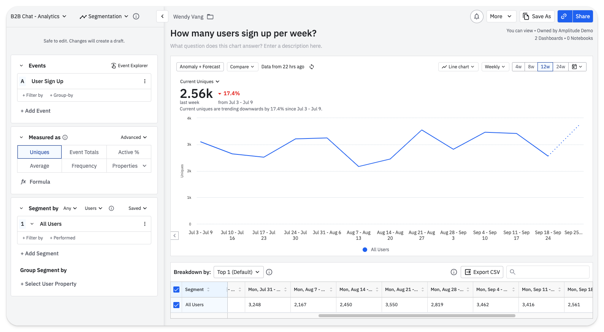

import { ComparisonTable } from 'components/ComparisonTable'
import { ComparisonRow } from 'components/ComparisonTable/row'

## 1. PostHog

### What is PostHog?

PostHog is an open-source product that combines product analytics, session replay, feature flags, A/B testing, and user surveys into one platform. This means it's not just an alternative to Mixpanel, but also [LaunchDarkly](/blog/posthog-vs-launchdarkly), Hotjar, and [Optimizely](/blog/posthog-vs-optimizely). 
 
### Key features

- 📈 **Product analytics**, including funnels, user paths, retention analysis, custom trends, and dynamic user cohorts. Power users can create custom insights using SQL.

- 📺 **Session replays** with event timelines, console logs, and network activity, and 90-day retention. Individual replays can be saved offline indefinitely.

- 🚩 **Feature flags** with local evaluation (for faster performance) and JSON payloads, so you can make changes to your product without deploying new code. 

- 🧪 **A/B tests** with up to 9 test variations, primary and secondary metrics. Automatically calculates recommended duration, sample size, and statistical significance.

- 💬 **Surveys**, including open text, link with custom CTA, ratings (for [NPS, CSAT, and CES surveys](/product-engineers/nps-vs-csat-vs-ces)), single and multiple choice. Target users based on user properties, URL, or using existing feature flags.

### Who uses PostHog?

Typical PostHog users are:

- Product-minded engineering teams
- Data-savvy product managers
- Startups and mid-size enterprises

Customers include [AssemblyAI](/customers/assemblyai), [Hasura](/customers/hasura), [Vendasta](/customers/vendasta), and Airbus.

### How does PostHog compare to Mixpanel?

<ComparisonTable column1="PostHog" column2="Mixpanel">
  <ComparisonRow column1={true} column2={true} feature="Product analytics" description="Custom trends, funnels, and retention analysis" />
  <ComparisonRow column1={true} column2={false} feature="Session replays" description="Watch real users use your product; diagnose bugs" />
  <ComparisonRow column1={true} column2={false} feature="Feature flags" description="Roll out features safely; toggle features for cohorts or individuals" />
  <ComparisonRow column1={true} column2={false} feature="A/B testing" description="Create A/B tests using feature flags" />
  <ComparisonRow column1={true} column2={false} feature="User surveys" description="Ask users for qualitative feedback and gather responses" />
  <ComparisonRow column1={true} column2={false} feature="Heatmaps" description="Track where users click and why" />
  <ComparisonRow column1={true} column2={false} feature="Open source" description="Build your own apps and contribute code" />
  <ComparisonRow column1={true} column2={false} feature="Autocapture" description="Capture events without manual instrumentation" />
  <ComparisonRow column1={true} column2={false} feature="SQL insight builder" description="Write your own insights using SQL" />
  <ComparisonRow column1="Public beta" column2={true} feature="Notebooks" description="Collaborate on analysis in shareable notebooks" />
</ComparisonTable>

PostHog is the only choice if you like the idea of consolidating around one platform. Mixpanel offers third-party integrations for features it doesn't have, but this creates a messy workflow for teams.
 
PostHog also supports autocapture. This means you don't have to manually instrument events. Instead, PostHog starts collecting data from the moment you implement its tracking snippet.

### How popular is PostHog?

According to [data compiled by Jason Packer](https://www.linkedin.com/posts/jhpacker_just-updated-the-popularity-numbers-on-my-activity-7112462135120601088-YLdh/), an independent analytics consultant, PostHog is the fastest growing Mixpanel alternative in the market.

As of July 2023, **PostHog** is deployed by 2,365 (0.2%) of the top 1 million websites in 2023, up +327% from 554 the previous year. **Mixpanel** is deployed by 5,218 (0.5%), down -17% from 6,295 the previous year.

### Why do companies use PostHog?

According to [reviews on G2](https://www.g2.com/products/posthog/reviews), companies use PostHog because:

1. **It replaces multiple tools:** PostHog can replace Mixpanel (product analytics), LaunchDarkly (feature flags and A/B testing), and Hotjar (session replay and surveys). This simplifies workflows and ensures all their data is in one place.

2. **Pricing is transparent and scalable:** Reviewers appreciate how PostHog's pricing scales as they grow. There's a [generous free tier](/pricing). Companies eligible for [PostHog for Startups](/startups) also get $50k in additional free credits.

3. **They need a complete picture of users:** PostHog includes every tool necessary to understand users and improve products. This means creating funnels to track conversion, watching replays to see where users get stuck, testing solutions with A/B tests, and gathering feedback with user surveys.

> #### Bottom line 
> PostHog is the best Mixpanel alternative for startups and mid-size companies. It replaces Mixpanel and numerous other tools, saving money and time. Power user features, like an SQL insight builder and session replay logs, make it a good choice for engineering-led teams, too.

 

## 2. Google Analytics 4 (GA4)

### What is Google Analytics 4?

Google Analytics 4 (GA4) is a marketing and product analytics tool that's tightly integrated with other Google products, such as Ads, BigQuery, Looker Studio, and Firebase. 

Unlike its predecessor, Universal Analytics (GA3), it's event-based. It also introduces new report types, such as conversion funnels and retention tables. This makes it more useful to product teams than before.

### Key features

- 🤖 **Predictive insights** alert you to trends you're not aware of, like an increase in traffic to a specific landing page, or an anomalous decline in conversion from one period to another.

- 🔁 **Integration with Google tools** means it's easy to analyze your GA4 data elsewhere, such as Google's dashboarding tool, Looker Studio.

- ⌨️ **Natural language search** means you can ask specific questions, like "MoM growth in users on iOS", rather searching existing reports.

### Who uses GA4?

Typical GA4 users are:
- Marketing and content teams
- Large news and content publishers
- Enterprises who also use BigQuery

Google's huge scale means GA4 is used by both the biggest global corporations to SMBs of every kind. It is ubiquitous.

### How does GA4 compare to Mixpanel?

<ComparisonTable column1="GA4" column2="Mixpanel">
  <ComparisonRow column1={true} column2={true} feature="Product analytics" description="Custom trends, funnels, and retention analysis" />
  <ComparisonRow column1={true} column2={true} feature="Marketing analytics" description="Track content and advertising performance" />
  <ComparisonRow column1={false} column2={true} feature="Notebooks" description="Collaborate on analysis in shareable notebooks" />
  <ComparisonRow column1={true} column2={true} feature="Google Ads integration" description="Track ROI on Google marketing campaigns" />
  <ComparisonRow column1={true} column2={false} feature="Predictive insights" description="AI-powered alerts when metrics chanage" />
  <ComparisonRow column1={true} column2={true} feature="Natural language insights" description="Fetch insights using natural language queries" />
  <ComparisonRow column1={false} column2={true} feature="Group analytics" description="Track metrics at account or company level" />
  <ComparisonRow column1={true} column2={false} feature="Realtime dashboards" description="Track website activity in realtime" />
  <ComparisonRow column1={false} column2={true} feature="Data governance" description="Admin level control over event approval, tags and descriptions" />
  <ComparisonRow column1={false} column2={true} feature="Transparent pricing" description="Public pricing calculator" />
</ComparisonTable>

GA4 and Mixpanel are only superficially similar. They cover the same basics, but GA4 is better-suited to content and marketing teams, while Mixpanel is designed for product teams. 

Note, GA4 doesn't support group analytics. This makes it easy to track aggregated usage at an account level, rather than at a user level – useful for tracking behavior in B2B products.

### How popular is GA4?

Google Analytics remains the most-used analytics tool in the world by a large margin. 

As of July 2023, [30.5% of the top 1 million websites](https://www.linkedin.com/posts/jhpacker_just-updated-the-popularity-numbers-on-my-activity-7112462135120601088-YLdh/) run GA4 – another 35.7% were still running GA3.

### Why do companies use GA4?

1. **Because it's Google:** It's not an original reason, but it holds true. Using Google Analytics makes a lot of sense for teams who rely on other Google platforms, like Google Ads and BigQuery.

2. **It's powerful and free:** Likewise, Google's scale means GA4 is completely free to most small and medium-sized businesses. This, combined with strong analytical tools and the large ecosystem of GA experts to call upon, makes it a safe choice.

3. **To track marketing ROI:** GA4 is predominantly used by marketing and e-commerce teams to track campaign ROI. It's also popular among large content publishers for its scalability.

> #### Bottom line
> GA4 is the best Mixpanel alternative for marketing teams who want to track ROI on campaigns, and a good option for B2C and e-commerce platforms. Product teams, especially those working on B2B products, should look elsewhere.

 

## 3. Amplitude

### What is Amplitude?

[Amplitude](/blog/best-amplitude-alternatives) is an analytics and testing tool with a particular focus on large enterprise customers, like Ford, NBCUniversal, and Walmart. 

### Key features

- 📈 **Product analytics**, including funnel and retention analysis, user paths, behavioral cohorts, custom dashboards, and more.

- 🧪 **A/B testing** with support for JSON payloads, primary, secondary, and counter metrics.

- 💁‍♂️ **Customer data platform** that combines analytics data with third-party tools for data governance, identity resolution, and data federation.

- 🤖 **AI insight builder** that generates insights based on natural language requests, like "What is my purchase conversion rate?".

### Who uses Amplitude?

Typical Amplitude users are:

- Non-technical product managers
- Data teams at large enterprises
- Growth engineering and marketing teams
- Companies with stringent compliance needs

While it offers a limited free tier for startups, high prices are a barrier. As one reviewer [points out](https://www.g2.com/products/amplitude-analytics/reviews/amplitude-analytics-review-7933567): "The high price tag poses a challenge for small businesses, early-stage, and even medium-sized startups."

### How does Amplitude compare to Mixpanel?

<ComparisonTable column1="Amplitude" column2="Mixpanel">
  <ComparisonRow column1={true} column2={true} feature="Product analytics" description="Custom trends, funnels, and retention analysis" />
  <ComparisonRow column1={true} column2={false} feature="A/B testing" description="Create A/B tests using feature flags" />
  <ComparisonRow column1={true} column2={true} feature="Notebooks" description="Collaborate on analysis in shareable notebooks" />
  <ComparisonRow column1={true} column2={false} feature="Natural language insights" description="Fetch insights using natural language queries" />
  <ComparisonRow column1={true} column2={true} feature="Group analytics" description="Track metrics at account or company level" />
  <ComparisonRow column1={true} column2={true} feature="Data governance" description="Admin level control over event approval, tags and descriptions" />
</ComparisonTable>

On paper, Amplitude and Mixpanel are very similar, but they differ in focus and approach. While both products serve large enterprise customers, Amplitude is more focused on these users. Unlike Mixpanel, for example, pricing isn't transparent.

### How popular is Amplitude?

Amplitude is slightly more popular than Mixpanel, according to [data compiled by Jason Packer](https://www.linkedin.com/posts/jhpacker_just-updated-the-popularity-numbers-on-my-activity-7112462135120601088-YLdh/), an independent analytics consultant:

As of July 2023, Amplitude is deployed by 6,973 (0.7%) of the top 1 million websites in 2023. Mixpanel is deployed by 5,218 (0.5%).

### Why do companies use Amplitude?

1. **Reducing load on data teams:** Amplitude is designed to enable non-technical to self-serve analytics. Amplitude [cites](https://amplitude.com/case-studies/nbc) NBCUniversal as a company that's benefited from its data team spending less time responding to requests for analysis.

2. **Large-scale experimentation:** Unlike Mixpanel, Amplitude offers a built-in experimentation add-on. This enables companies to run experiments on users using existing cohorts created in Amplitude.

3. **Resolving data quality problems:** Companies that use Amplitude, particularly large ones, often migrate from outdated, or self-built, tools that generate poor quality data. Amplitude helps them fix that, while also making analytics more accessible.

> #### Bottom line
> Amplitude is the best Mixpanel alternative for large enterprise companies who want to reduce the load on expensive, overworked data science teams. Startups and mid-size companies might find there are better-value alternatives

 

## 4. Heap

### What is Heap?

Heap describes itself as a Digital Insights Platform. Unpacking that a bit, it means Heap offers both product analytics and session replay, and supports marketing use cases with multitouch attribution.

Heap was [acquired in September 2023](https://contentsquare.com/heap/) by Contentsquare, a marketing and e-commerce analytics firm, and announced plans to integrate the two products. 

### Key features

- ✅ **Event autocapture** is a key differentiator between Heap and Mixpanel. Autocapture means product teams don't have to rely on engineers to instrument all events. Heap offers a visual editor for enables teams to tag on-page events for analysis.

- 📺 **Session replay** and heatmaps augment Heap's analytics features with qualitative insights, though it lacks the debugging tools typical of most replay tools.

- 🔁 **Managed ETL** to data warehouses, so you can export your Heap analytics data into a data warehouse and combine it with data from other sources.

### Who uses Heap?

Typical Heap users are:

- Non-technical product managers
- Marketing and design teams

Heap puts a strong focus on supporting non-technical product managers via autocapture.

Customers include Amway, Eventbrite, and Freshworks.

### How does Heap compare to Mixpanel?

<ComparisonTable column1="Heap" column2="Mixpanel">
  <ComparisonRow column1={true} column2={true} feature="Product analytics" description="Custom trends, funnels, and retention analysis" />
  <ComparisonRow column1={true} column2={false} feature="Autocapture" description="Capture events without manual instrumentation" />
  <ComparisonRow column1={true} column2={false} feature="Session replay" description="Watch real users use your product; diagnose bugs" />
  <ComparisonRow column1={false} column2={true} feature="Notebooks" description="Collaborate on analysis in shareable notebooks" />
  <ComparisonRow column1={true} column2={true} feature="Group analytics" description="Track metrics at account or company level" />
  <ComparisonRow column1={true} column2={true} feature="Data governance" description="Admin level control over event approval, tags and descriptions" />
</ComparisonTable>

Session replay and autocapture support make Heap a good Mixpanel alternative for product teams.

Heap has a healthy integration library for things like A/B testing, or marketing automation, but Mixpanel's is better. For example, Heap has two official survey integrations (Appcues and Delighted), while Mixpanel has nine.

Mixpanel also offers a more generous free tier of up to 20 million events; Heap is limited to 10,000 monthly users.

### How popular is Heap?

Heap is less popular than Mixpanel. According to BuiltWith, Heap is deployed on 4,221 (0.4%) of the top 1 million websites, while Mixpanel is used by 6,300.

### Why do companies use Heap?

1. **Conversion rate optimization:** Combining product analytics and session replay makes Heap useful for growth and marketing teams looking to improve conversion.

2. **To improve data collection** Companies with limited engineering resources find Heap's autocapture ensures important events aren't missed.

3. **Low information density** Reviewers on G2 appreciate Heap's user-friendly interface, which tends toward lower information density than competing tools.

> #### Bottom line 
> Heap is basically Mixpanel with autocapture. This makes it a decent choice for non-technical product teams, but it's not radically different.

 
 
## Honorable mentions

This guide focuses on the most popular Mixpanel alternatives, but these aren't the only ones. Here are some honorable mentions that are worth also worth considering:

- **[Pendo](/blog/best-pendo-alternatives)**, which describes itself as a product experience platform. It combines analytics with in-app guides, user feedback widgets, roadmap planning, and product discovery tools.
  
- **[Kissmetrics](https://www.kissmetrics.io/)**, which is more focused on marketing and e-commerce use cases than Mixpanel. It's worth considering if you want to focus on channel attribution and revenue tracking, but don't want to use GA4.

- **[Snowplow](https://snowplow.io/)**, a powerful, open-source behavioral data platform. It can replace tools like Mixpanel, but it's only suitable for companies with well-staffed data science teams. It's mostly used by large enterprises.

- **[June](https://www.june.so/)**, a lightweight take on product analytics that focuses on auto generated reports. It's popular among seed stage and Series A B2B SaaS startups, though its free tier includes only 1,000 active monthly users.

<ArrayCTA />
