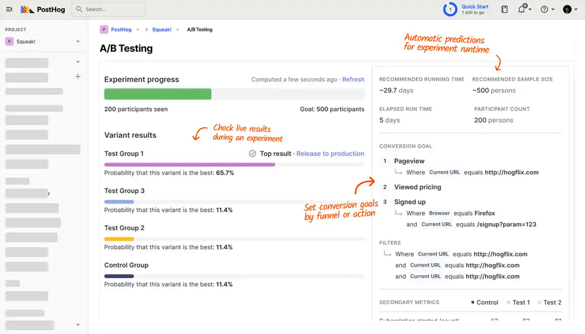
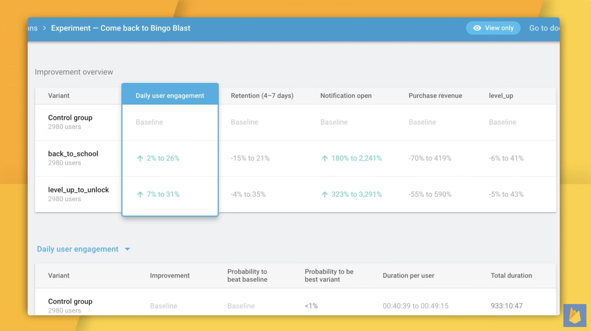
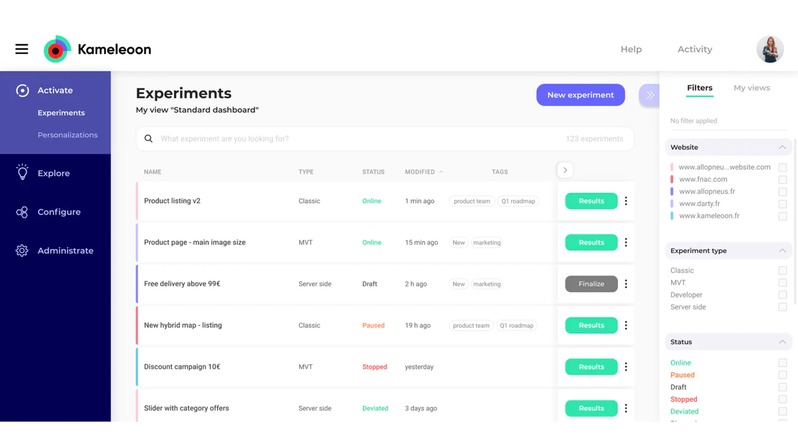
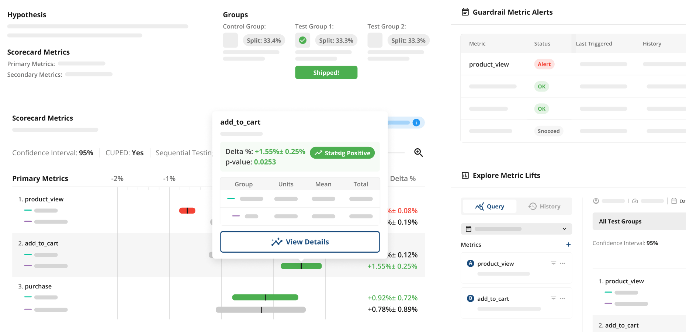
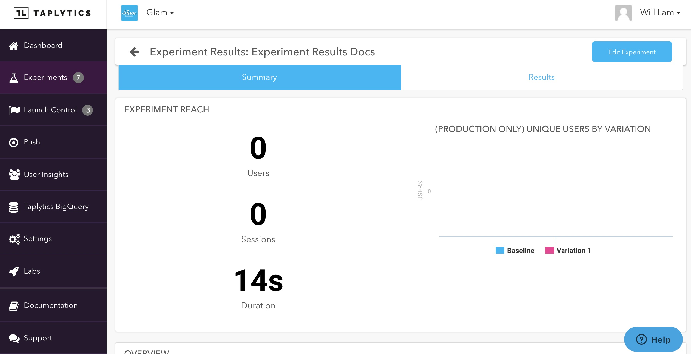
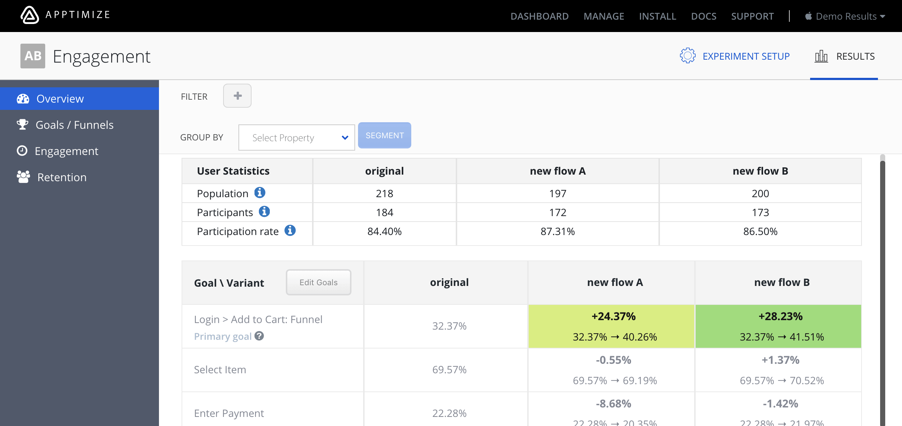

import { ComparisonTable } from 'components/ComparisonTable'
import { ComparisonRow } from 'components/ComparisonTable/row'

A/B tests are a great way to confirm that your product changes have the intended effects. When it comes to mobile apps, there are many different A/B testing tools to choose from, but each one is built with a specific target audience in mind. In this guide, we’ll explore these options so that you can decide which is best for you.

## 1. PostHog

- **Free tier:** ✔
- **Open source:** ✔
- **Transparent pricing:** ✔
- **Includes product analytics:** ✔
- **Get started without talking to sales:** ✔
- **Best for:** Engineering and product teams
  

### What is PostHog?

[PostHog](https://posthog.com) (that's us!) is an all-in-one platform built to help engineers create better products. It includes A/B testing **and** a whole bunch more, such as [product analytics](/product-analytics), [session replays](/session-replay), [feature flags](/feature-flags), and [surveys](/survey).

It's designed for product-minded engineers, growth teams, and product managers who need to move fast and iterate based on reliable, actionable insights.

### Which platforms does PostHog support?

- **iOS:** ✔
- **Android:** ✔
- **React Native:** ✔
- **Flutter:** Product analytics and feature flags only
- **Web:** ✔
- **Server:** ✔

### How much does PostHog cost?

PostHog has [transparent pricing](/pricing) based on the usage. It’s free to get started and completely free for the first 1 million A/B testing requests. After this free monthly allowance, you'll pay $0.0001/request, and requests cost progressively less the more you use. You can also set billing limits to ensure you don't get surprise bills. 

While PostHog is open source, its A/B testing features aren't included in the open source release.

> **Further reading:** New to A/B testing? Read [a software engineer's guide to A/B testing](/blog/ab-testing-guide-for-engineers) and our guide to [common A/B testing mistakes](/blog/ab-testing-mistakes).

## 2. VWO

- **Free tier:** ✖
- **Open source:** ✖
- **Transparent pricing:** ✔
- **Includes product analytics:** ✔
- **Get started without talking to sales:** ✔
- **Best for:** Non-technical teams

### What is VWO?

[VWO](https://vwo.com/) is a testing platform that primarily targets large enterprises. Its experimentation platform includes support for A/B and multivariate tests and a visual editor. It's useful for non-technical users who need an easy-to-use interface to test in-app messaging and UI copy.

It also offers product analytics, so you don't need a separate platform or integration to link your analytics data to your A/B test results.

### Which platforms does VWO support?

- **iOS:** ✔
- **Android:** ✔
- **Flutter:** ✔
- **React Native:** ✔
- **Web:** ✔
- **Server:** ✔

### How much does VWO cost?

VWO mobile app A/B tests starts at $1,526 per month for up to 10k users. This is billed annually, so it means an upfront cost of $18,312. Also note that this price is only for mobile A/B tests. If you want to include analytics in your package, prices start at an additional $15,936 per year.

Lastly, if you also want to run server-side tests, you also need to purchases a separate package. Prices for this start at $28,164 per year.

## 3. Optimizely

- **Free tier:** ✖
- **Open source:** ✖
- **Transparent pricing:** ✖
- **Includes product analytics:** ✖
- **Get started without talking to sales:** ✖
- **Best for:** Marketing teams

### What is Optimizely?

[Optimizely](/blog/posthog-vs-optimizely) is an all-in-one system for marketing that includes A/B testing **and** more – like content management, campaign planning, asset management, and checkout customizations. 

It's built for marketers in large enterprises looking to optimize their content, apps, and e-commerce experiences.

### Which platforms does Optimizely support?

- **iOS:** ✔
- **Android:** ✔
- **Flutter:** ✔
- **React Native:** ✔
- **Web:** ✔
- **Server:** ✔

### How much does Optimizely cost?

Optimizely's pricing is sales-driven and completely opaque, so it's not clear how much it costs. However, according to [Splitbase](https://splitbase.com/blog/optimizely-pricing), Optimizely will cost you at least $36,000 per year.

## 4. Firebase

- **Free tier:** ✔
- **Open source:** ✖ 
- **Transparent pricing:** ✔
- **Includes product analytics:** ✖
- **Get started without talking to sales:** ✔
- **Best for:** Apps already using Firebase's other features

### What is Firebase A/B testing?

[Firebase A/B testing](https://firebase.google.com/products/ab-testing) is built specifically for mobile apps and is completely free. It includes an easy to use interface for running experiments on Firebase's other app features, such as [cloud messaging](https://firebase.google.com/products/cloud-messaging) and [in-app messaging](https://firebase.google.com/products/in-app-messaging). 

It's important to note that using A/B testing on Firebase requires installing [Google Analytics](/blog/posthog-vs-ga4) in your app. It's also not possible to run A/B tests on your web app or server.

### Which platforms does Firebase support?

- **iOS:** ✔
- **Android:** ✔
- **Flutter:** ✔
- **React Native:** ✖
- **Web:** ✖
- **Server:** ✖

### How much does Firebase A/B testing cost?

A/B testing with Firebase is completely free. 

## 5. Kameleoon

- **Free tier:** ✖
- **Open source:** ✖
- **Transparent pricing:** ✖
- **Includes product analytics:** ✖
- **Get started without talking to sales:** ✖
- **Best for:** E-commerce and healthcare companies

### What is Kameleoon?

[Kameleoon](https://www.kameleoon.com/) is built specifically for mobile apps. It includes an easy to use interface for running experiments on push notifications and in-app messaging. 

In addition to testing, it offers a real-time personalization engine that's particularly useful for e-commerce apps. It's also [HIPAA-compliant](/blog/best-hipaa-compliant-ab-testing-tools), which makes Kameleoon a viable option for healthcare apps.

### Which platforms does Kameleoon support?

- **iOS:** ✔
- **Android:** ✔
- **Flutter:** ✔
- **React Native:** ✔
- **Web:** ✔
- **Server:** ✔

### How much does Kameleoon cost?

Kameleoon doesn't publish pricing publicly, but conversion optimization consultants BrillMark [state](https://www.brillmark.com/kameleoon-ab-testing-platform/#:~:text=The%20yearly%20licensing%20pricing%20for,pay%20for%20the%20annual%20license) pricing starts at $35,000 per year and scales based on traffic volume.

## 6. Statsig

- **Free tier:** ✔
- **Open source:**✖
- **Transparent pricing:** Partial
- **Includes product analytics:** ✔
- **Get started without talking to sales:** ✔
- **Best for:** Product teams in high-growth startups

### What is Statsig?

[Statsig](https://statsig.com/) is platform built for feature management and experimentation. It offers feature flags, A/B testing, and product analytics.

It offers advanced experimentation techniques, such as multi-armed bandit experiments and [holdout testing](/tutorials/holdout-testing), making it well suited for growth teams in startups.

### Which platforms does Statsig support?

- **iOS:** ✔
- **Android:** ✔
- **Flutter:** ✔
- **React Native:** ✔
- **Web:** ✔
- **Server:** ✔
  
### How much does Statsig cost?

Statsig has a free tier with an allowance of 1 million events. After that, you'll pay $150 per month for up to 5 million events and $50 for every 1 million events thereafter. They also offer enterprise discounts for large volume customers.

## 7. LaunchDarkly

- **Free tier:** ✔
- **Open source:** ✖
- **Transparent pricing:** Partial
- **Includes product analytics:** ✖
- **Get started without talking to sales:** ✖
- **Best for:** Engineering and product teams

### What is LaunchDarkly?

[LaunchDarkly](/blog/posthog-vs-launchdarkly) is built for enterprises wanting to follow software development best practices. This means A/B testing changes, managing features, de-risking releases, and coordinating deploys.

The people who find LaunchDarkly most useful are engineering managers, site reliability engineers, and product managers. 

### Which platforms does LaunchDarkly support?

- **iOS:** ✔
- **Android:** ✔
- **Flutter:** ✔
- **React Native:** ✔
- **Web:** ✔
- **Server:** ✔

### How much does LaunchDarkly cost?

Experimentation is available on LaunchDarkly's Pro plan, which costs $20 per seat, per month, but experiments are priced separately to this. As per LaunchDarkly's docs:

> "Experiments are billed monthly based on the number of unique user keys in each experiment. To estimate your Experimentation billing costs, multiply the number of experiments you run each month by the number of unique users in your experiment audience."

## 8. Taplytics

- **Free tier:** ✖
- **Open source:** ✖
- **Transparent pricing:** ✖
- **Includes product analytics:** ✖
- **Get started without talking to sales:** ✖
- **Best for:** Product and marketing teams

### What is Taplytics?

[Taplytics](https://taplytics.com/) is an A/B testing platform focusing on mobile. Its no-code experiment builder makes it easy for non-technical users to create and run A/B tests.

### Which platforms does Taplytics support?

- **iOS:** ✔
- **Android:** ✔
- **Flutter:** ✖
- **React Native:** ✔
- **Web:** ✔
- **Server:** ✔

### How much does Taplytics cost?

Taplytics don't share their pricing publicly, so it's not clear how much it costs. You need to talk to sales first.

## 9. Apptimize 

- **Free tier:** ✖
- **Open source:** ✖
- **Transparent pricing:** ✖
- **Includes product analytics:** ✖
- **Get started without talking to sales:** ✖
- **Best for:** Product teams in large enterprisess

### What is Apptimize?

Similar to Taplytics, [Apptimize](https://apptimize.com/) focsuses on A/B tests on mobile. It doesn't have a no-code builder like Taplytics has, which makes it less user friendly for non-technical users.

### Which platforms does Apptimize support?

- **iOS:** ✔
- **Android:** ✔
- **Flutter:** ✔
- **React Native:** ✔
- **Web:** ✔
- **Server:** ✔
  
### How much does Apptimize cost?

Apptimize don't share their pricing publicly. You need to ask sales for a custom quote.

> ## Is PostHog right for you?
>
> Here's the (short) sales pitch.
>
> We're biased, obviously, but we think you'll love PostHog if:
> 
> - You value transparency (we're open source and open core)
> - You want tools to ship, track, and analyze new features – like A/B testing, feature flags, and session replays
> - You want try before you buy (we're self-serve with a [generous free tier](/pricing))
>
> Check out [our product pages](/product-analytics) and [read our docs](/docs) to learn more.

<ArrayCTA />

## Further reading

- [The 6 best free and open-source A/B testing tools](/blog/best-open-source-ab-testing-tools)
- [The 7 best free and open-source feature flag tools](/blog/best-open-source-feature-flag-tools)
- [The 9 best GDPR-compliant analytics tools](/blog/best-gdpr-compliant-analytics-tools)