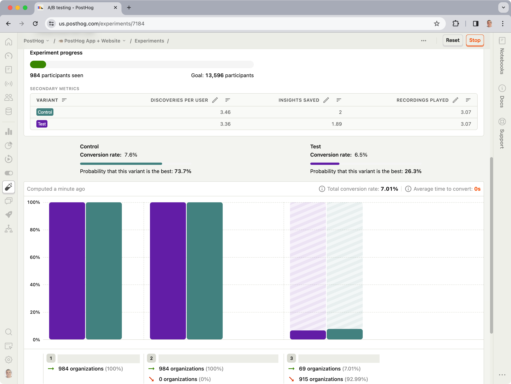
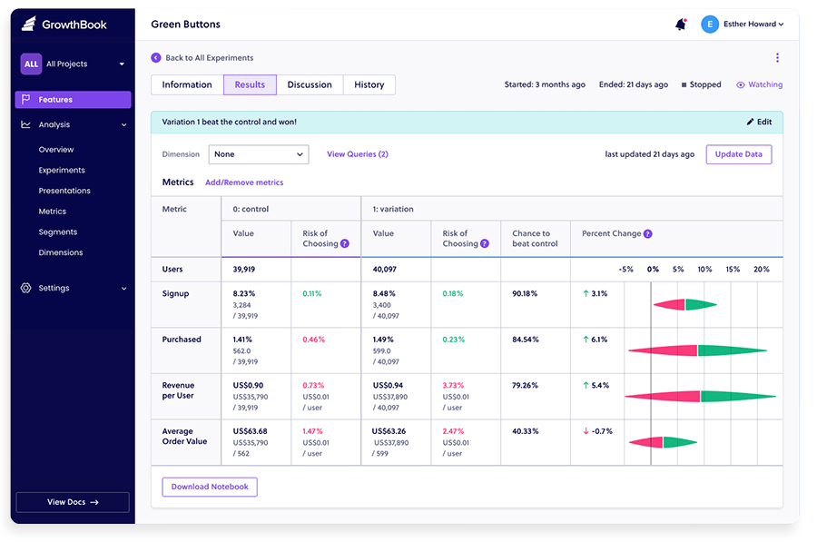
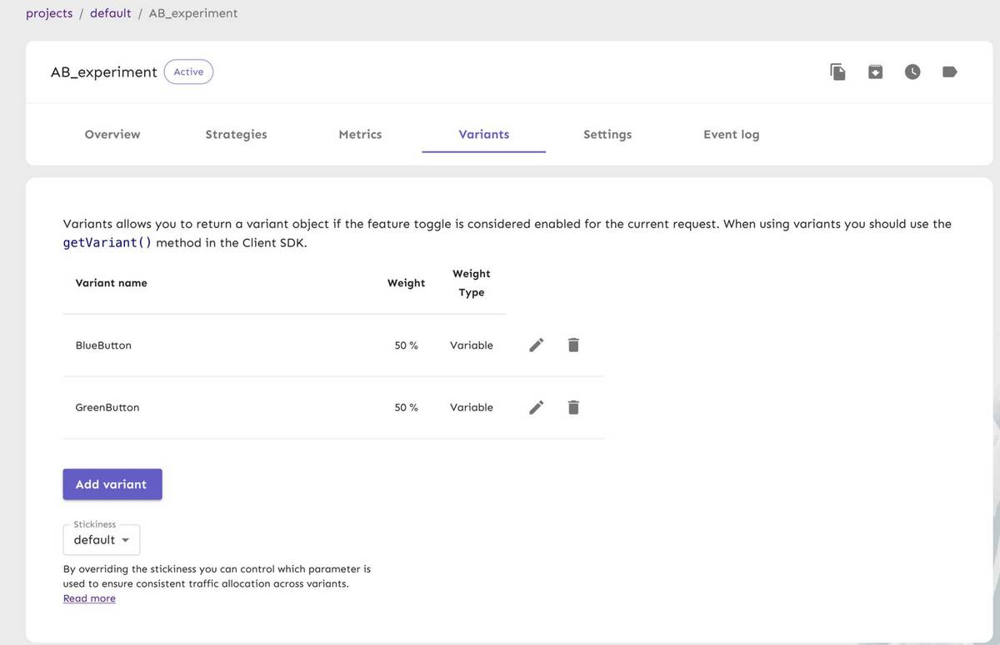
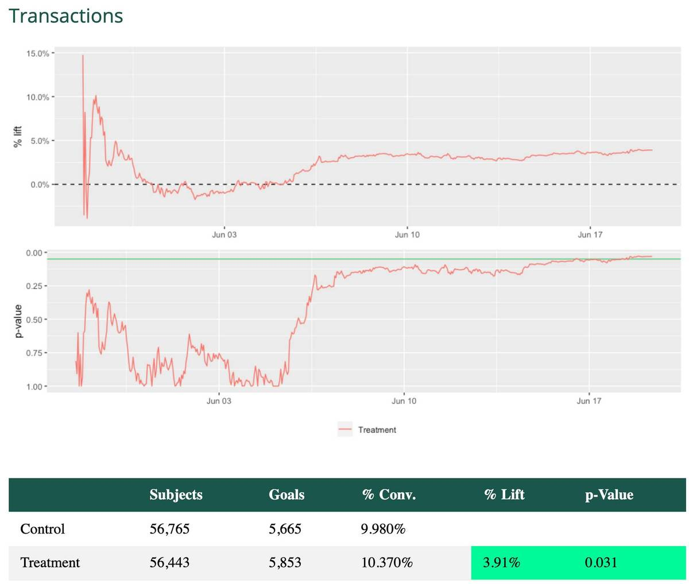
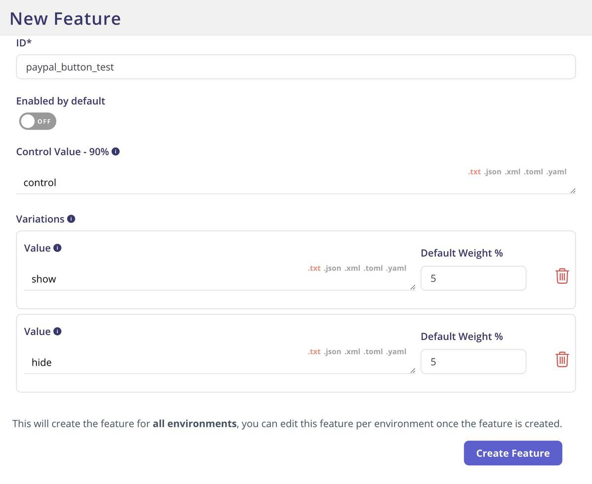
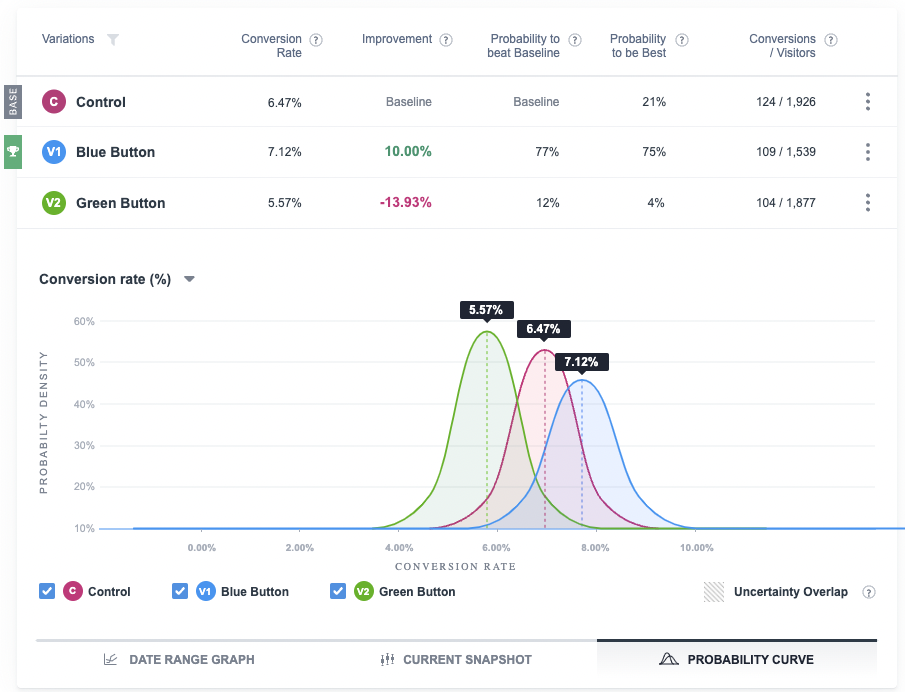

Also known as split testing or [multivariate testing](/product-engineers/what-is-multivariate-testing-examples), A/B testing is the practice of splitting your audience to test variations of a product design, new feature, call to action, landing page – anything you can imagine, really.

Product review website G2 lists 120 products in the A/B testing category, but what they offer varies widely. Many products on G2, for example, lean toward marketing uses cases (i.e. testing website landing pages) and aren't useful for product feature testing, or focus on a narrow subset of companies.

In this guide, we're looking at the best free and open-source A/B testing tools. Open-source tools are mainly built for developers, so we recommend marketers read our guide to the best [alternatives to Google Optimize](/blog/google-optimize-alternatives).

> **Changelog:**
>
> - **Mar 16, 2023:** Added VWO, updated images. Various copy updates and improvements.

## 1. PostHog

[PostHog](https://posthog.com) is an [open-source analytics platform](/blog/best-open-source-analytics-tools) that integrates a comprehensive A/B testing suite with numerous other tools, such as product analytics, feature flags, and session recording. It's designed for product-minded engineers, growth teams, and product managers who need to move fast and iterate based on reliable, actionable insights.

[PostHog’s experimentation suite](/product/experimentation-suite) supports multivariate experiments, and targeting by geography, user cohorts, and user properties – all of which is built atop PostHog's multivariate feature flags. PostHog uses a Bayesian approach to calculate the probability of each variant being the best, and whether the results are statistically significant or not.

### Who is PostHog for?

PostHog is ideal for product teams, particularly those who don't want to assemble a complicated stack of analytics tools. As an all-in-one platform, PostHog includes everything a team needs to measure user behavior, test new features, and roll them out. It's also one of the [best open-source session replay tools](/blog/best-open-source-session-replay-tools) available.

### Features and benefits

- A/B and multivariate testing
- Unlimited experiments
- Multivariate feature flags
- Full product analytics suite
- Ability to select segments for experiments
- Event pipelines for integration with data warehouses
- Traffic visualization with user path analysis

### How much does PostHog cost?

Experimentation is free-to-use on PostHog's Scale plan, which is also [free up to 1 million events](/pricing) and 15,000 recordings per month – you can set billing limits to ensure you don't get surprise bills. While PostHog is open source, its A/B testing features aren't included in the open source release.

> **Further reading:** New to A/B testing? Read [A software engineer's guide to A/B testing](/blog/ab-testing-guide-for-engineers) and our guide to [common A/B testing mistakes](/blog/ab-testing-mistakes).

## 2. GrowthBook

[GrowthBook](https://www.growthbook.io/) is an [open-source platform for feature flags](/blog/best-open-source-feature-flag-tools) and A/B tests that helps teams to deploy code efficiently and analyze experiments. Built by engineers who wanted better insights on new releases, it is a modular solution that promotes feature flagging as an essential step in the development process and can be used as a full-stack platform, a plugin feature flagging tool, or an analysis engine.

### Who is GrowthBook for?

GrowthBook is built for data, engineering and product teams who need the power of a customizable platform without having to build it in house.

### Features and benefits

- Modular platform to adapt to your needs
- Lightweight SDKs for speed
- Easy to implement – no need for data or engineering resources
- Self-hosted and managed options available

### How much does GrowthBook cost?

GrowthBook open source (MIT license) is free and includes unlimited experiments. A hosted version includes a visual A/B test editor and is free up to five users, with pricing at $20 per user per month thereafter.

## 3. Unleash

[Unleash](https://www.getunleash.io/) is a feature management platform that provides an overview of all features across your applications and services. The platform empowers engineering teams to implement A/B tests via feature toggles and offers accurate user targeting.

You can use Unleash to define the rules of your experiments, but the platform doesn’t provide all the tools you need to manage A/B tests end-to-end. Instead, you'll need to connect your experiment with an analytics platform like Google Analytics or Mixpanel in order to visualize results.

### Who is Unleash for?

Unleash is for autonomous development teams who want a lightweight way to test, validate and rollout new features safely.

### Features and benefits

- Accurate user targeting
- Fast toggle evaluation, so performance issues are spotted fast
- Extensive APIs
- Self-hosted and managed service available

### How much does Unleash cost?

Unleash’s basic open source self-hosted plan includes A/B experimentation and is free for two environments. A managed version is also available starting from $80 a month. The open source version is available under an Apache license.

## 4. Mojito

[Mojito](https://mojito.mx/) is an open split testing stack that lets you build, launch and analyze experiments via Git/CI. The stripped-down tool consists of three modular components – a front-end library for bucketing users and tracking them, data models and events for fast reporting, and reporting templates and functions, so you can build your own visualizations for experiment analysis.

### Who is Mojito for?

Mojito is a fully source-controlled stack for developers and technical product teams who want a simple solution with unlimited customization.

### Strengths

- Simple APIs and unlimited customization
- No need for 3rd party analytics
- Error tracking and handling
- Lightweight solution for optimized page load speed

### How much does Mojtio cost?

Mojito is completely free and open source, and you don’t need an account to get started. It's distributed under a BSD 3-clause license.

## 5. Flagsmith

[Flagsmith](https://flagsmith.com) is an open-source feature flag and remote configuration service that lets you manage features across mobile, web and server-side applications. You can use Flagsmith’s multivariate flags as a bucketing engine to place users into testing buckets and control the specific user experience that is being tested. Flagsmith doesn’t provide analytics for multivariate tests, however, so you’ll need to use a third-party provider to receive the stream of event data derived from the behavior of the user.

### Who is Flagsmith for?

Flagsmith is targeted at data-driven front end and user experience teams who want to increase efficiency in their feature development.

### Features and benefits

- Manage flags across multiple platforms
- Powerful segmenting rules
- Integrations with a number of popular analytics platforms
- Remote configuration allows you to toggle features without changing code

### How much does Flagsmith cost?

Flagsmith is open source and available on a BSD 3-clause license. For teams looking to manage their infrastructure, Flagsmith can be hosted entirely on-premises with pricing available on request. They also offer a cloud solution for free up to 50,000 requests per month. 

## 6. VWO

[VWO](https://vwo.com/)'s testing platform caters mainly to large enterprises, but it recently introduced a free tier to entice companies leaving the [soon-to-be-closed Google Optimize](/blog/google-optimize-alternatives). Its experimentation platform offers A/B and multivariate tests, as well as a visual editor. However, many useful features are only available in its paid tiers – the free tier only supports A/B tests using split URLs and doesn't support multiple variations or geo-targeting.

### Who is VWO for?

VWO's free tier is useful for non-technical users who need an easy-to-use (and free) way to test landing pages.

### How much does VWO cost?

VWO's Starter plan is free up to 50k visitors per month, and $199 per month up to 100k visitors per month.