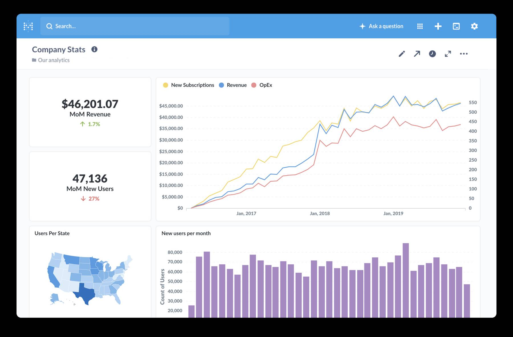
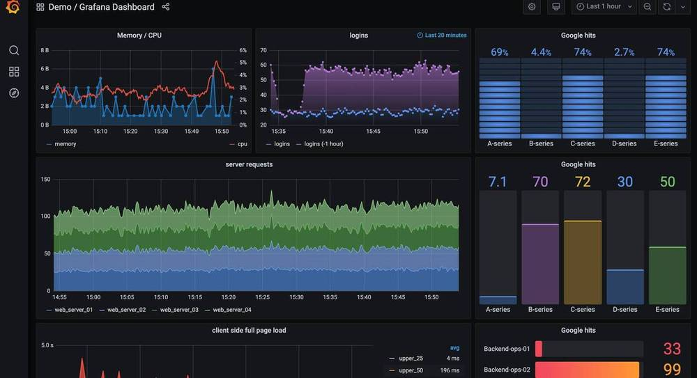
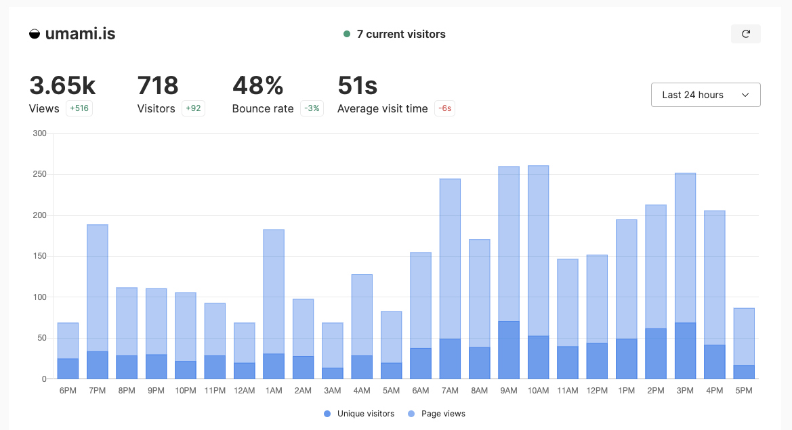
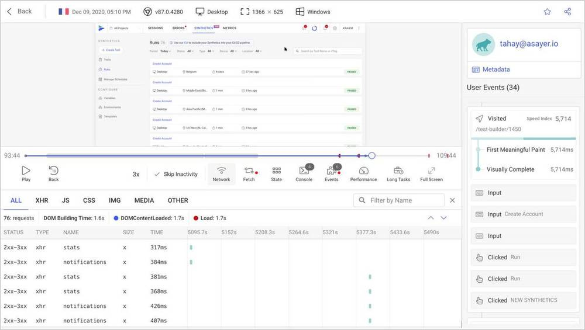
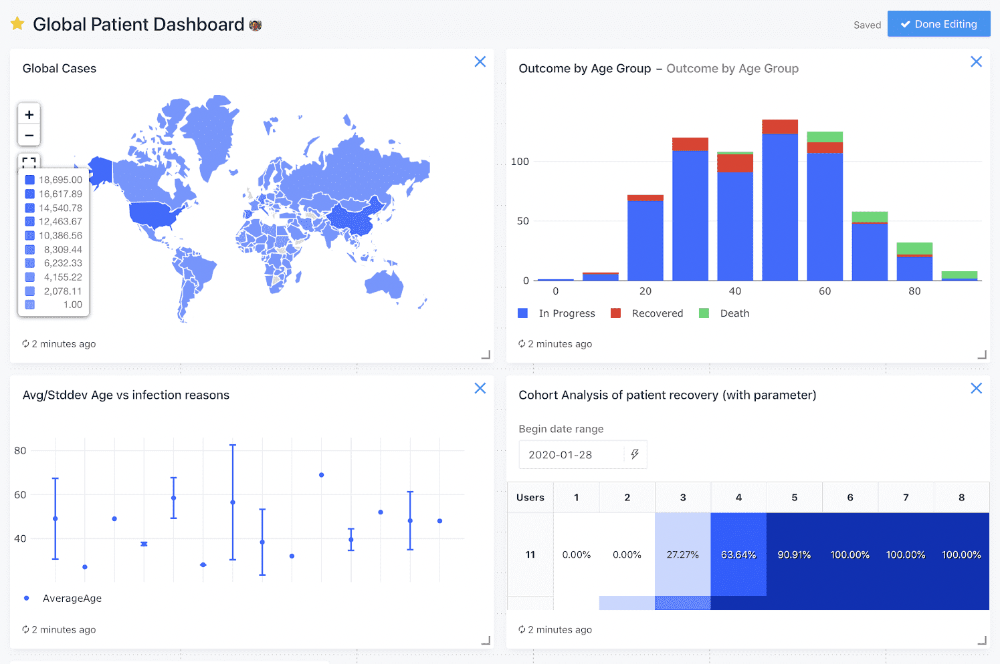
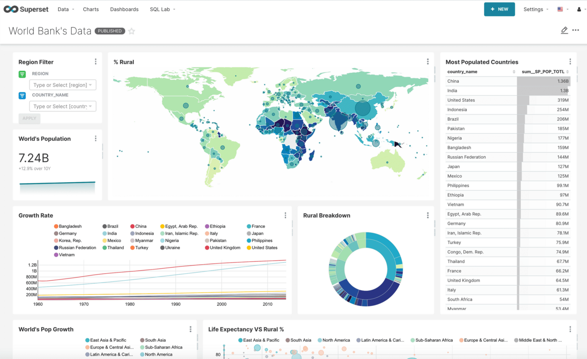
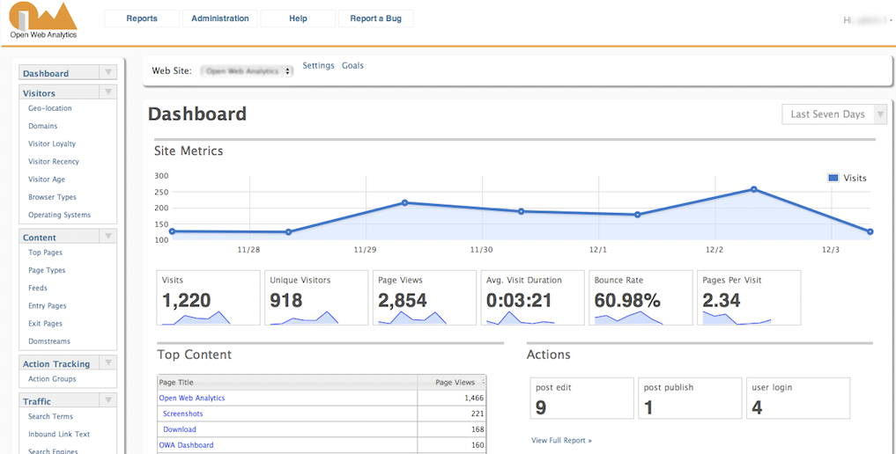

## What are the criteria for this guide?

This guides only includes open-source analytics tools that:

1. **Enable users to visualize and analyze behavioral data for products or websites.** This includes tools that actively capture data as well as dashboarding tools that connect to existing data sources, but not data pipeline platforms like Snowplow or Rudderstack. 

2. **Are actively developed or maintained by a company or community.** This is subjectively judged based on recently merged pull requests, commits to their repos, and the responsiveness of the maintainer to review requests.

3. **Are self-hostable.** Tools that are "open core" but don't offer a free, self-hostable deployment option are not included.

## Who maintains this guide?

This guide is maintained by [PostHog](https://posthog.com/), an open-source analytics platform. You can suggest additions to this guide by opening an issue on our [website repo](https://github.com/PostHog/posthog.com). We update the guide ~3 times per year.

We maintain separate guides on [open-source feature flag tools](/blog/best-open-source-feature-flag-tools) and [open-source AB testing products](/blog/best-open-source-ab-testing-tools).

> **Changelog** 
> - **Mar 14, 2022:** Added Umami; updates to copy and screenshots
> - **Jun 16, 2022:** Added Fathom Lite, GrowthBook, OpenReplay
> - **Aug 24, 2022:** Removed Fathom Lite (dormant), added Apache Superset, Redash
> - **Sep 13, 2023:** Added Ackee and Open Web Analytics
> - **Nov 22, 2023:** Added inclusion criteria, removed Ackee (dormant)

## The best open source analytics tools

### 1. PostHog

- **GitHub Stars:** 14.4k
- **Category:** Product and website analytics
- **Alternative to:** [Mixpanel](/blog/best-mixpanel-alternatives), Amplitude, Hotjar, [FullStory](/blog/best-fullstory-alternatives), LaunchDarkly
- **Language(s):** TypeScript (53%) and Python (42%)
- [PostHog on GitHub](https://github.com/PostHog/posthog)

#### What is PostHog?

[PostHog](https://posthog.com/) is an all-in-one platform designed to give engineers and product managers a complete view of user behavior. It's built on the highly-scalable ClickHouse OLAP database.

Features include a comprehensive product analytics suite (e.g. trend analysis, dashboards, funnels, path analysis, retention tracking etc.), feature flags for feature control, experimentation (A/B and [multivariate testing](/product-engineers/what-is-multivariate-testing-examples)), session recording, heatmaps and [more](/product).

It’s entirely self-serve, with the ability to autocapture event information out of the box. PostHog can also be self-hosted on your existing infrastructure using Docker Compose, making it ideal if you don't want to share data with third parties. 

It's a good option if you're after an [open-source session recording tool](/blog/best-open-source-session-replay-tools), too. 

#### Who is PostHog for?
PostHog is useful for engineering, data science, and product teams. As an all-in-one platform, it can replace multiple tools (e.g. Mixpanel, LaunchDarkly, Hotjar) so you can simplify your tech stack. [PostHog customers](/customers) include the likes of [Hasura](/customers/hasura), [Netdata](/customers/netdata), and [Phantom](/customers/phantom).  

#### Strengths
- All-in-one analytics suite
- Easy-to-use, no SQL required
- Self-hosting and cloud-hosting available
- Feature flags for safely deploying changes
- Multivariate experimentation suite for testing ideas
- Session recording for gathering insights
- Event pipelines to integrate with data warehouses
- Built on the ultra-fast ClickHouse OLAP database

#### License and monetization

[PostHog Open Source](https://github.com/PostHog/posthog) is free to use for life and distributed under an MIT license. The open-source version includes the core product analytics, feature flag, and session recording features, but has a one project limit. There's also a [FOSS edition](https://github.com/PostHog/posthog-foss) that removes all proprietary code. 

Subscribing to PostHog Cloud removes the project limit and adds numerous paid-only features, including experimentation, correlation analysis, group analytics for tracking organizations, and advanced cohorts. PostHog Cloud is [free up to 1 million events per month](/pricing).

### 2. Matomo

- **GitHub Stars:** 18.4k
- **Category:** Website analytics
- **Alternative to:** Google Analytics
- **Languages:** PHP (78%), JavaScript (8.1%)
- [Matomo on GitHub](https://github.com/matomo-org/matomo)

#### What is Matomo?

[Matomo](https://matomo.org/) is an open-source platform for website analytics. It's one of the most popular open-source [alternatives to Google Analytics 4](/blog/ga4-alternatives) for website owners and marketing teams. It even offers a data import tool for Google Analytics, so you can bring your data with you. You can run it on-premise or use Matomo's own cloud hosting service.

#### Who is Matomo for?
Matomo is intended for marketing and website teams looking to track content performance and marketing attribution. It's suitable for both SMBs and enterprises – the European Union runs a version of Matomo on all its websites.

#### Strengths
- Google Analytics data importer
- Easy to set up on WordPress and WooCommerce
- Marketing metrics and attribution
- Integrations with popular off-the-shelf CMS
- Built-in GDPR and tag managers

#### Open source license and monetization
Matomo on-premise is available under a AGPLv3 license. It includes Matomo's core web analytics reports, such as ecommerce tracking, real-time analytics, and content tracking, and supports an unlimited number of websites and users. Numerous premium add-ons (e.g. roll-up reporting, A/B testing, cohorts, funnels etc.) are charged for on a per-user basis. Cloud hosting is also available, which is billed on hits.

**Related:** [In-depth PostHog vs Matomo comparison](/blog/posthog-vs-matomo)

### 3. Metabase

- **GitHub Stars:** 34.9k
- **Category:** Dashboarding and business intelligence
- **Alternative to:** Looker, Tableau, Power BI
- **Languages:** Clojure (49%), JavaScript (33%), TypeScript (17%)
- [Metabase on Github](https://github.com/metabase/metabase)

#### What is Metabase?

[Metabase](https://www.metabase.com/) is one of the most popular open-source business intelligence (BI) tools, offering teams a way to visualize complex data and run analysis with no coding required. Instead, Metabase’s visual query builder enables you to create shareable dashboards in just a few minutes with a drag-and-drop interface — though a native SQL editor is available for advanced users.

#### Who is Metabase for?

Metabase's drag-and-drop interface makes it accessible for technical and non-technical teams, making it an ideal platform for democratizing data analytics in organizations.

#### Strengths
- Easy-to-use, no SQL required
- Automated reports and interactive dashboards
- Self-hosting and cloud-hosting available
- Integrate with 20+ data sources

#### License and monetization
Metabase is available under a AGPL license. A limited version of the product is available for free, while an Enterprise license is available for a cost. Check [the Metabase repo](https://github.com/metabase/metabase) for more information.

### 4. Plausible Analytics

- **GitHub Stars:** 16.8k
- **Category:** Website analytics
- **Alternative to:** Google Analytics
- **Languages:** Elixir (74%), JavaScript (14%)
- [Plausible on Github](https://github.com/plausible/analytics/)

#### What is Plausible Analytics?

[Plausible Analytics](https://plausible.io/) is focused on providing website analytics that don’t infringe on user privacy. That means Plausible doesn’t rely on cookies and is naturally compliant with regulations like GDPR. 

Unlike Matomo, Plausible is a very streamlined tool rather than a feature-equivalent Google Analytics alternative. As a result, it's a great fit for smaller teams who prefer ease of use to in-depth reporting, or hobby deployments if you just want basic analytics for a website or blog.

#### Who is Plausible Analytics for?
Plausible is intended for marketing teams and website owners who want to track top-level website metrics, such as pageviews, bounce rate and visit duration, but it's not an ideal tool for understanding user behavior.

#### Strengths
- Easy to use and focused on essential web metrics
- Lightweight integration script won’t impact page performance
- No cookies required, GDPR compliant out of the box 

#### License and monetization
Plausible Analytics is available under a AGPLv3 license and can be self-hosted via Docker Compose. Pricing for its hosted version starts at €9 per month for 10,000 monthly pageviews.

> **Also consider:** Plausible is one of a large subset of privacy-first analytics products that have proven popular in the wake of GDPR and less permissive attitudes to user tracking. [Umami](https://umami.is/) is another popular, open-source product in this space. Read our [GDPR analytics guide](/blog/best-gdpr-compliant-analytics-tools) for more options.

### 5. Grafana

- **GitHub Stars:** 58k
- **Category:** Dashboarding and data observability
- **Alternative to:** Datadog, Dynatrace 
- **Languages:** TypeScript (57%), Go (37%)
- [Grafana on GitHub](https://github.com/grafana/grafana)

#### What is Grafana?

[Grafana](https://grafana.com/products/cloud/) is an open-source data observability platform. It focuses on interactive visualization, providing a wide variety of charts, graphs, and alerts that can be connected to a wide range of online data sources. As a result, it’s a powerful system for monitoring and analyzing data in real-time.  

#### Who is Grafana for?

Grafana is an ideal choice for engineering, DevOps, or data science teams in businesses of any size, including enterprises, who need to observe and monitor data.

#### Strengths

- Great for tracking data in real time
- Multiple products allow you to scale
- Get alerts when anomalous events occur
- Integrates with a wide range of data sources

#### License and monetization

Grafana is available to self-host under an AGPLv3 license. Grafana Cloud also has a free tier, though it's limited to three active users and 14 days retention. Additional tiers remove those limitations.

### 6. Umami

- **GitHub Stars:** 16.9k
- **Category:** Website analytics
- **Alternative to:** Google Analytics, Plausible
- **Languages:** 53% JavaScript, 39% TypeScript
- [Umami on GitHub](https://github.com/umami-software/umami)

#### What is Umami?

[Umami](https://umami.is/) is another popular privacy-first website analytics tool. Like Plausible, it tracks basic website analytics, doesn't collect any personal information, and is extremely fast. On top of this, you can track basic events, such button clicks, using CSS classes or JavaScript. It also offers a free cloud hosting option.

#### Who is Umami for?

Hobbyists who want basic website analytics that doesn't collect any personal data.

#### Strengths

- Fast and lightweight, no impact on website performance
- Doesn't collect any personally identifiable information
- Easy to self-host and configure

#### License and monetization

Umami is available via an MIT license. The cloud hosted option is free up to 10k events per month, then starts at $9 per month for their "Pro" tier.

### 7. OpenReplay

- **GitHub Stars:** 8.2k
- **Category:** Session replay and funnel analysis
- **Alternative to:** LogRocket, Hotjar 
- **Languages:** Python (25%), TypeScript (24%), JavaScript (24%)
- [OpenReplay on GitHub](https://github.com/openreplay/openreplay)

#### What is OpenReplay?

[OpenReplay](https://openreplay.com/) is a session replay suite built for developers and privacy conscious companies. While it lacks many core analytics features, it does offer some basic analytics features such as funnel analysis.  

Its session replay feature automatically captures events, and provides useful click maps in addition to detecting rage clicks and slow loading pages. It also offers funnel analysis, performance monitoring, error tracking, and extensive integrations with other logging tools.

#### Who is OpenReplay for?
OpenReplay is primarily for developers, especially due to its focus on error tracking and bug fixing. It's a good option for early-stage products looking to understand user behavior and validate product-market fit.

#### Strengths
- Privacy-friendly
- Error tracking and bug fixing features
- Performance monitoring

#### License and monetization
OpenReplay is available under the ELv2 license. An Enterprise version adds additional reporting features and dedicated support, but there's no public pricing. There's also a cloud version with pricing based on sessions.

### 8. GrowthBook

- **GitHub Stars:** 5.1k
- **Category:** Experimentation
- **Alternative to:** LaunchDarkly
- **Languages:** TypeScript (92%)
- [GrowthBook on GitHub](https://github.com/growthbook/growthbook)

#### What is GrowthBook?

GrowthBook is an [open source A/B testing](/blog/best-open-source-ab-testing-tools) and feature flag tool for teams who want granular control over rolling out new features, and the ability to validate those changes through experiments. 

It supports multiple development environments, each with a unique API endpoint, and its comprehensive feature flag functionality allows for targeting based on user properties.

You don't need to import metric data into GrowthBook as it works with your data wherever it lives, be that a data warehouse or an analytics tool like Mixpanel, but it lacks any additional analytical features.

#### Who is GrowthBook for?

GrowthBook is ideal for engineering teams who want flexible, instant control over what users see in their product and already have, or don't require, a broader analytics platform.

#### Strengths
- Multivariate feature flags
- A/B testing visual editor
- Can be self-hosted
- No performance impact

#### Open source license and monetization

GrowthBook is distributed under an MIT license and self-hosted is supported at no cost. The cloud version is free for up to three users, and $20 per user per month thereafter. 

### 9. Redash

- **GitHub Stars:** 24.1k
- **Category:** Dashboarding and business intelligence
- **Alternative to:** Looker, Tableau, Power BI
- **Languages:** Python (41%), JavaScript (33%), TypeScript (17%)
- [Redash on GitHub](https://github.com/getredash/redash)

#### What is Redash?

Like Metabase, Redash is a tool for connecting to and visualizing data from a number of different sources. Unlike Metabase, you need to be fluent in SQL to get the most from it. Redash supports more data sources than Metabase by default, though how important this is will depend on your specific needs.

#### Who is Redash for?

Redash is ideal for engineering and data teams who want lots of flexibility for accessing and interrogating data.

#### Strengths

- Powerful SQL editor
- Alerts for changes in metrics
- Large selection of charts and visualizations
- Excellent range of natively supported data sources

#### Open source license and monetization

Redash is distributed via a BSD-2-Clause license. It currently has no paid tiers or limitations.

### 10. Apache Superset

- **GitHub Stars:** 55.3k
- **Category:** Dashboarding and business intelligence
- **Alternative to:** Looker, Tableau, Power BI
- **Languages:** TypeScript (37%), Python (33%), JavaScript (13%)
- [Superset on GitHub](https://github.com/apache/superset)

#### What is Superset?

Superset is the third of the big open-source business intelligence tools alongside Metabase and Redash. It's also considered the most complex and least accessible for non-technical users, though its range of visualizations and charting options is unmatched.

#### Who is Superset for?

Superset is ideal for enterprises with experienced in-house data teams. It can handle large data sets, and provides extensive permissioning systems, so you can restrict access to sensitive data.

#### Strengths

- Connects to a large range of SQL databases
- Large and active community
- Powerful web-based SQL query editor
- Huge range of charting options
- Deck.GL integration for advanced geographic dataviz

#### Open source license and monetization

Apache Superset is distributed under an Apache-2.0 license. There are no paid features or tiers.

### 11. Countly

- **GitHub Stars:** 5.3k
- **Category:** Product analytics
- **Alternative to:** Mixpanel, Amplitude, LogRocket
- **Languages:** JavaScript (82%), HTML (9.4%)
- [Countly on GitHub](https://github.com/Countly/countly-server)

#### What is Countly?

Like PostHog, [Countly](https://count.ly/) offers a wide range of tools to help you build better products. It has a strong focus on mobile and desktop applications, and enables you to bring together both qualitative and quantitative insights. However many features, such as dashboards, funnel analysis, and retention tracking are only available in the enterprise-level product.

#### Who is Countly for?

Countly is suitable for both small teams and enterprise businesses, especially those which focus on mobile apps. The crash analytics tools make it useful for customer support and engineering teams, too. 

#### Strengths

- Wide range of analysis tools
- Focus on mobile and desktop app development
- Crash analytics to diagnose bugs
- Run surveys to get qualitative insights

#### Open source license and monetization
Countly's Community Edition is available under a AGPLv3 license, but it's somewhat limited. It includes versions of its core analytics features, but customer behavior insights (e.g. retention, cohorts, funnels, user paths) are only available in the paid Enterprise Edition. Countly doesn't provide public pricing information.

### 12. Open Web Analytics

- **GitHub Stars:** 2.2k
- **Category:** Website analytics
- **Alternative to:** Google Analytics
- **Languages:** 67% PHP, 23% JavaScript
- [OWA on GitHub](https://github.com/Open-Web-Analytics/Open-Web-Analytics)

#### What is Open Web Analytics?

[Open Web Analytics](https://www.openwebanalytics.com/) is an entirely free, open-source alternative to Google Analytics. In addition to usual web analytics basics, it includes a basic heatmap feature, and the ability to track clicks on all DOM elements. It's less focused on privacy than others in this list, so you can use it to track when users come back, and perform basic campaign and ecommerce tracking. 

In comparative terms, it's more advanced than Plausible and Umami, but less advanced than Matomo or PostHog, though the interface is somewhat dated. 

#### Who is Open Web Analytics for?

OWA suits developers who want self-hosted analytics, but desire more tracking capabilities than privacy-focused alternatives like Plausible.

#### Strengths

- Simple GDPR compliance
- Control over your own data
- Heatmap and DOM element tracking
- Basic campaign and e-commerce tracking

#### Open source license and monetization
Open Web Analytics is distributed under the GPL-2.0 license. There are no paid features.