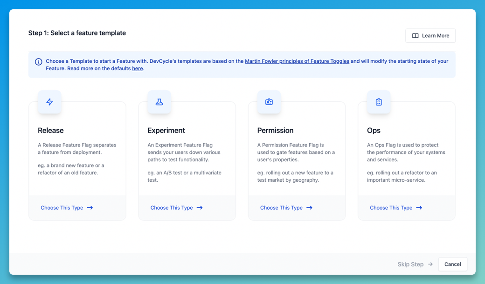

Feature flags, aka feature toggles, turn specific functions on and off during runtime. Rather than maintaining multiple feature branches in your source code, feature flags hide code or behaviors and allow you to enable or disable features on demand and without deploying new code.

They're useful for:

- **Safely releasing features** by eliminating complex branching and gradually rolling out feature access so you can [react quickly if issues arise](https://posthog.com/customers/phantom).

- **Running multivariate tests** so you can understand the impact of new features and changes.

- **Controlling access** to certain features based on user criteria, such as location, device type or subscription level.

In this guide, we’ll explore some of the best open source feature flag tools, all of which are either totally free or offer generous free plans.

If you want to run experiments as well, we recommend reading our guide to the [best open-source A/B testing tools](/blog/best-open-source-ab-testing-tools).

## 1. [PostHog](https://posthog.com)

PostHog is an all-in-one [product analytics platform](https://posthog.com/product) that holds and visualizes all of the data your team needs in one place. Complete with Session Recording, Heatmaps, Path analysis, Funnels and more, it’s a great choice if you want to build a comprehensive, data-driven product strategy, fast.

As well as [Feature Flags](https://posthog.com/docs/user-guides/feature-flags), you can take advantage of the toggles in the [Experimentation suite](https://posthog.com/docs/user-guides/experimentation) to test hypotheses on product changes with A/B tests or define user segments for feature access. [Multivariate flags](https://posthog.com/docs/user-guides/feature-flags#multivariate-feature-flags-beta) allow you to test several variants of the same interchangeable content.

### Who is PostHog for?

PostHog is built primarily for engineers and other product-minded teams. With all of your analytics in one place, everyone in the organization is empowered to examine and act on user data. You can also self-host PostHog, which is ideal for any company with stringent data privacy needs.

### Strengths

- All-in-one product analytics platform
- Easy to get set up (no SQL needed)
- A/B tests with PostHog’s experimentation suite
- Multivariate flags for several variations per test
- Target by user properties and percentage
- Unlimited flags
- Multi-environment support
- Free third-party apps to enrich your data

### How much does it cost?

Feature flags are a core feature of all editions, including the open source release. While multivariate feature flags are limited to paid plans, PostHog's paid plans are [free up to 1 million events every month](/pricing).

### Open source license

PostHog open source is available under an MIT license. Read more about [self-hosting PostHog](https://posthog.com/docs/self-host) in our docs.

<ArrayCTA />

## 2. [Flagsmith](https://flagsmith.com/)

Flagsmith is a feature flag tool which makes it easy to test and deploy new functional and visual changes to users without pushing updates to code. All flags in Flagsmith are capable of being configured for cross-platform remote configuration, so you can alter an app in real-time without having to wait for app-store approval.

Flagsmith is heavily user-focused. You can use the tooling to create detailed user segments based on store traits. and roll out features based on those identifiers.

The platform doesn’t provide full analytics however, so a third-party provider will be required for visibility on any testing you want to carry out.

### Who is Flagsmith for?

Flagsmith is for product-conscious front-end developers who want to be able to test new features in production and roll them out at the right time without having to modify the back-end.

### Strengths

- Cross-platform functionality
- Out of the box 3rd party analytics integrations
- User-focused segmentation
- Update in real-time without back end intervention

### How much does it cost?

Flagsmith is free up to 50,000 requests per month when you choose the cloud solution. If you’re looking to self-host, pricing is available on request.

### Open-source license

Flagsmith is covered by a BSD 3-clause open source license. You can [take a look at their GitHub](https://github.com/Flagsmith/flagsmith) to read more.

## 3. [Harness](https://harness.io/)

Harness is a Software Delivery Platform which uses AI to help development teams take their delivery pipeline to the next level. The feature flag module benefits from succinct user targeting and offers basic analytics to track the usage and impact of your features.

Harness feature flags include a significant level of control when it comes to governance with an automated policy engine powered by Open Policy Agent. You can also integrate with a number of popular workflow tools like Jira and Slack.

### Who is Harness for?

Harness is a good choice for organizations who are concerned with compliance. Their policy engine enforces local and global governance standards on deployments, infrastructure and more so development teams can move very quickly while maintaining rules and standards.

### Strengths

- Easy integration into CI/CD
- Manage governance needs with RBAC and audit logs
- Integrate with workflows in GitOps and YAML
- End-to-end software delivery platform

### How much does it cost?

Harness’s feature flags module is free with unlimited flags and environments for up to 25,000 client monthly active users. Pricing starts at $25 per developer per month if you want to add on support, SLAs or increase client MAUs.

### Open source license

Harness has several open source options depending on company size and the level of support required. A free, team-maintained edition is available to certain businesses under the Polyform Small Business License, and there are community editions under Apache 2.0 and PolyForm Sheild. Learn more on [GitHub](https://github.com/harness).

## 4. [Unleash](https://www.getunleash.io/)

Unleash lets you safely test and release new features with defined rules. The platform removes pressure from developers and lets them play around with features safely. The Canary release feature allows you to strategically manage gradual roll outs, identify issues and use kill switches to roll back in seconds.

Unleash is not an analytics platform, and you’ll need to connect a third-party platform to visualize analytics on experiments like A/B tests.

### Who is Unleash for?

Unleash is for development teams who want freedom and creativity to test their releases in a safe environment and ensure consistent performance for all users.

### Strengths

- Super fast performance monitoring
- Refined user segmentation
- Rollout strategy management for gradual releases
- Fall-back mechanisms and SDKs that keep local back-ups

### How much does it cost?

Unleash is free for two environments when you self-host. A managed version is also available at cost if you want to add team members or access additional features like advanced segmentation or custom activation strategies.

### Open source license

Unleash is available under an Apache license. Take a look at their [GitHub](https://github.com/Unleash/unleash) to see more details.

## 5. [GrowthBook](https://www.growthbook.io/)

GrowthBook is an open source feature flagging and experimentation platform built to help companies make better data-driven decisions. Its flag tool features advanced targeting, gradual rollouts and experiments. The platform is highly customisable and gives users the option to choose between a full testing platform, a plugin toggle tool or a data analysis engine.

### Who is GrowthBook for?

GrowthBook is designed to be used by any data-driven team in your company, with SDKs built with developers in mind, transparency and automation for data-analysts and an accessible user-interface for product managers.

### Strengths

- Accessible for all teams
- Advanced targeting for experiments
- Modular, customizable platform
- Automated experiment analysis
- Unlimited flags

### How much does it cost?

Growthbook’s open source self-hosted plan is free forever, with unlimited flags and experiments.

### Open source license

Available under an MIT license. Take a look at the [Growthbook GitHub](https://github.com/growthbook/growthbook/) to learn more.

## 6. [DevCycle](https://devcycle.com/)

DevCycle is a progressive feature delivery solution focused on improving development team workflows and reporting. Its feature flag platform comes with full SDK coverage for all major languages, customized workflows which integrate with the existing PR environment and status reports which make your work transparent for all stakeholders.

### Who is DevCycle for?

DevCycle is designed for developers who want strong project management tools for their feature flags in order to stay aligned with product stakeholders. Their concise release activity monitoring allows for easy reporting and keeps code clean.

### Strengths

- Feature experimentation
- Powerful dashboard with global feature flag view for simple reporting
- Full SDK and API coverage
- Workflow customization

### How much does it cost?

DevCycle has a 14 day free plan with up to 1,000 client-side monthly active users and 25,000 experimentation events. If you’re happy after your time is up, it’s $12 per seat per month to upgrade to pro.

### Open source license

DevCycle is open source and available under an MIT license. You can [find them on GitHub here](https://github.com/DevCycleHQ).

<NewsletterForm compact />