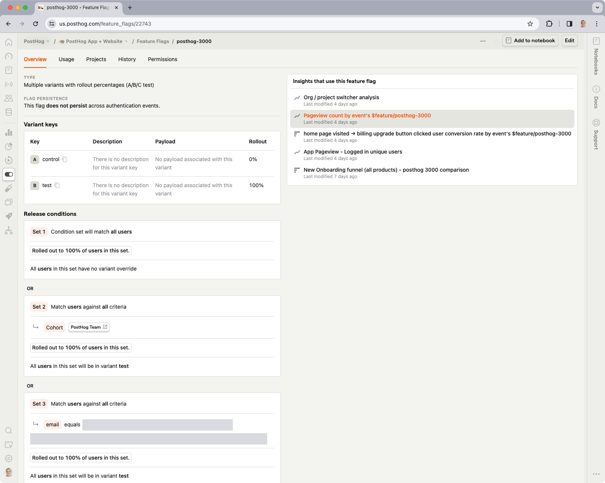
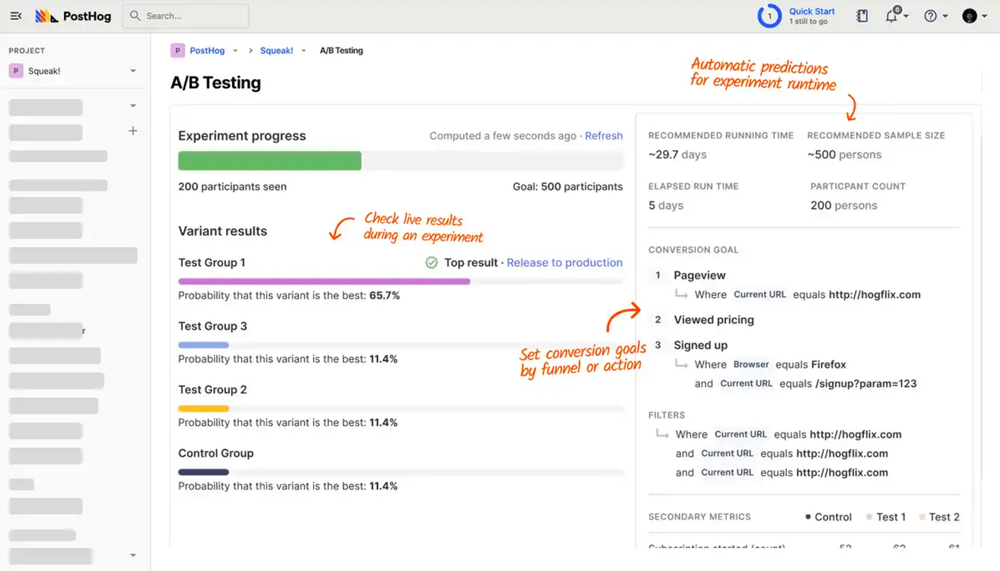
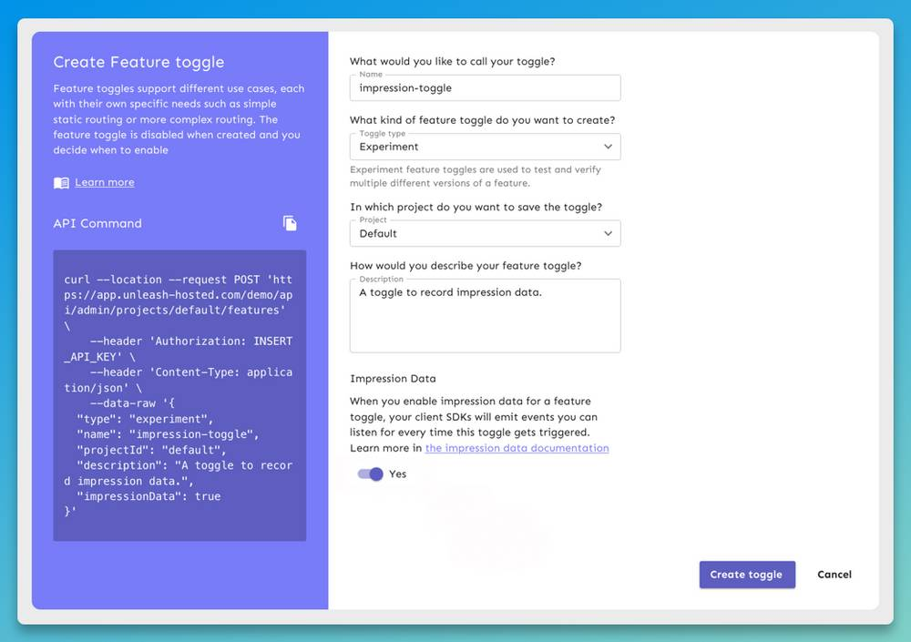
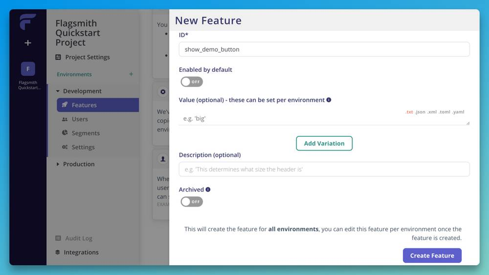
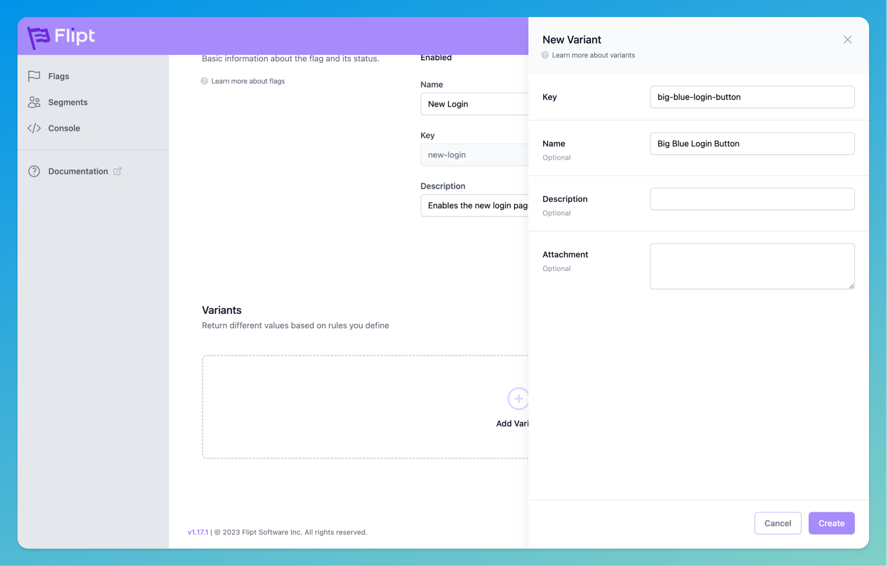
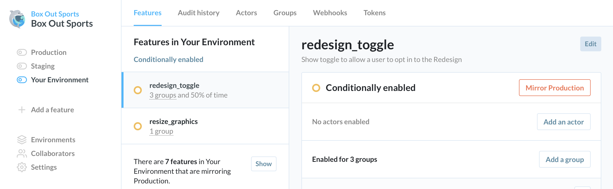
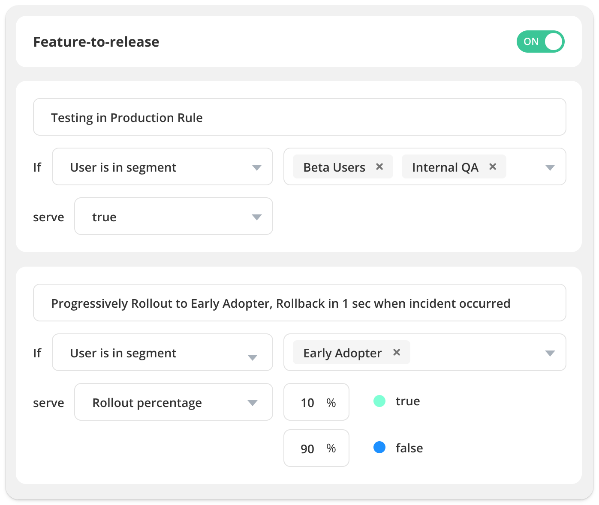
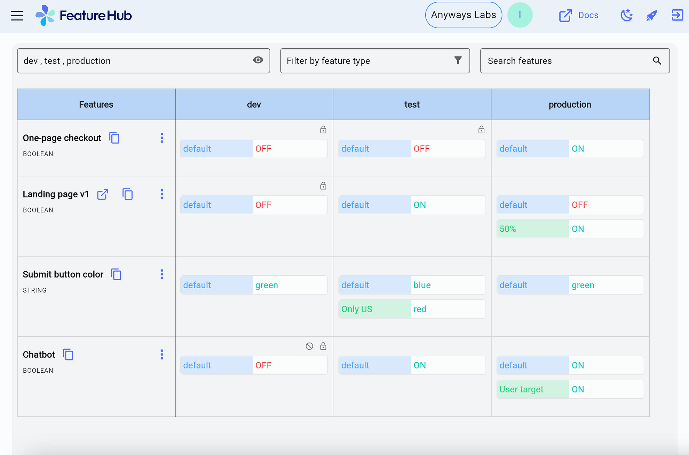

The [benefits of feature flags](/product-engineers/feature-flag-benefits-use-cases) are numerous. They help you mitigate risk, [test changes in production](/product-engineers/testing-in-production), manage access, and most important of all, ship faster.

While it's tempting to [build your own tools](/blog/feature-flags-as-a-service), there's no shortage to feature flag services with decent free tiers, or open-source feature flag tools you can self-host. These are the best and most popular right now.

## The best open-source feature flag tools

> **Changelog:**
> - **Mar 15, 2023:** Removed DevCycle, added Flipt. Updated copy and screenshots.
> - **Sep 14, 2023:** Removed Harness, added Flipper and FeatBit, added SDKs
> - **Dec 11, 2023:** Added FeatureHub

### 1. PostHog

- **License:** MIT
- **GitHub stars:** 14.8k
- [PostHog on GitHub](https://github.com/PostHog/posthog)

#### What is PostHog?

[PostHog](https://posthog.com) is a [popular alternative to LaunchDarkly](/blog/best-launchdarkly-alternatives) and analytics tools like [Amplitude](/blog/best-amplitude-alternatives).

It's an all-in-one platform, which means it offers product analytics, session replay, A/B testing, and user surveys, in addition to feature flags.

PostHog's [feature flags](/docs/feature-flags) enable conditional rollouts, multivariate flags, JSON payloads, automated usage reports, local evaluation, and more. They power its [A/B testing features](/docs/experiments), so you can test product changes for their impact on key metrics. 

PostHog also offers an [early access feature management](/docs/feature-flags/early-access-feature-management) feature, which enables users to self-onboard to beta features behind feature flags. 

#### Supported libraries

- **Client-side:** JavaScript, React Native, React, Android, iOS, Flutter, Remix, Angular, Next.js, Svelte.

- **Server-side:** Node.js, Python, PHP, Ruby, Go.

You can also evaluate feature flags using PostHog's API from any language that can make HTTP requests.

#### How much does it cost?

There are no limits on feature flag usage in the open-source edition, though A/B testing isn't available. PostHog's Cloud edition includes 1 million API requests per month for free – see the [feature flag pricing page](/pricing?product=feature-flags) for more info.

### 2. Unleash

- **License:** Apache
- **GitHub stars:** 9k
- [Flagsmith on GitHub](https://github.com/Unleash/unleash)

#### What is Unleash?

[Unleash](https://www.getunleash.io/) is open-source feature flag service with a public roadmap and a strong community. Official SDK support is comprehensive and there's a large selection of community maintained SDKs for less popular frameworks, too.

#### Supported SDKs

- **Client-side:** JavaScript, Android, Flutter, iOS, React, Svelte, Vue.

- **Server-side:** Go, Java, Node.js, PHP, Python, Ruby, Rust, .NET.

- **Community maintained:** Angular, Clojure, C++, ColdBox, Dart, Elixir, Haskell, Laravel, NestJS, React Native, Solid.

### How much does it cost?

Unleash is free for two environments when you self-host. A managed version is also available at cost if you want to add team members or access additional features like advanced segmentation or custom activation strategies.

### 3. GrowthBook

- **License:** MIT
- **GitHub stars:** 5.2k
- [GrowthBook on GitHub](https://github.com/growthbook/growthbook/)

#### What is GrowthBook?

[GrowthBook](https://www.growthbook.io/) is a warehouse native, open-source feature flagging and experimentation platform built to help companies make better data-driven decisions. Its flag tool features advanced targeting, gradual rollouts, and experiments. 

It's warehouse native with support for most major SQL data sources, and there's a code-free visual experiment editor that can used be less technical end users.

#### Supported SDKs

- **Client-side:** JavaScript, React, Android (Kotlin), iOS (Swift), Flutter, Vue

- **Server-side:** PHP, Ruby, Python, Go, Java, C#.

#### How much does it cost?

Growthbook’s open source self-hosted plan is free forever, with unlimited flags and experiments. GrowthBook also offers a hosted version with pricing based on the number of users.

### 4. Flagsmith

- **License:** BSD 3-clause
- **GitHub stars:** 3.4k
- [Flagsmith on GitHub](https://github.com/Flagsmith/flagsmith)

#### What is Flagsmith?

[Flagsmith](https://flagsmith.com/) is a feature flag tool that makes it easy to test and deploy new functional and visual changes to users without pushing updates to code. 

All flags in Flagsmith are capable of being configured for cross-platform remote configuration, so you can alter an app in real-time without having to wait for app store approval.

It supports local evaluation, scheduling, and paid plans offer an Edge API that automatically routes requests to the closest data center to the user.

#### Supported SDKs

- **Client-side:** JavaScript, React Native, React, Android, iOS, Next.js.

- **Server-side:** Node.js, Python, PHP, Ruby, Go, .NET, Ruby, Rust, Elixir.

#### How much does it cost?

Flagsmith is free up to 50,000 requests per month when you choose the cloud feature flag service. In addition to open source, Flagsmith also offers self-hosted and private cloud options.

### 5. Flipt

- **License:** GPL-3.0
- **GitHub stars:** 3k
- [Flipt on GitHub](https://github.com/flipt-io/flipt)

#### What is Flipt?

[Flipt](https://www.flipt.io/) is a popular open-source option for feature flagging. It's 100% open source with no paid editions. It supports all basic [feature flag use cases](/blog/feature-flag-benefits-use-cases), such as rolling out features based on segments (e.g. new users, email, country etc.), multiple variations, and percentage thresholds for rollouts. It also supports storing your flags in Git, so it can be used without a database.

#### Supported SDKs

- **Client-side:** JavaScript/TypeScript, React, Android (Kotlin).

- **Server-side:** C#, .NET, C++, Dart, Go, Java, Node, PHP, Python, Ruby.

#### How much does it cost?

Nothing. There is no paid version of Flipt. It's distributed under a GPL-3.0 license.

### 6. Flipper

- **License:** MIT
- **GitHub stars:** 3.4k
- [Flipper on GitHub](https://github.com/flippercloud/flipper)

Flipper is a rebuilt version of the [feature flag platform used by GitHub](/blog/github-gitlab-feature-flags), maintained by a small team of ex-GitHub engineers. It supports all the common use cases for feature flags, such as boolean flags, group targeted flags, and targeting by actors or a percentage of actors. It currently only supports Ruby applications, though support for other languages is planned.

#### Supported SDKs

Ruby only

#### How much does it cost?

In addition to the free open-source edition, Flipper also offers a cloud-hosted version with a 14-day trial. It's priced at $20 per seat with unlimited flags and projects.

### 7. FeatBit

- **License:** MIT
- **GitHub stars:** 1.1k
- [FeatBit on GitHub](https://github.com/featbit/featbit)

#### What is FeatBit?

FeatBit is an open-source feature flag and A/B testing tool that's available in Standard (for small businesses) and Professional (for enterprises) flavors – the Standard edition is easier deploy due to fewer dependencies. It supports custom user segments, rolling out by percentages, and feature flag scheduling. A/B testing data can also be exported to tools like Datadog, Grafana, and Amplitude.

#### Supported SDKs

- **Client-side:** JavaScript, React, Vue.

- **Server-side:** Python, PHP, Ruby, Go, .NET, Java.

### How much does it cost?

All features are completely free. FeatBit monetizes its platform by offering premium support packages, which start at $399 per month for dedicated support with a 2-hour reply SLA during business hours.

### 8. FeatureHub

- **License:** Apache 2.0
- **GitHub Stars:** 276
- [Feature Hub on GitHub](https://github.com/featurehub-io)

#### What is FeatureHub?

FeatureHub is an open-source feature flag tool that offers all the basics you need, including multivariate flags, client and server-side evaluation, and percentage rollouts.

The open-source version has no usage limits – it even supports SAML and social sign-in via Microsoft, Google and GitHub. There's also a Google Analytics integration, though this is the only analytics integration it offers at present.   

#### Supported SDKs

- **Client-side:** JavaScript, React, Flutter, iOS (Swift), Android, Angular.

- **Server-side:** Node, C#, Dart, Go, Python, Ruby, Java.

#### How much does it cost?

FeatureHub offers a hosted option in addition to its open-source edition, though both version offer the same features. The hosted version is $4.99 per user, per month and ~$0.33-0.38 per 10,000 API requests.

## Further reading

- [Feature flag best practices and tips (with examples)](/product-engineers/feature-flag-best-practices)
- [Should you build or buy? Feature flags as a service, explained](/blog/feature-flags-as-a-service)
- [Feature flags vs configuration: Which should you choose?](/product-engineers/feature-flags-vs-configuration)