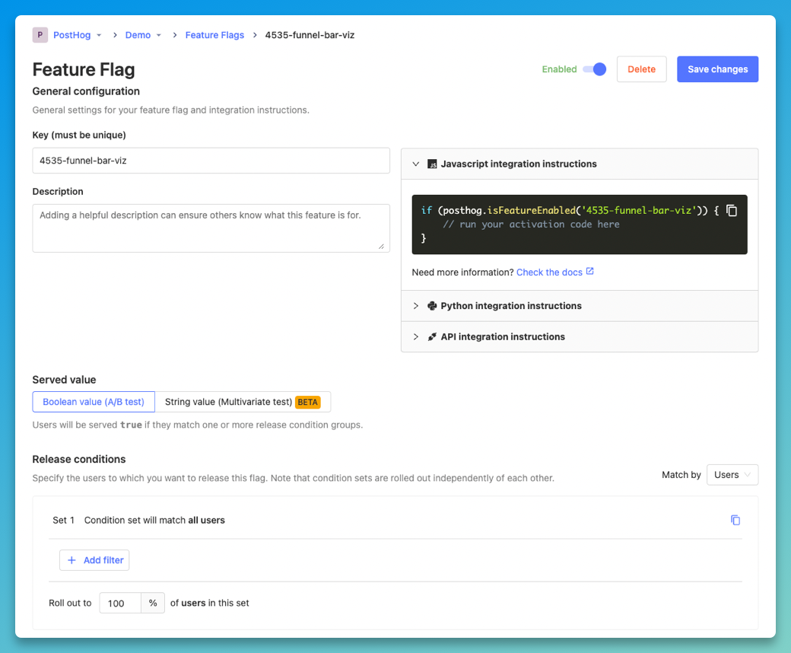

Feature flags, aka feature toggles, turn specific functions on and off during runtime. Rather than maintaining multiple feature branches in your source code, feature flags hide code or behaviors and allow you to enable or disable features on demand and without deploying new code.

[Feature flag benefits](/blog/feature-flag-benefits-use-cases) include:

- **Safely releasing new features** by eliminating complex branching and gradually rolling out feature access.
- **Running multivariate tests**, so you can understand the impact of new features and changes.
- **Controlling feature access** to certain features based on user criteria, such as location, device type or subscription level.
- **Beta feature opt-in**, so users can autonomously subscribe to new features.

In this guide, we’ll explore some of the best open source feature flag tools, all of which are either totally free or offer generous free plans. If you want to run experiments as well, we recommend reading our guide to the [best open-source A/B testing tools](/blog/best-open-source-ab-testing-tools).

> **Changelog:**
> - **Mar 15, 2023:** Removed DevCycle, added Flipt. Updated copy and screenshots.
> – **Sep 14, 2023:** Removed Harness, added Flipper and FeatBit, added supported SDKs

## 1. PostHog

- **License:** MIT
- **GitHub stars:** 13.3k
- [PostHog on GitHub](https://github.com/PostHog/posthog)

[PostHog](https://posthog.com) is an all-in-one platform that captures and visualizes all the data your team needs in one place. In addition to feature flags, it offers comprehensive product analytics, session replay, A/B testing, and user surveys.

PostHog's [feature flags](/docs/feature-flags) also power its [A/B testing features](/docs/experiments), so you can test product changes with A/B tests or define user segments for feature access. Multivariate flags enable you to test several variants of the same interchangeable elements.

### Supported libraries

<table className="w-full mt-4" style="min-width: 600px;">
	<tbody>
		  <tr>
        	<td>Javascript</td>
        	<td className="text-center">✔</td>
    	</tr>
    	<tr>
        	<td>React Native</td>
        	<td className="text-center">✔</td>
    	</tr>
		   <tr>
        	<td>React</td>
        	<td className="text-center">✔</td>
    	</tr>
    	<tr>
        	<td>Python</td>
        	<td className="text-center">✔</td> 
    	</tr>
    	<tr>
       	<td>PHP</td>
      		<td className="text-center">✔</td>
    	</tr>
    	<tr>
        	<td>Ruby</td>
        	<td className="text-center">✔</td> 
   		</tr>
    	<tr>
        	<td>Go</td>
        	<td className="text-center">✔</td> 
    	</tr>
    	<tr>
        	<td>Android</td>
        	<td className="text-center">✔</td>
    	</tr>
    	<tr>
        	<td>iOS</td>
        	<td className="text-center">✔</td>
    	</tr>
      <tr>
        	<td>Flutter</td>
        	<td className="text-center">✔</td>
    	</tr>
    	<tr>
        	<td>.NET</td>
        	<td className="text-center">✖</td>
    	</tr>	
    	<tr>
        	<td>Java</td>
        	<td className="text-center">✖</td>
    	</tr>		
		  <tr>
        	<td>Rust</td>
        	<td className="text-center">✖</td>
    	</tr>
      <tr>
        	<td>Elixir</td>
        	<td className="text-center">✖</td>
    	</tr>
	</tbody>
</table>

### Features and benefits

- Extensive library support
- All-in-one analytics platform
- A/B testing features (hosted version only)
- Multivariate flags for several variations per test
- Target by user properties and percentage
- Free third-party apps to enrich your data

### How much does it cost?

There are no limits on feature flag usage in the open source edition, though A/B testing isn't available. PostHog's hosted edition includes 1 million API requests per month for free – see the [feature flag pricing page](/pricing?product=feature-flags) for more info.

## 2. Flagsmith

- **License:** BSD 3-clause
- **GitHub stars:** 2.7k
- [Flagsmith on GitHub](https://github.com/Flagsmith/flagsmith)

[Flagsmith](https://flagsmith.com/) is a feature flag tool that makes it easy to test and deploy new functional and visual changes to users without pushing updates to code. All flags in Flagsmith are capable of being configured for cross-platform remote configuration, so you can alter an app in real-time without having to wait for app store approval.

Flagsmith is heavily user-focused. You can use the tooling to create detailed user segments based on store traits, and roll out features based on those identifiers. The platform doesn’t provide full analytics however, so a third-party provider will be required for visibility on any testing you want to carry out.

### Supported SDKs

<table className="w-full mt-4" style="min-width: 600px;">
	<tbody>
		<tr>
        	<td>Javascript</td>
        	<td className="text-center">✔</td>
    	</tr>
		  <tr>
        	<td>React</td>
        	<td className="text-center">✔</td>
    	</tr>
    	<tr>
        	<td>React Native</td>
        	<td className="text-center">✔</td>
    	</tr>
    	<tr>
        	<td>Python</td>
        	<td className="text-center">✔</td> 
    	</tr>
    	<tr>
       	<td>PHP</td>
      		<td className="text-center">✔</td>
    	</tr>
    	<tr>
        	<td>Ruby</td>
        	<td className="text-center">✔</td> 
   		</tr>
    	<tr>
        	<td>Go</td>
        	<td className="text-center">✔</td> 
    	</tr>
    	<tr>
        	<td>Android</td>
        	<td className="text-center">✔</td>
    	</tr>
    	<tr>
        	<td>iOS</td>
        	<td className="text-center">✔</td>
    	</tr>
      <tr>
        	<td>Flutter</td>
        	<td className="text-center">✔</td>
    	</tr>
    	<tr>
        	<td>.NET</td>
        	<td className="text-center">✔</td>
    	</tr>	
    	<tr>
        	<td>Java</td>
        	<td className="text-center">✔</td>
    	</tr>		
		  <tr>
        	<td>Rust</td>
        	<td className="text-center">✔</td>
    	</tr>
      <tr>
        	<td>Elixir</td>
        	<td className="text-center">✔</td>
    	</tr>
	</tbody>
</table>

### Features and benefits

- Cross-platform functionality
- Out of the box 3rd party analytics integrations
- User-focused segmentation
- Update in real-time without back end intervention

### How much does it cost?

Flagsmith is free up to 50,000 requests per month when you choose the cloud solution. If you’re looking to self-host, pricing is available on request.

## 3. Unleash

- **License:** Apache
- **GitHub stars:** 9k
- [Flagsmith on GitHub](https://github.com/Unleash/unleash)

[Unleash](https://www.getunleash.io/) lets you safely test and release new features with defined rules. The platform removes pressure from developers and lets them play around with features safely. The [canary release](/tutorials/canary-release) feature allows you to strategically manage gradual rollouts, identify issues and use kill switches to roll back in seconds. Unleash is not an analytics platform, and you’ll need to connect a third-party platform to visualize analytics on experiments like A/B tests.

### Supported SDKs

<table className="w-full mt-4" style="min-width: 600px;">
	<tbody>
		<tr>
        	<td>Javascript</td>
        	<td className="text-center">✔</td>
    	</tr>
		  <tr>
        	<td>React</td>
        	<td className="text-center">✔</td>
    	</tr>
    	<tr>
        	<td>React Native</td>
        	<td className="text-center">✔</td>
    	</tr>
    	<tr>
        	<td>Python</td>
        	<td className="text-center">✔</td> 
    	</tr>
    	<tr>
       	<td>PHP</td>
      		<td className="text-center">✔</td>
    	</tr>
    	<tr>
        	<td>Ruby</td>
        	<td className="text-center">✔</td> 
   		</tr>
    	<tr>
        	<td>Go</td>
        	<td className="text-center">✔</td> 
    	</tr>
    	<tr>
        	<td>Android</td>
        	<td className="text-center">✔</td>
    	</tr>
    	<tr>
        	<td>iOS</td>
        	<td className="text-center">✔</td>
    	</tr>
      <tr>
        	<td>Flutter</td>
        	<td className="text-center">✔</td>
    	</tr>
    	<tr>
        	<td>.NET</td>
        	<td className="text-center">✔</td>
    	</tr>	
    	<tr>
        	<td>Java</td>
        	<td className="text-center">✔</td>
    	</tr>		
		  <tr>
        	<td>Rust</td>
        	<td className="text-center">✔</td>
    	</tr>
      <tr>
        	<td>Elixir</td>
        	<td className="text-center">✔</td>
    	</tr>
	</tbody>
</table>

### Features and benefits

- Fast performance monitoring
- Refined user segmentation
- Rollout strategy management for gradual releases
- Fall-back mechanisms and SDKs that keep local back-ups

### How much does it cost?

Unleash is free for two environments when you self-host. A managed version is also available at cost if you want to add team members or access additional features like advanced segmentation or custom activation strategies.

## 4. GrowthBook

- **License:** MIT
- **GitHub stars:** 4.9k
- [GrowthBook on GitHub](https://github.com/growthbook/growthbook/)

[GrowthBook](https://www.growthbook.io/) is a warehouse native, open-source feature flagging and experimentation platform built to help companies make better data-driven decisions. Its flag tool features advanced targeting, gradual rollouts and experiments. The platform is highly customizable and gives users the option to choose between a full testing platform, a plugin toggle tool, or a data analysis engine.

### Supported SDKs

<table className="w-full mt-4" style="min-width: 600px;">
	<tbody>
		<tr>
        	<td>Javascript</td>
        	<td className="text-center">✔</td>
    	</tr>
		  <tr>
        	<td>React</td>
        	<td className="text-center">✔</td>
    	</tr>
    	<tr>
        	<td>React Native</td>
        	<td className="text-center">✖</td>
    	</tr>
    	<tr>
        	<td>Python</td>
        	<td className="text-center">✔</td> 
    	</tr>
    	<tr>
       	<td>PHP</td>
      		<td className="text-center">✔</td>
    	</tr>
    	<tr>
        	<td>Ruby</td>
        	<td className="text-center">✔</td> 
   		</tr>
    	<tr>
        	<td>Go</td>
        	<td className="text-center">✔</td> 
    	</tr>
    	<tr>
        	<td>Android</td>
        	<td className="text-center">✔</td>
    	</tr>
    	<tr>
        	<td>iOS</td>
        	<td className="text-center">✔</td>
    	</tr>
      <tr>
        	<td>Flutter</td>
        	<td className="text-center">✔</td>
    	</tr>
    	<tr>
        	<td>.NET</td>
        	<td className="text-center">✖</td>
    	</tr>	
    	<tr>
        	<td>Java</td>
        	<td className="text-center">✔</td>
    	</tr>		
		  <tr>
        	<td>Rust</td>
        	<td className="text-center">✖</td>
    	</tr>
      <tr>
        	<td>Elixir</td>
        	<td className="text-center">✖</td>
    	</tr>
	</tbody>
</table>

### Features and benefits

- Accessible for all teams
- Advanced targeting for experiments
- Modular, customizable platform
- Automated experiment analysis
- Feature flag scheduling
- Unlimited flags

### How much does it cost?

Growthbook’s open source self-hosted plan is free forever, with unlimited flags and experiments. GrowthBook also offers a hosted version with pricing based on the number of users.

## 5. Flipt

- **License:** GPL-3.0
- **GitHub stars:** 2.8k
- [Flipt on GitHub](https://github.com/flipt-io/flipt)

[Flipt](https://www.flipt.io/) is a popular open-source option for feature flagging, and it's 100% open source with no paid editions. It supports all basic [feature flag use cases](/blog/feature-flag-benefits-use-cases), such as rolling out features based on segments (e.g. new users, email, country etc.), multiple variations, and percentage thresholds for rollouts. It also supports storing your flags in Git, so it can be used without a database.

### Supported SDKs

<table className="w-full mt-4" style="min-width: 600px;">
	<tbody>
		<tr>feat
        	<td>Javascript</td>
        	<td className="text-center">✔</td>
    	</tr>
		  <tr>
        	<td>React</td>
        	<td className="text-center">✖</td>
    	</tr>
    	<tr>
        	<td>React Native</td>
        	<td className="text-center">✖</td>
    	</tr>
    	<tr>
        	<td>Python</td>
        	<td className="text-center">✔</td> 
    	</tr>
    	<tr>
       	<td>PHP</td>
      		<td className="text-center">✔</td>
    	</tr>
    	<tr>
        	<td>Ruby</td>
        	<td className="text-center">✔</td> 
   		</tr>
    	<tr>
        	<td>Go</td>
        	<td className="text-center">✔</td> 
    	</tr>
    	<tr>
        	<td>Android</td>
        	<td className="text-center">✔</td>
    	</tr>
    	<tr>
        	<td>iOS</td>
        	<td className="text-center">✔</td>
    	</tr>
      <tr>
        	<td>Flutter</td>
        	<td className="text-center">✖</td>
    	</tr>
    	<tr>
        	<td>.NET</td>
        	<td className="text-center">✖</td>
    	</tr>	
    	<tr>
        	<td>Java</td>
        	<td className="text-center">✔</td>
    	</tr>		
		  <tr>
        	<td>Rust</td>
        	<td className="text-center">✔</td>
    	</tr>
      <tr>
        	<td>Elixir</td>
        	<td className="text-center">✖</td>
    	</tr>
	</tbody>
</table>

### Features and benefits

- Multivariate feature flags
- Store flags in Git
- Target by user segments
- Percentage distribution controls
- Create rules using variants and segments

### How much does it cost?

Nothing. There is no paid version of Flipt. It's distributed under a GPL-3.0 license.

## 6. Flipper

- **License:** MIT
- **GitHub stars:** 3.4k
- [Flipper on GitHub](https://github.com/flippercloud/flipper)

Flipper is a rebuilt version of the [feature flag platform used GitHub](https://posthog.com/blog/github-gitlab-feature-flags), maintained by a small team of ex-GitHub engineers. It supports all the common use cases for feature flags, such as boolean flags, group targeted flags, and targeting by actors or a percentage of actors. It currently only supports Ruby applications, though support for other languages is planned.

### Supported SDKs

Ruby only

### Features and benefits

- Boolean flags
- Group targeting
- Actor targeting
- Percentage of time flags
- Flag audit history
- One click rollbacks

### How much does it cost?

In addition to the free open-source edition, Flipper also offers a cloud-hosted version with a 14-day trial. It's priced at $20 per seat with unlimited flags and projects.

## 7. FeatBit

- **License:** MIT
- **GitHub stars:** 1.1k
- [FeatBit on GitHub](https://github.com/featbit/featbit)

FeatBit is an open-source feature flag and A/B testing tool that's available in Standard (for small businesses) and Professional (for enterprises) flavors – the Standard edition is easier deploy due to fewer dependencies. It supports custom user segments, rolling out by percentages, and feature flag scheduling. A/B testing data can also be exported to tools like Datadog, Grafana, and Amplitude.

### Supported SDKs

<table className="w-full mt-4" style="min-width: 600px;">
	<tbody>
		<tr>
        	<td>Javascript</td>
        	<td className="text-center">✔</td>
    	</tr>
		  <tr>
        	<td>React</td>
        	<td className="text-center">✔</td>
    	</tr>
    	<tr>
        	<td>React Native</td>
        	<td className="text-center">✖</td>
    	</tr>
    	<tr>
        	<td>Python</td>
        	<td className="text-center">✔</td> 
    	</tr>
    	<tr>
       	<td>PHP</td>
      		<td className="text-center">✖</td>
    	</tr>
    	<tr>
        	<td>Ruby</td>
        	<td className="text-center">✖</td> 
   		</tr>
    	<tr>
        	<td>Go</td>
        	<td className="text-center">✔</td> 
    	</tr>
    	<tr>
        	<td>Android</td>
        	<td className="text-center">✖</td>
    	</tr>
    	<tr>
        	<td>iOS</td>
        	<td className="text-center">✖</td>
    	</tr>
      <tr>
        	<td>Flutter</td>
        	<td className="text-center">✖</td>
    	</tr>
    	<tr>
        	<td>.NET</td>
        	<td className="text-center">✔</td>
    	</tr>	
    	<tr>
        	<td>Java</td>
        	<td className="text-center">✔</td>
    	</tr>		
		  <tr>
        	<td>Rust</td>
        	<td className="text-center">✖</td>
    	</tr>
      <tr>
        	<td>Elixir</td>
        	<td className="text-center">✖</td>
    	</tr>
	</tbody>
</table>

### Features and benefits

- Feature flag scheduling
- Boolean and multivariate flags
- A/B testing (with data export)

### How much does it cost?

All features are completely free. FeatBit monetizes its platform by offering premium support packages, which start at $399 per month for dedicated support with a 2-hour reply SLA during business hours.

## Further reading 

- [Feature flag best practices and tips (with examples)](/blog/feature-flag-best-practices)
- [Should you build or buy? Feature flags as a service, explained](/blog/feature-flags-as-a-service)
- [Feature flags vs configuration: Which should you choose?](/blog/feature-flags-vs-configuration)