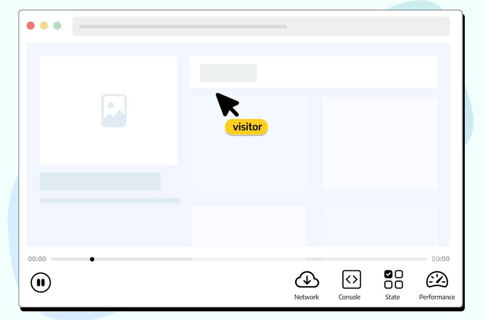
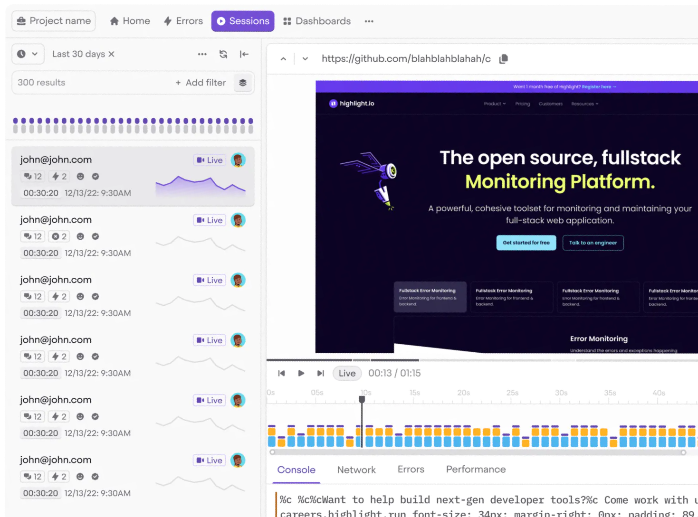
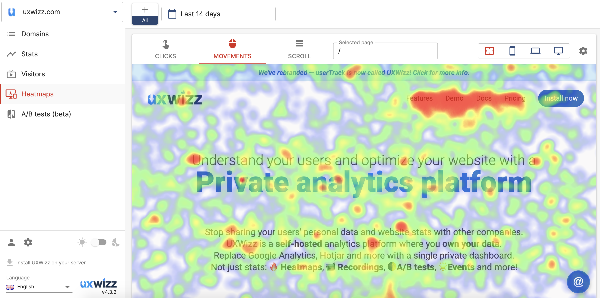
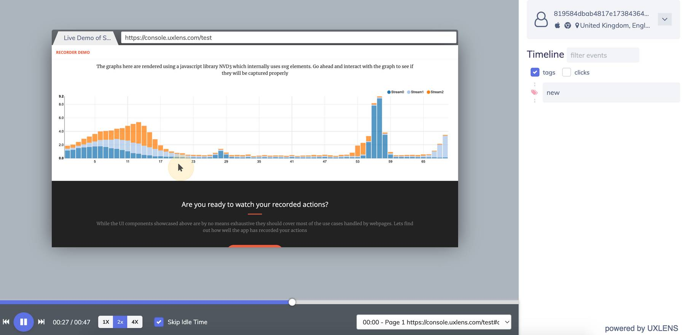
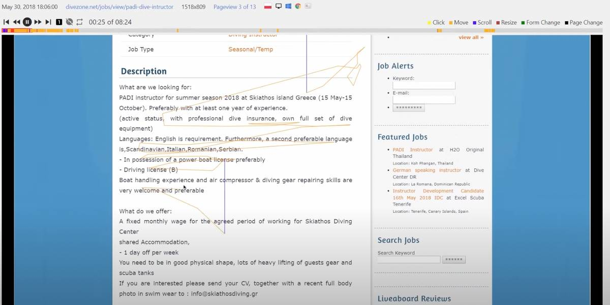

[Open-source analytics](/blog/best-open-source-analytics-tools) is great when you need hard numbers, but hard numbers don't give you the full picture. What else do you need to do? [Talk to users](/blog/10x-engineers-do-user-interviews)? Sure. Gather feedback? That's useful, too. But, for us, there's nothing better than watching session replays for understanding a user's pain points.

Replays (aka session recordings) are a great way to understand:

- What causes bugs and user frustration.
- Where users are getting stuck on your site.
- Hesitation at different stages of your funnel.
- How your users are interacting with individual elements of your product.

Hotjar and [Fullstory](/blog/best-fullstory-alternatives) are popular session replay products, but they're expensive, inflexible, and primarily designed with marketing teams. In this guide, we're looking at the best free and open-source session replay tools, which often offer the same features (or more) for less.

> **Changelog:**
>
> - **Mar 16, 2023:** Removed SessionStack, added Highlight.io. Updated copy and screenshots.

## 1. PostHog

[PostHog](https://posthog.com/) is an all-in-one, Product OS that offers all the tools required to build better products, including but not limited to [session replay](/product/session-recording).

PostHog's session replay tool includes console logs and network activity, so you can identify the causes of bugs or performance problems. There's also a playlist feature, allowing you to save similar replays based on specific events or user properties into one list, and you can save recordings offline for safe keeping.

Other features include product analytics, [feature flags](/product/feature-flags), [funnels](/product/funnels), [heatmaps](/product/heatmaps), [experimentation](/product/experimentation-suite), [trends](/product/trends) and [much more](/product). 

All PostHog’s tools work together natively, offering extensive, actionable user insights beyond what's possible with standalone session replay tools.

### Who is PostHog for?

PostHog is ideal for [product-minded developers](/blog/what-is-a-product-engineer) and product teams. Unlike Hotjar and Fullstory, it's designed for technical users. Its broad range of features means PostHog can replace several tools.

### Features and benefits

- Console logs and network performance
- Filter recordings by user or event
- Export recordings offline
- Fully-featured product analytics suite
- Front-end events captured out of the box
- CSS selectors block sensitive data to protect user privacy

### How much does PostHog cost?

PostHog Cloud is free up to 1 million captured events and 5,000 recordings per month, and you can set billing limits to avoid surprise bills. 

You can also self-host PostHog Open Source (available under an MIT license) using Docker Compose, though PostHog Cloud is recommended for event volumes exceeding 100k per month.

## 2. OpenReplay

[OpenReplay](https://openreplay.com/) is an open-source session replay stack that provides insights into user actions inside web apps. Its tooling is particularly effective for application state and customer support. It has some basic analytics features, such as funnel analysis, though it falls some way short of feature-complete product analytics tools.

### Who is OpenReplay for?

OpenReplay is a developer-friendly tool. It allows engineers to see how users are interacting with their web apps, respond to issues faster, and troubleshoot problems with users.

### Features and benefits

- Error and rage click tracking
- Bug reporting and reproduction 
- Network activity inspection
- Performance and state monitoring
- Co-browsing feature to assist users at critical moments

### How much does OpenReplay cost?

OpenReplay’s self-hosted plan is available for free. It also offers a cloud option starting at $3.95 per month for 1,000 recordings with 30 days data retention.

## 3. Highlight.io

[Highlight.io](https://www.highlight.io/) is a popular open-source monitoring platform that's similar, in some ways, to OpenReplay. Core features include session replay with console logs and network monitoring, error monitoring, and customizable log alerts. It lacks some of OpenReplay's additional features, such as click maps and customer support features.

### Who is Highlight.io for?

Highlight.io is a developer focused tool with a particular focus on debugging user problems and errors.

### Features and benefits

- Log alerts 
- Open source and self hostable
- Session replay with console logs and network monitoring
- Error monitoring and customizable alerts

### How much does Highlight.io cost?

You can self-host for free – Highlight.io recommends an upper limit of 10k sessions and 50k errors per month for hobby deployments. The managed cloud service is free up to 500 monthly sessions and 1,000 errors. Costs thereafter vary depending on usage and retention requirements.

## 4. UXWizz

[UXWizz](https://www.uxwizz.com/) is a simplified, self-hosted product analytics tool offering features like visitor insights, session recording, segments and A/B testing. 

It offers a lightweight version of session recording that only stores the URL of the page and the user actions. This is designed to optimize your data storage and remove the manual maintenance otherwise required by UXWizz.

UXWizz is maintained by a single developer.

### Who is UXWizz for?

UXWizz is a good choice for individuals and small businesses who want quick, qualitative insights and session recordings. A Wordpress plugin is also available.

### Features and benefits

- Broad range of engagement-focused insights
- Low database usage with lightweight version
- Unlimited usage with one-time license fee

### How much does UXWizz cost?

UXWizz is available as a self-hosted solution only and with prices starting at £129 for a lifetime license, including 1-year support. Additional updates and support are priced as add-on subscriptions.

## 5. UXlens

[UXlens](https://uxlens.com/) is a developer-first session recording tool that provides insight into user interface and conversion issues. It does not include any additional analytics tools, but does have useful segment filtering features that help businesses locate blocks in their funnel.

### Who is UXlens for?

UXlens is a good choice for UX designers and product teams who want to study the impact of their UI on the user journey without spending too much.

### Strengths

- Customizable filters to track sessions on specific user segments
- Input elements masked by default to protect user data
- UI to assist with complex filter building

### How much does UXlens cost?

The cloud version starts at just $6 per month for 6,000 recordings. Lifetime self-host licenses start at $200.

## 6. [Matomo](https://matomo.org/)

Matomo is an open web analytics platform. Touted as an alternative to Google Analytics, Matomo is largely focused on understanding marketing website analytics. Session recording is available as an add-on via the [on-premise marketplace](https://plugins.matomo.org/HeatmapSessionRecording).

### Who is Matomo for?

Matomo is mainly built with marketing and content teams in mind, offering insights into website content engagement for optimization of user journeys. Features like session recording are part of a wider set of tools that are useful for product teams as well, but they aren't included in Matomo's open source release. To learn more, read our [PostHog vs Matomo comparison](/blog/posthog-vs-matomo).

### Features and benefits

- Funnels, acquisition analysis and other insight features
- Unlimited session recordings
- Out-of-the-box solution meaning no developer required to get set up

### How much does Matomo cost?

The session recording add-on for a self-hosted Matomo solution has a 30-day free trial, after which the cost ranges from $199 to $599 per year depending on the number of users in your team. Session recording is also included in Matomo’s cloud Business plan. Pricing is calculated depending on the volume of your site traffic.

