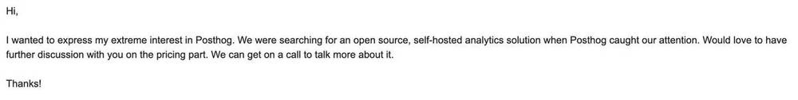
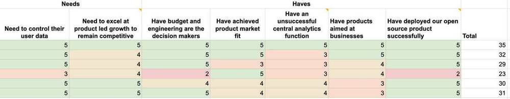

_We are open source_ is [literally our top value](../handbook/company/values)... and what better way to be transparent than to share a diary?

## Late mover advantage

Product analytics is a busy space. It reminds me of the _front_ entrance to Liverpool Street station in London:

PostHog Fact: Tim (my co-founder) incorrectly believes this is the side entrance - it's one of our greatest disagreements.

There are tons of competitors in product analytics, and they've pretty much all got 300+ person teams, around $100M or more in funding, and years and years of headstart. Yet, we're totally confident we can win as a late mover.

A losing strategy for us would look like this:

1. Investing in (even more) sales assets, people, tools, and training
2. Building features that the salespeople need to sell to big companies, which makes our product feel like everyone else's
3. Annoying our users with poor UX since the product was built for selling and not using
4. Churning lots of customers which takes us back to step #1

A winning strategy for us involves:

1. Doubling down on investing in our open source project
2. Acquiring more users as developers at big companies enjoy using it
3. Enjoying wider adoption within each company since the product keeps getting better
4. Making more money as big companies happily pay for the value, leading us back to step #1 

## So what are we doing about the above?

PostHog started off as an open source project. We started getting emails like this one, which is from a 30k employee corporate that you'll have heard of:

Weirdly enough, at the time, we felt we provided a _worse_ experience to paying customers like this than to free users.

Larger companies have a broader range of users than just developers, and these other user profiles (like product managers or growth managers) tend to want more detailed analytics views and lack the same willingness to tolerate bugs.

We wanted to try selling to companies like this so we could complete the [open core business model](open-source-business-models). We would use this to double down on improvements to our free project, knowing we could delight paid customers when they came our way.

So we decided to get [Five Reference Customers](../handbook/strategy/overview), despite having >100 subscribers (on top of thousands of open source deployments). 'Reference customers' are genuinely delighted, use PostHog meaningfully, and pay full price.

From this exercise, we learned we had to level up our UX around funnels - so we [nailed funnels](new-vp-nailing-funnels). Next up, we're working on [nailing diagnoses](../handbook/strategy/roadmap). This is particularly cool as we're starting to see how our broad approach with analytics, session recording, and feature flags uniquely lets users visualize their funnels, understand _why_ funnel performance is bad, and release changes to safely improve it.

## A board meeting happened

This mainly focused on what our reference customers have in common.

They appeared to be from a wide range of industries, so we thought about the _Needs_ and the _Haves_ they've got in common. 

This is what we're seeing:

## What's next

We want to get more scores like the above, so we did two things:

1. [We updated the product positioning on the homepage](https://github.com/PostHog/posthog.com/pull/1810). We're working on a simpler, cleaner design, but we wanted to make a handful of changes immediately.
1. We're launching marketing initiatives to promote PostHog even further to teams that feel like the above scores. The test is: "Can we do this without building any more paid features?"

More updates coming soon! :)

_Enjoyed this? Subscribe to our [newsletter](https://newsletter.posthog.com/subscribe) to hear more from us twice a month!_
