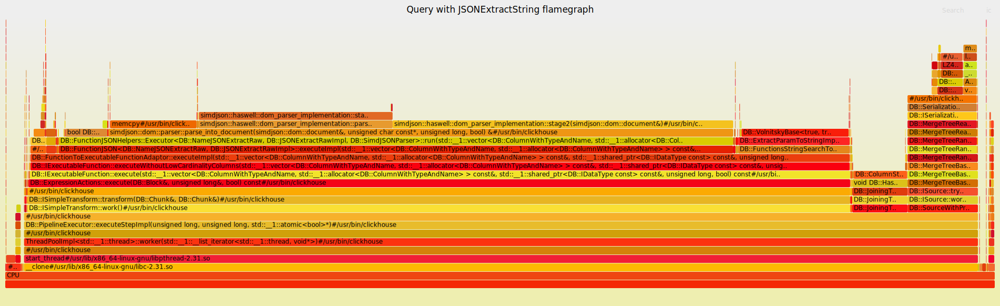

Did you know ClickHouse supports speeding up queries up to an order of magnitude by using Materialized Columns? This rarely-used feature can be used to create new columns on the fly from existing data, speeding up queries.

In this post, I’ll walk through an example query optimization in which materialized columns are well suited.

Consider the following schema:

```sql
CREATE TABLE events (
    uuid UUID,
    event VARCHAR,
    timestamp DateTime64(6, 'UTC'),
    properties_json VARCHAR,
)
ENGINE = MergeTree()
ORDER BY (toDate(timestamp), event, uuid)
PARTITION BY toYYYYMM(timestamp)
```

Each event has an ID,  event type, timestamp, and a JSON representation of event properties. The properties can include the current URL and any other user-defined properties that describe the event (e.g. NPS survey results, person properties, timing data, etc).

This table can be used to store a lot of analytics data and is similar to what we use at PostHog.

If we wanted to query login page pageviews in August, the query would look like this:

```sql
SELECT count(*)
FROM events
WHERE event = '$pageview'
  AND JSONExtractString(properties_json, '$current_url') = 'https://app.posthog.com/login'
  AND timestamp >= '2021-08-01'
  AND timestamp < '2021-09-01'
```

On a large test dataset this query takes a while complete, while without the url filter the query is almost instant. Adding even more filters just makes the query slower and slower. Let’s dig in why!

## Looking at flamegraphs

ClickHouse has great tools for introspecting queries. Looking at `system.query_log`  we can see that the query:

- Took 3433ms
- Read 79.17 GiB from disk

To dig even deeper, we can use clickhouse-flamegraph to peek into what the CPU is doing during query execution.

[](../images/blog/clickhouse-materialized-columns/query-json-extract-CPU.svg)

From this we can see that the clickhouse node CPU is spending most of its time parsing JSON.

The typical solution would be to extract $current_url to a separate column. This would get rid of the JSON parsing and reduce the amount of data read from disk.

However, in this particular case it wouldn’t work because:

1. The data is passed from users - meaning we’d end up with millions (!) of unique columns
2. This would complicate live data ingestion a lot, introducing new and exciting race conditions


## Enter materialized columns

Turns out, that's exactly the problems materialized columns can help solve.

```sql
ALTER TABLE events
ADD COLUMN mat_$current_url
VARCHAR MATERIALIZED JSONExtractString(properties_json, '$current_url')
```

This will create a new column that will be automatically filled for incoming data, creating a new file on disk. The data is automatically filled during `INSERT` statements, so data ingestion does not need to change.

The trade-off is more data being stored on disk. In practice clickhouse compresses data very well, making this a worthwhile trade-off. On our test dataset, mat_$current_url is only 1.5% the size of `properties_json` on disk with a 10x compression ratio. Other properties which have lower cardinality can achieve even better compression (we’ve seen up to 100x)!

Just creating the column is not enough, since for old data queries would still resort to using a `JSONExtract`. For this reason, you want to backfill data. The easiest way currently is to run [OPTIMIZE](https://clickhouse.tech/docs/en/sql-reference/statements/optimize/) command:

```sql
OPTIMIZE TABLE events FINAL
```

After backfilling, running the updated query speeds things up significantly:

```sql
SELECT count(*)
FROM events
WHERE event = '$pageview'
  AND mat_$current_url = 'https://app.posthog.com/login'
  AND timestamp >= '2021-08-01'
  AND timestamp < '2021-09-01'
```

Looking at `system.query_log`, the new query:

- took 980ms (**71%/3.4x improvement**)
- read 14.36 GiB from disk (**81%/5x improvement improvement**)

The wins are even more magnified if more than one property filter is used at a time.


## Backfilling efficiently

Using `OPTIMIZE TABLE` after adding columns is often not a good idea, since it will involve a lot of I/O as the whole table gets rewritten.

As of writing, there's a a feature request on [Github](https://github.com/ClickHouse/ClickHouse/issues/27730) for adding specific commands for this.

As a work-around you can:
1. Temporarily set the column to use `DEFAULT` instead of `MATERIALIZED`
2. Backfill part of the data using `ALTER TABLE events UPDATE mat_$current_url = mat_$current_url WHERE timestamp >= '2021-08-01'`
3. Set the column back to `MATERIALIZED`

Note that hacky work-around has [implications](https://clickhouse.tech/docs/en/sql-reference/statements/create/table/#materialized) for your `INSERT` and `SELECT *` queries.


## Usage at PostHog

PostHog as an analytics tool allows users to slice and dice their data in many ways across huge time ranges and datasets. This also means that performance when investigating things is of key importance but also that we currently do nearly no preaggregation.

Rather than materialize all columns, we built a solution which looks at recent slow queries using `system.query_log`, determines which properties need materializing from there and backfills the data on a weekend. This works well because not every query needs optimizing and a relatively small subset of properties make up most of what’s being filtered on by our users.

You can find the code for this [here](https://github.com/PostHog/posthog/blob/c23704b3909ae8ebb827e6a43453e32b3d3487bd/ee/clickhouse/materialized_columns/analyze.py#L42-L119) and [here](https://github.com/PostHog/posthog/blob/c23704b3909ae8ebb827e6a43453e32b3d3487bd/ee/clickhouse/materialized_columns/columns.py#L37-L130).

After materializing our top 100 properties and updating our queries, we analyzed slow queries (> 3 seconds long). **The average a 55% improvement in our query times was 55%, with 99th percentile improvement being 25x.**

As a product we're only scratching the surface of what ClickHouse can do to power product analytics. If you're interested in helping us with these kinds of problems, we're hiring!

