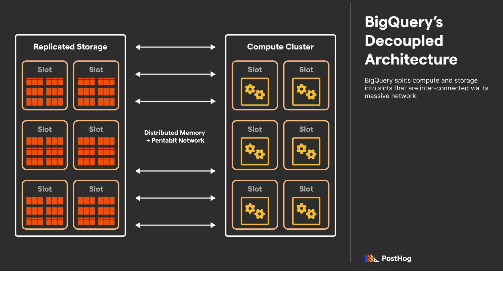
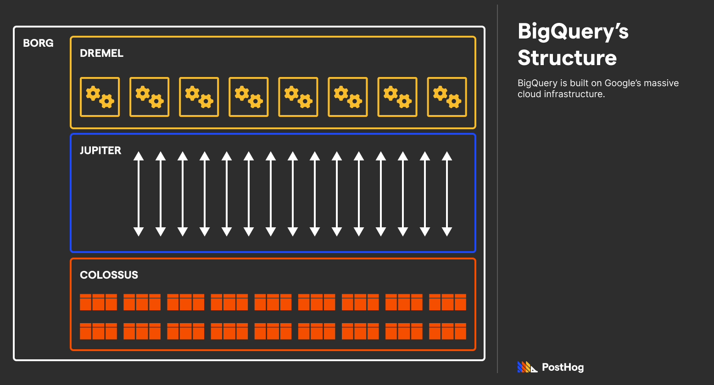
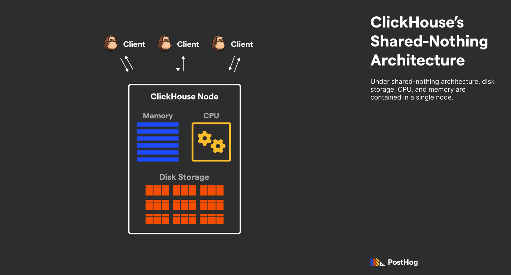
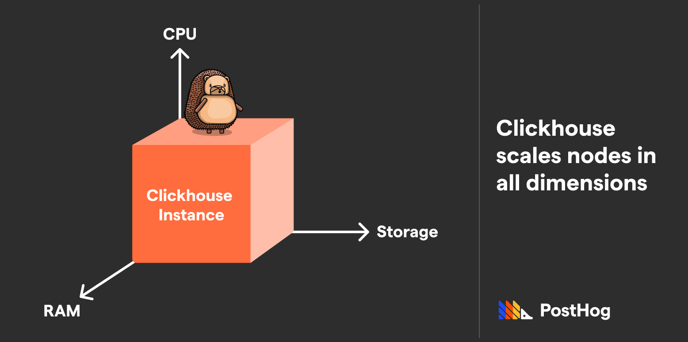
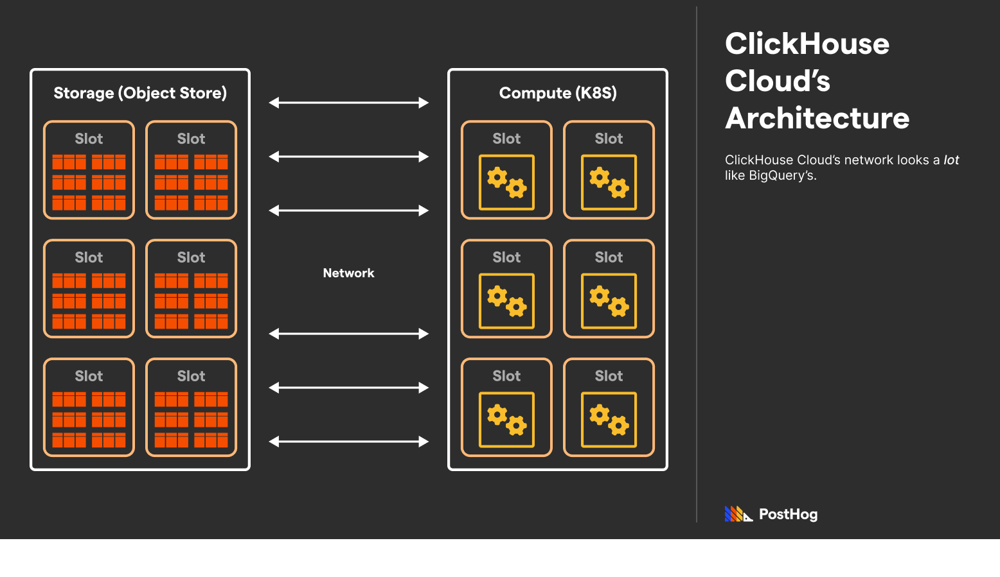
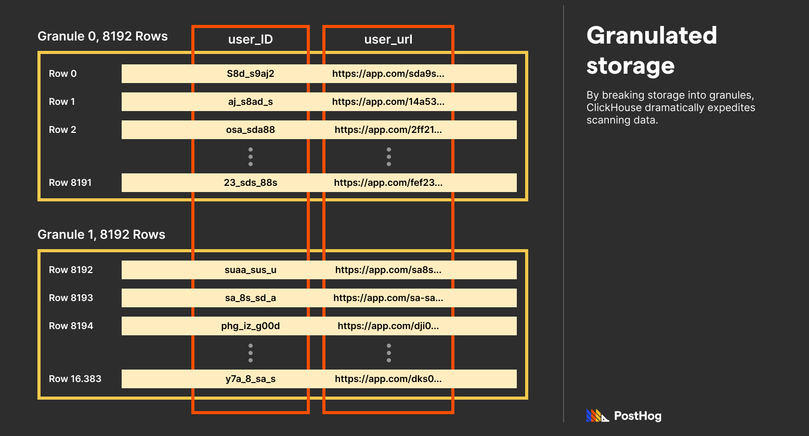
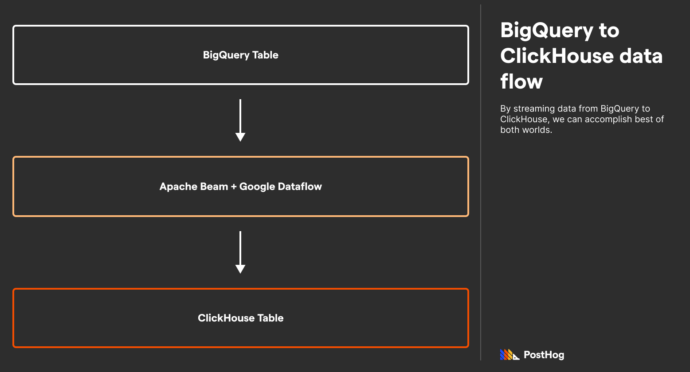

Both BigQuery and ClickHouse are databases designed to handle lots of data (like *loads* of data), but they have distinct philosophies and use cases.

BigQuery is exceptional at handling complex business queries that can tolerate many-second (sometimes dozens of seconds) loading times at scale. Conversely, with some tuning ClickHouse can deliver sub-second performance on terabytes of data for predictable queries, making it ideal for powering customer-facing dashboards and analytics.

In this article, I’ll explain how BigQuery and ClickHouse work, and how their approaches create very different products and target use-cases. 

## Background

At first glance, comparing BigQuery and ClickHouse seems like a David versus Goliath situation. 

While they both tackle search and analytics problems, are built on columnar data storage, and are available via managed infrastructure, BigQuery is an established name maintained by one of the infrastructure mob bosses (sorry, I mean *benevolent leaders*), while ClickHouse is a relative newcomer and an open source one at that.

That said, ClickHouse is exploding in popularity, has a hugely active development community, and is already used by the likes of Spotify, Uber, Cloudflare, and popular analytics platforms like [PostHog](https://posthog.com/). Moreover, it has its origins in another big tech player, Yandex.

### What is ClickHouse?

Over a decade ago, Yandex Metrica (a Google Analytics analog in Russia) needed to store pentabytes of data targeting sub-second retrieval. This tight constraint served as the bedrock for ClickHouse. In 2016, ClickHouse was spun out into an independent open-source project, and is now actively maintained by ClickHouse Inc. with contributions from Altinity Inc.

In its stock form, ClickHouse is just a data warehouse. It does not include a user interface, nor any stateful management for querying data. Instead, developers directly interface with ClickHouse through the command line or an SDK wrapper library as they would any other database. However, ClickHouse Inc. also develops ClickHouse Cloud, a managed service that runs ClickHouse on the cloud in a style similar to BigQuery. 

While these managed services are paid products, ClickHouse’s core remains open source. Most literature on ClickHouse focuses on stock ClickHouse, but I’ll also compare ClickHouse Cloud directly with BigQuery because they operate on the same decoupled infrastructure pattern. 

### What is BigQuery?

BigQuery’s claim to fame was its novel way of decoupling storage and compute. Before BigQuery, databases would typically bundle storage and compute in the same box. Targeting reporting and analytical needs, BigQuery enables data engineers to store data without worrying about scaling clusters or storage. 

BigQuery is exclusively available on GCP (Google Cloud Platform) and is tightly integrated with other GCP products. However, BigQuery can also connect to AWS and Azure storage through [BigQuery Omni](https://cloud.google.com/blog/products/data-analytics/introducing-bigquery-omni), though that defeats some of BigQuery’s all-in-one value-prop.  

One of the reasons that BigQuery touts a feature-rich and friendly user-interface is to appeal to marketers with some basic SQL skills. While BigQuery isn’t as non-technical friendly as [Kibana](/blog/clickhouse-vs-elasticsearch) or [Snowflake](/blog/clickhouse-vs-snowflake), it does make using SQL easier by providing a GUI wrapper with the ability to save progress. Of course, for development purposes, BigQuery can also be accessed via GCP’s command line suite. 

## Architecture

### BigQuery’s Architecture

BigQuery’s serverless architecture was novel at the time of its 2010 debut. Every BigQuery instance has variable storage units (distributed replicas) connected to variable compute units (calling slots); as an instance’s demands grow, so does its utilization of the storage and compute slots. Even today, this approach stands out — most databases parallelize compute, but not storage. 

BigQuery extends many Google projects to make this happen. Specifically, BigQuery uses Colossus, Google’s file storage system; Borg, Google’s job scheduler; Dremel, a multi-tenant cluster that executes the queries; and Jupiter, Google’s pentabit network. BigQuery works because Google has a massive general-purpose infrastructure designed for isolated storage and compute.

Amid being built on titanic infrastructure, BigQuery usually returns results in the order of _seconds_, not _milliseconds_, because it focuses on scalability, not per-query performance. 

### ClickHouse’s (Traditional) Architecture

ClickHouse utilizes a shared-nothing architecture where CPU, Storage, and Memory are stored in a single, beefy machine. While ClickHouse *does* support sharding databases across many physical instances managed under Apache Zookeeper, its fundamental design is monolithic. When you use ClickHouse (traditionally), everything is happening in the same place. 

Accordingly, ClickHouse can scale in all three dimensions (storage, memory, and compute) by simply upgrading the machine. However, scaling isn't as straightforward compared to BigQuery — compute cannot be added on a whim to the same instance, though you can add additional disks to an instance to scale capacity.

ClickHouse’s magic happens in the way it compresses data, pre-aggregates data, and uses specialized engines accessing a device’s full compute potential. If BigQuery is a commercial airliner, then ClickHouse is a fighter jet. 

### ClickHouse Cloud’s Architecture

ClickHouse Cloud flips ClickHouse’s monolithic architecture on its head. ClickHouse Cloud is ClickHouse Inc.’s paid offering that helps bridge the gap between ClickHouse and BigQuery. Not only does ClickHouse Cloud provide a UI for interfacing with ClickHouse like BigQuery, it deploys ClickHouse on decoupled storage and compute on AWS. 

ClickHouse Cloud is unquestionably modeled after BigQuery and GCP. It offers similar features, such as out-of-the-box integrations with ELT providers, an interactive SQL console, automated backups, caching, and automatic replication. 

However, ClickHouse Cloud is still ***not*** a pure replacement for BigQuery. ClickHouse Cloud simply makes managing, scaling, and protecting a ClickHouse instance easy — it does ***not*** alter the way ClickHouse works, including what it is and isn’t good at. 

> **Using ClickHouse + GCS:** It’s worth mentioning that another hybrid architecture exists — ClickHouse + Google Cloud Storage (GCS). Specifically, developers could replace ClickHouse’s in-unit storage with Google Cloud Storage instead. ClickHouse’s [integration with GCS](https://clickhouse.com/docs/en/integrations/gcs) effectively decouples storage and compute, and works great for businesses that already use GCS. 

## Why ClickHouse is faster

Data warehouses like BigQuery and ClickHouse are used to return analytical queries. Queries might look like “a list of average revenue for the last four years” or “the median household income”. Not only do these queries change on **every** data insert, but computing many values can draw a lot of memory and processing power. 

The performance difference between BigQuery and ClickHouse can be immense. BigQuery can take dozens of seconds to execute a query. ClickHouse, if tuned correctly, can execute the same query on *terabytes* of data with sub-second performance. 

The **"tuned”** bit is important — ClickHouse gives developers tooling to expedite expected queries. While BigQuery does some standard optimizations, like columnar storage (which we discuss in more detail in our [ClickHouse and Postgres comparison](/blog/clickhouse-vs-postgres)), ClickHouse goes further. In particular, ClickHouse accomplishes its “fighter jet” speeds by leveraging four techniques:

1. Granulated storage
2. Materialized views
3. Specialized engines
4. Vectorized query execution.

### Granulated Storage

Most databases store data indexed via primary keys. When searching for that data, such as a specific column, a typical database scans all data and return the result. This is sloooow. 

ClickHouse achieves a magnificent speed boost by using granulated storage. Each ClickHouse table has a primary key defined as a tuple of multiple columns. Data is then sorted by those columns, first by the first entry, then by the second, and onwards. Afterwards, sorted entries are broken into granules, which are fixed length mini-tables, by default 8192 entries long. ClickHouse’s big advancement is that it exclusively saves just the **first** entry to each granule. 

Because data is sorted by primary key columns — and those columns are typically chosen based on what’s used to index data — ClickHouse needs to scan ***significantly*** less data for most queries. 

### Materialized views

Materialized views are psuedo-tables generated by other table data. Materialized views are available in a lot of databases, including industry-favorite, [Postgres](/blog/clickhouse-vs-postgres). However, most databases generate materialized views at a *specific* point in time. They aren’t updated automatically when new data is available; but in ClickHouse, they are. 

ClickHouse doesn’t accomplish this by using a cron job. Instead, ClickHouse re-engineered how materialized views work. When data is ingested, typically in-bulk, it’s slowly added to a materialized view by merging with an intermediate data representation. 

If you’ve ever implemented a MergeSort, ClickHouse’s underlying operation is similar. It is tuned for specific mathematical operations, like mean or count, and can append to a pre-existing materialized view incrementally.  

### Specialized engines

One of the magic features that powers materialized views is ClickHouse’s specialized engines. Specialized engines are engines that more efficiently utilize the disk for known mathematical patterns. For instance, when a materialized view is aided by ClickHouse’s `AggregatingMergeTree`, queries execute even faster. 

This is one of the useful features we leverage extensively at PostHog – watch our **[video on them](https://youtu.be/6IwLWEx_mg4?t=804)** if you're curious.

### Vectorized Query Execution

While BigQuery doesn’t support vectorized query execution, Google does [offer it](https://cloud.google.com/bigquery/docs/bi-engine-query) through BI Engine, a separate GCP product that integrates with BigQuery. 

## Why ClickHouse is often integrated with BigQuery

ClickHouse and BigQuery are often used together, evidenced by ClickHouse’s [own blog post](https://clickhouse.com/blog/clickhouse-bigquery-migrating-data-for-realtime-queries) on the topic. In general, for GCP users, BigQuery offers an easy, consolidated place to analyze data given its easy integration with other GCP data products. 

However, a tuned ClickHouse instance is faster. If analytical queries need to be returned to a customer without noticeable delays, ClickHouse is likely the better solution. It’s also probably cheaper, as BigQuery charges users per scan or requires pre-purchased slots, which quickly grows expensive – it’s exactly why [HIFI switched to ClickHouse](https://clickhouse.com/blog/hifis-migration-from-bigquery-to-clickhouse), for example.  

With this arrangement, BigQuery can act as a business’s core data warehouse with ClickHouse operating as a tuned execution runtime. 

In order to effectively connect ClickHouse and BigQuery, data needs to be streamed from BigQuery to ClickHouse. This can happen through Google Cloud Storage, or using Google DataFlow + Apache Beam. This does take some serious setup work (the ClickHouse + BigQuery connection is hardly “one-click”), but ClickHouse has a well-documented [process](https://clickhouse.com/blog/clickhouse-bigquery-migrating-data-for-realtime-queries) on it. 

## Who uses BigQuery and ClickHouse (and ClickHouse Cloud)?

The biggest piece of BigQuery’s appeal is that it’s a general-purpose columnar data warehouse that’s tightly integrated with GCP. Data from other databases can easily be streamed to BigQuery, making it ideal for companies that already use GCP. Additionally, because BigQuery charges on a usage basis, it is great for well-financed companies with loads of data (as opposed to smaller companies with loads of data). BigQuery’s customers include P&G, Thomas Cook, 20th Century Fox, Asahi Group, HSBC, Wayfair, and Home Depot. 

Meanwhile, ClickHouse is designed for companies that need to return aggregations ***quickly.*** For instance, ClickHouse was a fantastic fit for PostHog because we are an analytics platform – we need to return queries like “what is the median time to convert for users who saw a X feature?” in *real time* and *at the speed of click*. ClickHouse dramatically leveled-up our data warehouse from our old Postgres setup, enabling us to deliver billion-event insights efficiently.

Other ClickHouse users include Github, YouTube, Twitter, and Slack, with ClickHouse typically powering user-facing analytics panels in each product. To be clear, these are **ClickHouse** users, not **ClickHouse Cloud**. ClickHouse Cloud is a very early product, and it hasn’t publicized any customers just yet.

## Summary

ClickHouse and BigQuery both solve big problems in the big data space. 

ClickHouse is incredibly fast, outpacing BigQuery and making it the ideal solution for “real-time” data needs. BigQuery, meanwhile, is tightly integrated with GCP and is ideal for non-tuned, arbitrary data queries. 

As we’ve outlined, BigQuery and ClickHouse are also often used together, with data first ingested into BigQuery and then streamed into ClickHouse via GCS or a Google Dataflow and Apache Beam mix. 

ClickHouse specifically is an ideal solution for analytics products like us. Its low-cost, ultra-efficient mechanics delivers analytics at “click of a button” speeds.

## Further Resources

Consider the following resources if you want to learn more about ClickHouse and BigQuery’s differences.

- [ClickHouse Documentation](https://clickhouse.com/docs/en/home/)
- [BigQuery Documentation](https://cloud.google.com/bigquery/docs)
- [BigQuery Whitepaper](https://github.com/tpn/pdfs/blob/master/BigQuery%20Technical%20Whitepaper%20-%20Google.pdf)
- [Why PostHog chose ClickHouse](/blog/how-we-turned-clickhouse-into-our-eventmansion)
- [Andy Pavlo - Vectorized Query Execution](https://www.youtube.com/watch?v=FrspnYbFSxQ)
- [ClickHouse Cloud](https://clickhouse.com/cloud)
- [Our comparisons of ClickHouse and Druid](/blog/clickhouse-vs-druid)
