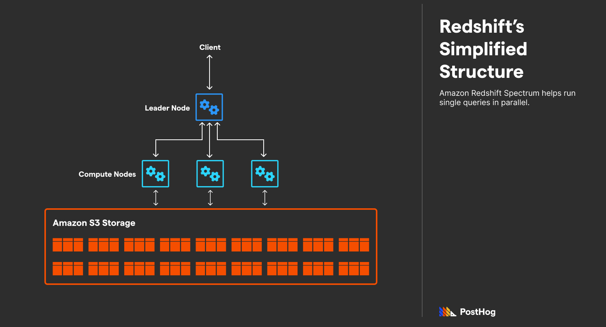
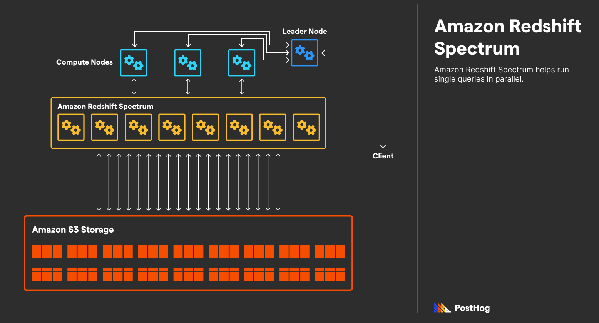
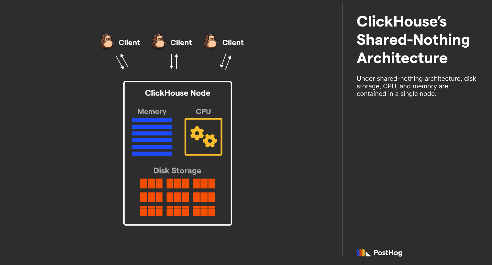
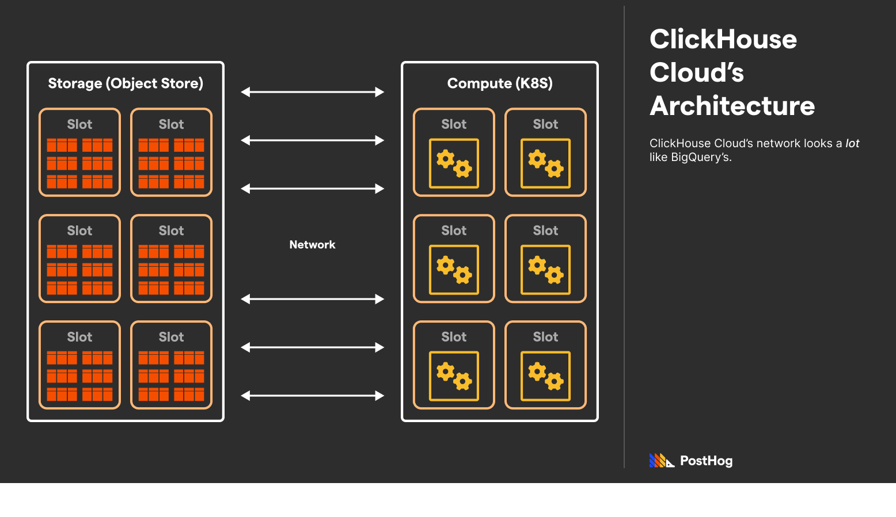

We've written extensively comparing ClickHouse to other analytical databases, including [Google BigQuery](/blog/clickhouse-vs-bigquery), [Elastic](/blog/clickhouse-vs-elasticsearch), and [Apache Druid](/blog/clickhouse-vs-druid). Most of those articles had the same gist – a tuned ClickHouse instance is faster by many orders of magnitude, but lacks some general-purpose features, making it unsuitable for certain use cases. 

ClickHouse with Amazon Redshift are the most comparable databases we've explored to date. While ClickHouse is still faster, Redshift's infrastructure optimizations makes the comparison closer than usual. While query speed on most databases are orders of magnitude slower than ClickHouse, Redshift is only 2-5x slower on a majority of queries.
 
Both have multiple configurations such as ClickHouse Cloud AWS, ClickHouse Cloud GCP, and Redshift's recent AQUA and AutoMV update. Certain optimizations from these could make query speeds even closer, but this comparison will speak more broadly on each product.

## Overview

Redshift and ClickHouse are both online analytical processing, or OLAP, databases that can handle petabytes of data at impressive speeds. Unlike online transaction processing, or OLTP, databases, such as MySQL or [Postgres](/blog/clickhouse-vs-postgres), OLAP databases are designed to efficiently return aggregations of data. 

From a cultural point of view, the two products are wildly different. ClickHouse is an open-source project developed by a relatively small startup. Amazon Redshift, meanwhile, is closed-source and is built and maintained by a company that needs no introduction. And while both have significant overlap, they are sometimes used in conjunction. 

Comparing Redshift and ClickHouse today is particularly apt because [Redshift’s most recent AWS talk](https://www.youtube.com/watch?v=pnPHEOlRcHQ) centered around ClickHouse’s forte: analytics. 

## What is ClickHouse?

ClickHouse is a SQL-based data warehouse that can deliver aggregations at amazing speeds.

Like many other open-source projects, ClickHouse started behind closed doors. The original ClickHouse was an internal project for Yandex, built for Yandex.Metrica, a Google Analytics analog popular in Russia. In 2016, ClickHouse was spun out into its own open-source project and is managed today by ClickHouse Inc. with some contributions by Altinity Inc. 

ClickHouse was engineered to number crunch big data, returning aggregates at subsecond speed. Consistently one of the fastest databases in its space, ClickHouse accomplishes remarkable efficiency through columnar storage, dynamic materialized views, and specialized multicore engines.

Like many open-source projects, ClickHouse can be optionally deployed via paid, managed solutions – including  one by ClickHouse Inc. known as ClickHouse Cloud, and another Kubernetes-based solution by Altinity Inc. known as Altinity.Cloud. 

ClickHouse has enjoyed considerable success since its founding in 2016, counting Cloudflare, Microsoft, GitLab, Clearbit, and even us at PostHog as users. Because [ClickHouse](/docs/how-posthog-works/clickhouse) is often employed to power user-facing analytics, it comes as no surprise that its users are traditional tech companies. 

## What is Amazon Redshift?

Amazon Redshift is a SQL-based data warehouse that also enables number crunching on structured (and semi-structured) data. Redshift is exclusively available in AWS and is often used by AWS users for any analytics queries functionally impossible via standard databases like Postgres. 

One of Redshift’s biggest selling points is its ability to scale automatically as data needs grow. Because it is tightly integrated with AWS, importing data from other AWS services is also relatively straightforward. Redshift is also easy to deploy inside a VPC and can easily encrypt data at rest or in transit. 

Because Redshift is a multipurpose analytical database, its customers are wide-ranging, including Nasdaq, PBS, McDonald's, Roche, and Merck. 

## Architecture

### Redshift’s (ultra-complex) architecture

Redshift has a particularly complex architecture, which is a byproduct of Amazon’s enormous preexisting infrastructure, and Redshift’s goal of being an all-purpose database. 

Redshift’s architecture is massively parallel, shared-nothing, and columnar. “Shared-nothing” means that individual Redshift clusters don’t have overlapping data, and “massively parallel” indicates that it splits computation between nodes. 

On paper, these are standard premises behind an OLAP database. Redshift uses a leader node (sometimes called a master node) that acts as a load balancer, handling transactions between SQL clients and compute nodes. 

Compute nodes, through some complexity discussed below, transact with storage that is often built on AWS S3, though support for other storage solutions, like RDS, has been added recently. 

Redshift becomes a bit more complex once we dive into its multiple layers of computation optimizations, both organizational and with bare-metal hardware. 

The first is Redshift Spectrum, which refers to an army of EC2 machines that compute nodes can recruit to split a single query into parallel computations. More accurately, Redshift Spectrum is a layer between compute nodes and storage – while compute nodes divvy up queries via the leader node, Spectrum splits a single query’s computation between many machines. 

The easiest way to describe this setup is to walk through a single query. Imagine a business intelligence (BI) tool that wants to learn the total sum of sales across a company’s history. In order: 

1. A leader node accepts the query and delegates it to a compute node.
2. A compute node employs Redshift Spectrum to execute the summation.
3. Thousands of machines in Spectrum begin adding up multiple months of sales data each, returning those aggregations to the compute node.
4. The compute node adds all the micro-aggregations together, calculating a total aggregation across all data. 
5. The compute node returns that value to the leader node. 
6. The leader node returns that value to the BI tool. 

Things get extra complicated and efficient, with Amazon’s 2019 release of AQUA (Advanced Query Accelerator). AQUA evolved because SSD bandwidth increased immensely over time, but more storage doesn’t inherently mean faster queries, especially when the bottleneck is now between the memory-compute bus. 

AQUA is a hardware optimization that enables storage units to run computations without burdening the main compute layers (e.g., Redshift Spectrum). It is **not** a replacement for Spectrum, it just eases the load by handling standard tasks, such as encryption or compression, as well as precomputing simple aggregations of data. 

According to AWS, AQUA boosts performance by 10x on average by precomputing queries. 

AQUA shifts Amazon’s shared-nothing model to something similar to a shared storage model. Because AQUA precomputes data, it encourages developers to use a single Redshift managed storage layer that multiple Redshift clusters can interact with. 

### ClickHouse’s (traditional) architecture

ClickHouse’s traditional architecture differ for some managed instances, but it best represents overall design differences. 

ClickHouse extends a shared-nothing architecture, combining CPU, storage, and memory into a single, beefy machine. But while ClickHouse’s design is fundamentally monolithic, it also supports sharding a database across multiple instances using Apache ZooKeeper. 

Because ClickHouse bundles everything into the same instance, it can scale that instance into three discrete dimensions – storage, memory, and compute. Although, scaling an already provisioned instance isn’t trivial; a new instance needs to be spun up and the data needs to be manually migrated. 

Like Redshift, ClickHouse employs techniques for pre-aggregating data to return faster queries. Redshift accomplishes this by specialized in-memory hardware that precomputes queries. ClickHouse, by contrast, uses materialized views with custom settings that dynamically and efficiently precompute data once new data is ingested. 

In layman's terms ClickHouse is a speedboat whereas Amazon Redshift is an aircraft carrier – one is most definitely feature-packed (Redshift), while the other is faster (ClickHouse). And sometimes, that speed is the deciding factor.

### ClickHouse Cloud’s architecture

A common point of confusion is the distinction between ClickHouse and ClickHouse Cloud, particularly in regard to architecture. While ClickHouse is a monolithic titan, ClickHouse Cloud decouples storage and compute. It is deployed on AWS and, as of very recently, GCP. 

ClickHouse Cloud was modeled after Google BigQuery, offering out-of-the-box integrations with ELT providers, an interactive SQL console, automated backups, caching, and automatic replication. 

## Why ClickHouse is still faster (with a caveat)

The general consensus of speed tests is that ClickHouse is faster [[1](https://clickhouse.com/blog/redshift-vs-clickhouse-comparison)][[2](https://www.firebolt.io/comparison/redshift-vs-clickhouse)][[3](https://altinity.com/blog/clickhouse-vs-redshift-performance-for-fintech-risk-management)]. However, this speed comparison isn’t as cut-and-dry as most other ClickHouse comparisons. 

The ClickHouse and Redshift comparison comes down to the nitty-gritty. Both offer materialized views with incremental updates, SIMD vector executions, and strong compression standards. The difference is that Redshift’s optimizations are created to optimize queries without much configuration (and, by contrast, some limited efficacy), while ClickHouse’s optimizations take work and effort, but are tuned for a project’s unique needs. 

There are some limitations of Redshift that ClickHouse [calls out](https://clickhouse.com/blog/redshift-vs-clickhouse-comparison) itself. The first limitation is that Redshift only allows up to 50 concurrent queries; this is a valid concern, particularly for analytics or data products where concurrent queries are abundant. 

The second limitation is that Redshift needs to compile first-time queries to optimize them, which adds a few seconds of delay. This compilation time isn’t ideal for analytics products where users are constantly customizing first-time queries to the database. ClickHouse also notes that it has better compression than Redshift, scoring something in the realm of 2x compression.

A common criticism of ClickHouse, meanwhile, is that it lacks a results cache, which is a flagship feature of Redshift. A results cache is excellent for applications with predictable, repeatable queries. Thankfully, ClickHouse has addressed this concern with a new update in February of this year; the project now supports [a configurable cache](https://clickhouse.com/blog/introduction-to-the-clickhouse-query-cache-and-design). 

A counterargument to ClickHouse’s speed supremacy is that it requires a lot more work. Materialized views need to be configured by engineers. In general, it requires more technical oversight to streamline queries. 

Meanwhile, Redshift has AutoMV, which automatically creates materialized views. Redshift is ideal for companies that want a faster solution than Google BigQuery, but cannot afford to spend too much time tuning queries. 

## How ClickHouse and Redshift often work together

Because ClickHouse is faster at certain queries, while Redshift is a more general-purpose product that is easier to connect to a preexisting AWS stack, they can work well together with redundant data. ClickHouse [has a fantastic guide](https://clickhouse.com/blog/redshift-vs-clickhouse-comparison) detailing step-by-step how to connect the two. 

There are a number of ETL providers that enable streaming data between Redshift and ClickHouse, but given Redshift is already embedded in the AWS ecosystem, many developers use AWS Glue. While AWS Glue lacks a native ClickHouse connector (for now), it can [execute Python scripts](https://clickhouse.com/blog/redshift-vs-clickhouse-comparison#using-aws-glue-for-streaming-data-between-redshift-and-clickhouse) that can be used to ingest data. Additionally, AWS EventBridge and AWS Lambda can be used to automatically trigger an ETL job after new data is ingested.

## Summary

ClickHouse and Redshift are both fantastic OLAP solutions that can efficiently return aggregations of data. ClickHouse is typically faster, beating out Redshift by 2-5x margins, but it requires more engineering effort, and isn’t as tightly embedded with other tools. Redshift, by contrast, works nicely with other AWS products. 

Because of their differences, ClickHouse and AWS Redshift are sometimes used in conjunction, connected via an events manager (like AWS EventBridge) and an ETL solution (like AWS Glue). 

We chose ClickHouse at [PostHog](https://posthog.com/) because we needed to return aggregations for unpredictable queries for hundreds of customers. Because of ClickHouse, PostHog is fast and can deliver results at “click of a button” speeds. 

## Further reading

Consider the following resources if you want to learn more about the differences between ClickHouse and Redshift.

- [ClickHouse guide to migrating data from Redshift to ClickHouse](https://clickhouse.com/docs/en/integrations/redshift)
- [Optimizing Analytical Workloads: Comparing Redshift vs ClickHouse](https://clickhouse.com/blog/redshift-vs-clickhouse-comparison)
- [Altinity's ClickHouse vs Redshift benchmarking](https://altinity.com/blog/2017/6/20/clickhouse-vs-redshift)
