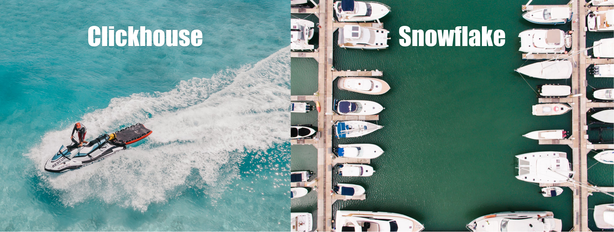
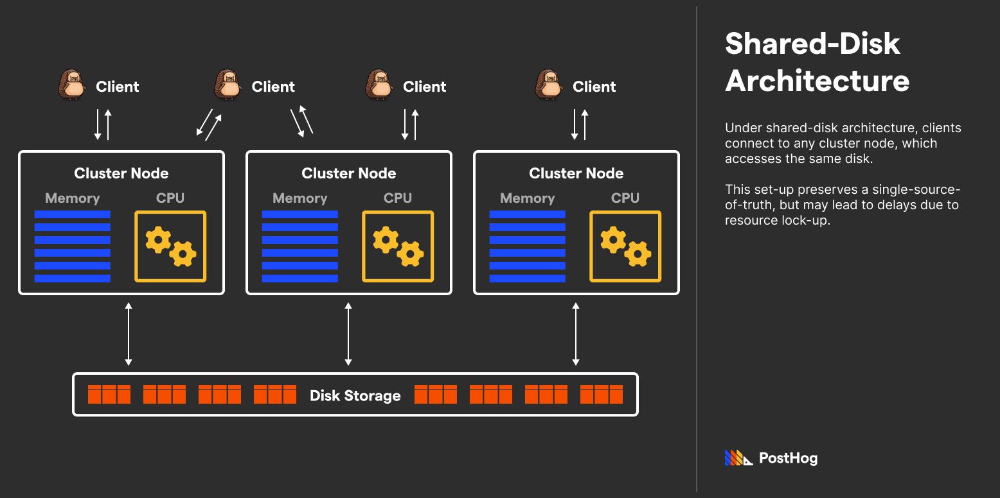
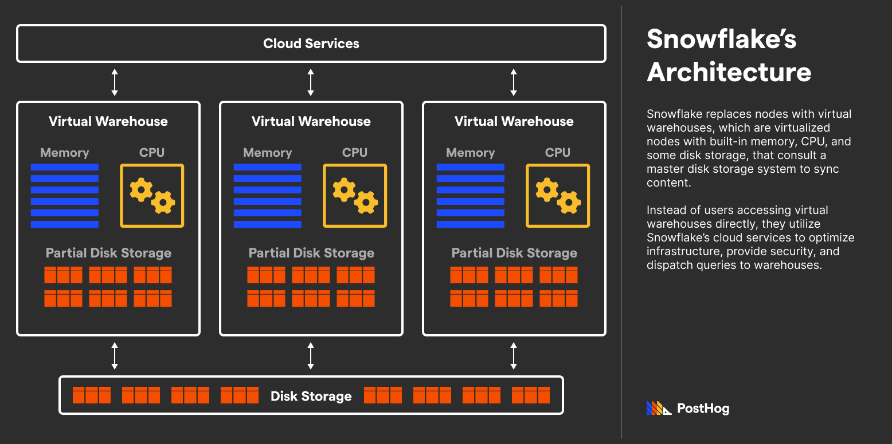

Two years ago, Snowflake versus ClickHouse was a straightforward comparison. Back then, Snowflake was fully managed, expensive, and broadly featured. ClickHouse was on-prem, open source, and speed-optimized. Two ends of a data warehouse spectrum splitting versatility (Snowflake) and speed (ClickHouse).

If I was to compare the databases to boats, ClickHouse is a jet ski – ultra-fast, but limited. Snowflake, meanwhile, is a shipyard – a slew of (expensive) tools spanning various functions.

But, as I said, that was *two years ago*. Today, Clickhouse has broken ground on features that compete with Snowflake’s managed solution. Likewise, Snowflake released features that are beginning to tackle ClickHouse’s speed. However, the overlap between ClickHouse and Snowflake remains nascent. Today, they are both still  *very, very* different.

## Background

Snowflake and ClickHouse are at wildly different stages of growth.

Snowflake, founded in 2012, is a well-funded, publicly-traded decacorn with nearly 4,000 employees.

In contrast, ClickHouse is in relative infancy. While the project originated internally at Yandex around 2012, ClickHouse only spun out independently in 2016 and received funding in 2021. 

Recently, ClickHouse raised a Series B to launch ClickHouse Cloud, its Snowflake-like service.

### What even is Snowflake?

Every engineer and their cousin has heard about Snowflake. Its massive IPO was the most successful public launch in technology history. The title of “Next Snowflake” translates to “Next Incredible Business” in venture-capital land. And with over $1B in revenue, the hype is deserved. However, there’s also a rather curious phenomenon – relatively speaking, few engineers appear to be versed in SnowSQL (Snowflake’s SQL dialect).

This contradiction between success and adoption is because Snowflake doesn’t behave like a typical database company. Snowflake is cloud-only, unlike solutions like ClickHouse, [Apache Druid](/blog/clickhouse-vs-druid), TimescaleDB, and most other OLAP databases. The codebase is neither open source nor locally installable. And sorry, startups, but there is no free tier.

To some developer evangelists, this business-first scheme is seen as heresy. But it's an excellent solution for Snowflake’s customers, each of whom pays an average of ~$170,000 a year. But why? Snowflake isn’t Louis Vuitton – people aren’t clamoring to buy its product merely because it's expensive.

Instead, Snowflake is a jack of all trades. Snowflake has complex, performant architecture, but its cloud-first, fully-managed design makes scaling seamless. Snowflake can handle complex, conditional-heavy queries, but its GUI enables non-technical people to take advantage of stored data. Snowflake’s codebase, including any security flaws, is entirely closed-source, but its massive app marketplace makes third-party integrations possible.

Snowflake was built for businesses with complex, ever-changing needs with big budgets. It’s by no means the fastest horse, but it’s the only one that can prance, race, dance, and even sing.

### What about Clickhouse?

An obvious difference between Snowflake and ClickHouse is that ClickHouse is an open source solution that can be deployed on any arbitrary server. ClickHouse doesn’t make money on any of those open source deployments, and this leads their team to be less sales-driven and more research-heavy. 

The biggest difference is in Clickhouse’s strength. Let’s return to the analogy of ClickHouse being a jet ski. ClickHouse is fast. Incredibly, unbelievably fast. In particular, ClickHouse can return complex aggregations of terabyte-level data spanning millions of rows in milliseconds. In comparison, Snowflake takes dozens of seconds to query gigabyte-level data. 

ClickHouse accomplishes this by optimizing the database for speed at returning aggregates. ClickHouse isn’t designed to be utilized like a stock PostgreSQL or mySQL database; it’s particularly good at write-heavy, mutation-low, read-and-reduce-heavy operations. It's perfect solution for analytics providers, like [PostHog](https://posthog.com/).

However, normal, on-prem ClickHouse lacks a lot of features that Snowflake likely considers table-stakes: 

- A dedicated non-technical-friendly GUI for exploring and visualizing data
- The ability to modify entry data without massive performance burns
- The ability to scale architecture seamlessly with no migrations whatsoever

### ClickHouse Cloud and Altinity Cloud

It is slightly silly to compare Snowflake and ClickHouse without mentioning ClickHouse Cloud and Altinity Cloud. Both solutions simplify deploying and maintaining a ClickHouse instance. This helps address the final bullet in the previous section; they make scaling architecture seamless without frustrating data migrations.

ClickHouse Cloud – a new product launched in 2022 by ClickHouse Inc (ClickHouse’s primary contributor) – is exclusively available on AWS, with plans to support both Google Cloud and Azure like Snowflake. Meanwhile, Altinity Cloud – built by Altinity Inc (also contributors to ClickHouse) – has support for both AWS and Google Cloud. Altinity Cloud is also Kubernetes-compatible. 

The big difference between ClickHouse Cloud and Altinity Cloud is how they store data. ClickHouse Cloud is engineered like Google BigQuery. The data is stored in object storage. Altinity Cloud meanwhile runs ClickHouse similar to how an on-prem or local instance works; virtually anything you can do on a local instance is possible on Altinity Cloud. 

Separately, an advantage of ClickHouse Cloud is that it includes some exclusive features not available in the ClickHouse core distribution. One of these is a SQL GUI explorer which provides similar features to some of Snowflake’s basic data exploration. 

Overall, ClickHouse Cloud or Altinity Cloud are excellent options for companies that want a managed version of ClickHouse on the public cloud. Their emergence closes the gap between ClickHouse and Snowflake. 

### Who uses Snowflake and ClickHouse?

Part of Snowflake’s value prop is the broad appeal to both technical and non-technical users. Snowflake’s marketplace makes connecting business intelligence tools with warehouse data easy, which appeals to teams wanting explore their data. ClickHouse Cloud has a competitive offering, but the current integrations are limited to a select few.

While a managed ClickHouse solution is similar to Snowflake’s integration war chest, it has a long way to go before it is competitive. It does, however, level the playing field considerably. Before ClickHouse Cloud, the on-prem only option made it significantly harder to scale compared to Snowflake’s one-click upgrades.

Some **companies that use** Snowflake include AT&T, Jetblue, Anthem, and Capital One. Snowflake customers tend to be enterprise-level and have to deal with a lot of data. 

**ClickHouse’s customers** include Github, YouTube, Twitter, and Slack. We, at PostHog, also [use ClickHouse](/docs/how-posthog-works/clickhouse). It dramatically improved our analytics data warehouse from our previous Postgres setup and allows us to deliver billion-event scale insights quickly. 

## Architecture overview

When Snowflake was released in 2012, there were two major paradigms – **Shared-Disk Architecture** and **Shared-Nothing Architecture**.

Under Shared-Disk Architecture, CPU and memory were split into nodes, but each connected to a single storage unit. The benefit of Shared-Disk Architecture is that data is always in sync, but collective usage means stalled requests to avoid conflicts.

Meanwhile, CPU, memory, and storage are encapsulated under Shared-Nothing Architecture in separate, parallel instances, only syncing via background jobs. The benefit of Shared-Nothing Architecture is an arbitrary instance never stalls requests; however, storage could go out of sync. 

Part of Snowflake’s initial appeal is its hybrid solution that combines the advantages of Shared-Disk Architecture and Shared-Nothing Architecture. Snowflake achieved this by adding another layer of storage to each node that stored partial data, similar to the cache but more complete.

More importantly, Snowflake’s middle layer – virtual warehouses – can be scaled easily, coming in T-shirt sizes (S/M/L/XL). Snowflake makes it easy to add parallel nodes or re-size existing nodes, made possible by Snowflake's virtualized architecture.

ClickHouse utilizes Shared-Nothing Architecture as each instance bundles CPU, memory, and storage into a single instance, with parallel instances in case the database has replicas. However, ClickHouse has [suggested](https://github.com/ClickHouse/ClickHouse/issues/7177) that future support for an alternative Shared-Disk layout is coming.

### Differences in query optimization & speed

This time, let’s start with ClickHouse. ClickHouse has three significant optimizations that make querying aggregate computations efficient: (i) materialized views, (ii) specialized engines, and (iii) vectorized query execution.

- **Materialized views:** Materialized views are independent tables derived from other table data generated at some specific point in time. Unlike databases like Postgres, ClickHouse's materialized views are constantly re-generated in the background after new data is inserted. While materialized views are delayed because most of ClickHouse's use cases involve aggregate, analytical data, the delay doesn’t pose a problem.

- **Specialized engines:** Materialized views are aided by ClickHouse's specialized engines that efficiently parallelize processes. For instance, if you need to add millions of numbers, ClickHouse's SummingMergeTree would dramatically optimize that query.

- **Vectorized query execution:** Vectorized execution, initially championed by the MonetDB team, batches data to achieve bulk processing. Vectorized query execution takes advantage of CPU caches and SIMD CPU instructions to enable faster computation.

Snowflake has some of these features, but with caveats: 

- While Snowflake has support for materialized views, it charges additionally for it since it needs to allocate serious CPU resources to recompute the views. Those re-computations, under the hood, are more resource intensive for Snowflake because it lacks the same partial-update techniques ClickHouse uses to expedite re-calculations.

- **Virtual warehouses instead of specialized engines:** Unlike ClickHouse's specialized engines, which utilize hardware to optimize query execution, Snowflake segments its database into virtual warehouses sized from small to large. These warehouses can have larger or lesser compute to handle complex to easy queries and isolate workloads. However, while clever and organized, this approach is computationally and financially expensive when taken full advantage of.

- **Search optimization service:** Introduced in 2021, Snowflake offers a search optimization service at its higher enterprise tiers. Because Snowflake is a closed-source product, not much is known about how the search optimization service works, but it can offer enormous performance gains (4x-100x) relative to un-optimized search for some types of queries. Unfortunately, while Snowflake likely uses similar mechanisms to ClickHouse, direct side-by-side analysis isn’t possible due to Snowflake’s closed-search tier. By extension, the search optimization service’s performance boost is unpredictable.

Overall, ClickHouse's close-metal optimizations enable it to return aggregate values over a thousand times faster (and cheaper) than Snowflake. However, Snowflake’s approach is considerably more user-friendly as it requires less SQL-level optimization to take advantage of these organizational features.

### Security

From a third-party vendor standpoint, Snowflake and ClickHouse Cloud are SOC II Type 2 accredited and have PCI-DSI compliance. Of course, ClickHouse on-prem has no built-in security features beyond ordinary user management.

## Conclusion

Snowflake and ClickHouse solve similar problems but are each cut from a different cloth. Snowflake was designed as business first, appealing to enterprise clients with intensive needs. ClickHouse was intended to improve the efficiency of returning aggregate analytical data, but is young as a business. 

For teams looking to implement an OLAP database with enormous performance gains and not much else, ClickHouse is a fantastic solution. Snowflake may be best for businesses that need a more extended, broad product, but they should be ready for a hefty invoice.

### Further reading

Consider the following resources if you want to learn more about ClickHouse and Snowflake’s differences.

- [ClickHouse Documentation](https://clickhouse.com/docs/en/home/)

- [Snowflake Documentation](https://docs.snowflake.com/en/)

- [Clickbench](https://benchmark.clickhouse.com/), a benchmark test comparing ClickHouse, Snowflake, and other databases

- Learn more about Snowflake’s [Search Optimization Service](https://www.snowflake.com/blog/now-generally-available-snowflakes-search-optimization-service-accelerates-queries-dramatically/).

- [Velotio](https://www.velotio.com/engineering-blog/clickhouse-the-newest-data-store-in-your-big-data-arsenal)’s Snowflake versus ClickHouse article. Note, this article was published before the ClickHouse Cloud announcement, which impacts the comparison with Snowflake.