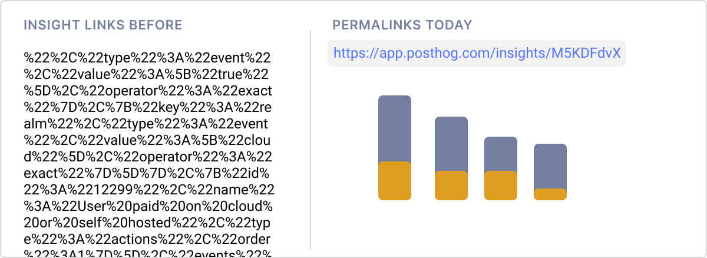
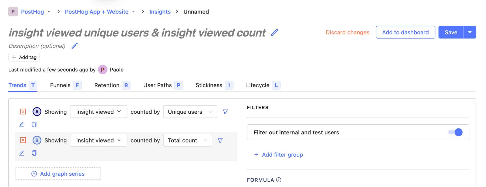
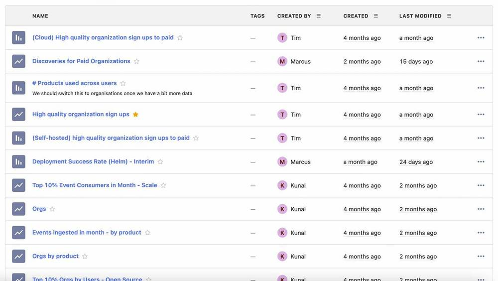

PostHog is better with teammates. You only have to create a [dashboard](/docs/user-guides/dashboards) once, but it becomes more valuable every time you invite someone from your organization to view it. And this isn't just some vague truism: it's a measurable fact.

Our data shows organizations with multiple teammates retain 30%+ better than those with a single user. Better collaboration also powers our [main Product metric](https://github.com/handbook/product/metrics): insight discoveries. Our conservative estimates suggest we could increase discoveries by 20% by improving collaboration workflows [1], so that's what we've done.

Over the past few months, we've worked hard to make collaboration in PostHog as easy as possible, particularly for larger teams. That work will never end, but we want to show you what we have today and share our roadmap for the future.

## Use case one: Sharing

The most basic collaborative action for an analytics product is sharing insights. This is critical because, in larger teams, there are usually multiple stakeholders making or influencing product decisions. In order to make solid decisions, context must be shared (e.g. sharing with your marketing team the effect of marketing efforts on the product, like high quality signups).

To address the above we introduced robust permalinks to insights that can easily be shared across multiple mediums. These links can now be used to send a specific insight (with all configurations) to a colleague, even if you are working across multiple projects.

Dashboards can easily be shared too, and even if you share a link to a dashboard in a different project, if the user has access to that project, they'll be automatically switched to that project.

New challenges arise when collaborating with dashboards among larger teams. In small teams, it's common for a single person to own the analytics process, but proactive feedback sessions with our larger clients demonstrated this wasn't the case for them, and caused issues.  In response, we've introduced granular permission controls to dashboards to provide confidence to users that dashboards haven't changed when they shouldn't.

### Use case two: Discovering interesting stuff you weren't looking for
Sometimes you don't know what you're looking for, or you don't know where to start. There are many different avenues to improving your product. For example, we recently [discovered](https://github.com/PostHog/posthog/pull/7973) users seldom use our Paths advanced features and these could introduce mental burden to users.

To aid serendipitous discoveries, we've created a project homepage to surface helpful insights you may not have considered. By making it the default page on PostHog, our aim is to help users make quick discoveries. We'll surface your most important product and company metrics here as well as popular insights, and we're leveraging social proof from what other teammates are doing in your app to help you discover more product improvements.

In addition, if your team uses the [Recordings](/product/session-recording) feature, we'll also surface the most recent recordings here. We've found that users who return to session recordings make 3x more discoveries than other users (more context [here](https://github.com/PostHog/posthog/issues/8595#issuecomment-1056916848)). This should also help drive qualitative discoveries about your product.

Mockup / screenshot here.

## Use case three: Leverage what others discovered
We find there are two general profiles for PostHog users:

1. People who are naturally curious and whose job leads them to discover insights all the time and across multiple dimensions.
2. People who use PostHog to answer specific questions as they arise. 

For people who create insights, we've introduced one-click saving and automatic insight naming to ensure any insight you create is easy to understand for other users who happen upon them. This means people who create lots of insights but don't have to spend time documentating or explaining them to their colleagues, and their colleagues don't have to waste time decoding what insights mean.

And for people who love discovering insights that others helped create, we've made it easier to search and find saved insights.

To support this work, we also introduced the new [Data Management](link_to_blog_post_here) feature, which aims to bring all the context on how your product is instrumented to your entire organization. Now there's no need to ask an engineer or the PM which event you should use to answer a question, which both parties will appreciate!

## What's next?
We continue to actively work on improving collaboration throughout the product and we have some specific plans in our short term [roadmap](https://posthog.com/handbook/people/team-structure/team-app#roadmap). However, we're a fast moving company and we continuously reprioritize based on user feedback, market and need changes, and strategy changes, so while our goal to make more people successful with PostHog will remain, the way we tackle this problem and the actual product changes may change.

With the disclaimer above in mind, here's some exciting stuff we hope to ship soon. 
### Slack Previews

Almost every team uses some sort of Instant Messaging tool (think Slack, Discord, Teams, ...) and in particular, it's a place for discussions. We believe that adding more context when you share a link to a PostHog insight or dashboard in your messaging tool will speed up discussions (e.g. a screenshot of the graph, general details, recent changes, ...). We're starting with Slack to test drive this concept, but if successful, expanding to other tools will make sense.
 
### Email subscriptions to dashboards and insights
As we analyzed dashboard usage in PostHog (and from conversations with users too), we discovered it's quite common for teams to have 1-2 dashboards that represent critical metrics for their product and their company. These metrics, such as number of sales for an e-commerce company or retention for a pre-Product-Market-Fit startup, are so important that keeping an eye on them continuously is vital. A very user friendly way of doing this is integrating with current workflows, and almost everyone uses email. So you'll be able to start your Mondays (or any other day) with a digest of how your product and company are doing.

### Embeddable graph images

You've seen the typical Medium post with a graph, well we have too and we hate they're not PostHog graphs. But aside from that superficial argument, teams have different workflows and tools where product context is shared (e.g. an intranet, Notion, Google Docs, code repositories, blog posts). Usually product decisions are at least data-informed (and we do hope this will help drive this behavior further), so we want to make sure that the context from product data is properly shared, accessible and preserved. In particular, we also want to make sure these context remains up-to-date.

As always, we welcome and highly encourage you to share any feedback you may have about this or any other feature. Give us a shout in our [community Slack](/slack) or join us directly for a [call](https://calendly.com/posthog-feedback) with our Product or Engineering team.

[1]: Based on the average number of discoveries per active user and the number of teammates that never perform a discovery, we estimated that we could get at least a ~12%+ increase in active discoverers, and 20%+ increase in weekly discoveries.