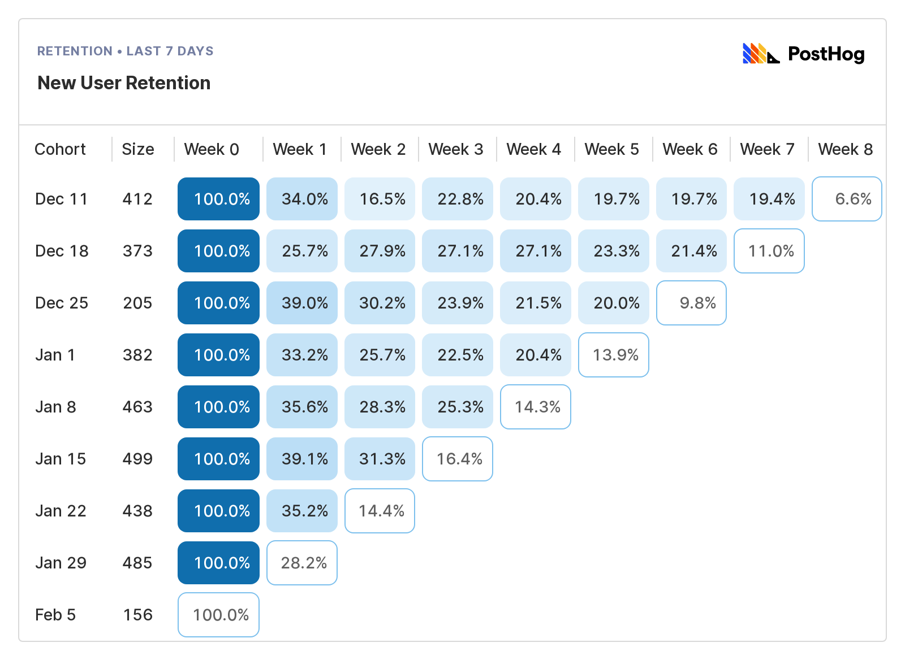
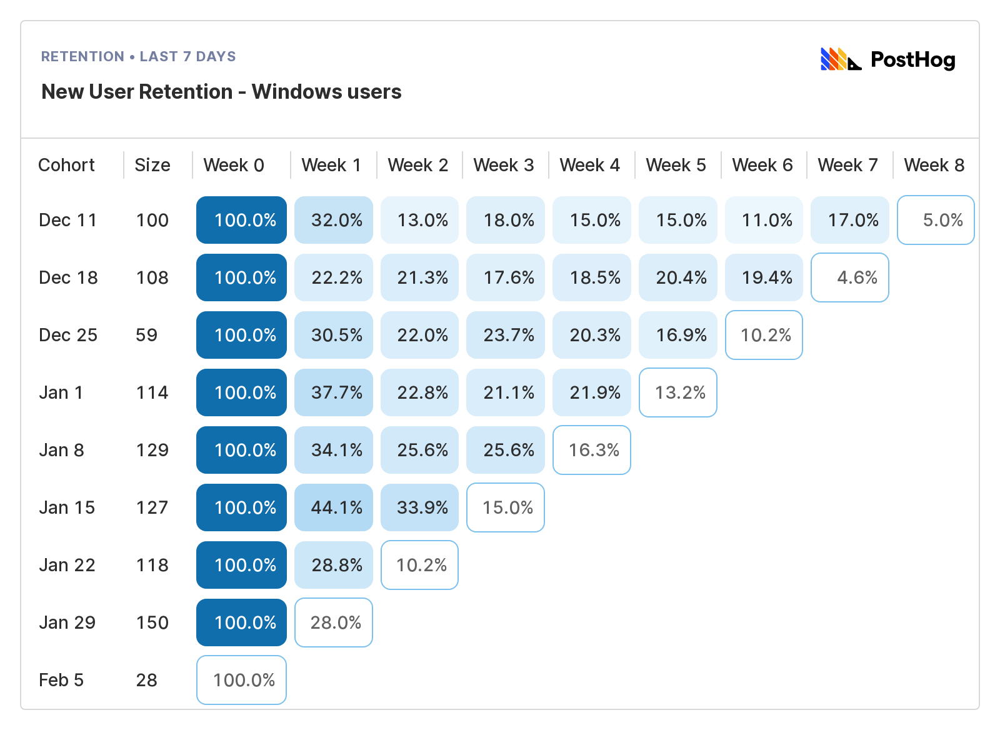
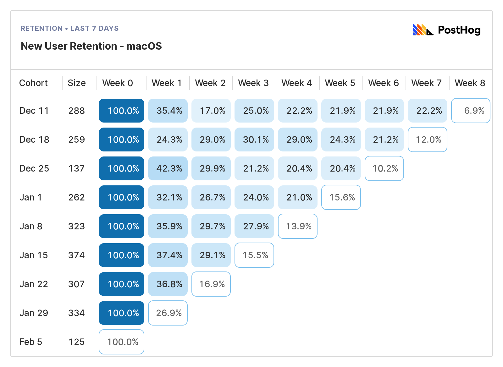

You know what's cooler than gaining new customers? Retaining them.

In this guide to customer churn analysis, I'm exploring churn rate and retention rate:
- How they're different
- How to measure them
- Why you should care

These and other questions (like [how to reduce churn](#how-to-improve-retention-and-reduce-churn)) will be answered. Let's get to it.

## What's the difference between retention rate and churn rate?

Not much, really: 

- **Churn rate** is the percentage of customers who **stop using** your product during a given period of time.
 
- **Retention rate** is the percentage of **existing customers** who **continue using** your product. 

In other words, if you have 1,000 customers and 100 of them cancel their subscription, your monthly churn rate would be 10% and your retention rate would be 90%. That's it.

Typically, "churn" and "customer churn" are used interchangeably, but there are numerous formulas for revenue churn/retention metrics – e.g. net revenue retention, gross revenue churn etc. I won't be covering them here, but [ADD LINK TO A GOOD SOURCE ON THE TOPIC].

Those are the basics, but there's more worth learning. Let's start with churn rate.

## Understanding churn rate

Here's the simplest formula for churn rate:

> **Customer churn rate** = (Churned customers during a specific period / Total customers at the start of that period) x 100

Where:

> **Churned customers** = (Customers at the start of the period - Customers at the end of the period) + New customers acquired in that period

The majority of companies should track churn monthly and/or annually. Those interested in tracking churn daily or weekly are better off using a [cohort retention table](#how-to-read-and-use-a-cohort-retention-table). More on those later.

> 🚨 **Important:** Do not confuse monthly and annual churn rates. Monthly churn compounds into annual churn – i.e. a monthly churn rate of 5% equals a massive 46% annual churn rate. You can't just multiply your monthly churn rate by 12 to get your annual number, either. See [how to convert monthly churn to annual](#converting-monthly-churn-into-annual-churn-and-vice-versa) in the appendix.

### Why should you care about churn?

Reducing churn makes intuitive sense, but it's worth considering the practical impact of high churn and reducing it. You can boil it down to three points:

  1. High churn is a likely sign you don't have product-market fit.

  2. High churn leads to increased sales and/or marketing spend to compensate.

  3. Reducing churn compounds – i.e. revenue **and** marketing ROI increase.

All are compelling reasons to reduce churn, but you need some context before you do. Is your current churn rate actually bad, or does it just **feel** bad? Let's dig into that next.

### What is a good churn rate?

For research, I read several dozen data analyses and finger-in-the-air takes on what "good churn" looks like. Suffice it to say there are contrasting views on the topic.

I've collated the better sources [in the appendix](#more-on-churn-rate-benchmarks). What follows is my own, not-quite-scientific meta-analysis:

**TODO:** Re-org this section by company type, rather than bands... 

- **Monthly churn of 0.5% or less** is outstanding for any company, but an unrealistic expectation for B2C products. It's equivalent to an annual churn rate of 5.84% – i.e. a company with 1,000 customers would lose 58 over 12 months.

- **Monthly churn of 1.5 to 2%** is still very good, especially for mid-market B2B companies that don't sell to enterprises. It's equivalent to an annual churn rate of 16.59% – i.e. a company with 1,000 customers would lose 166 over 12 months.

- **Monthly churn of 3.5%** or 34.8% per year is pretty typical for B2B SaaS products with less than $250 average revenue per customer (ARPC). The higher your ARPC, the lower your churn rate ought to be. 

- While an **annual churn of 45%** (aka 5% per month) sounds terrifying, it's not unheard of among successful mid-market B2B SaaS companies. In 2016, Buffer, a successful SaaS company with over $1 million in monthly recurring revenue at the time, reported annual churn of 46%. Multiple studies show a 5% monthly churn rate is common among smaller B2B SaaS companies.

- **Monthly churn above 5%** is to be expected for any early-stage company B2B SaaS, and a good benchmark for B2C subscription products. When you're early-stage, hitting an absolute number is less important than seeing your churn rate improving.

## Understanding retention rate

So that's churn rate, but what about retention rate? The basic formula is very similar:

> Retention rate = (Customers at the end of a period - Total new customers during that period) / Customers at the start of the period x 100

So, if you have 100 customers at the start of a year, gain 35 new customers during the year, and end the year with a total of 80 customers then your retention rate would be:

> ((80-35)/100)*100 = 45% retention

Needless to say, ending the year with fewer customers than you started isn't great news, but this is just an example, so there's no need to panic yet.

Now, the cool thing about retention rate is it's easy to visualize in a cohort retention table like this:

Retention tables allow you to answer questions like:

- Which features do users come back to over and over?
- Which features do users try and never use again?
- What actions contribute to users retaining or churning?
- What properties do retaining users have that or churning users lack?

If you can answer these questions, you're on the way the improving retention and reducing churn.

### How to read (and use) a cohort retention table

Below is a PostHog retention table for an imaginary Dropbox clone called Hedgebox. In this retention table we're looking at weekly repeat usage, configured as:

> `Unique users` who `signed up for the first time` in the last 8 weeks who then came back and triggered the `interacted with file` event in PostHog.

To read it, just start on the left and work your way across:

- **Cohort** Denotes the week these users signed up – i.e. the cohort these users belong to.

- **Size:** Shows the size of that cohort – a useful reference to avoid comparing a very small cohort to a much larger one.

- **Week 0:** Gives you the percentage of users in the cohort who used Hedgebox in that week. As it's week 0, this number will always be 100%.

- **Week 1-8:** Shows the percentage of users from that cohort who returned each subsequent week, relative to week 0. Blue boxes denote completed periods; white boxes periods still in progress.

In this example, we can see retention settles at ~20% from week 4 onwards in most cohorts. 

That's a useful baseline, but what happens if we filter by just people who use Windows?

It's obvious Windows users retain worse than the baseline, dipping as low as 15% in week 4 onwards in the 'Dec 11' cohort. 

Do macOS users retain better than Windows users? Let's check...

They do! While the exact values vary, macOS users consistently retain better than Windows users. 

This prompts several avenues of investigation, such as: 

- Is the Windows Hedgebox experience worse and, if so why?
- Are Windows users demographically different to macOS users? 
- Does Hedgebox solve some fundamental problem for macOS users that makes them retain better? 

This is just one example using demo data in PostHog. You could also filter users by:

- Their age
- The browser they use
- The country or city they live in
- The number of files they upload
- The types of files they upload
- User job titles, company type, or myriad other properties

Cohort retention tables are also useful for tracking revenue retention, especially if you charge based on usage. Positive revenue retention (i.e. more than 100%) indicates users increase their spend over time. Needless to say, this is a good thing.

## How to improve retention and reduce churn

So, how do you improve retention and reduce churn? Talking to users is a vital component – we're [constantly talking to users](/blog/making-something-people-want) – but here are some tactical moves to consider:

- **Check for involuntary churn:** Involuntary churn typically means billing problems – e.g. expired cards, out-of-date info etc. In e-commerce, abandoned baskets are a form involuntary churn.

- **Target different users:** Sometimes poor retention comes from acquiring the wrong users. This could be a marketing problem, or you might have the wrong [ideal customer profile](/blog/creating-ideal-customer-profile) for your product.

- **Learn about your power users:** It's great to have power users, but they're also more sensitive to product changes. It's important to identify who they are, what they do, and what they value. They're your biggest advocates, so keep them happy. See: [How to identify and analyze power users in PostHog](/tutorials/power-users).

- **Improve your product:** If you're talking to your users, and learning about your power users, then you should be well-placed to build awesome new features your existing (and potential) customers will love. I'm told this is "creating value" in the official business lingo.

- **Focus on customer success:** Customer success > outbound sales a lot of the time. [Our customer success team](/handbook/small-teams/customer-success) owns all inbound contact requests, assisting new users and introducing them to the right PostHog people at the right time. If you can't afford a dedicated team, give the job to someone until you do. PostHog CEO, James Hawkins, owned this area in our early days.

- **Re-engage your users:** Users who like your product can sometimes be distracted by other things. Well-timed re-engagement messages, such as showcasing an underused featured, can be extremely powerful. [Path analysis](/product/user-paths) is a useful tool for understanding where users get distracted.

### The things you need to improve retention

You're gonna need a few things to track, analyze and reduce customer churn, such as:

1. The ability to identify your new/current users (e.g. job role, location etc.)

1. An analytics tool to help you track user churn, and analyze use behavior.

1. Session recording, so you can watch real interactions with your product.

1. A way to test new features and improvements to validate if they work.

1. The ability to safely roll out new features to test groups and specific cohorts

1. Product-minded engineers or product managers who talk to users and ship fast

Some companies deploy a complicated data stack to get all this, but it's not necessary. We built PostHog (yes, this is a teeny bit of sales pitch, now) so you can get all those things in one, tightly integrated tool.

And, while we can't help you with #6, we do have strong opinions on why [product engineers are awesome](/blog/what-is-a-product-engineer) for startups, and [how product engineers and product managers](/blog/product-engineer-vs-product-manager) can work together.

Check out [our product page](/product) if this sounds interesting to you.

/pitch over

## Takeaways

Phew, ok, that was lot. Hopefully you know a little more about how churn and retention rate work, interact, and impact your product now.

To conclude, here are {CHANGE THIS} takeaways you can use to sound smart in meetings, or perhaps share on LinkedIn 😱 with a hashtag – I won't judge, not publicly at least:

1. Early-stage startups shouldn't get too hung up on how high or low churn is, but you should care **which direction** it's headed. The actual rate of churn / retention is more important once you have product-market fit and care about revenue.

1. Don't benchmark your churn rate against the wrong industry, or product type. Average revenue per customer (ARPC) is a huge factor here. A B2B SaaS with an ARPC of $200 per month should have very different expectations than an enterprise SaaS with an ARPC of $10,000 per month.

1. PostHog is awesome and you should totally adopt it at your startup. "Nobody got fired for buying PostHog" said someone, probably me.

- TODO: WILL PROBABLY ADD ANOTHER TWO HERE

### Further reading

If you're interested in early-stage startups and product-led growth, you may find these articles useful: 

- PostHog CEO, James Hawkins, on [how we found our Ideal Customer Profile](/blog/creating-ideal-customer-profile)

- My guide to [building an AARRR pirate funnel](/blog/aarrr-pirate-funnel) for tracking your most important metrics

- Another piece from James on [how we made something people want](/blog/making-something-people-want)

You can also sign up to our newsletter over there 👉. We send it every two weeks. It's full of articles like this.

> ## Appendix
>
> ### Converting monthly churn into annual churn (and vice versa)
>
> - **Annual churn** = 1-(1-[your monthly churn])^12
>
> Using this formula, a monthly churn rate of 1% equals an annual churn of 11.6%. So, if you started the year with 1,000 customers and had 1% churn per month, you'd have 114 churned customers you need to replace through acquisition.
>
> - **Monthly churn** = 1-(1-[your annual churn])^(1/12)
>
> Using this formula, an annual churn rate of 11.6% equals an average monthly churn of 1%.
>
> ### More on churn rate benchmarks 
>
>  There's a lot of conflicting information and advice about what "good" churn looks like. 
>
> Studies tend to focus on specific verticals (e.g. enterprise SaaS), which aren't relevant to mid-market companies, or advice is based on anecdotal experience rather than data. 
>
> These are the best sources on the topic and the basis for my guidelines:
>
> - This [2020 meta-analysis](https://www.cobloom.com/blog/churn-rate-how-high-is-too-high) of six different studies neatly explains how methodology and data sources can distort results.
>
> - Subscription analytics company, Baremetrics, maintains an [open benchmarks page](https://baremetrics.com/open-benchmarks) based on data from its customers – mostly mid-size SaaS products like todoist, Product Hunt and npm.
>
> - [Recurly's 19-month study](https://recurly.com/research/churn-rate-benchmarks/) of 1,900 subscription products that use its platform. It breaks down churn for B2B and B2C products across multiple cohorts, including average revenue per customer (ARPC).
>
> - [Lenny Rachitksy's Q&A](https://www.lennysnewsletter.com/p/monthly-churn-benchmarks) on monthly churn, in which he polls several experts, including the CEO of subscriptions platform ProfitWell.