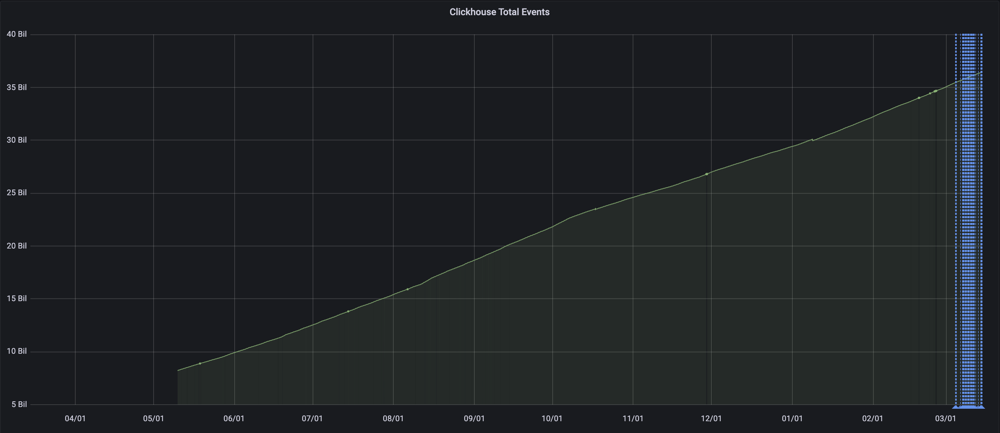
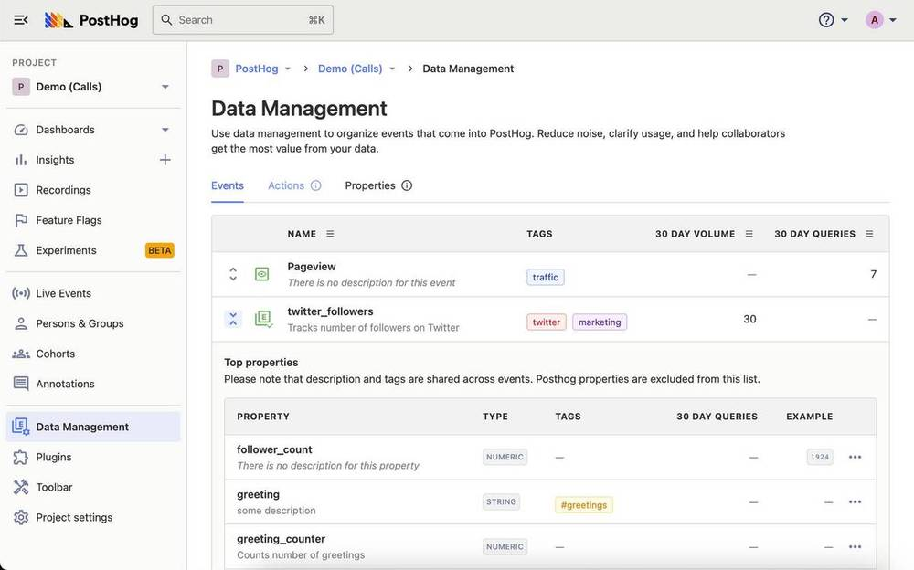
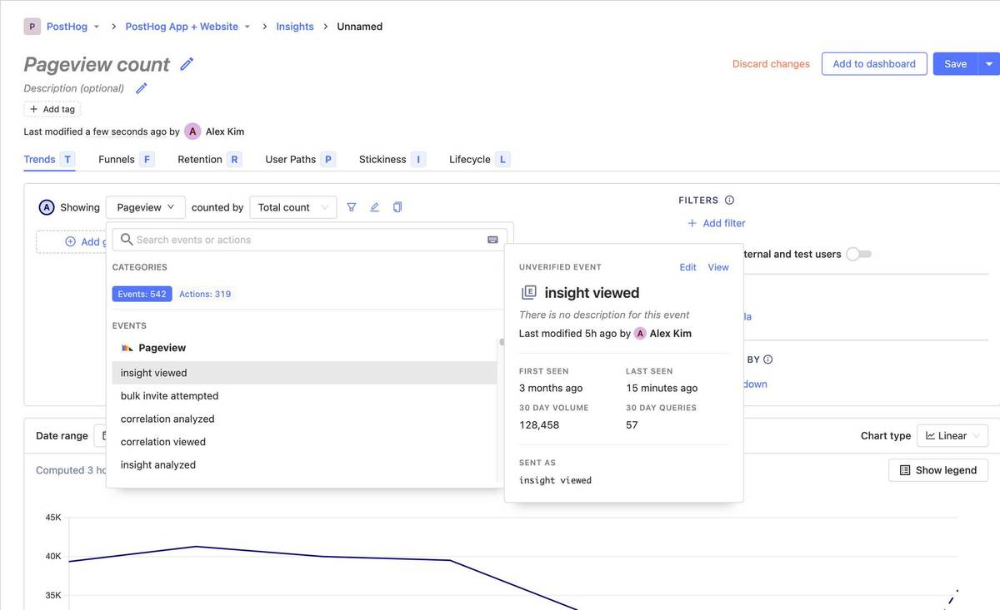
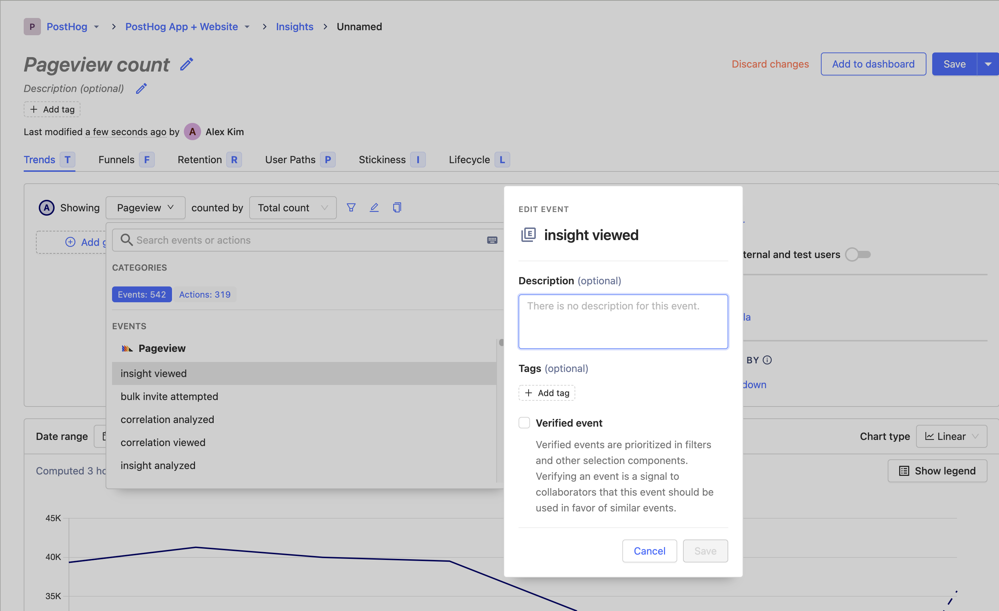

As PostHog grows, the data that users are sending to PostHog continues to grow into the double-digit billions. In just the last year (since we started measuring total events), we've gone from ~8B to ~36.5B total events ingested in PostHog Cloud!

Data explosion is real and can be a nightmare to scale in the context of a product analytics tool. Furthermore, poor data management can seriously harm your business as it can lead to inaccurate analyses and poor business decisions.

As the biggest dogfooder of our own product, we (and many other teams) were beginning to see the consequences of the lack of in-house tools to manage our data. All the use cases we saw boiled down to a few common pain points:

1. It is hard to understand events, actions, and properties that you yourself didn't set up.
2. Data decays quickly, and most of the time fails to stay up-to-date with instrumentation.
3. Event-level context in insights and dashboards is difficult to share with external people and new team members.

Fret no more because we've been working hard to deliver a solution to your data management woes!

Today we're releasing our Data Management feature, which introduces new ways to help you organize events and properties being sent to PostHog. 

This is the first step in a continuous effort to help make organizing your data easier. You can now:

- Create definitions for events and event properties
- Manage data on the fly while building insights
- Verify trusted definitions which are prioritized in the UI
- Organize your definitions with tags
- Give custom names and descriptions to events and properties
- Make the right events and properties discoverable with event metrics

## What is an Event?

[Events](/docs/user-guides/events) are the basic building blocks of data that is sent to PostHog. Events can capture a wide variety of different interactions, from a new user signing up to capturing a server event when an API endpoint is called.

[Event Properties](/docs/user-guides/events#event-properties) make up the meat of the event. These can be viewed nested in the context of a single event, or as a flat list in the Data Management > Event Properties tab.

## How to create event and event property definitions

### Creating definitions in the Insight Builder (on the fly!)

Building an insight and see an event or event property that could be more descriptive? You can now create a definition for that without leaving the insight query builder.

### Creating definitions in the new Data Management Tab

Alternatively, click on view in the definition hover card and you'll be redirected to the new "Data Management" page. From here, explore a centralized place to manage all the event and event property definitions you have created.

[WIP screenshot]

### Creating definitions with the API

You can also opt to create definitions with our API. Check out our documentation on how to use the [`event_definitions`](/docs/api/event-definitions) and [`property_definitions`](/docs/api/property-definitions) API endpoints.

## How to use Data Management as a team (Best practices)

1. **Rule of thumb**: The more definitions you define, the easier it will be for your teammates to understand what each event and property is describing. 

Take a custom event sent as `sign_up` for example that is triggered on user sign up. Pretty self explanatory, right? Imagine you have a second app pushing data to the same PostHog instance sending sign up events as `sign up`. A new teammate using PostHog will find it impossible to differentiate between the two, leading to incorrect queries and onboarding woes. Defining two separate definitions (with different custom names, descriptions, tags) can be very powerful in these situations, not only in documenting your data, but also in providing clarity to teammates.

2. **Rule of thumb**: Official organization-wide events should be verified so that teammates can discover and use them easily. 

Verified events will be prioritized in filters and other selection components to signal to the rest of the team that this event should be used in favor of other similar events.

3. **Rule of thumb**: Tagging is an easy way to categorize events into custom groups, be it for a product, feature or new page. 

We highly recommend using tags to organize events coming in from different parts of your product. 

## We've moved some things around

- The "Events & Actions" tab has been renamed to "Live Events".
- "Actions", "Event Stats", and "Property Stats" have been moved into the new "Data Management" tab.
- "Event Stats" has been renamed to "Events"
- "Property Stats" has been renamed to "Event Properties"

## Do I need to create event definitions before ingesting that event?

Not at all! The awesome thing about definitions in PostHog is that they can be created, updated, or deleted at any time without affecting the event data that is already there. This means that you can create your definitions retroactively which nicely scales with your team's growing data needs.

## What's next for Data Management?

We're excited to get these data management features in, but we're just scratching the surface. We've prepared some documentation to help you get started with creating definitions and potential use-cases.

As always, we welcome any feedback you may have about this feature. Feel free to open an issue in [our Github repo](https://github.com/PostHog/posthog) or give us a shout in our [PostHog community Slack channel](/slack).
