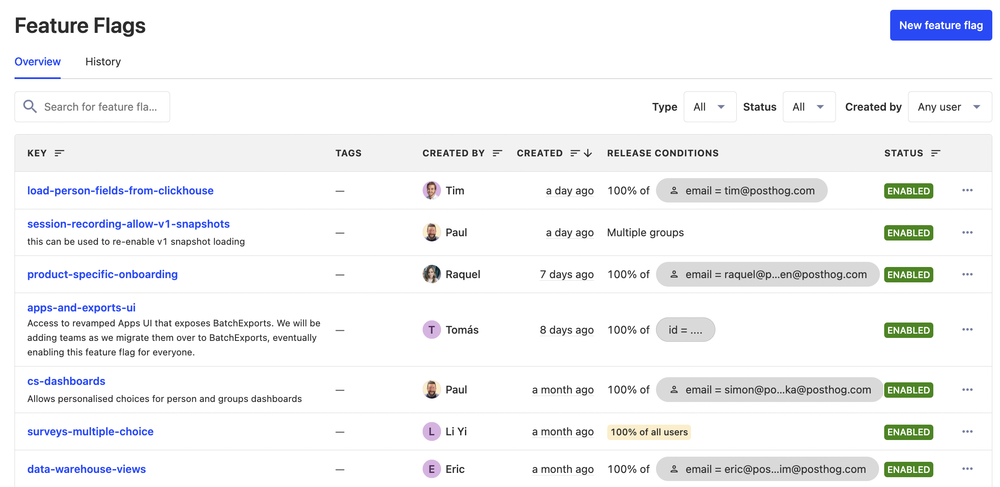

Releasing a big feature can be nerve-racking. When deploying it, you don't know if it will work in production, break your app, or cause other issues. Without the right processes in place, the safety of your releases is a big question mark.

A best practice for improving this is decoupling deployment and release. What does this mean, though? This post goes over the differences between the two, why you should decouple them, examples, and how to get started.

## What are the differences between deployment and release?

The process of delivering code starts with writing and testing code locally. After completing a piece of code, it often goes through reviews and more tests before integrating with the existing codebase. 

Once integrated, the new code deploys. Deployment means getting code from a local machine or repository into production. Your app or build containing the new code becomes available on production infrastructure.

A release is when the new code is made available to users. By default, as soon as code is deployed, it is automatically released. This is because there is nothing preventing users or systems from accessing the new code available on production infrastructure.

This means teams often hold deployments until they are confident the code is ready to release.

## Why should you separate deployment and release?

The main issue caused by coupling deployment and release is new code not working as expected in production. For example, queries that worked locally timing out on production data.

By preventing new code from automatically releasing after a deployment, you lower the risk of this issue. This is called **decoupling deployment from release**.

Decoupling can lower the risk of issues, increase developer productivity, and improve app reliability. The specific benefits include:

- Improves developer confidence knowing they can [test in production](/blog/testing-in-production) and that there is an easy way to roll back changes without affecting users.

- Increase deployment frequency by removing the need to wait for a formal release. 

- Developers can follow [trunk-based development](https://trunkbaseddevelopment.com/) and merge to `main` more often instead of waiting on branches. This increases shipping velocity and reduces merge conflicts.

- Developers can pass off releases to product managers and marketers once they deploy. They can coordinate elaborate launches and stakeholders without holding up development.

- Less downtime from broken releases and easier rollbacks when an issue does occur.

## How we decouple deployment from release at PostHog

We deploy many changes behind [feature flags](/feature-flags) and release them after testing them in production. At any time, there are [30+ flags](https://github.com/PostHog/posthog/blob/03eb1dcaec3cf5064a1ace4433f2f77d6676b634/frontend/src/lib/constants.tsx#L118C1-L118C1) in use in PostHog. They are created and updated daily.

These flags help us dogfood features, roll out changes to specific users, do incremental rollouts, and more. For example, in the flags above, we deployed 5 new features without releasing them.

We also dark launch features using feature flags. This means they are available in production but hidden from users. For example, they might only be accessible through the API, don’t have navigation links, or only have limited options shown to users.

All this enables us to ship and get features into the hands of users faster at PostHog. 

## How top companies decouple deployment from release

- [Netflix](https://netflixtechblog.com/automated-canary-analysis-at-netflix-with-kayenta-3260bc7acc69) A/B tests [every change](https://netflixtechblog.com/its-all-a-bout-testing-the-netflix-experimentation-platform-4e1ca458c15) before release, and does [phased rollouts](https://netflixtechblog.com/safe-updates-of-client-applications-at-netflix-1d01c71a930c) for every release. They use a [canary](/tutorials/canary-release), where they direct a small number of users to the new version, while a majority stay on the old one. Netflix then uses automated canary analysis to compare key metrics, score each variant, and report to developers. This system reduces risk while increasing developer productivity.

- [Etsy](https://www.etsy.com/codeascraft/how-does-etsy-manage-development-and-operations/) practices continuous deployment. They rely heavily on feature flags to make small, frequent changes. They often leave features deployed but unreleased for weeks and let product managers do releases.

- [Airbnb](https://medium.com/airbnb-engineering/how-airbnb-safeguards-changes-in-production-9fc9024f3446) developed a system for safeguarding production changes. They do automated canary analysis during deployment to compare versions for performance, error rate, and other key metrics. They also do experiments across many platforms to test channels and end-to-end business metrics. The combination of these enabled them to be more confident in the released code.

- [Lyft](https://eng.lyft.com/continuous-deployment-at-lyft-9b457314771a) follows continuous deployment for its microservices architecture. Each deployment goes through a pipeline of staging, canary, and single zone before production. They automate jobs, monitoring, and testing for this pipeline, and they use "gates" at each step to block deployments if broken. They also wait for deploys to "bake" in production environments to check for issues before releasing.

- [Grab](https://engineering.grab.com/our-journey-to-continuous-delivery-at-grab) deploys to a staging environment then schedules deployments to a canary environment then production. They make deployment and monitoring as easy as possible and only notify developers about issues when they must make a decision.

## How you can decouple deployment from release

Now that you understand the merits of decoupling deployments from release and some examples of how top companies do it, how can you do it yourself? Two of the easiest ways to get started are:

1. **Feature flags.** Deploy features behind [feature flags](/docs/feature-flags). Use conditional rollouts to roll out features to the internal team, beta users, and canary release.

2. **Dark launch.** Launch new routes and features, but hide them from users (don’t link or notify them). For example, create a new feature page and don’t link to it anywhere, so it's only accessible using a direct link (that only your team knows).

Both of these are great ways to start because they are simple. You can apply them to non-breaking changes, get comfortable with the process, and work towards decoupling all changes. Doing this provides an understanding of what code you should test in production and what is good to ship after testing locally.

As you scale further, you can take inspiration from the examples and try:

- **Staging environment.** Create an environment mimicking production and test changes in it before releasing them to users. Run smoke tests in staging.

- **Canary release.** Before doing a full release, release changes to a small percentage of users. Monitor or A/B test key metrics to ensure the changes don’t have negative effects before rolling out further.

- **Automate testing, monitoring, and alerts.** Track performance, error rate, and other key metrics for newly deployed code. Roll back or alert developers automatically when there is a problem, instead of having them monitor themselves.

Decoupling deployment from release is an ever-moving goal post. What it means is always changing and the process can always be improved. What stays the same is the benefits of lower risk of released issues, improved developer productivity, and a more reliable app. 

## Further reading

- [Feature flag best practices and tips (with examples)](/blog/feature-flag-best-practices)
- [What you can learn from how GitHub and GitLab use feature flags](/blog/github-gitlab-feature-flags)
- [Why use feature flags? Benefits, types and use cases, explained](/blog/feature-flag-benefits-use-cases)
