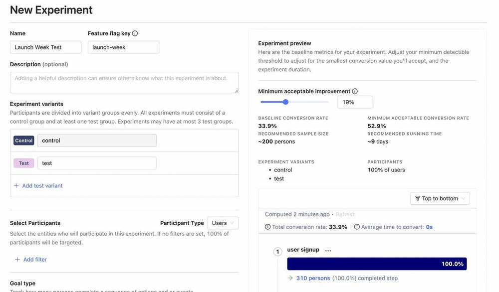
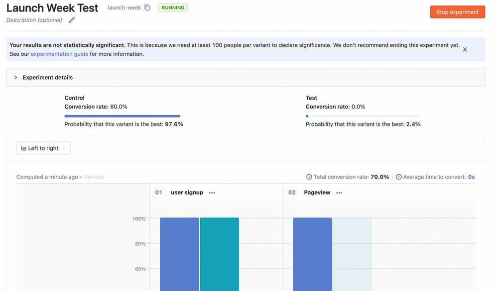

We just launched our Experimentation suite, and there's a ton we learned about running successful experiments.

It was a no brainer product decision: Since you're already analysing your data in PostHog, and you're already using [Feature Flags](/product/feature-flags) to roll out new features, why not have the capability to test how well these features are doing? Plus, what is the world without a [great open-source A/B testing tool](/blog/best-open-source-ab-testing-tools)?

Experiments allow you to choose a target metric, choose specific people to run this experiment on, and set how long the experiment runs for.

Thanks to Feature Flags, you can then easily validate whether each variant looks good, launch your experiment, and wait for data to come in. We then run a Bayesian analysis on the data to give a probability for each variant being the best, a graph of how things are looking for each variant, and whether the results are statistically significant or not.

It's a powerful tool for building great products, but that's enough about how experiments work for now. If you're interested in the technical details, check out the [Experimentation user guide](/docs/user-guides/experimentation).  

Instead, I'm going to share the three key things we've learned about running effective A/B tests so you can get the most out of this new feature.

> This article is Chapter III in our [A Universe of New Features launch week](/blog/launch-week-universe-of-new-features) series

## 1. Use specific metrics

Let's say you're running an experiment to optimize the number of times users interact with PostHog graphs. Specifically, you're testing out different layouts for funnels - horizontal and vertical - and want to find which one leads to more interactions.

You can choose one of two metrics, but which one is right?

1. Number of interactions across all graphs, not just funnels.
2. Number of interactions for funnels.

Note that you're choosing the _total_ interactions here, not _unique_ interactions so if one person clicks on the funnel three times, that counts as three interactions for either metric, as it should.

There's a big problem with metric #1: It's global, and a lot more susceptible to things out of our control. For example, if Trends power users are somehow assigned to the control group, the data will have a big skew towards control which has nothing to do with the different funnel layouts.

We found this to be the case in reality - the more specific the metric, the fewer outside factors affect your result. Focusing on local optimization gives you better local information.

At the same time, you don't want to discard second order effects. What if the horizontal funnel layout prevents users from switching to other graphs? This might increase funnel interactions (local metric #2 increases), but at a cost to the global metric (#1).

To solve this problem, we introduced secondary metrics. We encourage making the main metric as the local metric, and then allow the option of having a few secondary metrics. We don't do significance analysis on these secondary metrics, but show the metric values for each variant, so you can ensure that there's no huge drop in global metrics while deciding on results.

Another advantage of local metrics over global is that it can be hard to reliably move global metrics[^2]. Local metrics allow you to see changes faster, since they're narrower in scope, and thus move quicker.

[^2]: Depends a lot on how big and mature your product is, and how many sub features it has. If there's only one thing the app does, the local metric is the global metric.

## 2. Experiment results aren't set in stone

You just finished running the experiment above, and the results are in. Horizontal funnel layout had 1,000 interactions, while vertical funnel layout had 1,200. The results ended up being significant, with vertical funnel layout being 20% better.

All well and good... except this goes against everything you intuitively know about using your own product. You find the vertical view congested, hard to parse, and sort of terrible.

Do you completely trust the data, or your intuition?

Both have issues. Your intuition might be how you see the world, but not necessarily how people who use the product see the world. At the same time, what if there was a bug in the vertical layout implementation, which counted each interaction twice? Maybe the 'real' number was 600, instead of 1,200, which massively changes your product direction.

Perhaps unhelpfully, I'd recommend neither blindly trusting the data, nor your intuition. Experiments show you what is happening, but can't answer why. The real institutional knowledge comes with answering the why, and building up an accurate model of who your users are, what they need, and how they interact with your product.

To answer the why, you need to talk through the causes. <a target='_blank' rel="noopener" href='https://neilkakkar.com/Bayes-Theorem-Framework-for-Critical-Thinking.html'> Create hypotheses about why this is happening</a> , watch user session recordings, and then make a call about what you want to do.

That is, bring data to conversations, but also talk through causes.

## 3. Changing environments can invalidate experiment results

You've finally got results for the experiment above, and figured out why they're like this. Turns out, the vertical layout promotes interaction – it allows users to see all steps of the funnel in one go, click on the steps that seem surprising, see the persons involved in that step, watch their recordings, etc. The horizontal layout, meanwhile, is a bit more frustrating to see all this information at a glance, causing faster bounces.

That's a model that keeps on giving, even when things change.

Let's say it's now three months in the future, and you've done a design revamp. Horizontal bars are thinner now, while vertical bars are thicker. As a result, horizontal funnels fit in cleanly on screen, while vertical funnels don't.[^4]

You could run an experiment again to find if user preferences have changed, but if your model is right, interactions should start going down, and you can make the call to revert back to a horizontal layout.

[^4]: A bit contrived, but easier to keep this blogpost manageable without explaining the ins and outs of PostHog graphs :). Also, don't tell our designer, they'll scream if they hear about this design revamp.

ULtimately, experiment results don't stand the test of time - we cannot stress enough the importance of extracting a useful model out of your experiment results.

## Bonus: Experimentation for web products is very different from clinical trials

Another interesting thing we learned is that we can't simply run experiments for web products like you would a clinical trial. Rigor is important, but if it takes you a year to make up your mind about a vertical vs. horizontal layout, you'll be in trouble.

This kind of rigor makes sense when you're developing a new drug and optimizing for risk mitigation: there's lives at stake, and mistakes do result in casualties. Further, you can take things slow because human biology is reliably consistent.

By contrast, web products are much lower stake, and are present in an ever-changing environment. Culture and individual preferences can change rapidly, and the cost of getting experiments wrong isn't too high - you can easily revert them later on.

Moving quickly trumps rigor in web product experiments.

We built Experimentation with this in mind. It's a web product, built for products that move quickly.

Another example where this difference shines through is the peeking problem.

The strawman, pop-sci version of the peeking problem goes something like: "You shouldn't look at experiment results while the experiment is running because that can lead to you ending experiments early, when the data is skewed in favour of one variant, thanks to random chance."

However, peeking isn't the problem. The problem is taking action too quickly _after_ peeking.

We built this into our product. Peeking is fun, almost addictive, when you can see your experiment results changing in real time. It gives a sense of excitement, seeing your hypotheses being proven right or wrong. More importantly, it keeps you coming back to the experiment, tracking its progress.

To solve the Taking-action-without-enough-information problem, we made it clear in our UI when it was okay to end an experiment. Specifically, this is when results become significant, or the pre-determined duration for peeking has passed.[^1] This changed the conversation from 'peeking early and ending experiment if results look good' to 'waiting for the green light to switch on', and led to an overall much better experience.

[^1]: If you're looking for how we calculate this, see the [user guide](/docs/user-guides/experimentation)

That's all for this post, we'd love to have you start your own experiments and tell us what you learn. Feel free to open an issue in [our Github repo](https://github.com/PostHog/posthog), join us directly for a [call](https://calendly.com/posthog-feedback) with our Product & Engineering team, or [submit a ticket](https://app.posthog.com/home#supportModal) if you have feedback to share.

> PostHog is an open source analytics platform you can host yourself. We help you build better products faster, without user data ever leaving your infrastructure.

<ArrayCTA />
