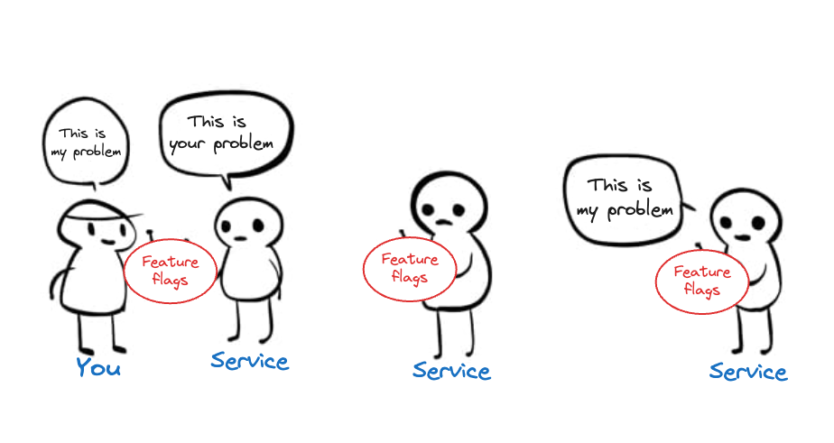

Feature flags are a tool to conditionally turn on or off code and components. They enable developers to safely roll out and roll back new features. This helps them follow the [best practice of disconnecting deployment from release](/blog/github-gitlab-feature-flags#why-do-github-and-gitlab-use-feature-flags).

The basic functionality of feature flags is simple enough to build yourself. The challenge comes as you scale and the features you need become more complex. This post goes over the functionality of a feature flag service, the challenges of using a house-built service, and the benefits of feature flags as a service.

## What does a feature flag service do?

At their most simple, a feature flag service is:

- A store of feature flags with keys with associated values.
- A function that takes a key, checks the store, and returns a value.

In Python, this might look like:

```python
class FeatureFlagService:
    def __init__(self):
        self.feature_flags = {
            "new_feature": True
        }

    def is_enabled(self, feature_name):
        return self.feature_flags.get(feature_name, False)

if __name__ == "__main__":
    feature_flag_service = FeatureFlagService()

    if feature_flag_service.is_enabled("new_feature"):
        print("New feature enabled")
```

This enables you to simply toggle on or off features from a centralized location.

## The challenge of rolling your own feature flag service

The big problem with this simple service is that the values are hard coded and require a redeploy to change. It isn’t remotely configurable, meaning it can’t change at runtime and doesn’t provide many benefits over using `if` statements where needed.

The path to solving this is an increasingly complicated one, each step with its downsides:

1. Use a config to store the flag values. This still requires a redeploy to change. Read more in [Feature flags vs configuration: Which should you choose?](/blog/feature-flags-vs-configuration)
2. Store flag values in your database. This requires an admin panel or root access to modify the values and puts stress on your infrastructure. Database issues also impact the resiliency of flags.
3. Write an external service or use a library to manage and evaluate feature flags. New dependencies creates a bunch of maintenance and optimization work to ensure they remain fast and bug-free. 

As is apparent, rolling your own in-house feature flag service becomes increasingly complicated. We haven’t even touched on adding logic for targeting, caching for speed, or resiliency for parts of the service going down. All of these make you more likely to introduce bugs and create tech debt. 

> **What does "roll your own" mean?** The phrase "rolling your own X" refers to developing, implementing, and using your own version of a common service such as authentication, bootloader, or in this case, feature flags.

Beyond the simple example we provided above, feature flag services become a classic build vs. buy decision. Building a feature flag service yourself works well if you have a clear, simple use case. As you scale, the benefits of "outsourcing" the work to a feature flags as a service provider becomes stronger.

## What are feature flags as a service?

A "feature flags as a service" provider is an external application that provides all the functionality for implementing and using feature flags. It is a centralized location to create, manage, evaluate, and monitor your feature flags. This enables remote configuration and the best practice of decoupling deployment from release.

Using feature flags as a service integrates with your app like other external services to provide a simple interface with. They create SDKs or an API to evaluate flags and get values. For example, in PostHog, a [feature flag call](/docs/feature-flags/adding-feature-flag-code) is as simple as this:

<MultiLanguage>

```js
import posthog from 'posthog-js'

posthog.init('<ph_project_api_key>', { api_host: '<ph_instance_address>' })

posthog.onFeatureFlags(function () {
    if (posthog.isFeatureEnabled('flag-key')) {
        // do something
    }
})
```

```python
from posthog import Posthog

posthog = Posthog('<ph_project_api_key>', host='<ph_instance_address>')

is_my_flag_enabled = posthog.feature_enabled('flag-key', 'distinct_id_of_your_user')
```

</MultiLanguage>

Feature flag services also contain features for complicated use cases including: 

- Target feature flags to specific actors or situations to enable percentage rollouts, [betas](/tutorials/public-beta-program), [testing in production](/blog/testing-in-production), and more.
- Multi-variant flags that enable A/B testing.
- Integrations with other external services like product analytics, CDPs, and automations.
- Speed and resiliency optimizations like local evaluation and caching.

## Why use a feature flags as a service provider?

The benefit of using a feature flag service is similar to the benefit of using other external services. You get the benefits of feature flags while (theoretically) minimizing their costs. This enables you to focus on building the core functionality that creates value in your business.

> **Aren’t feature flags as a service expensive?** Although you aren’t paying anything to roll your own or use an open source version, you are still paying for the hosting, implementing, and maintaining of it. This time and energy can cost much more than the dollar amount you pay a service provider.

With a feature flags as a service, you worry less about:

- **Usability.** The service provides a centralized location and UI to manage flags.
- **Reliability.** The service takes care of the infrastructure, redundancy, speed, and reliability.
- **Interoperability.** The service connects to any part of your application (SDKs) and other external services.

In fewer words, you pass your potential problems off to them. 



Using feature flags as a service doesn’t mean everything is perfect. There are often issues with the worry areas. Design can be poor, services can go down, and integrations can disappoint. 

What using feature flags as a service means is that these issues are largely off your plate. You can focus on building a great product, and that is what a [feature flag as a service provider like PostHog](/feature-flags) is all about supporting.

## Further reading

- [Feature flag best practices and tips (with examples)](/blog/feature-flag-best-practices)
- [Why use feature flags? Benefits, types and use cases, explained](/blog/feature-flag-benefits-use-cases)
- [What you can learn from how GitHub and GitLab use feature flags](/blog/github-gitlab-feature-flags)