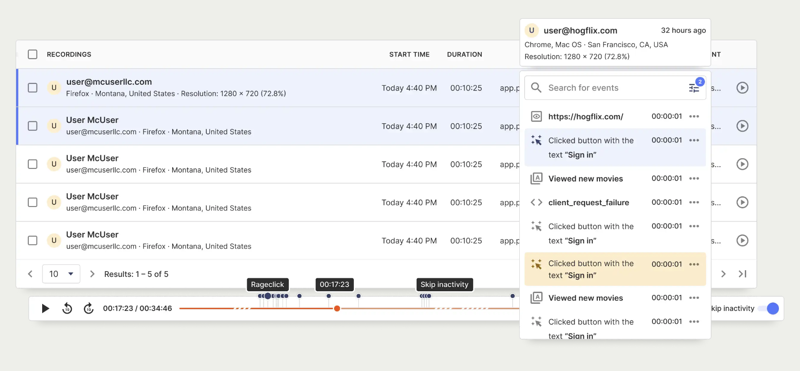
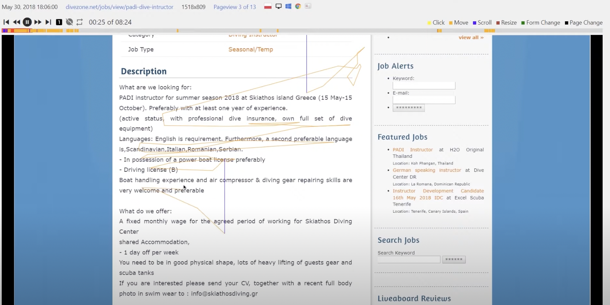

Most analytics tools have one goal in mind: providing actionable insights on user behavior. It's all about hard numbers; views, clicks, conversions. But sometimes all those numbers can feel a bit sterile. Separated from the individual user narrative, statistics are an incomplete picture. Enter session recording.

### Why you need session recording

Session recordings, also known as session replays, are video renderings of actions taken by your users in real-time. They capture mouse movement, clicks, taps, and scrolling across your site or app’s pages.

Aside from making for some fascinating watching, recordings facilitate a detailed investigation of user behavior, allowing you to identify friction areas such as: 

- Where users are getting stuck on your site
- Hesitation at different stages of your funnel
- How bugs come about
- How your users are interacting with individual elements of your product.

This context can help you to optimize user experience, build user-led products and, ultimately, improve conversion and retention. 

Bottom line: session recording is an essential tool for making better products.

### Why self-host your session recording?
Most popular session recording tools, such as  Hotjar, FullStory and LogRocket, are exclusively cloud-based. This is convenient, but comes with several drawbacks:

1. They're expensive
2. You don't control your user data
3. GDPR and HIPAA compliance is a headache 

Self-hosting your session recording eliminates these drawbacks and allows you to keep control of your data, while open source tools give you the freedom to study, modify, and run the tools at no extra cost.

If that sounds good to you, coming up are the best open source (or self-hosted) session recording tools right now.

## 1. [PostHog](https://posthog.com/)

PostHog is an all-in-one product analytics platform that offers all the tools required to measure user success and build better products, including but not limited to [session recording](https://posthog.com/product/session-recording). Other features include Feature Flags, Funnels, Heat Maps, A/B testing, Trends and much more. All of PostHog’s tools work together natively, offering extensive, actionable user insights beyond what's possible with standalone session replay tools.

### Who is PostHog for?

We think PostHog is the best tool for product-minded developers, data engineers and product teams. The fully comprehensive suite of analytics tools make it an ideal choice for any company that wants to gain wide-ranging insights into their usage and engagement metrics, while keeping all of their data in one manageable platform.

Are we may be biased here? Yes. Are we wrong? We'll let you be the judge. As we're open source, you can [self-host PostHog for free](/signup) to find out for yourself.

### Strengths

- Fully-featured product analytics suite
- Unlimited scaling
- Front-end events captured out of the box
- Easy [migration](https://posthog.com/tutorials/free-hotjar-alternative) to your existing infrastructure
- CSS selectors block sensitive data to protect user privacy
- Customisable data retention
- Enable session recording for specific user segments for more granular insights
- Flexible self-hosting and managed SaaS options
- Session recording is a no additional cost feature

### How much does it cost?

PostHog (self-hosted and cloud) free up to 1 million captured events each month when you enter card details.

[Session recording](https://posthog.com/docs/user-guides/recordings) is included at no extra cost in both plans.

### Is it open source?

Yes! PostHog’s open source plans are available under an MIT license. Find out more about [PostHog’s self-hosting plans](https://posthog.com/signup/self-host).

## 2. [OpenReplay](https://openreplay.com/)

OpenReplay is an open source session replay stack that provides insights into user actions inside web apps. It does lack additional analysis tools to give a more cohesive view of the user experience at large and assist with optimized product development. 
Its tooling is particularly effective for application state and customer support, howeve – features like DevTools and co-browsing sessions are useful for monitoring performance.

### Who is OpenReplay for?

OpenReplay is a developer-friendly tool. It allows engineers to see how users are interacting with their web apps and respond to issues faster.

### Strengths

- Co-browsing feature to assist users at critical moments
- Network activity inspection
- Performance and state monitoring
- Error tracking

### How much does it cost?

OpenReplay’s self-hosted plan is available for free.

It also offers a cloud option starting at $3.95 per month for 1,000 recordings with 30 days data retention.

### Is it open source?

Yes. OpenReplay’s open source library is available under the ELv2 license, via [the OpenReplay repo](https://github.com/openreplay/openreplay).

## 3. [UXWizz](https://www.uxwizz.com/)

UXWizz is a paired-down product analytics platform offering features like visitor insights, session recording, segments and A/B testing.

A lightweight version of session recording is available, which only stores the URL of the page and the user actions. This is designed to optimize your data storage and remove some of the manual maintenance otherwise required by UXWizz.

### Who is UXWizz for?

UXWizz’s is a good choice for individuals, and marketing and product teams in small businesses who want quick, qualitative insights into their user analytics from one simple and accessible dashboard.

### Strengths

- Broad range of engagement-focused insights
- Low database usage with lightweight version

### How much does it cost?

UXWizz is available as a self-hosted solution only and pricing ranges from £79 to £1,199 for a lifetime license, including 1-year support. Additional updates and support are priced as add-on subscriptions.

### Is it open source?

No. UXWizz is not open source.

## 4. [UXlens](https://uxlens.com/)

UXlens is a developer-first session recording tool which provides insight into user interface and conversion issues. It does not include any additional analytics tools, but includes useful segment filtering features that help businesses locate blocks in their funnel.

### Who is UXlens for?

UXlens is a good choice for UX designers and product teams who want to study the impact of their UI on the user journey.

### Strengths

- Customisable filters to track sessions on specific user segments
- Input elements masked by default to protect user data
- UI to assist with complex filter building

### How much does it cost?

Self-hosting is free. A cloud-hosted version is also available starting at $5 per month.

### Is it open source?

No. UXlens is not open source.

## 5. [SessionStack](https://www.sessionstack.com/)

SessionStack is a user session insights tool with a focus on critical issues and error tracing. Without additional analytics features, it doesn’t necessarily give a cohesive overview of the user experience at large or assist with product development. Its tooling is particularly effective for customer support use cases; error messages and co-browsing sessions help teams to pinpoint issues and track down problems related to specific users, devices or releases.

### Who is SessionStack for?

SessionStack enables product managers, customer support teams and engineers to harness user navigation insights to identify friction points and bugs, and to assist users in real-time.

### Strengths

- Notification alerts when issues arise
- Network traffic monitoring
- Ability to co-browse with users to offer guidance
- Cloud-hosting and self-hosting options available

### How much does it cost?
Cloud plans with SessionStack start from $99 a month for up to 1,000 sessions. A self-hosted deployment option is available on custom plan, which includes implementation support and customisable data volume and retention. Pricing for SessionStack’s self-hosted plan is not publicly available.

### Is it open source?

SessionStack’s code is not open source. It does offer a self-hosted deployment option, though, which allows customers to keep their user data off the cloud, but you can expect to pay a premium for the privilege.

## 6. [Matomo](https://matomo.org/)

Matomo is an open web analytics platform. Touted as an alternative to Google Analytics, Matomo is largely focused on understanding marketing website analytics. Session recording is available as an add-on via the [on-premise marketplace](https://plugins.matomo.org/HeatmapSessionRecording).

### Who is Matomo for?

Matomo is built with marketing and content teams in mind, offering insights into website content engagement for optimization of user journeys.

### Strengths

- Funnels, acquisition analysis and other insight features
- Unlimited session recordings
- Out-of-the-box solution meaning no developer required to get set up

### How much does it cost?

The session recording add-on for a self-hosted Matomo solution has a 30-day free trial, after which the cost ranges from $199 to $599 per year depending on the number of users in your team.

Session recording is also included in Matomo’s cloud Business plan. Pricing is calculated depending on the volume of your site traffic. 

### Is it open source?

Yes. Matomo is available under a AGPLv3 license. Check out [the Matomo repo](https://github.com/matomo-org/matomo) for more info.