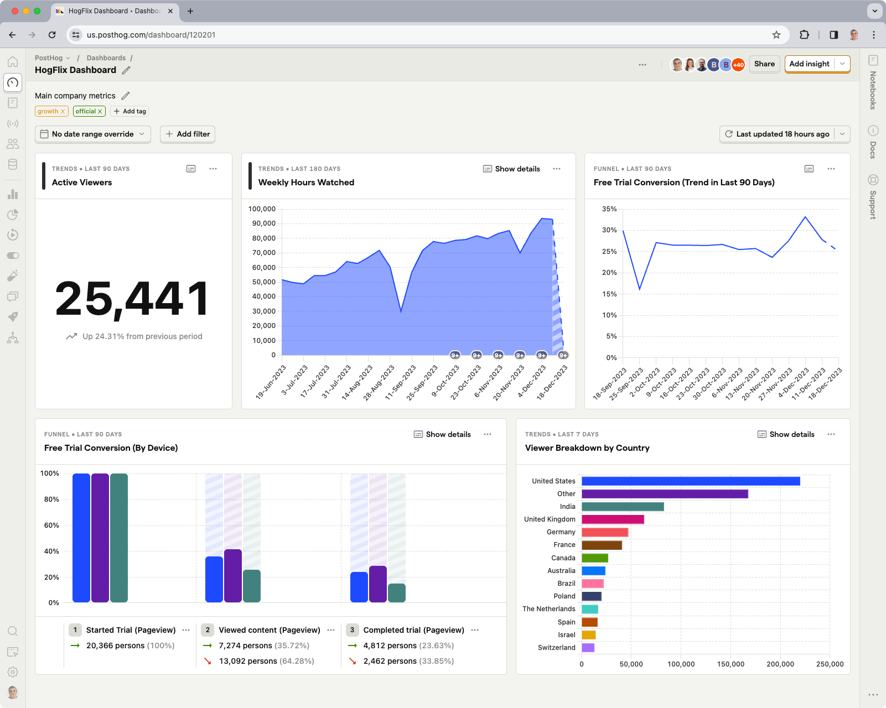
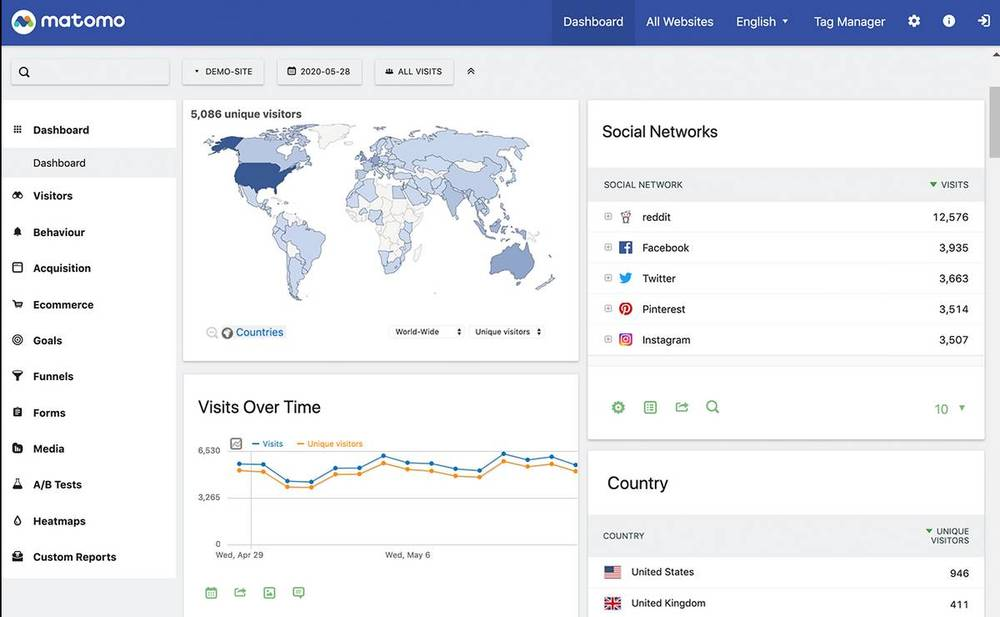
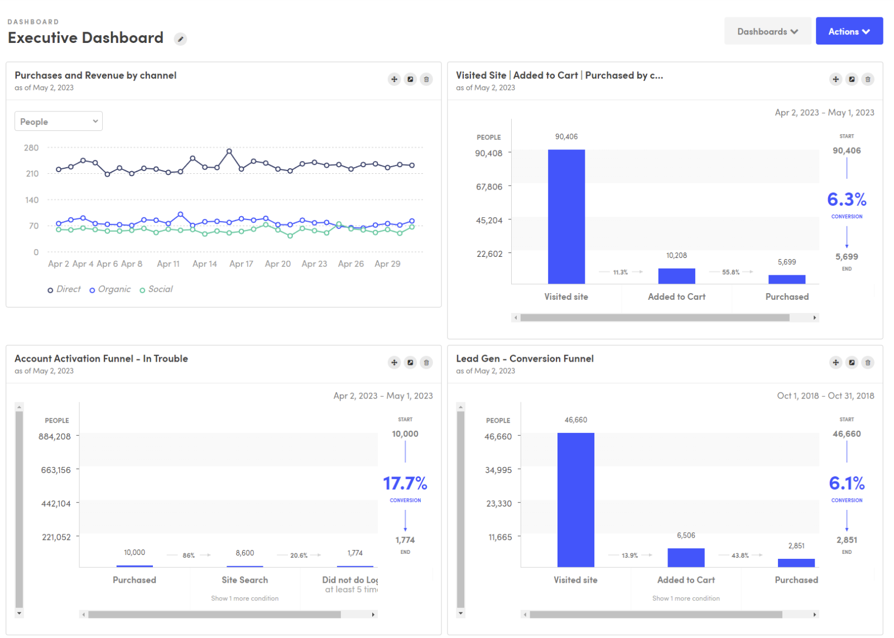
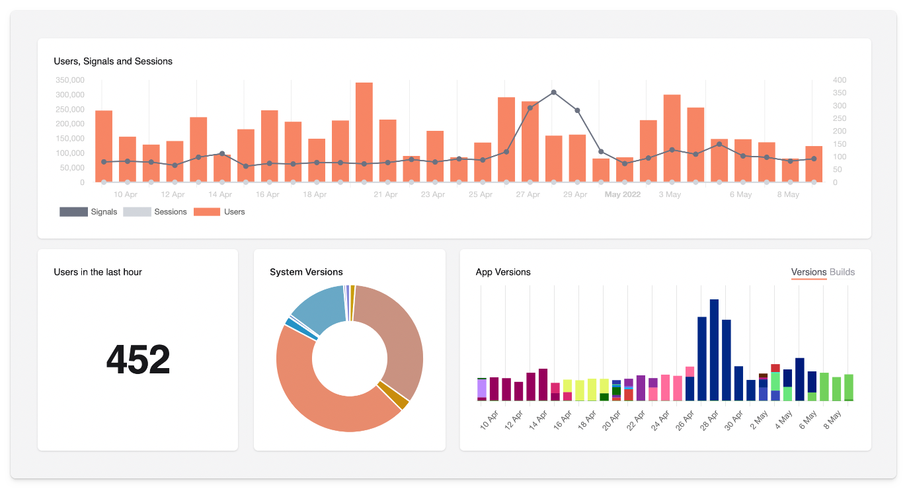
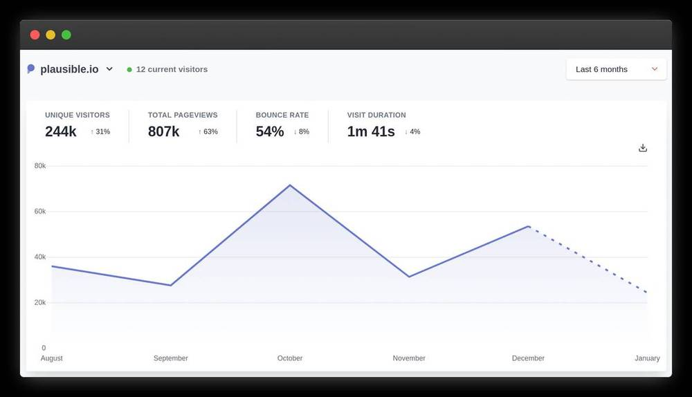
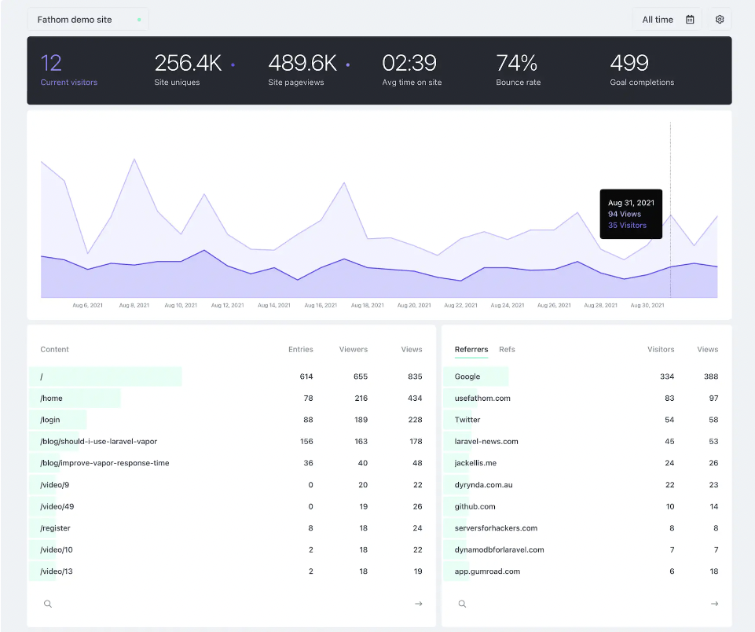
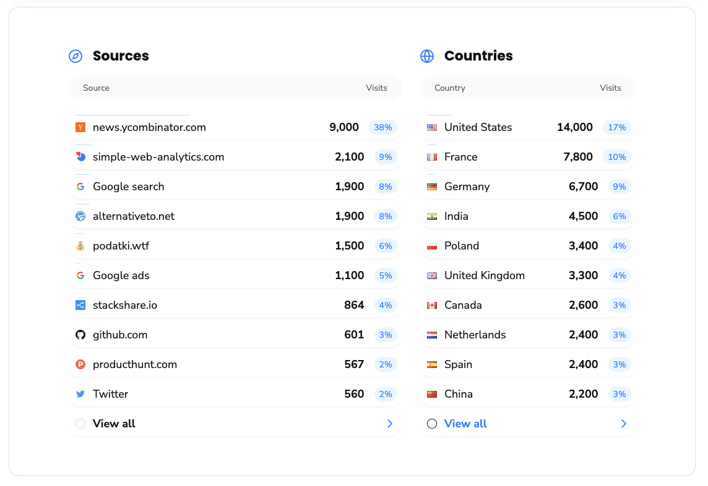

In July 2023, Google closed Universal Analytics (UA), forcing users to switch to Google Analytics 4 (GA4) or another provider.

This hasn't proved a popular decision. GA4 is a radical departure for existing users, particularly those using GA for marketing use cases.

In this guide we'll cover:

- The differences between UA and GA4
- Why existing users want to switch
- The best GA4 alternatives for different use cases

> **Changelog:**
> - **Aug 24, 2023:** Added Kissmetrics and Vercel Web Analytics; updated info on EU-U.S. privacy framework.  

## GA4 vs Universal Analytics... what's the difference?

In simple terms, the core difference comes from how UA and GA4 track activity:

**Universal Analytics** was a session-based analytics platform. It was designed for a time when desktop websites were the norm, and people didn't think much about what cookies were. It's good at tracking things like the number of sessions on a website, how many pageviews they generated, and where they came from.

**Google Analytics 4** uses an event-based tracking system. It's designed for tracking what people actually do, such as when they click a button, complete an action, or when they fail to do so. It can still track things like pageviews and website referrers, but its event-based model is more flexible and powerful.

### So, why do people hate GA4?

If event-based tracking is so great, why do people hate GA4 so much?

People tend to fall into one or more of the following camps:

1. **Users who miss pre-defined reports:** GA4 lacks many of the pre-defined reports users relied on to do their jobs. Stuff is just harder to find in GA4, unnecessarily so. Some speculate popular reports will make a return one day, but there's no guarantee they will.

2. **Users who lack data science support:** Universal Analytics is popular among small business users and marketing teams, but GA4 caters to large corporate users and app developers. GA4's greater emphasis on exporting data to Looker Studio or BigQuery for analysis is hard for users who lack data science and analytics support.

3. **App developers who need more features:** While GA4 courts app developers, it still falls short of the [numerous alternatives](/blog/categories/comparisons) that lured customers away from Universal Analytics in the first place. To many, GA4 is too little, too late.

Some users also prefer not to use Google Analytics due to privacy concerns and GDPR compliance. A [new EU-U.S. Data Privacy Framework](https://commission.europa.eu/law/law-topic/data-protection/international-dimension-data-protection/eu-us-data-transfers_en), agreed in July 2023, makes GDPR compliance with Google Analytics less problematic, though the new framework could yet face legal challenges from privacy campaigners in the EU.

## Alternatives to GA4

The following GA4 alternatives all solve one or more of these issues. Some provide a similar experience to UA, while others focus on unimpeachable privacy, or greater insights. In each case, we've highlighted the strengths of each tool and the ideal use cases.  

### PostHog

- **Best for:** Mobile and web apps
- **Tracking method:** Event-based
- **GDPR compliance:** ✔ (via self-hosting or EU Cloud)
- **GA data import:** ✖

PostHog is an [all-in-one Product OS](/product) that includes product analytics, session recording and A/B testing – pretty much everything you need to track user behavior in an app or website, basically. Like GA4, PostHog is an event-based platform. It's priced on per event used, though it offers a generous [1 million events for free](/pricing) each month, so many users can use it for free.

As an open-source product, you can see exactly what the team is working on via the [PostHog's public roadmap](/roadmap). Small projects can self-host PostHog to keep complete control of their data, while PostHog Cloud (with US and EU hosting options) is available for those who want a managed SaaS experience.

See [GDPR-compliant analytics tools](/blog/best-gdpr-compliant-analytics-tools) for more.

#### PostHog vs Google Analytics 4

<table className="w-full mt-4" style="min-width: 600px;">
	<thead>
    	<tr>
        	<td className="w-3/12"></td>
        	<td className="w-3/12 text-center"><strong>Google Analytics 4</strong></td>
        	<td className="w-3/12 text-center"><strong>PostHog</strong></td>
    	</tr>
	</thead>
	<tbody>
		<tr>
        	<td>Website analytics</td>
        	<td className="text-center">✔</td>
        	<td className="text-center">✔</td>
    	</tr>
		<tr>
        	<td>Funnels</td>
        	<td className="text-center">✔</td>
        	<td className="text-center">✔</td>
    	</tr>
    	<tr>
        	<td>User Paths</td>
        	<td className="text-center">✔</td>
          <td className="text-center">✔</td>
    	</tr>
    	<tr>
        	<td>Retention</td>
        	<td className="text-center">✔</td> 
        	<td className="text-center">✔</td>
    	</tr>
    	<tr>
       	<td>Revenue tracking</td>
      		<td className="text-center">✔</td>
       	<td className="text-center">✔</td>
    	</tr>
    	<tr>
        	<td>User profiles</td>
        	<td className="text-center">✔</td> 
        	<td className="text-center">✔</td>
   		</tr>
    	<tr>
        	<td>Cohort analysis</td>
        	<td className="text-center">✔</td> 
        	<td className="text-center">✔</td>
    	</tr>
    	<tr>
        	<td>A/B testing</td>
        	<td className="text-center">✖</td>
        	<td className="text-center">✔</td>
    	</tr>
    	<tr>
        	<td>Session recording</td>
        	<td className="text-center">✖</td>
        	<td className="text-center">✔</td>
    	</tr>
    	<tr>
        	<td>Feature flags</td>
        	<td className="text-center">✖</td>
        	<td className="text-center">✔</td>
    	</tr>
    	<tr>
        	<td>Surveys</td>
        	<td className="text-center">✖</td>
        	<td className="text-center">✔</td>
    	</tr>		
		<tr>
        	<td>Self-hosting</td>
        	<td className="text-center">✖</td>
        	<td className="text-center">✔</td>
    	</tr>
	</tbody>
</table>

Read our [PostHog and Google Analytics comparison](/blog/posthog-vs-ga4) for an in-depth look at the differences

> #### Verdict
>
> [PostHog](https://posthog.com/) is an all-in-one platform for tracking user behavior in apps and websites. While it's a [powerful tool for marketing](/blog/posthog-marketing) in the right hands, it's best deployed by product and engineering teams seeking deep insights into how users use their product. Integrated session recording, A/B testing, survey, and feature flag tools mean it can also replace several other products in your tech stack.

### Matomo

- **Best for:** Content, marketing and e-commerce websites
- **Tracking method:** Session-based
- **GDPR compliance:** ✔
- **GA data import:** ✔

[Matomo](https://matomo.org/) is one of the most popular Google Analytics alternatives around. Like UA, it's based on a session-based tracking model, and it even allows new users to import data from an existing Google Analytics account.

It also shares some weaknesses inherent in Universal Analytics. While Matomo has added more advanced analytics features, it's better suited to traditional website analytics than tracking desktop and mobile apps. Like PostHog, it's open source, so can be self-hosted if you prefer.

#### Matomo vs Google Analytics 4  

<table className="w-full mt-4" style="min-width: 600px;">
	<thead>
    	<tr>
        	<td className="w-3/12"></td>
        	<td className="w-3/12 text-center"><strong>Google Analytics 4</strong></td>
        	<td className="w-3/12 text-center"><strong>Matomo</strong></td>
    	</tr>
	</thead>
	<tbody>
		<tr>
        	<td>Website analytics</td>
        	<td className="text-center">✔</td>
        	<td className="text-center">✔</td>
    	</tr>
		<tr>
        	<td>Funnels</td>
        	<td className="text-center">✔</td>
        	<td className="text-center">✔</td>
    	</tr>
    	<tr>
        	<td>User Paths</td>
        	<td className="text-center">✔</td>
          <td className="text-center">✔</td>
    	</tr>
    	<tr>
        	<td>Retention</td>
        	<td className="text-center">✔</td> 
        	<td className="text-center">✔</td>
    	</tr>
    	<tr>
       	<td>Revenue tracking</td>
      		<td className="text-center">✔</td>
       	<td className="text-center">✔</td>
    	</tr>
    	<tr>
        	<td>User profiles</td>
        	<td className="text-center">✔</td> 
        	<td className="text-center">✔</td>
   		</tr>
    	<tr>
        	<td>Cohort analysis</td>
        	<td className="text-center">✔</td> 
        	<td className="text-center">✔</td>
    	</tr>
    	<tr>
        	<td>A/B testing</td>
        	<td className="text-center">✖</td>
        	<td className="text-center">✔</td>
    	</tr>
    	<tr>
        	<td>Session recording</td>
        	<td className="text-center">✖</td>
        	<td className="text-center">✔</td>
    	</tr>
    	<tr>
        	<td>Feature flags</td>
        	<td className="text-center">✖</td>
        	<td className="text-center">✖</td>
    	</tr>
		<tr>
        	<td>Self-hosting</td>
        	<td className="text-center">✖</td>
        	<td className="text-center">✔</td>
    	</tr>
	</tbody>
</table>

> #### Verdict
> 
> Matomo is closest you'll get to a Universal Analytics-style experience. It's session-based and was explicitly conceived as European alternative to Google Analytics. It has plenty of features, too, though some may find the interface a little dated.

### Kissmetrics

- **Best for:** Marketing and e-commerce websites
- **Tracking method:** Event-based
- **GDPR compliance:** ✔
- **GA data import:** ✖

Kissmetrics is all about tracking marketing ROI. As a result, it doesn't track what Kissmetrics deems vanity metrics like bounce rate, time on page, exits, etc. It does, however, track most essential website metrics, and makes it easy to understand the impact of organic and paid marketing activity.

One of its key features is the Populations report, which groups users into key cohorts, such as those who have recently activated trials, or are at risk of churning. You can also create custom funnel reports, and track user paths through your website.

#### Kissmetrics vs Google Analytics 4

<table className="w-full mt-4" style="min-width: 600px;">
	<thead>
    	<tr>
        	<td className="w-3/12"></td>
        	<td className="w-3/12 text-center"><strong>Google Analytics 4</strong></td>
        	<td className="w-3/12 text-center"><strong>Kissmetrics</strong></td>
    	</tr>
	</thead>
	<tbody>
		<tr>
        	<td>Website analytics</td>
        	<td className="text-center">✔</td>
        	<td className="text-center">✔</td>
    	</tr>
		<tr>
        	<td>Funnels</td>
        	<td className="text-center">✔</td>
        	<td className="text-center">✔</td>
    	</tr>
    	<tr>
        	<td>User Paths</td>
        	<td className="text-center">✔</td>
          <td className="text-center">✔</td>
    	</tr>
    	<tr>
        	<td>Retention</td>
        	<td className="text-center">✖</td> 
        	<td className="text-center">✔</td>
    	</tr>
    	<tr>
       	<td>Revenue tracking</td>
      		<td className="text-center">✔</td>
       	<td className="text-center">✔</td>
    	</tr>
    	<tr>
        	<td>User profiles</td>
        	<td className="text-center">✔</td> 
        	<td className="text-center">✔</td>
   		</tr>
    	<tr>
        	<td>Cohort analysis</td>
        	<td className="text-center">✔</td> 
        	<td className="text-center">✔</td>
    	</tr>
    	<tr>
        	<td>A/B testing</td>
        	<td className="text-center">✖</td>
        	<td className="text-center">✔</td>
    	</tr>
    	<tr>
        	<td>Session recording</td>
        	<td className="text-center">✖</td>
        	<td className="text-center">✖</td>
    	</tr>
    	<tr>
        	<td>Feature flags</td>
        	<td className="text-center">✖</td>
        	<td className="text-center">✖</td>
    	</tr>
    	<tr>
        	<td>Surveys</td>
        	<td className="text-center">✖</td>
        	<td className="text-center">✖</td>
    	</tr>		
		<tr>
        	<td>Self-hosting</td>
        	<td className="text-center">✖</td>
        	<td className="text-center">✖</td>
    	</tr>
	</tbody>
</table>

> #### Verdict
> 
> Kissmetrics is a great platform for sophisticated marketing teams who want to track the impact of their work on revenue. It's overkill for basic website analytics use cases, but a good option for mature businesses looking for a robust alternative to Google Analytics.

### TelemetryDeck

- **Best for:** Mobile apps
- **Tracking method:** Event-based
- **GDPR compliance:** ✔
- **GA data import:** ✖

While it can be used on websites, [TelemetryDeck](https://telemetrydeck.com/) is primarily a privacy-minded analytics tool for mobile apps. As such, it uses an event-based tracking model – TelemetryDeck calls them signals. It has first-party SDKs for Swift (iOS, macOS etc. apps), Kotlin (Android and Java apps), and Javascript (node and web apps).

TelemetryDeck makes it easy for app developers to track things like active users, OS version, app version, and basic user metadata like user location. It also supports basic retention and conversion funnel insights. TelemetryDeck doesn't collect any personally identifiable metadata, so you don't need tracking consent banners.

#### TelemetryDeck vs Google Analytics 4

<table className="w-full mt-4" style="min-width: 600px;">
	<thead>
    	<tr>
        	<td className="w-3/12"></td>
        	<td className="w-3/12 text-center"><strong>Google Analytics 4</strong></td>
        	<td className="w-3/12 text-center"><strong>TelemetryDeck </strong></td>
    	</tr>
	</thead>
	<tbody>
		<tr>
        	<td>Website analytics</td>
        	<td className="text-center">✔</td>
        	<td className="text-center">✔</td>
    	</tr>
		<tr>
        	<td>Funnels</td>
        	<td className="text-center">✔</td>
        	<td className="text-center">✔</td>
    	</tr>
    	<tr>
        	<td>User Paths</td>
        	<td className="text-center">✔</td>
          <td className="text-center">✖</td>
    	</tr>
    	<tr>
        	<td>Retention</td>
        	<td className="text-center">✔</td> 
        	<td className="text-center">✔</td>
    	</tr>
    	<tr>
       	<td>Revenue tracking</td>
      		<td className="text-center">✔</td>
       	<td className="text-center">✖</td>
    	</tr>
    	<tr>
        	<td>User profiles</td>
        	<td className="text-center">✔</td> 
        	<td className="text-center">✖</td>
   		</tr>
    	<tr>
        	<td>Cohort analysis</td>
        	<td className="text-center">✔</td> 
        	<td className="text-center">✖</td>
    	</tr>
    	<tr>
        	<td>A/B testing</td>
        	<td className="text-center">✖</td>
        	<td className="text-center">✖</td>
    	</tr>
    	<tr>
        	<td>Session recording</td>
        	<td className="text-center">✖</td>
        	<td className="text-center">✖</td>
    	</tr>
    	<tr>
        	<td>Feature flags</td>
        	<td className="text-center">✖</td>
        	<td className="text-center">✖</td>
    	</tr>
		<tr>
        	<td>Self-hosting</td>
        	<td className="text-center">✖</td>
        	<td className="text-center">✖</td>
    	</tr>
	</tbody>
</table>

> #### Verdict
> 
> TelemetryDECK is a good option for those who want basic app analytics, but it falls someway short of feature parity with GA4.

### Plausible

- **Best for:** Content and marketing websites
- **Tracking method:** Session-based
- **GDPR compliance:** ✔
- **GA data import:** ✔

[Plausible](https://plausible.io/) is a leader in the trend of lightweight, privacy-orientated analytics tools. It's easy to use and doesn't collect any personally identifiable information. This makes it ideal for complying with GDPR, but this comes at the cost of functionality. 

Plausible, and others like it, can only track very basic website metrics like pageviews, session duration, and referrer information. This makes it useless for apps, and significantly less powerful than Google Analytics and other alternatives in this list.

But, if you just want basic website analytics, it gets the job done, and won't adversely impact the performance of your website thanks to its lightweight tracking script.

#### Plausible vs Google Analytics 4

<table className="w-full mt-4" style="min-width: 600px;">
	<thead>
    	<tr>
        	<td className="w-3/12"></td>
        	<td className="w-3/12 text-center"><strong>Google Analytics 4</strong></td>
        	<td className="w-3/12 text-center"><strong>Plausible</strong></td>
    	</tr>
	</thead>
	<tbody>
		<tr>
        	<td>Website analytics</td>
        	<td className="text-center">✔</td>
        	<td className="text-center">✔</td>
    	</tr>
		<tr>
        	<td>Funnels</td>
        	<td className="text-center">✔</td>
        	<td className="text-center">✖</td>
    	</tr>
    	<tr>
        	<td>User Paths</td>
        	<td className="text-center">✔</td>
          <td className="text-center">✖</td>
    	</tr>
    	<tr>
        	<td>Retention</td>
        	<td className="text-center">✔</td> 
        	<td className="text-center">✖</td>
    	</tr>
    	<tr>
       	<td>Revenue tracking</td>
      		<td className="text-center">✔</td>
       	<td className="text-center">✖</td>
    	</tr>
    	<tr>
        	<td>User profiles</td>
        	<td className="text-center">✔</td> 
        	<td className="text-center">✖</td>
   		</tr>
    	<tr>
        	<td>Cohort analysis</td>
        	<td className="text-center">✔</td> 
        	<td className="text-center">✖</td>
    	</tr>
    	<tr>
        	<td>A/B testing</td>
        	<td className="text-center">✖</td>
        	<td className="text-center">✖</td>
    	</tr>
    	<tr>
        	<td>Session recording</td>
        	<td className="text-center">✖</td>
        	<td className="text-center">✖</td>
    	</tr>
    	<tr>
        	<td>Feature flags</td>
        	<td className="text-center">✖</td>
        	<td className="text-center">✖</td>
    	</tr>
		<tr>
        	<td>Self-hosting</td>
        	<td className="text-center">✖</td>
        	<td className="text-center">✔</td>
    	</tr>
	</tbody>
</table>

> #### Verdict
>
> While it lacks many of the advanced features of GA4, Plausible is a good option for content and marketing teams who just want easy to use, basic website analytics.

### Vercel Web Analytics

- **Best for:** Content and marketing websites
- **Tracking method:** Event-based
- **GDPR compliance:** ✔
- **GA data import:** ✖

[Vercel Web Analytics](https://vercel.com/docs/analytics) is a privacy-friendly analytics tool included in all Vercel plans. Like Plausible, it tracks basic website metrics like pageviews, unique users, time on page, and referrers. It doesn't collect personally identifiable information, so can be used without cookie banners.

Other useful features include a Speed Insights tool for keeping track of your website's Core Web Vitals. You can also set up custom events to track conversions.

Vercel acquired another popular analytics tool, Splitbee, in 2022. Splitbee's team are now working on developing Vercel's analytics further.

#### Vercel vs Google Analytics 4

<table className="w-full mt-4" style="min-width: 600px;">
	<thead>
    	<tr>
        	<td className="w-3/12"></td>
        	<td className="w-3/12 text-center"><strong>Google Analytics 4</strong></td>
        	<td className="w-3/12 text-center"><strong>Vercel Web Analytics</strong></td>
    	</tr>
	</thead>
	<tbody>
		<tr>
        	<td>Website analytics</td>
        	<td className="text-center">✔</td>
        	<td className="text-center">✔</td>
    	</tr>
		<tr>
        	<td>Funnels</td>
        	<td className="text-center">✔</td>
        	<td className="text-center">✖</td>
    	</tr>
    	<tr>
        	<td>User Paths</td>
        	<td className="text-center">✔</td>
          <td className="text-center">✖</td>
    	</tr>
    	<tr>
        	<td>Retention</td>
        	<td className="text-center">✔</td> 
        	<td className="text-center">✖</td>
    	</tr>
    	<tr>
       	<td>Revenue tracking</td>
      		<td className="text-center">✔</td>
       	<td className="text-center">✖</td>
    	</tr>
    	<tr>
        	<td>User profiles</td>
        	<td className="text-center">✔</td> 
        	<td className="text-center">✖</td>
   		</tr>
    	<tr>
        	<td>Cohort analysis</td>
        	<td className="text-center">✔</td> 
        	<td className="text-center">✖</td>
    	</tr>
    	<tr>
        	<td>A/B testing</td>
        	<td className="text-center">✖</td>
        	<td className="text-center">✖</td>
    	</tr>
    	<tr>
        	<td>Session recording</td>
        	<td className="text-center">✖</td>
        	<td className="text-center">✖</td>
    	</tr>
    	<tr>
        	<td>Feature flags</td>
        	<td className="text-center">✖</td>
        	<td className="text-center">✖</td>
    	</tr>
		<tr>
        	<td>Self-hosting</td>
        	<td className="text-center">✖</td>
        	<td className="text-center">✖</td>
    	</tr>
	</tbody>
</table>

> #### Verdict
>
> Vercel Web Analytics is a nice value-add for any front-end dev using Vercel's frontend-as-a-service. There's certainly no need to deploy another privacy-first analytics tool (e.g. Plausible, Fathom) if you're already using Vercel, though it falls a long way short of a genuine Google Analytics alternative. If you need more than what it offers, consider deploying PostHog or Matomo.

### Piwik PRO

- **Best for:** Content, marketing and e-commerce websites
- **Tracking method:** Session-based
- **GDPR compliance:** ✔
- **GA data import:** ✖

[Piwik PRO](https://piwik.pro/) is a commercial spinoff of Matomo – Matomo used be called Piwik. As such, there are some similarities between the two, such as session-based tracking and superficial UX similarities.

Piwik PRO's main differentiators are enterprise level support and the integration of a customer data platform (CDP). Like Matomo, it also puts an emphasis on privacy compliance by integrating a consent manager.

#### Piwik PRO vs Google Analytics 4

<table className="w-full mt-4" style="min-width: 600px;">
	<thead>
    	<tr>
        	<td className="w-3/12"></td>
        	<td className="w-3/12 text-center"><strong>Google Analytics 4</strong></td>
        	<td className="w-3/12 text-center"><strong>Piwik PRO</strong></td>
    	</tr>
	</thead>
	<tbody>
		<tr>
        	<td>Website analytics</td>
        	<td className="text-center">✔</td>
        	<td className="text-center">✔</td>
    	</tr>
		<tr>
        	<td>Funnels</td>
        	<td className="text-center">✔</td>
        	<td className="text-center">✔</td>
    	</tr>
    	<tr>
        	<td>User Paths</td>
        	<td className="text-center">✔</td>
          <td className="text-center">✔</td>
    	</tr>
    	<tr>
        	<td>Retention</td>
        	<td className="text-center">✔</td> 
        	<td className="text-center">✖</td>
    	</tr>
    	<tr>
       	<td>Revenue tracking</td>
      		<td className="text-center">✔</td>
       	<td className="text-center">✔</td>
    	</tr>
    	<tr>
        	<td>User profiles</td>
        	<td className="text-center">✔</td> 
        	<td className="text-center">✔</td>
   		</tr>
    	<tr>
        	<td>Cohort analysis</td>
        	<td className="text-center">✔</td> 
        	<td className="text-center">✔</td>
    	</tr>
    	<tr>
        	<td>A/B testing</td>
        	<td className="text-center">✖</td>
        	<td className="text-center">✖</td>
    	</tr>
    	<tr>
        	<td>Session recording</td>
        	<td className="text-center">✖</td>
        	<td className="text-center">✖</td>
    	</tr>
    	<tr>
        	<td>Feature flags</td>
        	<td className="text-center">✖</td>
        	<td className="text-center">✖</td>
    	</tr>
		<tr>
        	<td>Self-hosting</td>
        	<td className="text-center">✖</td>
        	<td className="text-center">✔</td>
    	</tr>
	</tbody>
</table>

> #### Verdict
>
> Unsurprisingly, Piwik PRO's roots in Matomo make it a popular choice for users who are familiar with Universal Analytics. It's less feature-rich than Matomo in some respects, but may be a better choice for larger organizations who require more support and scale.

### Fathom

- **Best for:** Content and marketing websites
- **Tracking method:** Session-based
- **GDPR compliance:** ✔
- **GA data import:** ✔

[Fathom](https://usefathom.com/) is another leading privacy-focused analytics tool that's similar in scope to Plausible. It's ideal for small and medium-size marketing websites, but it lacks the deeper features typical Google Analytics users will demand.

#### Fathom vs Google Analytics 4

<table className="w-full mt-4" style="min-width: 600px;">
	<thead>
    	<tr>
        	<td className="w-3/12"></td>
        	<td className="w-3/12 text-center"><strong>Google Analytics 4</strong></td>
        	<td className="w-3/12 text-center"><strong>Fathom</strong></td>
    	</tr>
	</thead>
	<tbody>
		<tr>
        	<td>Website analytics</td>
        	<td className="text-center">✔</td>
        	<td className="text-center">✔</td>
    	</tr>
		<tr>
        	<td>Funnels</td>
        	<td className="text-center">✔</td>
        	<td className="text-center">✖</td>
    	</tr>
    	<tr>
        	<td>User Paths</td>
        	<td className="text-center">✔</td>
          <td className="text-center">✖</td>
    	</tr>
    	<tr>
        	<td>Retention</td>
        	<td className="text-center">✔</td> 
        	<td className="text-center">✖</td>
    	</tr>
    	<tr>
       	<td>Revenue tracking</td>
      		<td className="text-center">✔</td>
       	<td className="text-center">✖</td>
    	</tr>
    	<tr>
        	<td>User profiles</td>
        	<td className="text-center">✔</td> 
        	<td className="text-center">✖</td>
   		</tr>
    	<tr>
        	<td>Cohort analysis</td>
        	<td className="text-center">✔</td> 
        	<td className="text-center">✖</td>
    	</tr>
    	<tr>
        	<td>A/B testing</td>
        	<td className="text-center">✖</td>
        	<td className="text-center">✖</td>
    	</tr>
    	<tr>
        	<td>Session recording</td>
        	<td className="text-center">✖</td>
        	<td className="text-center">✖</td>
    	</tr>
    	<tr>
        	<td>Feature flags</td>
        	<td className="text-center">✖</td>
        	<td className="text-center">✖</td>
    	</tr>
		<tr>
        	<td>Self-hosting</td>
        	<td className="text-center">✖</td>
        	<td className="text-center">✖</td>
    	</tr>
	</tbody>
</table>

> #### Verdict
>
> There isn't much to choose between Fathom and Plausible. Again, if you want lightweight website analytics without the feature bloat of Google, you can't go wrong with Fathom.

### Counter

- **Best for:** Content and personal websites
- **Tracking method:** Session-based
- **GDPR compliance:** ✔
- **GA data import:** ✖

[Counter](https://counter.dev/) is a free and [open source analytics](/blog/best-open-source-analytics-tools) tool that operates a "pay what you want" model. It's by no means a feature-complete alternative to GA4, but it's ideal if you want to track basic website activity like visits, referral data, and user properties (device, platform, browser etc.).

Counter's creators can offer it for free because it only collects aggregated data, reducing the complexity and load on the server, while also improving data privacy. To count unique users, Counter uses a combination of techniques including the browser's cache, `sessionStorage`, and referrer inspection.

#### Counter vs Google Analytics 4

<table className="w-full mt-4" style="min-width: 600px;">
	<thead>
    	<tr>
        	<td className="w-3/12"></td>
        	<td className="w-3/12 text-center"><strong>Google Analytics 4</strong></td>
        	<td className="w-3/12 text-center"><strong>Counter</strong></td>
    	</tr>
	</thead>
	<tbody>
		<tr>
        	<td>Website analytics</td>
        	<td className="text-center">✔</td>
        	<td className="text-center">✔</td>
    	</tr>
		<tr>
        	<td>Funnels</td>
        	<td className="text-center">✔</td>
        	<td className="text-center">✖</td>
    	</tr>
    	<tr>
        	<td>User Paths</td>
        	<td className="text-center">✔</td>
          <td className="text-center">✖</td>
    	</tr>
    	<tr>
        	<td>Retention</td>
        	<td className="text-center">✔</td> 
        	<td className="text-center">✖</td>
    	</tr>
    	<tr>
       	<td>Revenue tracking</td>
      		<td className="text-center">✔</td>
       	<td className="text-center">✖</td>
    	</tr>
    	<tr>
        	<td>User profiles</td>
        	<td className="text-center">✔</td> 
        	<td className="text-center">✖</td>
   		</tr>
    	<tr>
        	<td>Cohort analysis</td>
        	<td className="text-center">✔</td> 
        	<td className="text-center">✖</td>
    	</tr>
    	<tr>
        	<td>A/B testing</td>
        	<td className="text-center">✖</td>
        	<td className="text-center">✖</td>
    	</tr>
    	<tr>
        	<td>Session recording</td>
        	<td className="text-center">✖</td>
        	<td className="text-center">✖</td>
    	</tr>
    	<tr>
        	<td>Feature flags</td>
        	<td className="text-center">✖</td>
        	<td className="text-center">✖</td>
    	</tr>
		<tr>
        	<td>Self-hosting</td>
        	<td className="text-center">✖</td>
        	<td className="text-center">✔</td>
    	</tr>
	</tbody>
</table>

> #### Verdict
>
> Counter is a great choice if you have basic needs. It does most of the things the popular privacy-first analytics tools offer, but does so for free. The simple interface is easy to understand, though it doesn't allow you to drill down deeply into individual page performance like Fathom or Plausible.