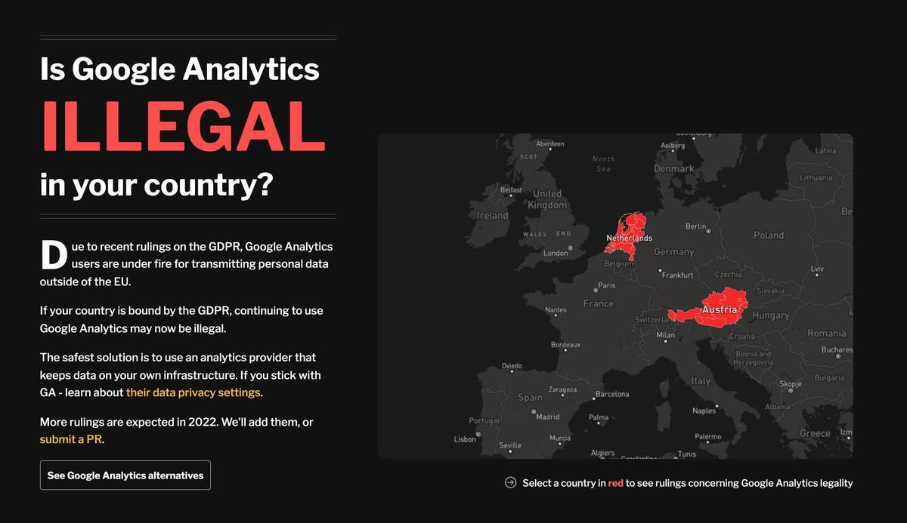

Ten years ago today, the European Commission published the first draft of the General Data Protection Regulation (GDPR). But, as [the recent ruling in Austria concerning one website's use of Google Analytics](https://isgoogleanalyticsillegal.com/) proves, how those rules are enforced and interpreted is still contested.

There's lots of detail in the [full ruling](https://noyb.eu/sites/default/files/2022-01/E-DSB%20-%20Google%20Analytics_EN_bk.pdf), but here's a quick summary:

- An Austrian website was found to have exported personal data of a user to Google servers in the US
- The complaint argued this was a breach as it was subject to demands from local intelligence agencies
- The Austrian Data Protection Agency agreed it was a breach and the case remains ongoing 

That's a very simplified version of events, but here are three important takeaways:

### 1 . Google itself was cleared of any wrongdoing
Only the website that was using Google Analytics, as the data controller, was found liable for the breach. Under the GDPR, breaching the regulation can result in huge fines of up to €20 million or 4% of a company's global turnover, whichever is the largest. [Amazon was fined €746 million by authorities in Luxembourg in 2020](https://www.bbc.co.uk/news/business-58024116), the largest GDPR fine so far. Getting it wrong can be painful.

### 2. Any website using GA to collect data on EU citizens could be in breach 
As confirmed by [guidance](https://tweakers.net/nieuws/192020/autoriteit-persoonsgegevens-waarschuwt-voor-mogelijk-verbod-op-google-analytics.html) published by the Dutch Data Protection Authority, any website or product using Google Analytics in the EU could be in breach of the GDPR. Much of the ruling hinges on specific configuration options within GA, which further complicates things for end users.

### 3. This is just the beginning
This complaint was but one of 100 similar complaints lodged by the same non-profit group. The founder, Max Schrems, [told WIRED](https://www.wired.co.uk/article/google-analytics-europe-austria-privacy-shield): "It's not specific to Google Analytics. It's basically about outsourcing to US providers in general". Other complaints include the use of Google Analytics and Facebook Connect by the likes of Airbnb and Ikea, so expect to hear about more rulings in the coming months.

<figcaption className="text-center">
  The Austrian ruling <a href="https://isgoogleanalyticsillegal.com/">questions the legality</a> of using Google in the EU
</figcaption>

## A brief history of GDPR
In its [response](https://blog.google/around-the-globe/google-europe/its-time-for-a-new-eu-us-data-transfer-framework/) to the ruling, Google urged the EU and US to come up with a new legal framework to create legal stability. It's a reasonable suggestion, but we've been here several times before.

To understand why, it helps to break down the history of the GDPR:

- **January 25, 2012:** The European Commission [publishes a draft](https://web.archive.org/web/20121203024154/http://ec.europa.eu/justice/data-protection/document/review2012/com_2012_11_en.pdf) of its proposed General Data Protection Regulation (GDPR) to regulate the free movement of data

- **June 2013:** Edward Snowden leaks millions of secret US intelligence files, fundamentally changing the debate around personal privacy and data protection forever

- **October 2015:** Responding to a complaint from privacy campaigner Max Schrems, the European Court of Justice deems the 'Safe Harbor Privacy Principles' allowing data portability between the EU and US invalid. Schrems argues data transferred by Facebook from Ireland to US servers was insufficiently protected due to the NSA's surveillance practices, as revealed by Edward Snowden. [The ruling](https://iapp.org/resources/article/schrems-i/) is known as 'Schrems I'

- **May 24, 2016:** The General Data Protection Regulation becomes EU law

- **July 12, 2016:** In response to Schrems I, the EU and US negotiate the EU-US Privacy Shield, a replacement for the previous 'Safe Harbor' rules. It's designed to allow US companies to receive data from the EU while adhering to EU privacy laws

- **January 25, 2017:** President Donald Trump signs an executive order demanding government agencies ensure their privacy policies "exclude persons who are not United States citizens or lawful permanent residents". President Joe Biden would later repeal the executive order in January, 2021

- **May 25, 2018:** Just over two years after it was first approved by the EU, all member states have passed the GDPR in their national parliaments and the GDPR is now in force

- **July 16, 2020:** In response to another complaint from Max Schrems, the Court of Justice of the European Union (CJEU) rules the revised Privacy Shield [doesn't provide adequate protection](https://gdprhub.eu/index.php?title=CJEU_-_C-311/18_-_Schrems_II). This is 'Shrems II'

- **August 17, 2020:** Schrems files a new complaint with Austrian DPA alleging an Austrian website and Google violated the GDPR

- **July 16, 2021:** Amazon [is fined](https://www.wired.co.uk/article/amazon-gdpr-fine) €746 million for failing to follow rules regarding its use of targeted advertising and proper consent. It's the largest GDPR fine to date.

- **January 13, 2022:** The Austrian data authority partially upholds the Shrems complaint, ruling that the Austrian website did violate the GDPR. Google, as a data processor, isn't deemed liable

>Read our guide to the [best GDPR-compliant analytics tools](/blog/best-gdpr-compliant-analytics-tools) for advice on alternatives to Google Analytics

<GDPRForm />

## What happens next?
Once you break down the chain of events, one thing becomes abundantly clear: a new Privacy Shield, such as that suggested by Google, would run into the same legal challenges that scuppered previous agreements. 

The only reliable solution is for the US to enact adequate legal protections for EU citizens, but this would be politically difficult. An executive order could smooth the path to a quicker resolution, but it would be subject to the whims of any incoming president who didn't like it. Hello, Donald Trump. 

This legal instability makes controlling your own data, in our view, critically important. Self-hosting your analytics obviates the worry about where data is captured and then exported, and simplifies the processes for ensuring your business is GDPR or HIPAA compliant. 

The larger the business, the greater risk. Fines are punitive and expensive to litigate and the sunk cost risk of choosing the wrong solution is a waste of time and money.

> PostHog is an open source analytics platform you can host yourself. We help you build better products faster, without user data ever leaving your infrastructure.

<ArrayCTA />
