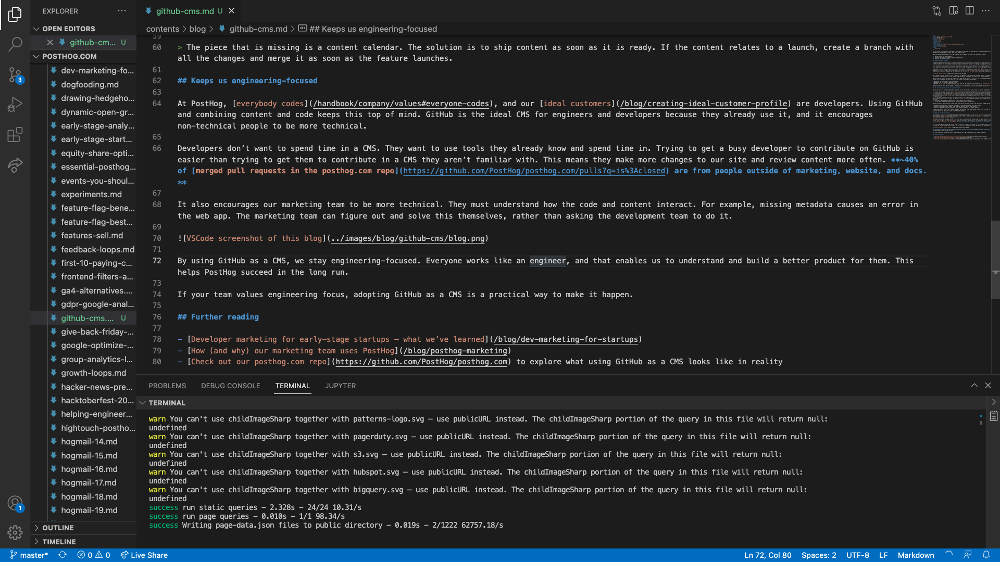

As you publish more content, inevitably you need a way to manage it. A content management system, or CMS, is the go-to software solution for this. Examples include WordPress, Drupal, Wix, Ghost, and many more. 

But there's another left-field option: GitHub. In this post, I'll explain the three reasons we use GitHub as a CMS (and why we love doing so). 

## 1. GitHub enables transparency and open contributions

[Being open source](https://github.com/PostHog/posthog.com) is core to PostHog. It creates the transparency, context, and trust needed to be a high-performing, remote software startup.

As the home of open source, GitHub makes this easy. Having our level of transparency might not be possible with another CMS. Anyone can see what we're working on, give feedback, and even make changes to the content and code. This happens all the time, for example:

- Engineers contribute to site documentation and review content.
- Marketers fix layout or template issues.
- Readers fix typos and content issues, this makes up ~5% of merged pull requests on our [posthog.com repo](https://github.com/PostHog/posthog.com).
- Users provide feedback on [our roadmap](/roadmap) which displays data from GitHub issues on our site.

Every time one of these happens, it makes our site a bit better in a way that wouldn’t be possible if we weren’t using GitHub. It empowers people to make changes to code and content themselves, rather than rely on others to do it. This enables us to move fast and have a high impact while maintaining quality.

## 2. GitHub has most of the necessary tools for your content workflow

GitHub is built for software development, but many of the features work just as well for content development. Take our workflow for example:

1. Create content ideas as issues with a [template](https://github.com/PostHog/posthog.com/issues/new?assignees=andyvan-ph&labels=content&template=blog-post-idea-template.md&title=%7BContent+type%7D+-+%7Btitle%7D). Fill out a strapline, reasoning, and outline. Each issue has an owner.

2. Issues go into a content [project board](https://docs.github.com/en/issues/tracking-your-work-with-issues/planning-and-tracking-work-for-your-team-or-project#adding-issues-to-a-project-board) with columns for the backlog, coming soon (in priority order), in progress, in review, and done.

3. Content gets worked on. When done, the creator opens a pull request (with a [checklist](https://github.com/PostHog/posthog.com/blob/master/.github/pull_request_template.md)), and asks for reviews. [GitHub Actions](/blog/automating-a-software-company-with-github-actions) run for spellcheck and Vercel site previews.

4. Reviewers comment and make suggestions. Creator updates until approved.

5. Content gets merged and changes publish to the production site automatically. PRs are connected to the issues, which are automatically closed when merged.

GitHub and a text editor are all we need to go from idea to published content. The features of GitHub provide many benefits to our workflow such as:

- Automation for templates, checklists, spellcheck, review notifications, and site previews.

- Central location for ideas, drafts, team comments, finished content, and revisions.

- Tools for feedback including suggestions, full markdown comments, and comment history.

The one thing it lacks is a content calendar, but it's not something we miss much. Most content can be published as soon as it's ready. If the content relates to a launch, we create a branch with all the changes (including documentation and landing page updates) and merge it as soon as the feature launches.

## 3. GitHub keeps us engineering-focused

At PostHog, [everybody codes](/handbook/company/values#everyone-codes), and our [ideal customers](/newsletter/ideal-customer-profile-framework) are developers. Using GitHub and combining content and code keeps this top of mind. GitHub is the ideal CMS for engineers and developers because they already use it, and it encourages non-technical people to be more technical.

Developers don’t want to spend time in a CMS. They want to use tools they already know and spend time in. Trying to get a busy developer to contribute on GitHub is easier than trying to get them to contribute in a CMS they aren’t familiar with. This means they make more changes to our site and review content more often. **~40% of [merged pull requests in the posthog.com repo](https://github.com/PostHog/posthog.com/pulls?q=is%3Aclosed) are from people outside of marketing, website, and docs.**

It also encourages our marketing team to be more technical. They must understand how the code and content interact. For example, when missing metadata causes an error in the web app. The marketing team can figure out and solve this themselves, rather than asking the development team to do it.

By using GitHub as a CMS, we stay engineering-focused. Everyone works like an engineer, and that enables us to understand and build a better product for them. This helps PostHog succeed in the long run. 

If your team values engineering focus, adopting GitHub as a CMS is a practical way to make it happen.

## Further reading

- [Developer marketing for early-stage startups – what we’ve learned](/blog/dev-marketing-for-startups)
- [How (and why) our marketing team uses PostHog](/blog/posthog-marketing)
- [Check out our posthog.com repo](https://github.com/PostHog/posthog.com) to explore what using GitHub as a CMS looks like in reality
