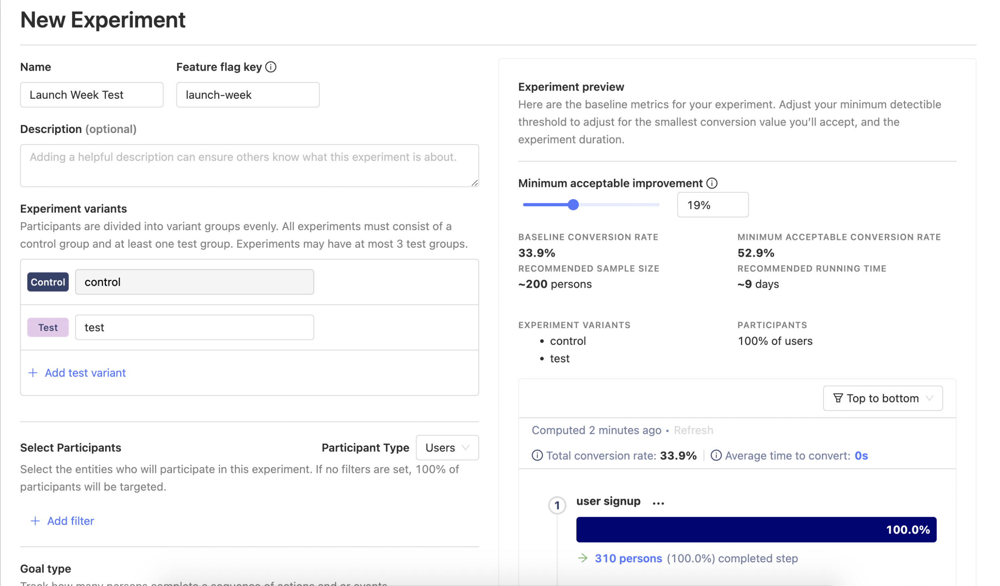
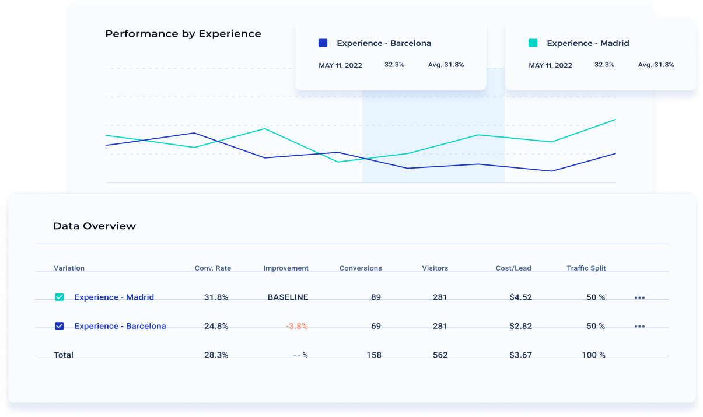
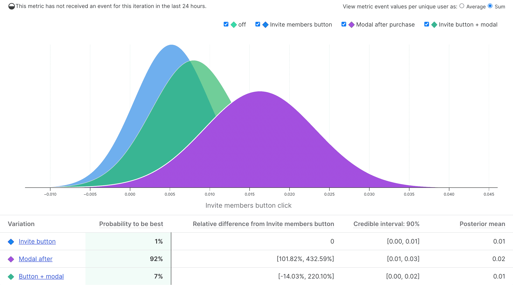

Google recently confirmed the sunsetting Google Optimize, its A/B testing platform. In a [statement](https://support.google.com/optimize/answer/12979939) on its website, Google said:

> "Google Optimize and Optimize 360 will no longer be available after **September 30, 2023**. Your experiments and personalizations can continue to run until that date. Any experiments and personalizations still active on that date will end."

The statement went on to say Google is working on adding A/B testing functionality to Google Analytics 4, its somewhat divisive replacement for Google Analytics 360 (Universal Analytics). But Google **didn't commit to a launch date** for this A/B testing functionality, which suggests it may not arrive before Optimize is closed.

If this sounds like bad news to you, consider one of following six Google Optimize alternatives instead. 

> **How did we choose these tools?** There are dozens of A/B testing platforms, so we tried to include a cross-section of tools designed for engineers, marketing teams, and different use cases. We prioritized tools that are self-serve (i.e. no demo or quote needed to open an account) and/or have transparent pricing.

## 1. PostHog

- **Free tier:** ✔
- **Transparent pricing:** ✔
- **Unlimited experiments:** ✔
- **Best for:** Product and engineering teams

[PostHog](https://posthog.com/) is a comprehensive [Google Optimize](/blog/optimize-to-posthog) and [GA4 alternative](/blog/ga4-alternatives) that integrates A/B and [multivariate testing](/product-engineers/what-is-multivariate-testing-examples) with event-based analytics, session recording, and feature flags.

PostHog supports A/B and multivariate experiments that target by geography, device, source, cohort, or limitless other user properties. It tracks metric improvement goals for success, secondary goals, and estimates how long it takes to get a statistically significant result. PostHog's experimentation suite is built on its feature flag functionality, making it easy to rollout winning variants.

As an all-in-one platform, PostHog simplifies your data and analytics stack by replacing multiple tools. This makes it easy to quickly create experiments using existing data and cohorts in your product analytics, rather than connecting an external data source.

PostHog has a range of [libraries and SDKs](/docs/integrate), from [JavaScript](/docs/integrate/client/js) to [Python](/docs/integrate/server/python) to [iOS](/docs/integrate/client/ios), to help integrate into your website or apps' codebase. It has has an HTML snippet for easy setup with basic sites, [Shopify](/docs/libraries/shopify), [Wordpress](/docs/libraries/wordpress), [Webflow](/tutorials/webflow), and more.

### How much does PostHog cost?

PostHog offers **unlimited experiments** on PostHog Cloud, which includes 1 million events and 5,000 session recordings for free every month. You can calculate your price upfront using [PostHog's pricing calculator](/pricing) and set **billing limits** to avoid surprise bills.

### Companies that use PostHog

- **Y Combinator:** Startup accelerator – [read how they increased engagement by 40%](/customers/ycombinator)
- **Pry:** Financial planning software – [read how they boosted registrations by 30%](/customers/pry)
- **Vendasta:** SaaS marketplace – [read how they cut onboarding drop-off by 50%](/customers/vendasta)
- **Joybird:** Furniture e-commerce store

## 2. Unbounce

- **Free tier:** ✖
- **Transparent pricing:** ✔
- **Unlimited experiments:** ✖
- **Best for:** Marketing teams

[Unbounce](https://unbounce.com) is a popular content marketing platform among small and medium-size businesses. It allows marketers to quickly create landing pages using its page builder and AI copy writing tools, then use its 'Smart Traffic' system to automatically direct users to the best-performing variant. It supports traditional A/B tests, too.

This 'Smart Traffic' system is what's known as 'multi-armed bandit' testing, where machine learning is used to dynamically allocate traffic to the best performing variant. This is especially effective in marketing scenarios as Unbounce says it can direct visitors to their ideal variant after just 50 visits. Conversion rates should improve the longer a test is run as the algorithm learns.

The downside is Unbounce is only suitable for use on marketing websites – it can't be used on products or mobile apps.

### How much does Unbounce cost?

Unbounce offers a pleasing range of transparently-priced plans. Its entry-level 'Launch' plan is $99 per month and supports "up to 500 conversions", 20k visitors, and one website domain – "conversions" being any time a user completes a conversion goal. Additional plans increase these limits and there's a 25% discount for paying annually. 

### Companies that use Unbounce

- **Packlane:** Custom packaging and boxes for retailers
- **Uberflip:** Sales engagement and lead-gen platform
- **PitchBook:** M&A database and marketing intelligence

## 3. GrowthBook

- **Free tier:** ✔
- **Transparent pricing:** ✔
- **Unlimited experiments:** ✔
- **Best for:** Product and engineering teams

[GrowthBook](https://www.growthbook.io/) is a popular open-source feature flagging and experimentation platform. It supports A/B and multivariate tests, and integrates with a range of popular analytics tools, such as Google Analytics (UA), Mixpanel, Matomo, and most popular data warehouses.

It offers a basic visual editor so non-technical users can create experiments without writing code. GrowthBook's 'Guardrail' feature monitors for unintended second order effects of your change which you're not actively testing for.

### How much does GrowthBook cost?

GrowthBook offers unlimited traffic (subject to a fair use policy), feature flags, and experiments. It charges only on the number of user accounts. Its Starter plan includes three GrowthBook users. Its Pro plan adds advanced permissions, custom fields, and its visual A/B test editor, for just $20 per user, per month.

### Companies that use GrowthBook

- **Deezer:** Music app
- **Brilliant:** Learning platform
- **Typeform:** Form and survey platform for businesses

## 4. Instapage

- **Free tier:** ✖
- **Transparent pricing:** Partial
- **Unlimited experiments:** ✔
- **Best for:** Marketing teams

[Instapage](https://instapage.com/) is a marketing optimization platform built around a landing page builder and experimentation suite. It doesn't support multi-armed bandit testing like Unbounce, but it does include a range of useful features for marketing teams, such as personalized landing pages based on ad creative, AMP page support, loading speed optimizations, and dynamic text replacement for PPC campaigns.

### How much does Instapage cost?

Instapage's self-serve plan costs $299 per month ($199 if billed annually) and includes most of its core features with no usage limits. It doesn't publish pricing on its upgrade plans, which add numerous value-add features, such as heatmaps, custom font support, and consulting services.

### Companies that use Instapage

- **HelloFresh:** Recipe box delivery
- **Honey:** Coupon and shopping browser extension
- **Skyscanner:** Airline price comparison

## 5. VWO Testing

- **Free tier:** ✔
- **Transparent pricing:** ✖
- **Unlimited experiments:** ✔
- **Best for:** Marketing teams

[VWO](https://vwo.com) is a testing platform that primarily targets large enterprises. Its experimentation platform includes support for A/B and multivariate tests, and a visual editor, though some features are locked behind its numerous product tiers. Geo-targeting, for example, is only available on the 'Pro' tier of VWO Testing, while feature flags are only available as part of its VWO FullStack product.

### How much does VWO cost?

Outside of its new Starter plan, VWO is largely a 'price on application' product. Its Starter plan is free up to 50k visitors per month, and $199 per month up to 100k visitors per month, but it's quite limited. It only supports basic A/B tests and split URL testing, and you can only target based on device.

### Companies that use VWO

- **Chargebee:** Payments and subscription platform  
- **Amway:** Mutli-level marketing
- **TMZ:** Celebrity and entertainment news

## 6. LaunchDarkly

- **Free tier:** ✔
- **Transparent pricing:** Partial
- **Unlimited experiments:** ✖
- **Best for:** Engineering and product teams

[LaunchDarkly](/blog/best-launchdarkly-alternatives) is a leading platform for feature management (feature flags) that also enables experimentation. Like all the products in this list, it supports A/B and multivariate testing. In contrast to Unbounce, however, LaunchDarkly is designed for product and engineering teams, so it lacks marketing-friendly features like a visual editor. 

LaunchDarkly is a good option if you require a fully-featured feature flagging tool in addition to experimentation features, and it's particularly popular among enterprises with complex feature control needs.

### How much does LaunchDarkly cost? 

Experimentation is available on LaunchDarkly's Pro plan, which costs $20 per seat, per month, but experiments are priced separately to this. As per LaunchDarkly's docs:

> "Experiments are billed monthly based on the number of unique user keys in each experiment. To estimate your Experimentation billing costs, multiply the number of experiments you run each month by the number of unique users in your experiment audience." 

### Companies that use LaunchDarkly

- **Square:** Mobile payments
- **Ryanair:** Affordable airline
- **HashiCorp:** Infrastructure automation and security

<ArrayCTA />
