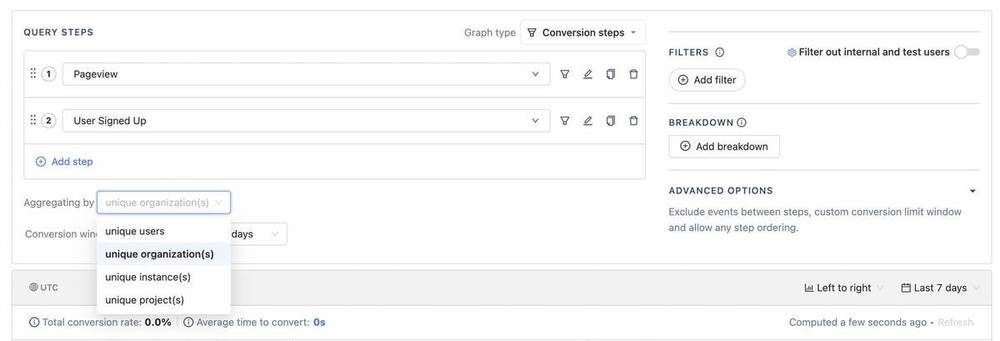

Today, we’re excited to announce that PostHog has launched Group Analytics for both PostHog Scale / Enterprise users and those on PostHog Cloud. 

Group Analytics are used for tracking and analyzing multiples of any event type within PostHog. Unlike cohorts, which essentially create lists of users, groups can track a far wider range of information because they apply at the event level. 

<BorderWrapper>
<Quote
    imageSource="/images/customers/weyert-tapico.png"
    size="md"
    name="Weyert de Boer"
    title="Senior Software Engineer, Tapico"
    quote={`“The Groups functionality in PostHog gives us the flexibility and power to target users at a higher level. Group Analytics also give us more detailed insight into user behaviour between instances. We love it!”`}
/>
</BorderWrapper>

As a result, Group Analytics is especially useful for certain types of product, such as:

- *B2B products:* If you sell primarily to businesses, groups can be used to track data at a company level and report on metrics such as Daily Active Companies. 

- *Crypto and financial products:* If your product deals with payments, groups can be used to track events such as transactions and report on metrics such as Daily Payments. 

- *Social media products:* If your product deals with user-generated content (UGC), groups can be used to track subscriptions, as well as report on metrics such as Likes, Follows or Shares. 

Groups work perfectly with all other PostHog tools, enabling you to analyze group data with [funnels](/docs/user-guides/funnels), [trends](/docs/user-guides/trends), [paths](/docs/user-guides/paths) and [retention charts](/docs/user-guides/retention). This opens up the potential for entirely new insights, such as using groups within a funnel analysis to see how a company moves through a sign-up funnel in the same way that you would do for an individual user. 

You can even use groups with [feature flags](/docs/user-guides/feature-flags) to roll out or test new features with all users within an organization. This makes feature flags a lot more practical for B2B focused products, as organizations such as [Tapico](https://tapico.io/), the open finance engine, have found out.

"Using groups we can enable feature flags per instance, dark launch features for a specific instance, or implement kill switches and ops flags," said Weyert de Boer, Senior Software Engineer at [Tapico](https://tapico.io/).

Group Analytics has been released as a [premium feature](/pricing) and is available now for both PostHog Scale, PostHog Enterprise, and PostHog Cloud users. If you’re on PostHog Cloud you can get started with groups immediately, while self-hosted instances will first need to be updated to the latest version. We’ve prepared some [documentation to help you get started with the new group types](/docs/user-guides/group-analytics) and illustrate some popular use-cases. 

As always, we welcome any feedback you have as an issue in [the GitHub repo](https://github.com/PostHog), or in the [PostHog Slack group](/slack).  

> PostHog is an open source analytics platform you can host yourself. We help you build better products faster, without user data ever leaving your infrastructure.

<ArrayCTA />
