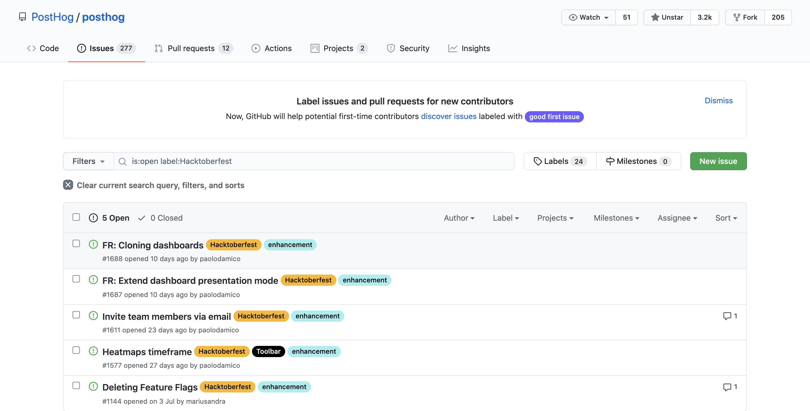

### Let the pull requests come in!

We're happy to announce that PostHog has joined [Hacktoberfest 2020](https://hacktoberfest.digitalocean.com/).

For those who don't know, Hacktoberfest is an initiative led by DigitalOcean to promote open source projects and foster the overall open source community. 

It encourages developers to contribute to public repositories on GitHub via pull requests by offering to ship a t-shirt to developers who have successfully submitted 4 valid PRs in the month of October ([Official Rules](https://hacktoberfest.digitalocean.com/#rules)).

As a company that's extensively dedicated to the open source ecosystem as a whole, it is only fitting that we participate in Hacktoberfest. 

As a result, we have now [tagged some good first issues](https://github.com/PostHog/posthog/labels/Hacktoberfest) on our [main repo](https://github.com/PostHog/posthog/) with the <code class="hacktoberfest">Hacktoberfest</code> tag, as these should be suitable issues for first-time contributors. We have also made an effort to document those issues better, so that their scope is clearly defined. 

From the perspective of the Hacktoberfest rules, you are able to contribute to any issue, be it tagged or not. We welcome all contributions and would be happy to help you with your pull request. We nevertheless recommend you try to find an issue tagged with <code class="hacktoberfest">Hacktoberfest</code> or <code class="good-first-issue">good first issue</code> if this is your first time contributing to PostHog. 

Additionally, we also welcome contributions to our Docs, especially to our [new tutorials section](https://github.com/PostHog/posthog.com/issues/491). These are related to the [repository for this website](https://github.com/PostHog/posthog.com). 

Finally, we don't want to miss out on the fun. Thus, while you need 4 valid PRs to get an official shirt from DigitalOcean, we are happy to send you some [PostHog merch](https://merch.posthog.com/) if you make _one_ relevant contribution. 

Happy Hacktoberfest from our entire team at PostHog. Let's get hacking!

> PostHog is an open source analytics platform you can host yourself. We help you build better products faster, without user data ever leaving your infrastructure.

<ArrayCTA />
