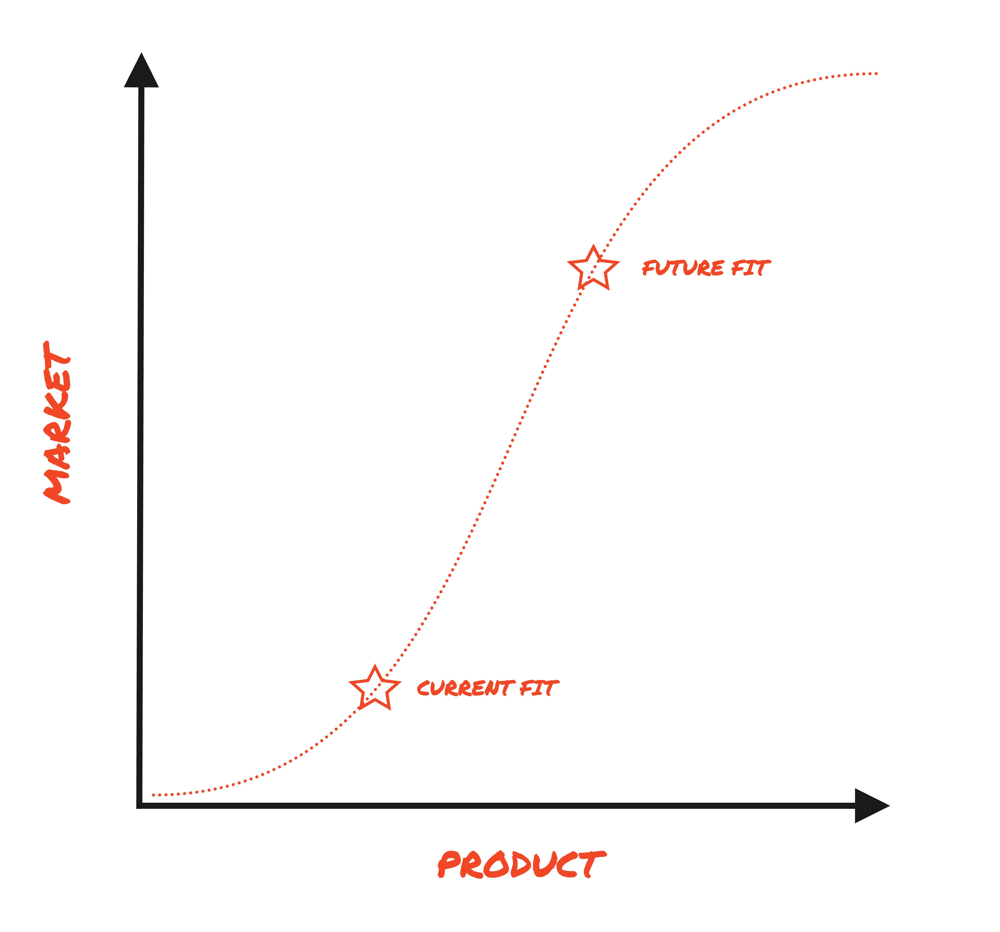

> Welcome to HogMail, our newsletter featuring the best of the PostHog blog, tutorials, product guides, and curated articles on building great products and companies. We send it every two weeks. [Signup here](https://newsletter.posthog.com/subscribe) so you don't miss it.

One week later than originally promised... welcome to the first HogMail of 2023. In this issue:

- Why Shopify is (maybe) killing the wrong meetings
- What co-founder James learned in 2022
- Why we shouldn't send humans to Mars
 
– Andy Vandervell, Word Typer-in-Chief

## #new-from-posthog

- [CEO diary: Things I learned in 2022](https://posthog.com/blog/2022-review): Reflections on 2022 and what's to come this year

- [Master Feature Flags: Best practice, tips and examples](https://posthog.com/blog/feature-flag-best-practices): Ian shares some practical tips for deploying PostHog feature flags (and feature flag usage generally).

- [How to track performance marketing in PostHog](https://posthog.com/tutorials/performance-marketing): How to set up UTM tracking for your campaigns and attribution. See also: [how our marketing team uses PostHog](https://posthog.com/blog/posthog-marketing).

- [How to do a canary release using PostHog](/tutorials/canary-release): Step-by-step guide to gradually rolling out a new feature release.

## #talking-points

### Which meetings should you kill? 📢

Shopify made the news recently with a [new year edict](https://www.forbes.com/sites/jenamcgregor/2023/01/03/shopify-is-canceling-all-meetings-with-more-than-two-people-from-workers-calendars-and-urging-few-to-be-added-back/) to cancel all meetings with more than two people and "re-instate" meeting-free Wednesdays. But Camille Fournier, author of The Manager's Path, suggests that [one-to-one meetings are the real time waster](https://skamille.medium.com/which-meetings-should-you-kill-7430467c005b):

> "I truly cannot imagine the mental model of someone who believes that the solution to too many meetings is to cancel group meetings while leaving 1:1 meetings untouched, unless their goal is creating a kind of hyper-political anti-transparency culture."

Camille's advice? Yes, pointless status update meetings are bad, but the answer is to invest the time and effort into running better group meetings. If you don't, inefficient and opaque 1:1 catchups will proliferate in their place.

What we do: We're big believers in fewer meetings and the maker's schedule – we have meeting-free days on Tuesdays and Thursday, for example.

But the real game changer is defaulting to asynchronous communication and writing everything down. [Transparency wins](https://posthog.com/blog/how-to-run-a-transparent-company). See [our handbook](https://posthog.com/handbook/company/culture) for more on how we work.
 
### Product-market fit is a moving target 🎯

We often get asked how to achieve the fabled product-market fit (PMF), mainly because [there is no universal standard](/blog/product-market-fit-game) and, as Run the Business points out in [Product Market Flex](https://runthebusiness.substack.com/p/product-market-flex), it's not a stationary target:

>"At any given moment in time, even if you have PMF, you still need to be working towards a future state where the market has evolved, and your product has kept up."

 
The author goes on to argue teams can flex two dimensions to achieve PMF: (i) reduce the effort by the user to get value (product); and (ii) increase user literacy (go-to-market).

John Cutler explores this idea further in [Product GTM Fitness](https://cutlefish.substack.com/p/tbm-4152-product-gtm-fitness), discussing how to identify the warning signs of atrophy, and how to change course when you do.

## #misc-good-reads

- [How to Read More Books in 2023](https://readmorebooks.substack.com/p/how-to-read-more-books-in-2023) – Tip 1... "there are no right or wrong books. Read what you want". Mills & Boon it is then! Seriously, though, these are useful tips if you have this on your resolutions list.
 
- [Google AI researcher makes the bear case for AI in 2023](https://twitter.com/fchollet/status/1612142423425138688) – Is that the hype train leaving the station? Best call it back. Francois Chollet argues the current climate in AI has many parallels to web3 in 2021.
 
- [Why Not Mars](https://idlewords.com/2023/1/why_not_mars.htm) – I'm a big fan of Apple TV's For All Mankind, but this long read makes a cogent argument for why we shouldn't send humans to Mars. AFAIK, Elon hasn't sub-tweeted the author yet.
 
- [Optimism Shapes Reality](https://alexw.substack.com/p/optimism-shapes-reality) – To balance out all this pessimism, here's Alexandr Wang (CEO at Scale AI), on the importance of optimism. "When we say things will take a short amount of time, they will take less time."
 
- [How employees can think like shareholders](https://www.mostlymetrics.com/p/questions-to-ask-before-taking-a) – Or, to use the post's original title, "the REAL questions you should ask before taking a job", though the questions here are still relevant outside of that context. CEO James has written about this in the past, too.

> We send HogMail every two weeks. [Signup here](https://newsletter.posthog.com/subscribe) so you don't miss it.