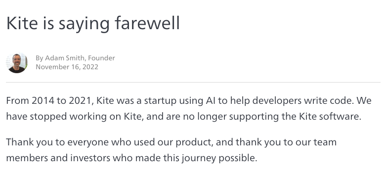
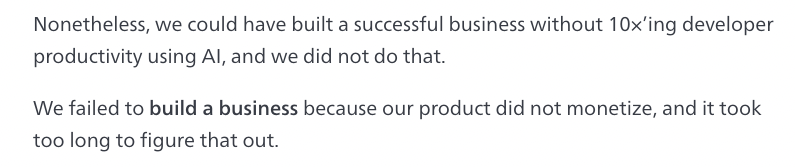

> Welcome to HogMail, our newsletter featuring the best of the PostHog blog, tutorials, product guides, and curated articles on building great products and companies. We send it every two weeks. [Signup here](https://newsletter.posthog.com/subscribe) so you don't miss it.

This week's theme is why startup's fail. It's a simple question to answer... not enough hedgehogs, obviously.

Seriously, though, there are too many ways to count, but bad hiring is one obvious failure point. Charles (PostHog's VP of Ops & Marketing) shares some of his hiring tips on the blog this week. 

Here's what's new on PostHog.com:

- [Myths (and truths) I've learned from 10 years of startup hiring](https://posthog.com/blog/early-stage-startup-hiring-strategy) by Charles Cook
 
- [Should startups hire product engineers, product managers, or both?](https://posthog.com/blog/product-engineer-vs-product-manager) by Ian Vanagas
 
- [The basics of using regex in PostHog](https://posthog.com/tutorials/regex-basics) by Ian Vanagas
 
Words by Andy Vandervell, who just trains AIs to write now.

## Why do startups fail? (or why "product-market fit" doesn't guarantee success)

In November, Adam Smith, the founder of AI-assisted programming startup Kite, [announced they were closing](https://www.kite.com/blog/product/kite-is-saying-farewell/) despite having reached [product-market fit](/blog/product-market-fit-game) and 500k monthly-active developers.

How does a product with **500k active users** fail? In Adam's opinion:

1. They were 10+ years too early to the market. The tech wasn't ready for primetime, citing the launch of GitHub Copilot, which he feels still has a long way to go.
 
2. As a consequence, while Kite made its users more productive, the change wasn't significant enough for engineering managers to pay for their teams to use it.
 
3. They were trying to solve an engineering intensive problem: "It may cost over $100 million to build a production-quality tool capable of synthesizing code reliably".

But, here's the kicker, he also says:

Adam goes onto explain how it took five years to reach product-market fit and, having done so, they focused on growing users rather than working out monetization simultaneously.

By the time they realized their 500k users would not pay to use it and found a viable pivot, the team was too tired from seven years of grind to pursue it. The launch of Copilot (for free) can't have helped morale.

Kite's source code is [now open source](https://github.com/kiteco).

### Some takeaways:

1. Achieving product-market fit is a landmark, not the final destination. Having it won't guarantee your company is successful.
 
2. Once you have it, don't delay figuring out revenue. It won't just happen. Kite managed to grow to 500k users with "almost zero" marketing spend, but it feels like they didn't see the problem until too late.
 
3. Don't give away too much for free too long – your users will get used to it being free and converting them will be hard.

### Further reading on this topic:

- In contrast to Kite, read [how Docker 2.0 went from $11M to $135M in 2 years](https://sacra.com/p/docker-plg-pivot/). After pivoting and cutting headcount from ~420 to just 60 in 2019, Docker's revenue is growing by 150% per year.
 
- Tracy Young, once co-founder/CEO of PlanGrid, on [the failure points from $5m to $100m in ARR](https://tracy.posthaven.com/part-ii-the-failure-points-from-$5m-to-$100m-in-arr). She outlines where startups who have solved PMF and monetization can still fail.
 
- Kyle Poyar on nailing [free-to-paid conversion at scale](https://kylepoyar.substack.com/p/free-to-paid-conversion-at-scale) for product-led companies, and finding "concrete ways to grow faster and do more with less". 
 
- First Round Review: [How Product Strategy Fails in the Real World](https://review.firstround.com/how-product-strategy-fails-in-the-real-world-what-to-avoid-when-building-highly-technical-products) and what to avoid when building highly-technical products

## More good reads

- [Stay SaaSy on Management Debt](https://staysaasy.com/management/2023/01/12/management-debt.html) – Whether it's excessively junior teams, title inflation, or compensation inflation, management debt is a real problem. A great post on identifying and dealing with it.
 
- [If you like startups you should love anti-trust](https://alexwrites.substack.com/p/if-you-like-startups-you-should-love) – Not a traditionally popular topic in startup circles, but Alex Wilhelm makes the case for why it's good for startups. Agree or disagree?
 
- [What is a good SaaS churn rate? A meta-analysis of 6 studies](https://www.cobloom.com/blog/churn-rate-how-high-is-too-high) – Is it 5% per month or 5% per year!? It's a huge difference with a lot of conflicting data and opinions. This is a good dig into the numbers.
 
- [Corey Haines on SaaS metrics that lie](https://twitter.com/coreyhainesco/status/1612943630997819394) – Former Head of Growth at Baremetrics shares some insightful points on popular metrics that might mislead you.

> We send HogMail every two weeks. [Signup here](https://newsletter.posthog.com/subscribe) so you don't miss it.
